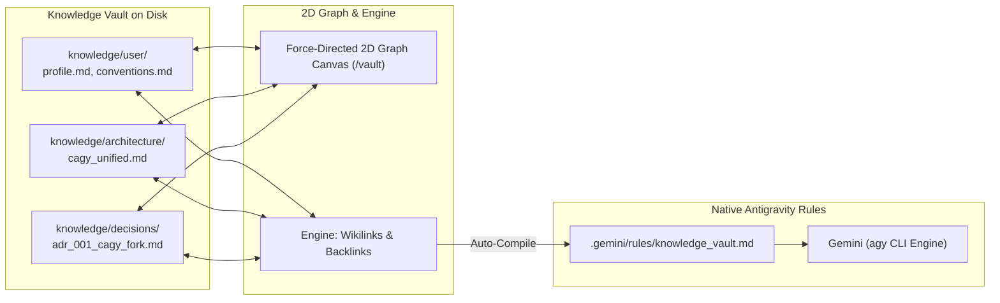

# Containerized Antigravity (CAGY Docker & WebUI Bridge)

[](LICENSE)
[](https://docker.com)
[](https://deepmind.google)

A secure, fully containerized execution environment and browser WebUI for **Google Antigravity (AGY)**.

By encapsulating both the WebUI server and the native Linux `agy` CLI binary inside an isolated Debian container, CAGY provides autonomous coding agents with a **sandboxed, reproducible workspace**:

- **Safer Blast Radius**: All agent shell executions, script runs, package installations, and file modifications execute strictly inside an isolated container boundary, protecting your host machine from unintended system changes or broken dependencies.
- **Reproducible Developer Toolchain**: Pre-configured environment bundling Node.js 22, Python 3.11, Git, Ripgrep, `uv`/`uvx`, and the Google `agy` CLI, guaranteeing identical behavior across macOS, Linux, and Windows (WSL2).
- **Zero-Drift Host Portability**: Run locally or deploy across servers, laptops, or cloud VMs with zero environment configuration drift or host-level tool conflicts.

---

## Key Features

- **Sandboxed Agent Execution & Blast Radius Control**: Autonomous terminal commands, script executions, package installs, and agent tool calls run safely isolated inside the container's Linux namespace.
- **Native Antigravity Engine**: Uses the official Google Antigravity Linux binary (`agy`) with automated lifecycle management.
- **Obsidian-Style Knowledge Vault & 2D Graph (`/vault`)**: Modular markdown second brain in `./knowledge/` (`/workspace/knowledge/`) with bi-directional `[[wikilinks]]`, editor autocomplete, neighborhood depth filtering (`[ All | 1-Hop | 2-Hop ]`), `#tag` extraction, backlinks resolution, and an interactive 2D physics force-directed graph canvas. 100% interoperable with the desktop Obsidian application.
- **Agent-Assisted Memory & Auto-Learning (`/memorize`)**: 1-click `🧠 Memorize` message actions and `/memorize` slash command that auto-categorize insights into ADRs (`decisions/adr_XXX`), user preferences, and architecture notes, auto-link existing entities with `[[wikilinks]]`, and sync to `.gemini/rules/` before every conversation turn.
- **Modern Composer Slash Popover (`/`)**: Floating inline autocomplete popover with Lucide SVG icons, category pills (`Workflow`, `Memory`, `Tools`, `Agents`, `System`, `Session`), and argument guides for all Antigravity signature workflows (`/plan`, `/goal`, `/grill-me`, `/boost`, `/learn`, `/browser`, `/swarm`, `/artifacts`).
- **Subagent Swarms Visualizer (`/swarm`)**: Real-time DAG hierarchy viewer, execution timeline, and inspector for delegated multi-agent subtasks (`invoke_subagent`).
- **Model Context Protocol (MCP) Hub (`/mcp`)**: Native manager for `mcp.json` with one-click presets for GitHub, Docker, Fetch, Memory, PostgreSQL, SQLite, and Puppeteer servers with live latency probes.
- **Artifact & Code Preview Canvas with Visual Diffs**: Tri-mode viewer (`[ Code | Diff | Live Preview ]`) featuring side-by-side Git diffs against HEAD, sandboxed live HTML/SVG canvas previews, and session-less direct-to-editor file manipulation.
- **Git-Backed Workspace Checkpoints & Safe Rollback**: The Spaces manager natively surfaces Git commits as immutable checkpoints with commit patch diffs and zero-risk rollback (auto-stashing any in-flight uncommitted work before restoring).
- **Skill & Rule Scaffolder Wizard (`/skills`)**: Visual builder for `.gemini/rules/*.md` and `skills/<name>/SKILL.md`.
- **Command Palette (`Cmd + K`)**: Quick access to all views, panels, settings, and slash commands (`/goal`, `/plan`, `/memorize`, `/vault`, `/swarm`, `/mcp`, `/skills`, `/grill-me`).
- **Workspace Destination Selector & Sandboxed Session Management**: Export conversation transcripts and sessions directly into workspace subdirectories as `.md`, `.json`, or `.html` with real-time path previews, anti-traversal security sandboxing, and a 1-click Workspace Session Browser for instant history recall and imports.
- **Standalone Portable Container**: Fully baked container image (`cagy:latest`) capable of running completely standalone without host volume mounts on any Docker-capable host or cloud VM.
- **Corporate SSL Certificate Trust**: Automatically exports host root certificates into `./container_data/system_certs.pem` to prevent corporate proxy or TLS inspection errors.
- **Persistent State**: Sessions, transcripts, tokens, and journals persist cleanly across container rebuilds in `./container_data/`.

---

## Prerequisites

Before setting up CAGY, ensure you have:
1. **Docker Desktop** (macOS / Windows) or **Docker Engine** (Linux) running.
2. **Git** and **Bash / Zsh**.
3. A **Google Account** with access to Google Antigravity (Gemini).

---

## Quick Start Guide

### Step 1: Clone the Repository
```bash
git clone https://github.com/therealkevops/CAGY-v2.0.0.git
cd CAGY-v2.0.0
```

### Step 2: Run Initial Setup & Certificate Generator
The setup script exports host root SSL certificates (vital for corporate TLS inspection), initializes the persistent data directories, and builds the container image:
```bash
./setup.sh
```

### Step 3: One-Time Google Authentication in the Container
Because macOS uses Keychain while Linux uses secure file-based token storage, run the interactive container CLI once to authenticate:
```bash
./agy-container.sh cli agy
```
1. Click the URL or press `Enter` to open the Google login page in your browser.
2. Complete sign-in and approve the Antigravity CLI authorization.
3. Once authenticated, press `Ctrl + C` or type `/exit` to return to your host terminal.
*(Your credentials are permanently stored in `./container_data/gemini/` and will persist across restarts and rebuilds.)*

### Step 4: Start the Background Container & WebUI
```bash
./agy-container.sh up
```
Open **[http://localhost:8989](http://localhost:8989)** in your browser.

> [!TIP]
> **Optional Password Protection**: By default, the WebUI runs without a password for fast local development. If running on a shared network or server, set `AGY_WEBUI_PASSWORD=your_password` in `.env` to require password login (`agy_session` cookie).

---

## WebUI Overview & Navigation

| View / Feature | Shortcut / Route | Description |
| :--- | :--- | :--- |
| **Chat & Pairing Canvas** | `/chat` (Default) | Real-time streaming conversation, syntax highlighting, and inline tool inspection. |
| **Inline Slash Popover** | `/` in Composer | Rich floating command popover with icons, category pills, and signature workflows. |
| **Knowledge Vault & 2D Graph** | `/vault` or Left Rail | Interactive force-directed knowledge graph with 1-Hop/2-Hop depth filtering and tag search. |
| **Token Economics & Memory ROI** | `/analytics` or Left Rail | Real-time context accumulation curves, memory leverage (MLR), avoided context debt, and model cost comparisons. |
| **Agent Auto-Memorization** | `/memorize` or `🧠` Button | Instantly extract user preferences, conventions, or ADRs into the Knowledge Vault. |
| **Subagent Swarms** | `/swarm` or Left Rail | Visual DAG tree and step-by-step transcript timeline for autonomous subagents. |
| **MCP Server Hub** | `/mcp` or Left Rail | Catalog of active tools and servers configured in `mcp.json` with quick presets & test probes. |
| **Workspace, Diffs & Canvas** | Right Sidebar / `/artifacts` | Tri-mode drawer (`[ Code | Diff | Live Preview ]`) with side-by-side git diffs and live canvas. |
| **Workspace Session Archiving** | Conversation Settings | Configure destination subfolder, export transcripts (`.md`/`.json`/`.html`), and browse/import workspace sessions. |
| **Spaces & Git Checkpoints** | Workspaces Panel | Native Git commit checkpoints with commit diff modal and non-destructive auto-stash rollback. |
| **Wikilink Autocomplete** | `[[` in Editor | Instant note search & insertion (`[[id\|title]]`) directly inside the Markdown editor. |
| **Skills & Rules Scaffolder** | `/skills` or Left Rail | Domain skills manager and visual rule generator. |
| **Command Palette** | `Cmd + K` / `Ctrl + K` | Universal search for commands, panels, settings, and workflows. |

---

## Obsidian-Style Knowledge Vault & Graph Memory

CAGY features an integrated **Obsidian-compatible Knowledge Vault** at `/workspace/knowledge/` (mounted directly from `./knowledge/` on the host).



### 1. Vault Directory Taxonomy
- **`knowledge/user/`**: Developer profile, tone preferences, coding conventions, and workflow rules.
- **`knowledge/architecture/`**: System topology, container execution models, cloud infrastructure, and network design.
- **`knowledge/decisions/`**: Architecture Decision Records (`adr_XXX_<name>.md`) tracking choices, trade-offs, and deprecations.
- **`knowledge/notes/`**: Research topics, conceptual summaries, and reference guides.

### 2. Bi-Directional Wikilinks & 2D Force-Directed Graph (`/vault`)
- Notes use standard Obsidian `[[Note Name]]`, `[[folder/note]]`, or `[[target|Alias]]` links.
- The **2D Graph Canvas** simulates a real-time particle-spring physics layout:
  - Node sizes scale dynamically with connection density (in-degree + out-degree).
  - Category-based color coding (`user`: blue, `architecture`: cyan, `decisions`: purple, `notes`: green).
  - Hover glow, pan, mouse-wheel zoom, and aspect-ratio synchronization preventing distortion when resizing sidebars.
  - Clicking any note or graph node opens it directly in the right-sidebar Markdown editor.

### 3. Agent-Assisted Memorization (`/memorize` & `🧠` Button)
- **`/memorize <insight>`**: Automatically classifies the takeaway into the appropriate directory, assigns sequential ADR numbers for decisions, synthesizes wikilinks to matching existing vault entities, and recompiles native rules.
- **`/memorize` (No Arguments)**: Prompts Gemini to synthesize recent conversation turns into atomic vault notes.
- **1-Click Message Action**: Click the `🧠` bookmark icon on any assistant message to immediately extract and persist the insight into the vault with toast feedback.
- **Pre-Turn Rule Sync**: The CLI runner (`run_agent.py`) re-compiles `.gemini/rules/knowledge_vault.md` before every conversation turn, ensuring the model retains full context across all sessions.

### 4. Knowledge Vault Power Tools
- **Full-Text Vault Body Search**: Toggle between note title/tag search and full-text body search (`[ Title | Body ]`). Features relevance scoring (+10 title, +5 tag, +1 body match) and excerpt snippets with line numbers (`L24: ...`) and `<mark>` match highlighting.
- **Interactive Markdown Wikilinks**: Obsidian-style wikilinks (`[[target]]` and `[[target|Alias]]`) in markdown previews are rendered as clickable navigation links that immediately load the target note.
- **Vault Health Analytics (Orphans & Missing Links)**: Automatic health analyzer identifying orphan notes (zero connections) and broken wikilinks referencing missing notes. The 4-column metric strip displays `Notes`, `Links`, `Orphans`, and `Missing` with 1-click filters and a `+ Create` shortcut to resolve missing links instantly.
- **2D Graph Degree Centrality & PNG Export**: Node radii scale dynamically based on degree centrality ($R = \max(9, \min(26, 8 + \lfloor\sqrt{\text{total\_connections}} \times 5\rfloor))$) so primary hubs stand out. Includes interactive category legend buttons (`User`, `Architecture`, `Decisions`, `Notes`) that dim unselected categories, and a 1-click `Export` button saving high-resolution PNG snapshots.
- **Structured Note Creation Modal**: Replaces basic browser prompts with a modal offering category presets (`Architecture Decision (ADR)`, `Architecture`, `User Profile`, `General Note`), dynamic path preview, and automated sequential ADR numbering (`adr_001_...`, `adr_002_...` -> `adr_003_...`).
- **Wikilink Autocomplete (`[[...]]`)**: When editing any note in the right sidebar (`#previewEditArea`), typing `[[` immediately opens a floating suggestion dropdown. As you type, notes are fuzzy-filtered across note titles, paths, folders, and `#tags`. Use `ArrowUp` / `ArrowDown` and press `Enter` or `Tab` to insert `[[id|title]]` (or `[[id]]`) and place the cursor right after `]]`. Press `Escape` to dismiss.
- **Local Neighborhood Depth Filtering (`[ All | 1-Hop | 2-Hop ]`)**: The Knowledge Graph header includes instant neighborhood depth toggles. When set to `1-Hop` or `2-Hop`, a breadth-first search (BFS) filters the graph to display only the active note and its directly connected cluster. Node positions are preserved to avoid visual disorientation.
- **Node Spacing & Forces Controls (`[ Compact | Spacious | Relaxed ]`)**: Adjust 2D graph spread in real-time. Features softened Coulomb repulsion, dynamic link spring distance (160px–400px), a hard collision buffer preventing node overlap, pill-backdropped text labels for crystal-clear legibility, and quick Zoom (`+` / `-`) action buttons.
- **Tag Extraction & Interactive Filtering**: The backend automatically parses `#tag` tokens across all markdown files (strictly excluding markdown headings). The vault sidebar renders interactive tag chips (`[All]`, `[#architecture]`, etc.) for 1-click filtering, and the vault search bar supports direct `#tag` lookups. Tags also display inside the right-panel note relations footer.

### 5. Obsidian Desktop Interoperability
Because all notes are saved as plain UTF-8 Markdown on the host filesystem under `./knowledge/`, you can open this folder directly as an existing vault in the official **[Obsidian](https://obsidian.md)** desktop app on macOS/Windows/Linux.

### 6. Token Economics & Memory ROI Dashboard (`/analytics`)
Inspect prompt token cost efficiency and the exact leverage of your Knowledge Vault:
- **Real-Time Token & Spend Tracking**: Instant USD cost estimations based on official API pricing tiers ($0.075/1M input, $0.30/1M output on Gemini 3.8 Flash), generation throughput (tok/s), and active prompt size.
- **Context Accumulation Curve**: Visual SVG growth graph plotting prompt tokens per conversation turn against the **Context Debt Threshold (25,000 tokens)**. Hover over turn nodes to view prompt size, response size, and generation speed.
- **Memory Leverage Ratio (MLR)**: Quantifies how many words of architectural notes in the vault are compressed into lean turn-0 rule tokens (`total_vault_words / compiled_rule_tokens`).
- **Cumulative Avoided Context Debt**: Calculates estimated turns and prompt tokens saved across all sessions by having permanent turn-0 vault recall instead of repetitively re-prompting context.
- **Context Diet Advisor**: Provides real-time guidance when context grows beyond 25k tokens, with 1-click actions to `/memorize` key architectural decisions and start a `/new` clean session with 0 context debt.
- **Multi-Model Pricing Matrix**: Real-time cost comparison showing what the current session would cost on Gemini 3.8 Flash, Gemini 1.5 Pro (16.6x), and Claude 3.5 Sonnet (40x).
- **Inline Message Telemetry**: Default-enabled per-message token chips in assistant message footers displaying turn prompt tokens, output tokens, generation duration, and throughput (tok/s). Toggle anytime via `/usage`.

#### Data Sources & Validation Math
The dashboard separates numbers into measured ground truth, published rates, and estimation models:

| Metric | Source / Category | Math & Formula |
| :--- | :--- | :--- |
| **Input / Output Tokens** | Measured Ground Truth | Emitted directly by Google Gemini API in `event: result.usage` at turn completion. |
| **Throughput (TPS)** | Measured Ground Truth | $\text{TPS} = \frac{\text{Output Tokens}}{\text{Stream Duration (seconds)}}$ timed via system wall-clock. |
| **Session Cost (\$ USD)** | Deterministic Math | $\text{Cost} = (\text{Input} \times \frac{\$0.075}{1\text{M}}) + (\text{Output} \times \frac{\$0.30}{1\text{M}})$ based on official Gemini 3.8 Flash rates. |
| **Memory Leverage (MLR)** | Deterministic Math | $\text{MLR} = \frac{\text{Total Words in Knowledge Vault}}{\text{Tokens in Compiled Rules}}$ (e.g. 5,000 vault words / 600 rule tokens = **8.3x**). |
| **Model Comparison** | Deterministic Math | Exact tokens multiplied against Gemini 1.5 Pro (\$1.25/\$5.00) and Claude 3.5 Sonnet (\$3.00/\$15.00). |
| **Avoided Context Turns** | Modeled Estimate | $\text{Tokens Saved} = \text{Notes} \times \min(\text{Sessions}, 10) \times 4{,}500\text{ tokens}$ (context re-explanation heuristic). |

*Validate raw model usage anytime via **Settings $\to$ JSON** or `curl http://localhost:8989/api/analytics/efficiency`.*

---

## Modern Composer Slash Popover & Signature Workflows (`/`)

Typing `/` in the chat composer displays an inline floating popover with Lucide SVG icons, category pills, parameter hints, and keyboard/mouse navigation (`ArrowUp`, `ArrowDown`, `Enter`, `Tab`, `Escape`):

```text
  /plan [description]          WORKFLOW   Step-by-step implementation planning before coding
  /goal [description]          WORKFLOW   Autonomous long-running goal execution until completion
  /grill-me [topic]            WORKFLOW   Interactive design interview to stress-test requirements
  /boost [complex task]        WORKFLOW   High-depth reasoning and multi-perspective verification
  /learn [rule/correction]     WORKFLOW   Persist behavioral guidelines & conventions
  /schedule [instructions]     WORKFLOW   Schedule recurring or one-shot task timer
  /teamwork-preview [brief]    AGENTS     Autonomous subagents team collaboration preview
  /memorize [insight]          MEMORY     Persist insights, preferences, or decisions into Vault
  /vault                       MEMORY     Open Knowledge Vault & Graph memory panel
  /browser [url or query]      TOOLS      Web browsing and URL content extraction
  /swarm                       AGENTS     Inspect autonomous subagents swarm and execution trees
  /artifacts                   TOOLS      Open code preview, interactive diffs and generated artifacts
  /quota                       SYSTEM     View live Gemini & model quota balances and reset timers
  /analytics                   SYSTEM     Inspect prompt token economics and memory efficiency
  /efficiency                  SYSTEM     Alias for /analytics
  /effort [low|med|high]       SYSTEM     Set reasoning effort depth for thinking models
  /status                      SYSTEM     Display container runtime & sandbox isolation diagnostics
  /skills                      CUSTOM     Browse active and built-in workspace skills
  /mcp                         CUSTOM     Inspect configured Model Context Protocol servers
  /new                         SESSION    Start a new conversation
  /clear                       SESSION    Clear the active chat view
  /theme [name]                SESSION    Switch UI theme or skin
  /help                        SESSION    Show available commands
```

---

## Artifact & Code Preview Canvas with Visual Diffs

The right-hand workspace panel provides a unified file inspector and artifact rendering canvas:

- **Mode 1: Code Viewer & Editor**: Syntax-highlighted view of workspace files with direct editing and saving. Operates without requiring an active chat session.
- **Mode 2: Side-by-Side Visual Diff**: Computes line-by-line structured diffs against Git HEAD (`difflib.SequenceMatcher`), displaying additions, deletions, line gutters, and unified scroll.
- **Mode 3: Live Preview Canvas**: Sandboxed `<iframe>` environment for rendering live HTML, CSS, JavaScript, SVG, and interactive diagrams with an **Expand Canvas** modal.

---

## Workspace Destination Selector & Session Archiving

Save, archive, and reload conversation histories directly within your active workspace:

- **Configurable Workspace Subdirectories**: In **Conversation Settings**, select your active workspace and choose a target subfolder (e.g. `docs/sessions/`, `transcripts/`, or `notes/`).
- **Live Path Preview**: Renders an instant live path indicator showing the absolute disk location where files will be written.
- **Multi-Format Export**: Export any session with 1 click as formatted Markdown (`.md`), raw JSON session objects (`.json`), or standalone styled HTML (`.html`).
- **Workspace Session Browser**: Discover exported session transcripts stored within the target subfolder, inspect message counts and timestamps, and import prior sessions back into the active chat with 1 click.
- **Strict Directory Traversal Protection**: Enforces canonical path verification to ensure file writes and reads remain strictly bounded within the chosen workspace.

---

## Managing & Updating Services

### Daily Operations

```bash
# Check status of container daemon & WebUI
./agy-container.sh status

# View live container logs (supervisor, webui, agy stream)
./agy-container.sh logs

# Open an interactive bash shell inside the container
./agy-container.sh cli

# Stop services gracefully
./agy-container.sh down
```

### Running Automated Tests

CAGY includes a comprehensive automated test suite covering syntax compilation, the `run_agent.py` CLI streaming bridge, dynamic model discovery, session persistence, and core REST API endpoints:

```bash
# Run hermetic test suite locally on host
./run-tests.sh

# Run test suite inside the running Docker container
./run-tests.sh --container

# Run live single-turn compatibility probe against Google Antigravity
./run-tests.sh --compatibility
```

### Building & Publishing Container Images

CAGY features an optimized multi-stage `Dockerfile` with multi-architecture support (`linux/amd64` and `linux/arm64`), pre-bundled `uv`/`uvx` binaries, and a streamlined runtime footprint:

```bash
# Build optimized image for local architecture (tagged cagy:latest and cagy:v2.0-cagy)
./build-image.sh

# Build with post-build toolchain verification (uv, uvx, agy)
./build-image.sh --test

# Validate multi-arch cross-compilation (linux/amd64 & linux/arm64)
./build-image.sh --multi-arch

# Build and push multi-arch image to container registry
./build-image.sh --push ghcr.io/therealkevops/cagy
```

### Standalone Container Execution (Zero Host Mounts)

CAGY images can run completely standalone without requiring volume mounts, packaging the entire WebUI server and toolchain inside the container:

```bash
# Run standalone container on local machine or cloud server
docker run -d -p 8989:8989 cagy:latest

# Or run directly from GitHub Container Registry
docker run -d -p 8989:8989 ghcr.io/therealkevops/cagy:latest
```

When running via `docker-compose.yml`, host volume mounts (`./:/workspace` and `./container_data/:/workspace/container_data/`) dynamically overlay the container filesystem to provide local live-reloading and state persistence.

### Updating Antigravity CLI

We provide two update pathways:

* **Quick In-Place Update (Recommended)**:
  Downloads and updates the Antigravity binary directly inside the running container in seconds:
  ```bash
  ./update.sh
  ```
* **Full Clean Rebuild**:
  Re-exports host certificates, updates Linux base packages, and performs a fresh build of the Docker image:
  ```bash
  ./update.sh full
  ```

---

## Architecture & Directory Layout

```text
├── container_data/        # Persistent data (gitignored, survives container restarts)
│   ├── webui/             # WebUI database, sessions, and settings
│   │   └── sessions/      # Transcripts, turn journals, and history
│   ├── gemini/            # Antigravity CLI auth tokens, settings, and brain logs
│   │   └── antigravity-cli/brain/  # Subagent transcripts and artifacts
│   └── system_certs.pem   # Exported host SSL root certificates
├── knowledge/             # Obsidian-compatible Knowledge Vault & Second Brain
│   ├── user/              # Developer profile and coding conventions
│   ├── architecture/      # System architecture and container topologies
│   ├── decisions/         # Architecture Decision Records (ADRs)
│   └── notes/             # Research notes and domain reference guides
├── skills/                # Antigravity domain skills
│   ├── agy-webui-bridge/  # CLI bridge contract & compatibility validator
│   └── knowledge-vault/   # Knowledge Vault authoring & protocol guidelines
├── webui/                 # WebUI frontend & backend bridge
│   ├── static/            # Static assets (HTML, CSS, JS, Katex, Smd)
│   ├── api/               # API endpoints (vault, subagents, mcp_hub, diff_viewer)
│   ├── run_agent.py       # Antigravity CLI event-streaming bridge adapter
│   └── server.py          # WebUI HTTP daemon entrypoint
├── tests/                 # Hermetic automated test suite & mock CLI
├── .gemini/rules/         # Native rules (knowledge_vault, container_confinement)
├── GEMINI.md              # Container execution namespace configuration
├── Dockerfile             # Multi-stage Debian container with Linux agy, uv, and supervisor
├── docker-compose.yml     # Compose service specification and volume mounts
├── build-image.sh         # Multi-arch image builder and verification tool
├── run-tests.sh           # Test suite runner (host, container, compatibility)
├── setup.sh               # Initial setup and certificate exporter
├── update.sh              # Update script (fast in-place or full rebuild)
└── agy-container.sh       # Unified container CLI manager
```

---

## Troubleshooting FAQ

### 1. "Authentication required" in WebUI
If the WebUI reports that the agent is not authenticated:
* Run `./agy-container.sh cli agy` in your host terminal.
* Complete the browser authentication link.
* Refresh the WebUI at `http://localhost:8989`.

### 2. Corporate Proxy or SSL Certificate Errors
If `agy` reports `x509: certificate signed by unknown authority`:
* Run `./setup.sh` on your host machine to re-export your local system keychain certificates to `container_data/system_certs.pem`.
* Restart the container: `./agy-container.sh down && ./agy-container.sh up`.

### 3. Port Conflict on 8989
If port `8989` is already bound by another service on your machine:
* Edit `docker-compose.yml` to map a different host port (e.g. `"9090:8989"`).
* Access the WebUI at `http://localhost:9090`.

### 4. Resetting Container State
To reset the container while preserving your sessions and login tokens:
```bash
./agy-container.sh down
./update.sh full
./agy-container.sh up
```

---

## Acknowledgments & Credits

CAGY was originally adapted and forked from the open-source **[Hermes WebUI](https://github.com/NousResearch/hermes-webui)** project by Nous Research and its contributors. We express our gratitude to the original Hermes authors and community for providing an excellent web interface foundation.

---

## License

This project is licensed under the [MIT License](LICENSE), preserving the original MIT licensing terms and upstream copyright notices.


