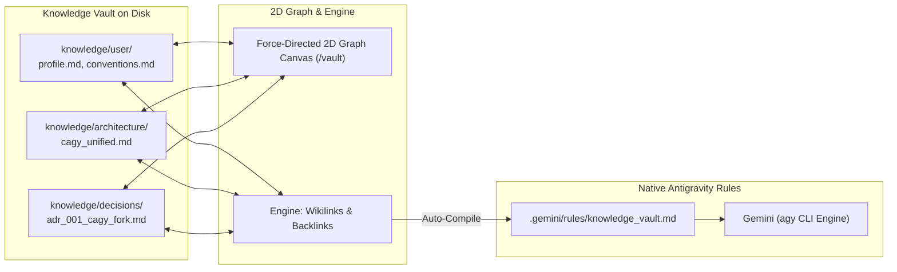

# Containerized Antigravity (CAGY Docker & WebUI Bridge)

[](LICENSE)
[](https://docker.com)
[](https://deepmind.google)

A complete, fully containerized execution environment and browser WebUI for **Google Antigravity (AGY)**.

By encapsulating both the WebUI server and the native Linux `agy` CLI binary inside an isolated Debian container, all process spawning, bash tool executions, script runs, and file modifications remain completely shielded from host-level endpoint detection (e.g. SentinelOne, SecureWorks, or CrowdStrike on macOS/Windows) while providing a rich, responsive pair-programming web experience.

---

## Key Features

- **Full EDR & Process Shielding**: All shell executions, python scripts, file manipulations, and agent tool calls run exclusively inside the container's isolated Linux namespace.
- **Native Antigravity Engine**: Uses the official Google Antigravity Linux binary (`agy`) with automated lifecycle management.
- **Obsidian-Style Knowledge Vault & 2D Graph (`/vault`)**: Modular markdown second brain in `./knowledge/` (`/workspace/knowledge/`) with bi-directional `[[wikilinks]]`, backlinks resolution, and an interactive 2D physics force-directed graph canvas. 100% interoperable with the desktop Obsidian application.
- **Agent-Assisted Memory & Auto-Learning (`/memorize`)**: 1-click `🧠 Memorize` message actions and `/memorize` slash command that auto-categorize insights into ADRs (`decisions/adr_XXX`), user preferences, and architecture notes, auto-link existing entities with `[[wikilinks]]`, and sync to `.gemini/rules/` before every conversation turn.
- **Subagent Swarms Visualizer (`/swarm`)**: Real-time DAG hierarchy viewer, execution timeline, and inspector for delegated multi-agent subtasks (`invoke_subagent`).
- **Model Context Protocol (MCP) Hub (`/mcp`)**: Native manager for `mcp.json` with one-click presets for GitHub, Docker, Fetch, Memory, PostgreSQL, SQLite, and Puppeteer servers with live latency probes.
- **Artifact & Code Preview Canvas with Visual Diffs**: Tri-mode viewer (`[ Code | Diff | Live Preview ]`) featuring side-by-side Git diffs against HEAD, sandboxed live HTML/SVG canvas previews, and session-less direct-to-editor file manipulation.
- **Skill & Rule Scaffolder Wizard (`/skills`)**: Visual builder for `.gemini/rules/*.md` and `skills/<name>/SKILL.md`.
- **Command Palette (`Cmd + K`)**: Quick access to all views, panels, settings, and slash commands (`/goal`, `/plan`, `/memorize`, `/vault`, `/swarm`, `/mcp`, `/skills`, `/grill-me`).
- **Corporate SSL Certificate Trust**: Automatically exports host root certificates into `./container_data/system_certs.pem` to prevent corporate proxy or TLS inspection errors.
- **Persistent State**: Sessions, transcripts, tokens, and journals persist cleanly across container rebuilds in `./container_data/`.

---

## Prerequisites

Before setting up CAGY, ensure you have:
1. **Docker Desktop** (macOS / Windows) or **Docker Engine** (Linux) running.
2. **Git** and **Bash / Zsh**.
3. A **Google Account** with access to Google Antigravity (Gemini).

---

## Quick Start Guide

### Step 1: Clone the Repository
```bash
git clone https://github.com/<your-username>/cagy-docker.git
cd cagy-docker
```

### Step 2: Run Initial Setup & Certificate Generator
The setup script exports host root SSL certificates (vital for corporate TLS inspection), initializes the persistent data directories, and builds the container image:
```bash
./setup.sh
```

### Step 3: One-Time Google Authentication in the Container
Because macOS uses Keychain while Linux uses secure file-based token storage, run the interactive container CLI once to authenticate:
```bash
./agy-container.sh cli agy
```
1. Click the URL or press `Enter` to open the Google login page in your browser.
2. Complete sign-in and approve the Antigravity CLI authorization.
3. Once authenticated, press `Ctrl + C` or type `/exit` to return to your host terminal.
*(Your credentials are permanently stored in `./container_data/gemini/` and will persist across restarts and rebuilds.)*

### Step 4: Start the Background Container & WebUI
```bash
./agy-container.sh up
```
Open **[http://localhost:8989](http://localhost:8989)** in your browser.

> [!TIP]
> **Optional Password Protection**: By default, the WebUI runs without a password for fast local development. If running on a shared network or server, set `AGY_WEBUI_PASSWORD=your_password` in `.env` to require password login (`agy_session` cookie).

---

## WebUI Overview & Navigation

| View / Feature | Shortcut / Route | Description |
| :--- | :--- | :--- |
| **Chat & Pairing Canvas** | `/chat` (Default) | Real-time streaming conversation, syntax highlighting, and inline tool inspection. |
| **Knowledge Vault & 2D Graph** | `/vault` or Left Rail | Interactive force-directed knowledge graph and second brain with bi-directional wikilinks. |
| **Agent Auto-Memorization** | `/memorize` or `🧠` Button | Instantly extract user preferences, conventions, or ADRs into the Knowledge Vault. |
| **Subagent Swarms** | `/swarm` or Left Rail | Visual DAG tree and step-by-step transcript timeline for autonomous subagents. |
| **MCP Server Hub** | `/mcp` or Left Rail | Catalog of active tools and servers configured in `mcp.json` with quick presets & test probes. |
| **Workspace, Diffs & Canvas** | Right Sidebar / `/artifacts` | Tri-mode drawer (`[ Code | Diff | Live Preview ]`) with side-by-side git diffs and live canvas. |
| **Skills & Rules Scaffolder** | `/skills` or Left Rail | Domain skills manager and visual rule generator. |
| **Command Palette** | `Cmd + K` / `Ctrl + K` | Universal search for commands, panels, settings, and workflows. |

---

## Obsidian-Style Knowledge Vault & Graph Memory

CAGY features an integrated **Obsidian-compatible Knowledge Vault** at `/workspace/knowledge/` (mounted directly from `./knowledge/` on the host).



### 1. Vault Directory Taxonomy
- **`knowledge/user/`**: Developer profile, tone preferences, coding conventions, and workflow rules.
- **`knowledge/architecture/`**: System topology, container execution models, cloud infrastructure, and network design.
- **`knowledge/decisions/`**: Architecture Decision Records (`adr_XXX_<name>.md`) tracking choices, trade-offs, and deprecations.
- **`knowledge/notes/`**: Research topics, conceptual summaries, and reference guides.

### 2. Bi-Directional Wikilinks & 2D Force-Directed Graph (`/vault`)
- Notes use standard Obsidian `[[Note Name]]`, `[[folder/note]]`, or `[[target|Alias]]` links.
- The **2D Graph Canvas** simulates a real-time particle-spring physics layout:
  - Node sizes scale dynamically with connection density (in-degree + out-degree).
  - Category-based color coding (`user`: blue, `architecture`: cyan, `decisions`: purple, `notes`: green).
  - Hover glow, pan, mouse-wheel zoom, and aspect-ratio synchronization preventing distortion when resizing sidebars.
  - Clicking any note or graph node opens it directly in the right-sidebar Markdown editor.

### 3. Agent-Assisted Memorization (`/memorize` & `🧠` Button)
- **`/memorize <insight>`**: Automatically classifies the takeaway into the appropriate directory, assigns sequential ADR numbers for decisions, synthesizes wikilinks to matching existing vault entities, and recompiles native rules.
- **`/memorize` (No Arguments)**: Prompts Gemini to synthesize recent conversation turns into atomic vault notes.
- **1-Click Message Action**: Click the `🧠` bookmark icon on any assistant message to immediately extract and persist the insight into the vault with toast feedback.
- **Pre-Turn Rule Sync**: The CLI runner (`run_agent.py`) re-compiles `.gemini/rules/knowledge_vault.md` before every conversation turn, ensuring the model retains full context across all sessions.

### 4. Obsidian Desktop Interoperability
Because all notes are saved as plain UTF-8 Markdown on the host filesystem under `./knowledge/`, you can open this folder directly as an existing vault in the official **[Obsidian](https://obsidian.md)** desktop app on macOS/Windows/Linux.

---

## Artifact & Code Preview Canvas with Visual Diffs

The right-hand workspace panel provides a unified file inspector and artifact rendering canvas:

- **Mode 1: Code Viewer & Editor**: Syntax-highlighted view of workspace files with direct editing and saving. Operates without requiring an active chat session.
- **Mode 2: Side-by-Side Visual Diff**: Computes line-by-line structured diffs against Git HEAD (`difflib.SequenceMatcher`), displaying additions, deletions, line gutters, and unified scroll.
- **Mode 3: Live Preview Canvas**: Sandboxed `<iframe>` environment for rendering live HTML, CSS, JavaScript, SVG, and interactive diagrams with an **Expand Canvas** modal.

---

## Managing & Updating Services

### Daily Operations

```bash
# Check status of container daemon & WebUI
./agy-container.sh status

# View live container logs (supervisor, webui, agy stream)
./agy-container.sh logs

# Open an interactive bash shell inside the container
./agy-container.sh cli

# Stop services gracefully
./agy-container.sh down
```

### Running Automated Tests

CAGY includes a comprehensive automated test suite covering syntax compilation, the `run_agent.py` CLI streaming bridge, dynamic model discovery, session persistence, and core REST API endpoints:

```bash
# Run hermetic test suite locally on host
./run-tests.sh

# Run test suite inside the running Docker container
./run-tests.sh --container

# Run live single-turn compatibility probe against Google Antigravity
./run-tests.sh --compatibility
```

### Building & Publishing Container Images

CAGY features an optimized multi-stage `Dockerfile` with multi-architecture support (`linux/amd64` and `linux/arm64`), pre-bundled `uv`/`uvx` binaries, and a streamlined runtime footprint:

```bash
# Build optimized image for local architecture (tagged cagy:latest and cagy:v2.0-cagy)
./build-image.sh

# Build with post-build toolchain verification (uv, uvx, agy)
./build-image.sh --test

# Validate multi-arch cross-compilation (linux/amd64 & linux/arm64)
./build-image.sh --multi-arch

# Build and push multi-arch image to container registry
./build-image.sh --push ghcr.io/<owner>/cagy
```

### Updating Antigravity CLI

We provide two update pathways:

* **Quick In-Place Update (Recommended)**:
  Downloads and updates the Antigravity binary directly inside the running container in seconds:
  ```bash
  ./update.sh
  ```
* **Full Clean Rebuild**:
  Re-exports host certificates, updates Linux base packages, and performs a fresh build of the Docker image:
  ```bash
  ./update.sh full
  ```

---

## Architecture & Directory Layout

```text
├── container_data/        # Persistent data (gitignored, survives container restarts)
│   ├── webui/             # WebUI database, sessions, and settings
│   │   └── sessions/      # Transcripts, turn journals, and history
│   ├── gemini/            # Antigravity CLI auth tokens, settings, and brain logs
│   │   └── antigravity-cli/brain/  # Subagent transcripts and artifacts
│   └── system_certs.pem   # Exported host SSL root certificates
├── knowledge/             # Obsidian-compatible Knowledge Vault & Second Brain
│   ├── user/              # Developer profile and coding conventions
│   ├── architecture/      # System architecture and container topologies
│   ├── decisions/         # Architecture Decision Records (ADRs)
│   └── notes/             # Research notes and domain reference guides
├── skills/                # Antigravity domain skills
│   ├── agy-webui-bridge/  # CLI bridge contract & compatibility validator
│   └── knowledge-vault/   # Knowledge Vault authoring & protocol guidelines
├── webui/                 # WebUI frontend & backend bridge
│   ├── static/            # Static assets (HTML, CSS, JS, Katex, Smd)
│   ├── api/               # API endpoints (vault, subagents, mcp_hub, diff_viewer)
│   ├── run_agent.py       # Antigravity CLI event-streaming bridge adapter
│   └── server.py          # WebUI HTTP daemon entrypoint
├── tests/                 # Hermetic automated test suite & mock CLI
├── .gemini/rules/         # Native rules (knowledge_vault, container_confinement)
├── GEMINI.md              # Container execution namespace configuration
├── Dockerfile             # Multi-stage Debian container with Linux agy, uv, and supervisor
├── docker-compose.yml     # Compose service specification and volume mounts
├── build-image.sh         # Multi-arch image builder and verification tool
├── run-tests.sh           # Test suite runner (host, container, compatibility)
├── setup.sh               # Initial setup and certificate exporter
├── update.sh              # Update script (fast in-place or full rebuild)
└── agy-container.sh       # Unified container CLI manager
```

---

## Troubleshooting FAQ

### 1. "Authentication required" in WebUI
If the WebUI reports that the agent is not authenticated:
* Run `./agy-container.sh cli agy` in your host terminal.
* Complete the browser authentication link.
* Refresh the WebUI at `http://localhost:8989`.

### 2. Corporate Proxy or SSL Certificate Errors
If `agy` reports `x509: certificate signed by unknown authority`:
* Run `./setup.sh` on your host machine to re-export your local system keychain certificates to `container_data/system_certs.pem`.
* Restart the container: `./agy-container.sh down && ./agy-container.sh up`.

### 3. Port Conflict on 8989
If port `8989` is already bound by another service on your machine:
* Edit `docker-compose.yml` to map a different host port (e.g. `"9090:8989"`).
* Access the WebUI at `http://localhost:9090`.

### 4. Resetting Container State
To reset the container while preserving your sessions and login tokens:
```bash
./agy-container.sh down
./update.sh full
./agy-container.sh up
```

---

## Acknowledgments & Credits

CAGY was originally adapted and forked from the open-source **[Hermes WebUI](https://github.com/NousResearch/hermes-webui)** project by Nous Research and its contributors. We express our gratitude to the original Hermes authors and community for providing an excellent web interface foundation.

---

## License

This project is licensed under the [MIT License](LICENSE), preserving the original MIT licensing terms and upstream copyright notices.


