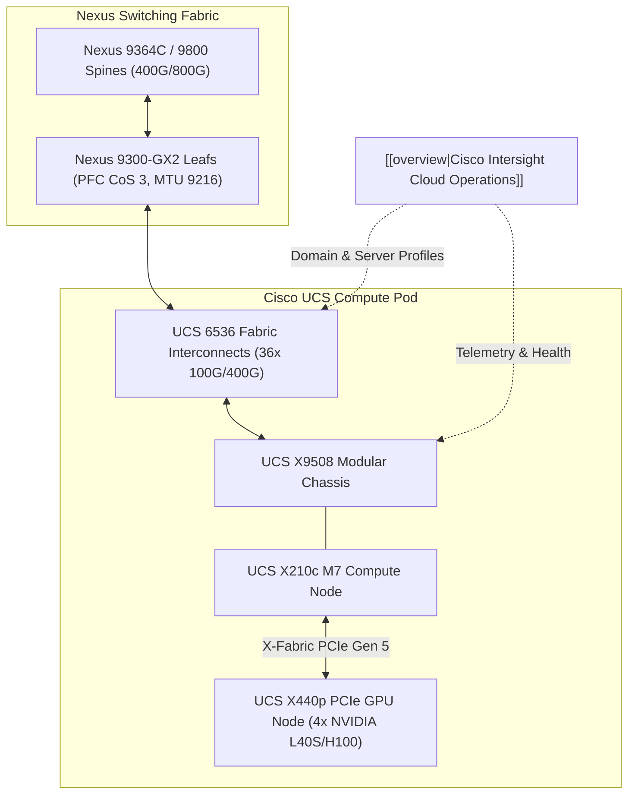

# Cisco UCS & Nexus AI Compute Fabric Architecture

- **Space**: `300-640_dcai`
- **Related Project**: `/workspace/projects/300-640_DCAI/02-ai-infrastructure-components-and-architecture/02-compute-architecture-and-gpu-connectivity.md`
- **Tags**: #cisco #ucs #intersight #nexus #gpus #nvlink #hbm3e

## 1. Architectural Overview
This architecture establishes the physical and logical integration of **Cisco UCS X-Series modular compute** and **Cisco Nexus 9000 switches**, orchestrating GPU-accelerated workloads across high-density AI data halls.

## 2. Core Architectural Principles
1. **Midplane-Free Chassis Dynamics**: The UCS X9508 eliminates the traditional chassis midplane, enabling direct front-to-back laminar airflow supporting up to 54 kW power delivery and high-wattage GPUs.
2. **X-Fabric PCIe Expansion**: Allows modular compute blades (X210c) to attach horizontally to full-length GPU expansion nodes (X440p) with native PCIe Gen 5 line rates.
3. **Strict 1:1 Non-Blocking Spine-Leaf**: Eliminates oversubscription in the back-end GPU fabric, guaranteeing that AllReduce collective bursts never experience spine buffer drops.

## 3. Interlinked Context
- See [[cisco_ai_compute_ucs_nexus_architecture]] for UCS policy configuration guides.
- See [[ai_infrastructure_troubleshooting_playbook]] for triaging straggler nodes and thermal events.
- See [[adr_001_rocev2_lossless_transport]] for the transport foundation.
