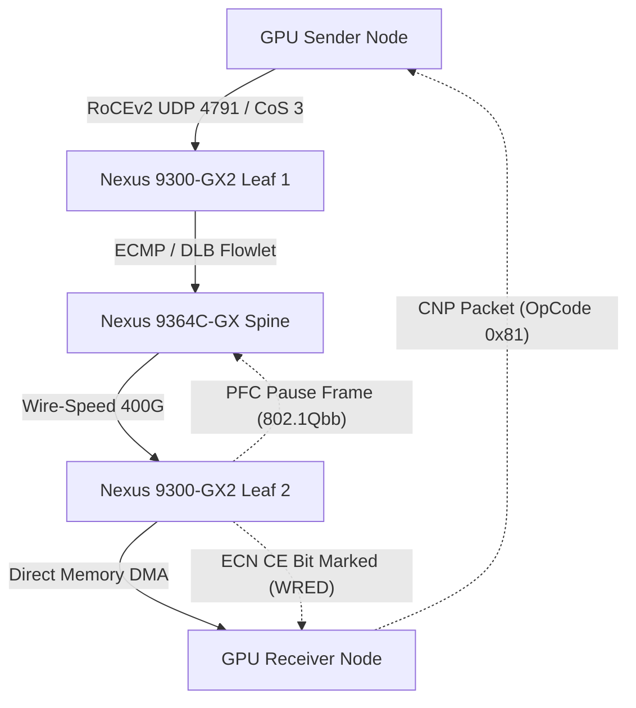

# Lossless Ethernet & RoCEv2 Network Architecture

- **Space**: `300-640_dcai`
- **Related Project**: `/workspace/projects/300-640_DCAI/03-ai-infrastructure-deployment-and-data-management/01-lossless-ethernet-and-congestion-control.md`
- **Tags**: #cisco #nexus #rocev2 #pfc #ecn #lossless #networking #ai

## 1. Architectural Overview
The back-end AI cluster network must provide deterministic, **lossless Layer 3 transport** for GPU-to-GPU collective operations (AllReduce, AllGather). Traditional TCP flow control introduces prohibitive retransmission latency that violates tail-latency SLAs.

## 2. The Lossless Holy Trinity
1. **Priority-Based Flow Control (PFC - IEEE 802.1Qbb)**: Link-level pause mechanism operating per CoS queue (standardized on CoS 3). Preserves buffer headroom during bursts.
2. **Explicit Congestion Notification (ECN - RFC 3168)**: Proactive egress queue marking using WRED curves to notify end hosts via Congestion Notification Packets (CNP).
3. **Enhanced Transmission Selection (ETS - IEEE 802.1Qaz)**: DWRR bandwidth allocation preventing starvation between AI, storage, and management traffic.

## 3. Interlinked Context
- See [[adr_001_rocev2_lossless_transport]] for the decision record selecting RoCEv2 over InfiniBand.
- See [[adr_002_dynamic_load_balancing_flowlets]] for eliminating ECMP elephant flow polarization.
- See [[lossless_ethernet_pfc_ecn_rocev2_guide]] for configuration parameters.
- See [[user/conventions]] for workspace architectural standards.
