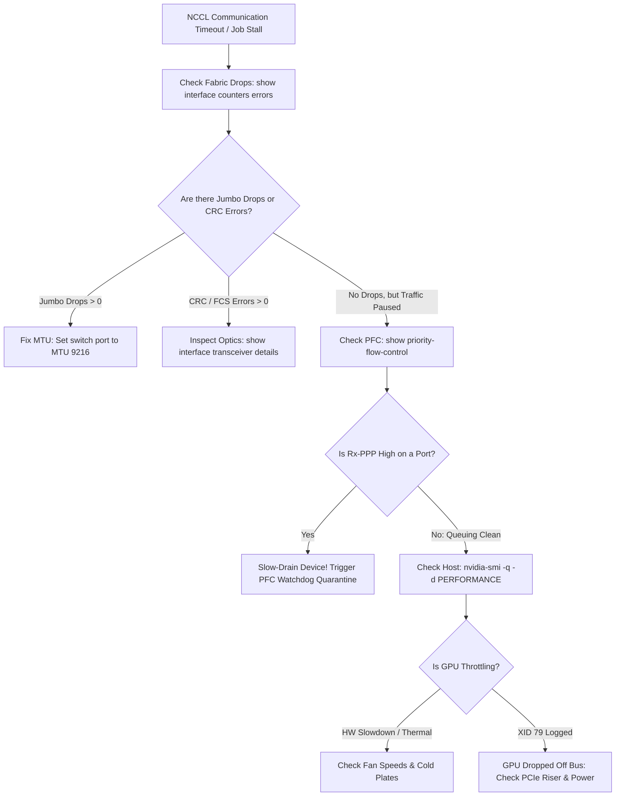

# AI Infrastructure Troubleshooting & Diagnostic Playbook

- **Space**: `300-640_dcai`
- **Related Project**: `/workspace/projects/300-640_DCAI/04-ai-infrastructure-operations-and-troubleshooting/04-troubleshooting-playbooks-and-cli-diagnostics.md`
- **Tags**: #troubleshooting #diagnostics #nxos #ucs #pfc #slowdrain #xid #dcai

## 1. Executive Triage Workflow
When multi-node distributed training jobs stall, drop packets, or abort with NCCL timeouts, follow this 4-step triage sequence:



---

## 2. Top Diagnostic Scenarios & Root Causes

### 1. PFC Pause Storm & Slow Drain
- **Symptom**: Whole rack stalls; `show priority-flow-control` shows millions of `Rx-PPP` on a single leaf port.
- **Root Cause**: Server SuperNIC buffer locked up due to PCIe bus congestion; spams pause frames upstream.
- **Resolution**: Enable PFC Watchdog (`priority-flow-control watch-dog-interval 100`) to quarantine rogue ports automatically.

### 2. Silent Packet Drop (MTU Mismatch)
- **Symptom**: Small ping packets pass, but large AllReduce tensor bursts drop silently with zero ICMP messages.
- **Root Cause**: Host sends 9000-byte packets; switch port set to default 1500 bytes.
- **Resolution**: Configure MTU 9216 under `policy-map type network-qos` and verify on physical interfaces.

### 3. Straggler Node in AllReduce
- **Symptom**: Multi-GPU collective communication takes 400% longer than baseline; bus bandwidth collapses.
- **Root Cause**: One GPU is thermal throttling (HW Slowdown) or bound across cross-socket NUMA nodes.
- **Resolution**: Bind PyTorch worker to local NUMA node (`numactl --cpunodebind=0`); inspect cooling loops.

### 4. High Bit Error Rate (BER) & Optical Signal Degradation
- **Symptom**: RoCEv2 NAK retransmissions surge while switch buffers show zero congestion.
- **Root Cause**: Transceiver `Rx Power` below low alarm threshold ($< -12\text{ dBm}$) due to dirty fiber end-faces.
- **Resolution**: Clean fiber end-faces or replace degraded QSFP-DD optical transceivers.

---

## 3. High-Frequency CLI Command Reference

```text
! Switch Level (Nexus NX-OS)
show priority-flow-control
show queuing interface Ethernet1/1
show interface transceiver details
show policy-map system
show logging | grep -E "PFC|QOS|WATCHDOG"

! Host Level (Linux / NVIDIA)
ib_write_bw -d mlx5_0 192.168.10.2 -R -F --report_gbits
nvidia-smi -q -d PERFORMANCE,CLOCK,BUS
dmesg -T | grep -E "NVRM: Xid|PCIe AER"
numactl --hardware
```

## 4. Interlinked Context
- See [[lossless_ethernet_pfc_ecn_rocev2_guide]] for PFC and ECN threshold baselines.
- See [[cisco_ai_compute_ucs_nexus_architecture]] for UCS policy troubleshooting.
- See [[dcai_curriculum_domain_map]] for the complete curriculum structure.
