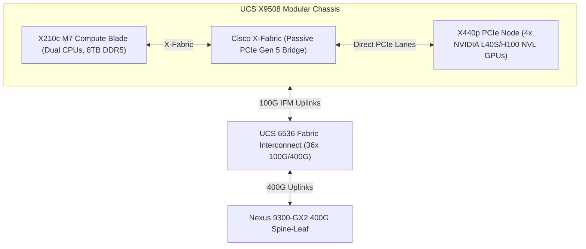

# Cisco AI Compute (UCS & Nexus) Architecture Reference Guide

- **Space**: `300-640_dcai`
- **Related Project**: `/workspace/projects/300-640_DCAI/03-ai-infrastructure-deployment-and-data-management/05-cisco-ucs-compute-and-storage-configuration.md`
- **Tags**: #cisco #ucs #nexus #intersight #compute #gpus #xseries

## 1. UCS X-Series & Intersight Policy Architecture
Cisco UCS revolutionizes high-density AI computing by combining modular blade agility with dedicated GPU accelerators via the **UCS X-Series Modular System**:

---

## 2. Mandatory UCS Policies for AI Clusters

| Policy Category | Configuration Target | Mandatory Setting for AI RoCEv2 |
| :--- | :--- | :--- |
| **Domain Profile** | UCS 6536 FI Ports | Define 100G server ports and 400G network uplinks. |
| **Power Policy** | Chassis Redundancy | **Grid Redundancy (N+N)** to protect 40kW+ racks from power feed failure. |
| **Storage Policy** | Controller Mode | **RAID 1** for OS boot drives; **JBOD / Pass-Through** for parallel NVMe storage. |
| **vNIC Policy** | MTU Size | **MTU 9216 (Jumbo Frames)**. |
| **vNIC RoCE** | Hardware RDMA Engine | **Enable RoCEv2** on host vNIC. |
| **vNIC Failover** | Network Redundancy | **Disable Hardware Fabric Failover** (allow dual-rail software stack to manage paths). |
| **QoS System Class** | Platinum Class | Set **Packet Drop = No** and map to **CoS 3** with 60–70% bandwidth weight. |
| **NTP / Time Policy**| Clock Synchronization | Enable **PTP (IEEE 1588)** for sub-microsecond multi-node log correlation. |

---

## 3. Cisco Nexus Hyperfabric AI Integration
- **Cloud-Managed Control Plane**: SaaS portal delivering automated Day-0 to Day-2 lifecycle management.
- **End-to-End Orchestration**: Manages both Cisco Nexus switches and host **NVIDIA BlueField DPUs / ConnectX SuperNICs**.
- **Automated Remediation**: Ingests real-time streaming telemetry and automatically steers traffic around congested links or degraded optical transceivers.

## 4. Interlinked Context
- See [[cisco_ucs_nexus_ai_fabric]] for physical and logical topology diagrams.
- See [[ai_infrastructure_troubleshooting_playbook]] for diagnosing GPU hardware errors and thermal throttling.
- See [[dcai_curriculum_domain_map]] for the complete blueprint mapping.
