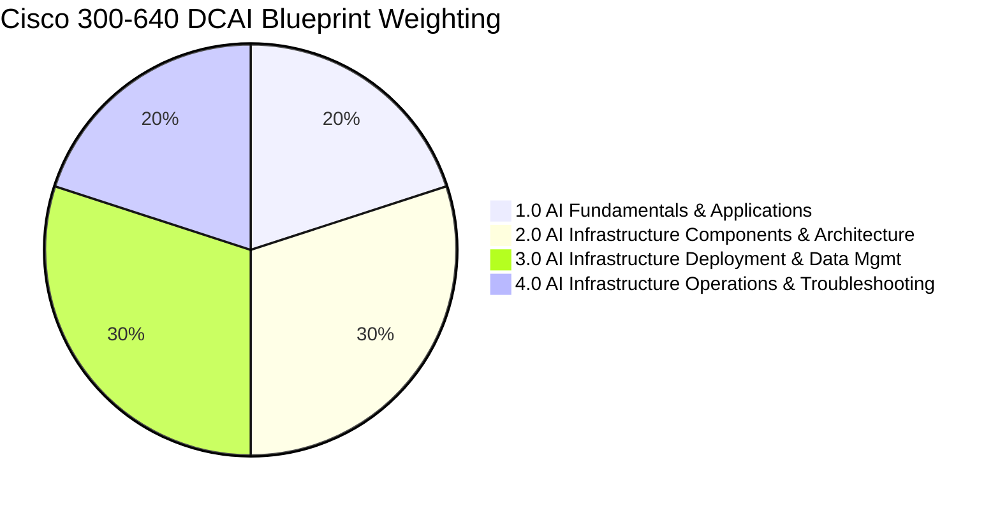

# Cisco 300-640 DCAI Curriculum Domain Map

- **Space**: `300-640_dcai`
- **Related Project**: `/workspace/projects/300-640_DCAI/README.md`
- **Tags**: #cisco #dcai #ccnp #curriculum #blueprint #exam-prep

## 1. Domain Weighting & Blueprint Topology

---

## 2. Detailed Domain Breakdown & Vault Interlinks

### Domain 1.0: AI Fundamentals and Applications (20%)
*Master AI workload mechanics, the data pipeline lifecycle, and Cisco turnkey architectures.*
- **1.1 Workload Types**: RAG, Distributed Training (Data, Tensor, Pipeline Parallelism), Inference (KV cache, TTFT), and Generative AI.
- **1.2 AI Lifecycle**: 7 phases from data ingestion and cleaning to model quantization, deployment, and data/concept drift.
- **1.3 AI Use Cases**: Enterprise search, edge computer vision, autonomous systems, predictive maintenance, and fraud detection.
- **1.4 Infrastructure Models**: Public Cloud vs. Private On-Prem (60% utilization TCO inflection rule) vs. Hybrid AI vs. Edge AI.
- **1.5 Core Components**: Front-end vs. back-end networks, NVLink, NVIDIA MIG hardware partitioning, Slurm vs. Kubernetes, and parallel file systems.
- **1.6 Cisco Solutions**: Cisco AI PODs (CVDs), Cisco AI Canvas framework, and Cisco Nexus Hyperfabric AI.
- *Linked Architecture*: See [[cisco_ucs_nexus_ai_fabric]].

---

### Domain 2.0: AI Infrastructure Components and Architecture (30%)
*Evaluate high-performance fabrics, compute density, high-throughput storage, and liquid cooling.*
- **2.1 Network Deployment**: Strict 1:1 non-blocking bisectional bandwidth, tail latency mitigation in AllReduce, rail-optimized spine-leaf, and wire-speed MACsec.
- **2.2 Compute Deployment**: 2:8 CPU-to-GPU golden ratio, PCIe Gen 5 lanes, HBM3e memory bandwidth, NUMA node binding, and scale-up vs. scale-out boundaries.
- **2.3 Storage Deployment**: Checkpointing write window mathematics, POSIX parallel scale-out file systems (Weka, VAST Data), and GPUDirect Storage (GDS).
- **2.4 Power, Cooling, & Sustainability**: 40kW–100kW+ rack density, PUE targets (1.15), Direct-to-Chip (D2C) liquid cooling, RDHx, and Intersight power capping.
- *Linked Architecture*: See [[lossless_ethernet_rocev2_topology]].

---

### Domain 3.0: AI Infrastructure Deployment and Data Management (30%)
*Configure lossless Ethernet, deploy RoCEv2, orchestrate UCS server profiles, and automate fabrics.*
- **3.1 High-Performance Networking**:
  - *Congestion Control*: Priority-based Flow Control (PFC - 802.1Qbb), Explicit Congestion Notification (ECN - RFC 3168), and Enhanced Transmission Selection (ETS - 802.1Qaz).
  - *RoCEv2*: UDP port 4791, InfiniBand BTH header, and Congestion Notification Packets (CNP OpCode 0x81).
  - *QoS*: Cisco NX-OS MQC configuration (`type qos`, `type network-qos`, `type queuing`) for CoS 3 no-drop.
  - *Load Distribution*: Resolving elephant flow polarization via Dynamic Load Balancing (DLB), Flowlet switching, and Packet Spraying.
- **3.2 Cisco UCS Configuration**: Intersight domain profiles, power policies (Grid N+N), storage RAID/JBOD policies, vNIC policies (MTU 9216, RoCE enabled, failover disabled), and Platinum lossless system classes.
- **3.3 Fabric Orchestration**: Nexus Dashboard Fabric Controller (NDFC AI templates), Cisco APIC (ACI), Nexus Hyperfabric, and Intersight.
- *Linked ADRs*: See [[adr_001_rocev2_lossless_transport]] and [[adr_002_dynamic_load_balancing_flowlets]].
- *Linked Notes*: See [[lossless_ethernet_pfc_ecn_rocev2_guide]] and [[cisco_ai_compute_ucs_nexus_architecture]].

---

### Domain 4.0: AI Infrastructure Operations and Troubleshooting (20%)
*Benchmark multi-GPU clusters, monitor microsecond telemetry, and triage production failures.*
- **4.1 Benchmarking**: NCCL tests (`all_reduce_perf`), bus bandwidth vs. algorithm bandwidth formula ($\text{busbw} \approx 2 \times \text{algbw}$), FIO storage testing, and `perftest` (`ib_write_bw`).
- **4.2 Monitoring Platforms**: Nexus Dashboard Insights (NDI) for microbursts and PFC pause telemetry; Cisco Intersight for GPU power, thermals, and proactive advisories.
- **4.3 Telemetry & Health**: Model-driven streaming telemetry (gNMI/gRPC), In-Band Network Telemetry (INT), DOM optical power monitoring, and full-stack log correlation.
- **4.4 Troubleshooting**: Playbooks for PFC deadlocks/pause storms, silent MTU 1500 drops, RoCE DSCP misclassifications, and GPU XID hardware faults (e.g., XID 79).
- *Linked Notes*: See [[ai_infrastructure_troubleshooting_playbook]].
