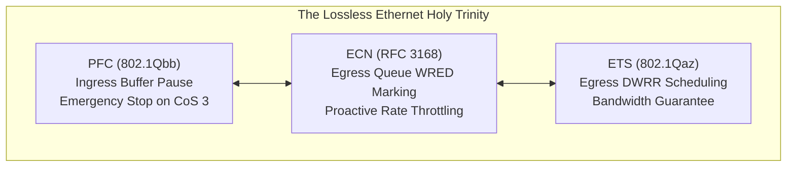

# Lossless Ethernet, PFC, ECN, & RoCEv2 Reference Guide

- **Space**: `300-640_dcai`
- **Related Project**: `/workspace/projects/300-640_DCAI/03-ai-infrastructure-deployment-and-data-management/01-lossless-ethernet-and-congestion-control.md`
- **Tags**: #lossless #pfc #ecn #ets #rocev2 #nxos #qos #cisco

## 1. Executive Summary & Plain-English Fundamentals
In AI distributed computing, gradient synchronization during AllReduce collective calls makes clusters extraordinarily sensitive to tail latency. A single dropped packet stalls hundreds of synchronized GPUs. Lossless Ethernet converts best-effort Ethernet into a zero-drop fabric through three synchronized mechanisms:
1. **PFC (IEEE 802.1Qbb)**: The emergency brake that halts transmission on specific CoS queues (standardized on CoS 3) when ingress buffers cross XOFF thresholds.
2. **ECN (RFC 3168)**: The proactive cruise-control that marks IP headers with Congestion Experienced (CE = `11`) via WRED curves on egress queues, prompting receivers to send Congestion Notification Packets (CNP) to slow down senders.
3. **ETS (IEEE 802.1Qaz)**: The bandwidth allocator using DWRR scheduling to guarantee bandwidth allocations across classes.



---

## 2. RoCEv2 Encapsulation & Transport Specs

| Parameter | Standard Specification | Role in AI Data Center |
| :--- | :--- | :--- |
| **Layer 4 Protocol** | UDP (IP Protocol 17) | Enables traversal of Layer 3 IP spine-leaf switches. |
| **Destination Port** | **`4791`** (IANA Standard) | Identifies RoCEv2 packet payload for switch classification. |
| **Source Port** | **Dynamic Hash (49152–65535)** | Provides flow entropy for ECMP and Dynamic Load Balancing (DLB). |
| **BTH Header** | 12 Bytes | Contains OpCode, Partition Key, Destination QPN, and PSN. |
| **CNP OpCode** | **`0x81`** | Congestion Notification Packet generated by receiver in response to ECN CE. |
| **Class of Service** | **CoS 3** | Cisco and NVIDIA industry standard for lossless AI RoCE traffic. |
| **DSCP Marking** | **DSCP 26 (AF31) or 24 (CS3)** | Layer 3 QoS tag preserved across routed hops. |

---

## 3. Cisco NX-OS Lossless Configuration Snippet

```text
! 1. Classification
class-map type qos match-any CM_ROCE
  match dscp 26
  match cos 3

policy-map type qos PM_QOS_INGRESS
  class CM_ROCE
    set qos-group 3

! 2. Network-QoS
class-map type network-qos CM_NETQOS_ROCE
  match qos-group 3

policy-map type network-qos PM_NETWORK_QOS
  class CM_NETQOS_ROCE
    pause pfc-cos 3
  class class-default
    mtu 9216

! 3. Queuing & ECN
class-map type queuing CM_QUEUE_ROCE
  match qos-group 3

policy-map type queuing PM_QUEUING_EGRESS
  class type queuing CM_QUEUE_ROCE
    bandwidth percent 70
    random-detect ecn
    random-detect minimum-threshold 150 kbytes maximum-threshold 1500 kbytes

! 4. System Activation
system qos
  service-policy type qos input PM_QOS_INGRESS
  service-policy type network-qos PM_NETWORK_QOS
  service-policy type queuing output PM_QUEUING_EGRESS
```

## 4. Interlinked Context
- See [[lossless_ethernet_rocev2_topology]] for the physical topology.
- See [[adr_001_rocev2_lossless_transport]] for the decision rationale.
- See [[ai_infrastructure_troubleshooting_playbook]] for triaging PFC pause storms.
