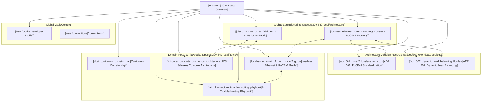

# Cisco 300-640 DCAI Knowledge Base Space Overview

- **Space**: `300-640_dcai`
- **Related Project**: `/workspace/projects/300-640_DCAI`
- **Tags**: #cisco #dcai #ccnp #ai #rocev2 #nexus #ucs #knowledge-graph #space

## 1. Space Mission & Architecture
This space container serves as the primary **Second Brain & Knowledge Graph Memory Engine** for the **Cisco 300-640 DCAI (Implementing Cisco Data Center AI Infrastructure)** certification and engineering repository. It bridges deep learning compute primitives, high-throughput storage pipelines, and wire-speed lossless Ethernet fabrics into an interconnected Obsidian-compatible knowledge base.

## 2. Directory Taxonomy
- **Decisions (`spaces/300-640_dcai/decisions/`)**:
  - `adr_001_rocev2_lossless_transport.md` — Standardization on RoCEv2 over InfiniBand.
  - `adr_002_dynamic_load_balancing_flowlets.md` — Dynamic Load Balancing to eliminate ECMP polarization.
- **Architecture (`spaces/300-640_dcai/architecture/`)**:
  - `lossless_ethernet_rocev2_topology.md` — Non-blocking 400G/800G lossless spine-leaf architecture.
  - `cisco_ucs_nexus_ai_fabric.md` — Integration of UCS X-Series, 6536 FIs, and Nexus 9000 ASICs.
- **Notes (`spaces/300-640_dcai/notes/`)**:
  - `overview.md` — Master space navigation and relationship graph.
  - `dcai_curriculum_domain_map.md` — Full 4-domain syllabus mapping with key exam objectives.
  - `lossless_ethernet_pfc_ecn_rocev2_guide.md` — In-depth guide on PFC, ECN, ETS, and RoCEv2.
  - `cisco_ai_compute_ucs_nexus_architecture.md` — Deep dive into UCS server profiles, power capping, and vNICs.
  - `ai_infrastructure_troubleshooting_playbook.md` — Step-by-step diagnostic trees and CLI show commands.
