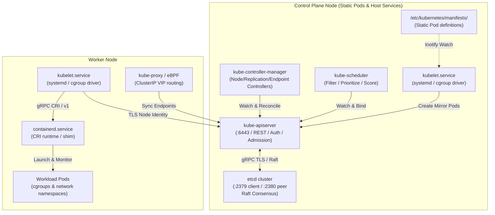

# Kubernetes Control Plane Topology & Component Lifecycle

- **Space**: `cka-kb`
- **Domain**: Cluster Architecture, Installation & Configuration (25%) & Troubleshooting (30%)
- **Tags**: #cka #kubernetes #architecture #control-plane #etcd #kubelet #ha

---

## 1. Core Component Breakdown

### 1.1 `kube-apiserver` (The Central Hub)
- **Role**: The stateless REST gateway and single entry point to the cluster state.
- **Request Pipeline**:
  $$\text{Client Request} \longrightarrow \text{Authentication (Cert/Webhook/Token)} \longrightarrow \text{Authorization (RBAC/Node)} \longrightarrow \text{Mutating Admission} \longrightarrow \text{Schema Validation} \longrightarrow \text{Validating Admission} \longrightarrow \text{etcd}$$
- **Key Config Flags**:
  - `--etcd-servers=https://127.0.0.1:2379`
  - `--etcd-cafile=/etc/kubernetes/pki/etcd/ca.crt`
  - `--enable-admission-plugins=NodeRestriction,...`
  - `--service-cluster-ip-range=10.96.0.0/12`

### 1.2 `etcd` (The Source of Truth)
- **Role**: Distributed, strongly consistent key-value store governed by the **Raft consensus algorithm**.
- **Quorum Formula**:
  $$\text{Quorum} = \lfloor N/2 \rfloor + 1$$
  - A 3-node cluster can tolerate **1 failure** ($Q=2$).
  - A 5-node cluster can tolerate **2 failures** ($Q=3$).
  - Even node counts provide no additional fault tolerance and increase split-brain risk.
- **Data Protection**: Managed via strict 4-step snapshot save/restore procedures detailed in [[adr_003_etcd_backup_restore_strategy|ADR 003: etcd Backup & Restore Strategy]].

### 1.3 `kube-scheduler`
- **Role**: Assigns unscheduled Pods (`spec.nodeName == ""`) to optimal nodes.
- **Two-Phase Algorithm**:
  1. **Filtering (Predicates)**: Removes unsuitable nodes (e.g., resource exhaustion, taints without tolerations, nodeSelector mismatch).
  2. **Scoring (Priorities)**: Ranks remaining nodes based on affinity weights, image locality, and balanced resource allocation.

### 1.4 `kube-controller-manager`
- **Role**: Continuous control loops ensuring *Current State* matches *Desired State*.
- **Embedded Controllers**: NodeLifecycleController, ReplicaSetController, DeploymentController, EndpointsController, ServiceAccountController.

### 1.5 `kubelet` (The Host Daemon)
- **Role**: Systemd service running on every node responsible for pod lifecycle, health probes, and volume mounting.
- **Cgroup Driver Requirement**: Must align with the container runtime (`systemd` cgroup driver) to prevent kernel out-of-sync OOM panics, governed by [[adr_004_cgroup_systemd_standardization|ADR 004: cgroup systemd Standardization]].

---

## 2. High Availability & Failure Recovery

| Component Failure | Cluster Impact | Client / Pod Impact | Recovery Action |
| :--- | :--- | :--- | :--- |
| **`kube-apiserver` down** | Control plane unresponsive; `kubectl` commands fail | Existing running pods continue unaffected; no auto-healing or scaling | Check `/var/log/pods/kube-system_kube-apiserver*` or static pod manifest |
| **`etcd` lost quorum** | APIServer enters read-only error state; updates rejected | Running pods continue functioning; new pods cannot be scheduled | Restore snapshot via [[adr_003_etcd_backup_restore_strategy|ADR 003]] or rebuild quorum |
| **`kube-scheduler` down** | New pods remain in `Pending` state | Existing pods healthy | Inspect `/etc/kubernetes/manifests/kube-scheduler.yaml` |
| **`kube-controller-manager` down** | Pod failures not rescheduled; ReplicaSet drift | Existing pods unaffected | Check leader election lock or manifests |
| **`kubelet` service crash** | Node marks `NotReady`; pods eventually evicted | Pods on node may freeze | Debug via `journalctl -u kubelet -e` |

---

## 3. Interlinks & Related Knowledge

- **Space Hub**: [[overview|CKA Space Overview]]
- **Architectural Counterparts**:
  - [[network_and_dns_model|Network & DNS Architecture]]
  - [[storage_architecture|CSI & Storage Architecture]]
- **Architectural Decision Records (ADRs)**:
  - [[adr_003_etcd_backup_restore_strategy|ADR 003: etcd Snapshot Backup & Restore Strategy]]
  - [[adr_004_cgroup_systemd_standardization|ADR 004: cgroup systemd Driver Standardization]]
- **Troubleshooting & Playbooks**:
  - [[troubleshooting_decision_trees|Troubleshooting Decision Trees]]
  - [[exam_triage_and_speedrun_playbook|Exam Speedrun & Triage Playbook]]
  - [[cka_curriculum_domain_map|CKA Curriculum Domain Map]]
- **Study Guides**:
  - [kubeadm Cluster Bootstrap](file:///workspace/projects/cka-kb/02-cluster-architecture-installation/01-kubeadm-cluster-bootstrap.md)
  - [HA Control Plane & etcd](file:///workspace/projects/cka-kb/02-cluster-architecture-installation/03-ha-control-plane-and-etcd.md)
  - [Control Plane Troubleshooting](file:///workspace/projects/cka-kb/01-troubleshooting/02-control-plane-troubleshooting.md)
