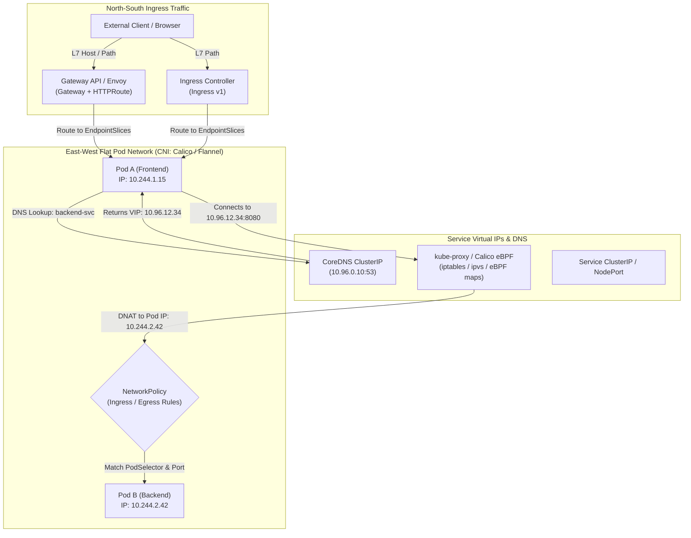

# Kubernetes Networking, CoreDNS & Traffic Routing Model

- **Space**: `cka-kb`
- **Domain**: Services & Networking (20%) & Troubleshooting (30%)
- **Tags**: #cka #kubernetes #architecture #networking #dns #coredns #cni #calico #ebpf #gateway-api #ingress

---

## 1. Fundamental Networking Invariants

Kubernetes mandates four core networking rules that every CNI plugin must enforce without NAT:
1. **Pod-to-Pod Direct Reachability**: Every Pod has a unique IP. All Pods communicate directly with all other Pods on any node without Network Address Translation (NAT).
2. **Node-to-Pod Direct Reachability**: Agents on a node (kubelet, containerd) communicate with all Pods on that node.
3. **Self-Consistency**: The IP a Pod sees as its own is the exact same IP other Pods see it as.
4. **Service VIP Abstraction**: Services provide stable virtual IPs (ClusterIP) multiplexed over dynamic ephemeral Pod IPs via EndpointSlices.

---

## 2. Packet Flow & Component Stack

### 2.1 CNI (Container Network Interface) & Data Planes
- **Flannel**: Simple overlay network using VXLAN (port 8472 encapsulation). Does not support NetworkPolicies natively.
- **Calico**: Industrial BGP/eBPF routing engine providing native Layer 3 routing and sub-millisecond NetworkPolicy enforcement. Formally adopted for CKA labs in [[adr_001_calico_ebpf_data_plane|ADR 001: Calico eBPF Data Plane]].

### 2.2 CoreDNS & Name Resolution Architecture
- **In-Cluster FQDN Syntax**:
  $$\text{<service-name>}.\text{<namespace>}.svc.cluster.local$$
- **Pod `/etc/resolv.conf` Resolution Mechanics**:
  - `nameserver 10.96.0.10` (CoreDNS ClusterIP)
  - `search <namespace>.svc.cluster.local svc.cluster.local cluster.local`
  - `options ndots:5`: Triggers up to 4 sequential search domain queries for external names before querying the root domain, a critical source of DNS latency.

### 2.3 North-South Ingress: Ingress v1 vs Gateway API
- **Ingress v1**: Monolithic, single-manifest specification tying route definitions to infrastructure annotations.
- **Gateway API**: Role-oriented, declarative standard decoupling cluster infrastructure (`GatewayClass`, `Gateway`) from application developers (`HTTPRoute`, `GRPCRoute`). Officially adopted as the primary routing paradigm via [[adr_002_gateway_api_adoption|ADR 002: Gateway API Adoption]].

### 2.4 East-West Isolation: NetworkPolicies
- **Default Open**: By default, all Pods accept traffic from any source.
- **Default Deny Strategy**: An empty `podSelector: {}` with `policyTypes: ["Ingress", "Egress"]` establishes zero-trust boundary.
- **Evaluation Logic**: Additive/whitelisting. Traffic is allowed if matched by at least one ingress or egress rule.

---

## 3. Failure Signatures & Diagnosis

| Network Symptom | Root Cause Candidates | Verification Command |
| :--- | :--- | :--- |
| **Pod cannot resolve external DNS** | CoreDNS crash, upstream forwarder loop, or missing security group port 53 | `kubectl exec -i test-pod -- nslookup kubernetes.default` |
| **Pod resolves DNS but connection times out** | NetworkPolicy ingress block, missing EndpointSlice, or wrong service port target | `kubectl get endpointslices -l kubernetes.io/service-name=<svc>` |
| **NodePort unreachable from outside node** | `kube-proxy` crashed, host firewall blocking port range `30000-32767` | `ss -tulpn \| grep <port>` on worker node |
| **Inter-node pod communication fails** | CNI overlay packet dropped, VXLAN port 8472 or Geneve port 6081 filtered | `tcpdump -i any port 8472 -nn` |

---

## 4. Interlinks & Related Knowledge

- **Space Hub**: [[overview|CKA Space Overview]]
- **Architectural Counterparts**:
  - [[control_plane_topology|Control Plane Topology]]
  - [[storage_architecture|CSI & Storage Architecture]]
- **Architectural Decision Records (ADRs)**:
  - [[adr_001_calico_ebpf_data_plane|ADR 001: Calico eBPF Data Plane for Lab Drills]]
  - [[adr_002_gateway_api_adoption|ADR 002: Gateway API Adoption for Ingress Routing]]
- **Troubleshooting & Playbooks**:
  - [[troubleshooting_decision_trees|Troubleshooting Decision Trees]]
  - [[exam_triage_and_speedrun_playbook|Exam Speedrun & Triage Playbook]]
  - [[cka_curriculum_domain_map|CKA Curriculum Domain Map]]
- **Study Guides**:
  - [Pod Networking & DNS](file:///workspace/projects/cka-kb/03-services-and-networking/01-pod-networking-and-dns.md)
  - [Services & Endpoints](file:///workspace/projects/cka-kb/03-services-and-networking/02-services-and-endpoints.md)
  - [Network Policies](file:///workspace/projects/cka-kb/03-services-and-networking/03-network-policies.md)
  - [Ingress Controllers & Resources](file:///workspace/projects/cka-kb/03-services-and-networking/04-ingress-controllers-and-resources.md)
  - [Gateway API](file:///workspace/projects/cka-kb/03-services-and-networking/05-gateway-api.md)
