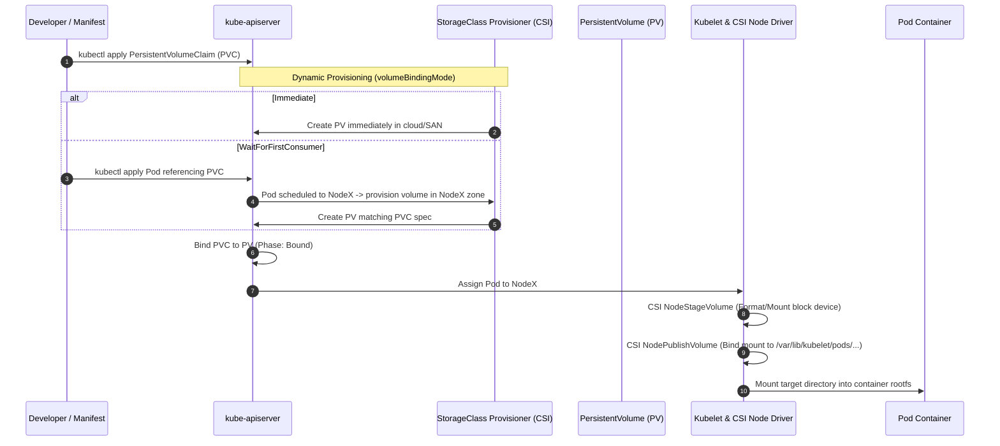

# Kubernetes Storage Architecture & Container Storage Interface (CSI)

- **Space**: `cka-kb`
- **Domain**: Storage (10%) & Troubleshooting (30%)
- **Tags**: #cka #kubernetes #architecture #storage #csi #pv #pvc #storageclass #statefulset



---

## 1. Storage Abstraction Hierarchy

```text
[StorageClass] (Provisioner engine & parameters, e.g., local-storage, ebs-csi)
       │
       ▼ (Dynamic Creation)
[PersistentVolume] (Cluster-wide resource, physical block/NFS backing)
       ▲
       │ (Two-Phase Binding: Capacity, AccessMode, StorageClassName)
[PersistentVolumeClaim] (Namespace-scoped request ticket created by user)
       ▲
       │ (spec.volumes[*].persistentVolumeClaim.claimName)
     [Pod] (Consumes storage via spec.containers[*].volumeMounts)
```

---

## 2. Key Architectural Attributes

### 2.1 Access Modes
- **`ReadWriteOnce` (`RWO`)**: Volume can be mounted as read-write by a **single node**. (Multiple pods on that *same* node can share it).
- **`ReadOnlyMany` (`ROX`)**: Volume can be mounted read-only by **many nodes** simultaneously.
- **`ReadWriteMany` (`RWX`)**: Volume can be mounted as read-write by **many nodes** concurrently (typically NFS, CephFS, GlusterFS).
- **`ReadWriteOncePod` (`RWOP`)**: Strict exclusive access to a single **Pod** across the entire cluster (CSI feature).

### 2.2 Reclaim Policies
- **`Retain`**: When the PVC is deleted, the PV remains intact in `Released` status. Data is preserved for manual recovery. (Cannot be rebound to a new PVC without clearing `claimRef`).
- **`Delete`**: When the PVC is deleted, the underlying backing storage asset and the PV object are automatically destroyed.

### 2.3 Volume Binding Modes
- **`Immediate`**: Storage volume is provisioned as soon as the PVC is created.
  - *Risk*: May provision the storage in Availability Zone A, while the Pod gets scheduled to a node in Availability Zone B, causing `VolumeZoneConflict`.
- **`WaitForFirstConsumer`**: Delays volume provisioning and binding until a Pod using the PVC is scheduled. Guarantees topology alignment.

---

## 3. Storage Failure Patterns & Remediation

| Issue / Error | Mechanism | Triage & Fix |
| :--- | :--- | :--- |
| **`CrashLoopBackOff` / Permission Denied** | Pod container runs as non-root user (e.g. UID 10001) but mounted volume owned by root (`0:0`) | Set `securityContext.fsGroup: 2000` in Pod spec to automatically chown volume files |
| **PVC remains `Pending`** | No PV satisfies requested capacity/accessMode, or StorageClass provisioner missing | Run `kubectl describe pvc <name>`. Verify `storageClassName` spelling and available PVs |
| **Pod stuck in `ContainerCreating` (`Multi-Attach error`)** | Previous node failed to unmount/detach volume before Pod rescheduled to another node | Verify old node status. Check CSI volume attachments: `kubectl get volumeattachment` |
| **PV stuck in `Terminating`** | PV has finalizer `kubernetes.io/pv-protection` while still bound to active PVC | Ensure referencing pods and PVCs are deleted first, or patch finalizers during lab cleanup |

---

## 4. Interlinks & Related Knowledge

- **Space Hub**: [[overview|CKA Space Overview]]
- **Architectural Counterparts**:
  - [[control_plane_topology|Control Plane Topology]]
  - [[network_and_dns_model|Network & DNS Architecture]]
- **Architectural Decisions (ADRs)**:
  - [[adr_003_etcd_backup_restore_strategy|ADR 003: etcd Snapshot Backup & Restore Strategy]]
  - [[adr_004_cgroup_systemd_standardization|ADR 004: cgroup systemd Driver Standardization]]
- **Troubleshooting & Playbooks**:
  - [[troubleshooting_decision_trees|Troubleshooting Decision Trees]]
  - [[exam_triage_and_speedrun_playbook|Exam Speedrun & Triage Playbook]]
  - [[cka_curriculum_domain_map|CKA Curriculum Domain Map]]
- **Study Guides**:
  - [Storage Classes & Dynamic Provisioning](file:///workspace/projects/cka-kb/05-storage/01-storage-classes-dynamic-provisioning.md)
  - [Persistent Volumes & Claims](file:///workspace/projects/cka-kb/05-storage/02-persistent-volumes-and-claims.md)
  - [Pod Volume Attachments](file:///workspace/projects/cka-kb/05-storage/03-pod-volume-attachments.md)
