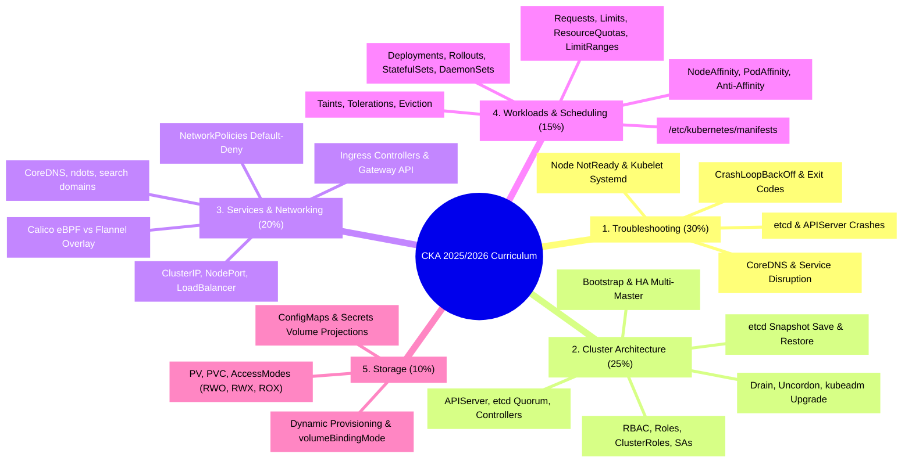

# CKA Curriculum Domain Map & Knowledge Graph Matrix

- **Space**: `cka-kb`
- **Domain**: Master Curriculum & Cross-Domain Index
- **Tags**: #cka #curriculum #domains #study-guide #index #kubernetes

---

## 1. Curriculum Weighting & Study Matrix

### Domain 1: Troubleshooting (30%)
- **Architectural Reference**: [[control_plane_topology|Control Plane Topology]], [[network_and_dns_model|Network & DNS Model]]
- **Governing ADRs**: [[adr_004_cgroup_systemd_standardization|ADR 004: cgroup systemd Standardization]]
- **Decision Trees**: [[troubleshooting_decision_trees|Troubleshooting Decision Trees]]
- **Detailed Study Guides**:
  1. [Node & Kubelet Troubleshooting](file:///workspace/projects/cka-kb/01-troubleshooting/01-node-and-kubelet-troubleshooting.md)
  2. [Control Plane Troubleshooting](file:///workspace/projects/cka-kb/01-troubleshooting/02-control-plane-troubleshooting.md)
  3. [Application & Container Debugging](file:///workspace/projects/cka-kb/01-troubleshooting/03-application-and-container-debugging.md)
  4. [Cluster Resource Monitoring](file:///workspace/projects/cka-kb/01-troubleshooting/04-cluster-resource-monitoring.md)
  5. [Services & DNS Troubleshooting](file:///workspace/projects/cka-kb/01-troubleshooting/05-services-and-dns-troubleshooting.md)

### Domain 2: Cluster Architecture, Installation & Configuration (25%)
- **Architectural Reference**: [[control_plane_topology|Kubernetes Control Plane Topology]]
- **Governing ADRs**: [[adr_003_etcd_backup_restore_strategy|ADR 003: etcd Snapshot Backup & Restore Strategy]]
- **Detailed Study Guides**:
  1. [kubeadm Cluster Bootstrap](file:///workspace/projects/cka-kb/02-cluster-architecture-installation/01-kubeadm-cluster-bootstrap.md)
  2. [Cluster Upgrades & Lifecycle](file:///workspace/projects/cka-kb/02-cluster-architecture-installation/02-cluster-upgrades-lifecycle.md)
  3. [HA Control Plane & etcd](file:///workspace/projects/cka-kb/02-cluster-architecture-installation/03-ha-control-plane-and-etcd.md)
  4. [RBAC & Security](file:///workspace/projects/cka-kb/02-cluster-architecture-installation/04-rbac-and-security.md)
  5. [Helm & Kustomize](file:///workspace/projects/cka-kb/02-cluster-architecture-installation/05-helm-and-kustomize.md)
  6. [Extension Interfaces, CRDs & Operators](file:///workspace/projects/cka-kb/02-cluster-architecture-installation/06-extension-interfaces-crds-operators.md)

### Domain 3: Services & Networking (20%)
- **Architectural Reference**: [[network_and_dns_model|Kubernetes Network & DNS Architecture]]
- **Governing ADRs**: [[adr_001_calico_ebpf_data_plane|ADR 001: Calico eBPF]], [[adr_002_gateway_api_adoption|ADR 002: Gateway API Adoption]]
- **Detailed Study Guides**:
  1. [Pod Networking & DNS](file:///workspace/projects/cka-kb/03-services-and-networking/01-pod-networking-and-dns.md)
  2. [Services & Endpoints](file:///workspace/projects/cka-kb/03-services-and-networking/02-services-and-endpoints.md)
  3. [Network Policies](file:///workspace/projects/cka-kb/03-services-and-networking/03-network-policies.md)
  4. [Ingress Controllers & Resources](file:///workspace/projects/cka-kb/03-services-and-networking/04-ingress-controllers-and-resources.md)
  5. [Gateway API](file:///workspace/projects/cka-kb/03-services-and-networking/05-gateway-api.md)

### Domain 4: Workloads & Scheduling (15%)
- **Architectural Reference**: [[control_plane_topology|Control Plane Topology]]
- **Detailed Study Guides**:
  1. [Deployments, Rollouts & Rollbacks](file:///workspace/projects/cka-kb/04-workloads-and-scheduling/01-deployments-rollouts-rollbacks.md)
  2. [Pod Configuration, ConfigMaps & Secrets](file:///workspace/projects/cka-kb/04-workloads-and-scheduling/02-pod-configuration-configmaps-secrets.md)
  3. [Scheduling, Affinity, Taints & Tolerations](file:///workspace/projects/cka-kb/04-workloads-and-scheduling/03-scheduling-affinity-taints-tolerations.md)
  4. [Resource Management & HPA](file:///workspace/projects/cka-kb/04-workloads-and-scheduling/04-resource-management-and-hpa.md)
  5. [Static Pods & DaemonSets](file:///workspace/projects/cka-kb/04-workloads-and-scheduling/05-static-pods-and-daemonsets.md)

### Domain 5: Storage (10%)
- **Architectural Reference**: [[storage_architecture|CSI & Storage Architecture]]
- **Detailed Study Guides**:
  1. [Storage Classes & Dynamic Provisioning](file:///workspace/projects/cka-kb/05-storage/01-storage-classes-dynamic-provisioning.md)
  2. [Persistent Volumes & Claims](file:///workspace/projects/cka-kb/05-storage/02-persistent-volumes-and-claims.md)
  3. [Pod Volume Attachments](file:///workspace/projects/cka-kb/05-storage/03-pod-volume-attachments.md)

### Exam Strategy & Practice Labs (Bonus Modules)
- **Speedrun Playbook**: [[exam_triage_and_speedrun_playbook|Exam Triage & Speedrun Playbook]]
- **Detailed Guides**:
  - [Exam Format, Rules & UI](file:///workspace/projects/cka-kb/00-exam-strategy-and-environment/01-exam-format-rules-and-ui.md)
  - [Terminal Setup & Speedruns](file:///workspace/projects/cka-kb/00-exam-strategy-and-environment/02-terminal-setup-and-speedruns.md)
  - [Killer.sh & Simulation Strategy](file:///workspace/projects/cka-kb/00-exam-strategy-and-environment/03-killer-sh-and-simulation-strategy.md)
  - [Imperative Command Cheatsheet](file:///workspace/projects/cka-kb/00-exam-strategy-and-environment/04-imperative-command-cheatsheet.md)
  - [Killer Break-Fix Scenarios](file:///workspace/projects/cka-kb/06-hands-on-practice-scenarios/01-killer-break-fix-scenarios.md)
  - [Speedrun Challenge Questions](file:///workspace/projects/cka-kb/06-hands-on-practice-scenarios/02-speedrun-challenge-questions.md)
  - [Master Exam Checklist](file:///workspace/projects/cka-kb/06-hands-on-practice-scenarios/03-master-exam-checklist.md)

---

## 2. Interlinks & Navigation
- **Master Space Hub**: [[overview|CKA Space Overview]]
- **Developer Profile**: [[user/profile|Developer Profile]]
- **Global Conventions**: [[user/conventions|Engineering Conventions]]
