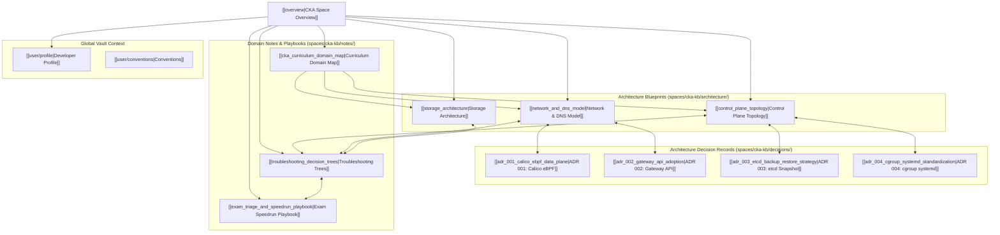

# CKA Knowledge Base Space Overview

- **Space**: `cka-kb`
- **Related Project**: `/workspace/projects/cka-kb`
- **Tags**: #kubernetes #cka #certification #devops #space #knowledge-graph

## 1. Space Mission & Architecture
This space container serves as the primary **Second Brain & Knowledge Graph Memory Engine** for the Certified Kubernetes Administrator (CKA) repository. It unifies architectural blueprints, architectural decision records (ADRs), interactive troubleshooting trees, and study matrices into a connected Obsidian-compatible knowledge base.

---

## 2. Space Node Inventory

### 2.1 Architectural Blueprints
- [[control_plane_topology|Control Plane Topology & Lifecycle]]: APIServer, etcd Raft quorum, scheduler filtering/scoring, and kubelet mirror pods.
- [[network_and_dns_model|Network, CoreDNS & Traffic Routing Model]]: Pod-to-pod flat IP invariants, CoreDNS ndots latency, Ingress vs Gateway API, and NetworkPolicies.
- [[storage_architecture|Storage Architecture & CSI]]: PV/PVC two-phase binding, AccessModes, and `WaitForFirstConsumer` topology binding.

### 2.2 Architectural Decisions (ADRs)
- [[adr_001_calico_ebpf_data_plane|ADR 001: Calico eBPF Data Plane]]: High-performance policy enforcement and service routing.
- [[adr_002_gateway_api_adoption|ADR 002: Gateway API Adoption]]: Transition from Ingress v1 to role-oriented Gateway API (`GatewayClass`, `Gateway`, `HTTPRoute`).
- [[adr_003_etcd_backup_restore_strategy|ADR 003: etcd Backup & Restore Strategy]]: Non-destructive 4-step snapshot save/restore protocol.
- [[adr_004_cgroup_systemd_standardization|ADR 004: cgroup systemd Standardization]]: Unifying containerd and kubelet on systemd cgroups.

### 2.3 Domain Notes & Exam Playbooks
- [[troubleshooting_decision_trees|Troubleshooting Decision Trees]]: Fast triage flowcharts covering nodes, control planes, pods, and DNS.
- [[exam_triage_and_speedrun_playbook|Exam Triage & Speedrun Playbook]]: 120-minute time budgeting, 30-second bash bootstrapping, and doc shortcuts.
- [[cka_curriculum_domain_map|CKA Curriculum Domain Map]]: Master cross-index linking all 5 exam domains directly to the 32 study guide files in `/workspace/projects/cka-kb/`.

---

## 3. Global Context & Interlinks
- **Developer Profile**: [[user/profile|Developer Profile]]
- **Engineering Conventions**: [[user/conventions|Engineering Conventions]]
- **Study Guides Repository**: [CKA Repository Index](file:///workspace/projects/cka-kb/README.md)
