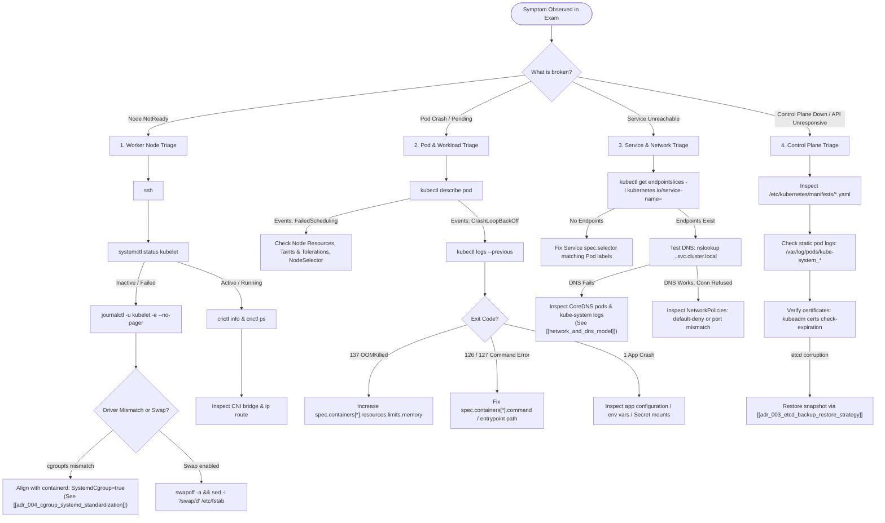

# CKA Troubleshooting Decision Trees & Mental Models

- **Space**: `cka-kb`
- **Domain**: Troubleshooting (30% Exam Weighting)
- **Tags**: #cka #troubleshooting #triage #flowcharts #mental-model #kubelet #crictl #journalctl

---

## 1. Golden Rules of CKA Troubleshooting

1. **Top-Down or Bottom-Up?**
   - **Bottom-Up**: Infrastructure failure (Node NotReady, Kubelet crash, Container runtime stopped).
   - **Top-Down**: Application or config failure (Pod CrashLoop, Service selector mismatch, NetworkPolicy drop).
2. **Never guess, read the logs immediately**:
   - For pods: `kubectl describe pod <pod>` $\rightarrow$ `kubectl logs <pod> --previous`.
   - For nodes: `systemctl status kubelet` $\rightarrow$ `journalctl -u kubelet -e -n 50`.
   - For static pods: `crictl ps -a` $\rightarrow$ `crictl logs <id>` or `/var/log/pods/`.
3. **Check the Active Context First**:
   - Always run `kubectl config current-context` or execute the context switch command supplied at the top of the exam question.

---

## 2. Decision Tree Matrix

| Component | Primary Failure Mechanism | Exact Recovery Action | Related Architectural Standard |
| :--- | :--- | :--- | :--- |
| **Worker Node** | Kubelet cgroup driver mismatch (`cgroupfs` vs `systemd`) | Set `SystemdCgroup = true` in containerd `config.toml` | [[adr_004_cgroup_systemd_standardization\|ADR 004]] |
| **Worker Node** | Swap enabled after host reboot | `swapoff -a` and edit `/etc/fstab` | [[control_plane_topology\|Control Plane Topology]] |
| **Control Plane** | `kube-apiserver` static pod manifest YAML indentation error | Fix typo in `/etc/kubernetes/manifests/kube-apiserver.yaml` | [[control_plane_topology\|Control Plane Topology]] |
| **Control Plane** | `etcd` disk corruption or quorum loss | Run 4-step snapshot restore to new `--data-dir` | [[adr_003_etcd_backup_restore_strategy\|ADR 003]] |
| **CoreDNS** | Forwarding loop or crashed replica | Check `kubectl -n kube-system logs -l k8s-app=kube-dns` | [[network_and_dns_model\|Network & DNS Model]] |
| **Networking** | Pod-to-Pod packet drop due to NetworkPolicy | Check namespace `podSelector` and ingress port matching | [[adr_001_calico_ebpf_data_plane\|ADR 001]] |
| **Storage** | Pod `Pending` due to PVC unbound | Check `StorageClass` binding mode and PV capacity | [[storage_architecture\|Storage Architecture]] |

---

## 3. Interlinks & Related Knowledge

- **Space Hub**: [[overview|CKA Space Overview]]
- **Architecture Foundations**:
  - [[control_plane_topology|Kubernetes Control Plane Topology]]
  - [[network_and_dns_model|Network & DNS Architecture]]
  - [[storage_architecture|CSI & Storage Architecture]]
- **Architectural Decisions (ADRs)**:
  - [[adr_003_etcd_backup_restore_strategy|ADR 003: etcd Snapshot Backup & Restore]]
  - [[adr_004_cgroup_systemd_standardization|ADR 004: cgroup systemd Driver Standardization]]
- **Speedrun Playbook**: [[exam_triage_and_speedrun_playbook|Exam Triage & Speedrun Playbook]]
- **Study Guides**:
  - [Node & Kubelet Troubleshooting](file:///workspace/projects/cka-kb/01-troubleshooting/01-node-and-kubelet-troubleshooting.md)
  - [Control Plane Troubleshooting](file:///workspace/projects/cka-kb/01-troubleshooting/02-control-plane-troubleshooting.md)
  - [Application & Container Debugging](file:///workspace/projects/cka-kb/01-troubleshooting/03-application-and-container-debugging.md)
  - [Cluster Resource Monitoring](file:///workspace/projects/cka-kb/01-troubleshooting/04-cluster-resource-monitoring.md)
  - [Services & DNS Troubleshooting](file:///workspace/projects/cka-kb/01-troubleshooting/05-services-and-dns-troubleshooting.md)
