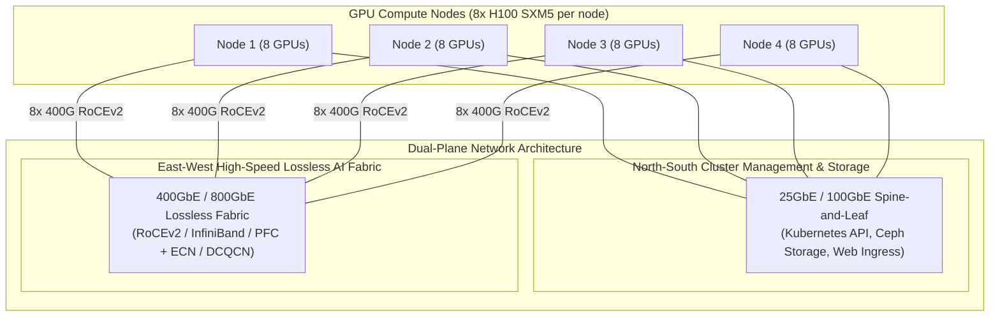

# Hybrid Cloud AI Infrastructure & Networking Fabric

> **Space**: `rh-ai`  
> **Category**: `architecture`  
> **Status**: Approved Reference  
> **Target Topology**: Multi-Cluster OpenShift, Bare Metal GPU Nodes, Hyperscalers

---

## 1. Network Fabric Topology for Distributed GPU Clusters

Distributed AI models require non-blocking, line-rate communication between GPU nodes. Standard TCP/IP networking across standard Kubernetes CNI induces packet drops, tail latency spikes, and severe GPU idle states.



---

## 2. Multi-NIC Pod Interconnect with Multus CNI

To bypass the Linux kernel network stack and connect PyTorch/Ray distributed workers directly to the 400GbE RoCEv2 fabric, OpenShift AI leverages **Multus CNI** paired with the **SR-IOV Network Operator**:

```
┌────────────────────────────────────────────────────────────────────────┐
│ OpenShift Worker Node with Multus CNI                                  │
│                                                                        │
│  [ PyTorch Distributed Pod ]                                           │
│    ├── eth0: OVN-Kubernetes (Default Pod Network -> K8s API, DNS)      │
│    ├── net1: RoCEv2 Virtual Function 0 (RDMA -> 400GbE Switch 1)        │
│    ├── net2: RoCEv2 Virtual Function 1 (RDMA -> 400GbE Switch 2)        │
│    └── ... up to 8 dedicated RDMA NICs                                 │
│                                                                        │
│  [ Host Kernel / Hardware ]                                            │
│    ├── Mellanox OFED / Core Drivers                                    │
│    └── Priority Flow Control (PFC) & ECN Enabled Switch Ports          │
└────────────────────────────────────────────────────────────────────────┘
```

---

## Related Knowledge & Decision Links
- **Knowledge Hub**: [[spaces/rh-ai/notes/overview|Rh-Ai Knowledge Hub]]
- **Hardware Sizing**: [[spaces/rh-ai/notes/10-hardware-acceleration-and-cluster-sizing|Hardware Sizing Guide]]
- **Distributed Training**: [[spaces/rh-ai/notes/05-distributed-training-and-orchestration|Distributed Training Deep Dive]]
- **Architectural Decision**: [[spaces/rh-ai/decisions/adr_003_heterogeneous_hardware_acceleration|ADR 003: Heterogeneous Hardware Acceleration]]
