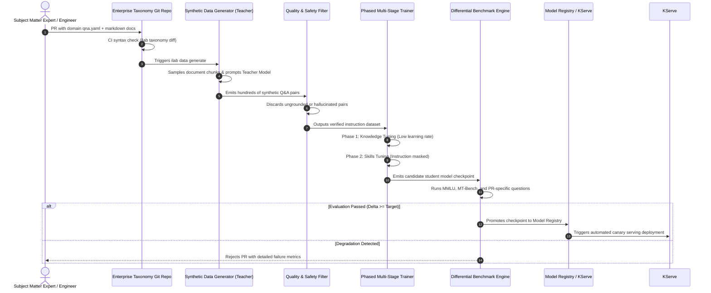
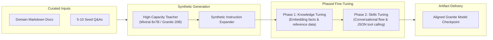

# InstructLab Alignment & Synthetic Data Pipeline Architecture

> **Space**: `rh-ai`  
> **Category**: `architecture`  
> **Status**: Approved Reference  
> **Target Tooling**: InstructLab CLI (`ilab`), IBM Granite, Ray Distributed

---

## 1. End-to-End Alignment Workflow

The Large-scale Alignment for chatBots (LAB) methodology operationalizes continuous enterprise knowledge transfer without manual human annotation:

---

## 2. Multi-Phase Training Pipeline Mechanics

---

## Related Knowledge & Decision Links
- **Knowledge Hub**: [[spaces/rh-ai/notes/overview|Rh-Ai Knowledge Hub]]
- **Alignment Guide**: [[spaces/rh-ai/notes/03-instructlab-and-model-alignment|InstructLab Deep Dive]]
- **RHEL AI Deployment**: [[spaces/rh-ai/notes/02-rhel-ai-architecture-and-deployment|RHEL AI Deployment]]
- **Architectural Decision**: [[spaces/rh-ai/decisions/adr_002_instructlab_taxonomy_governance|ADR 002: InstructLab Taxonomy Governance]]
