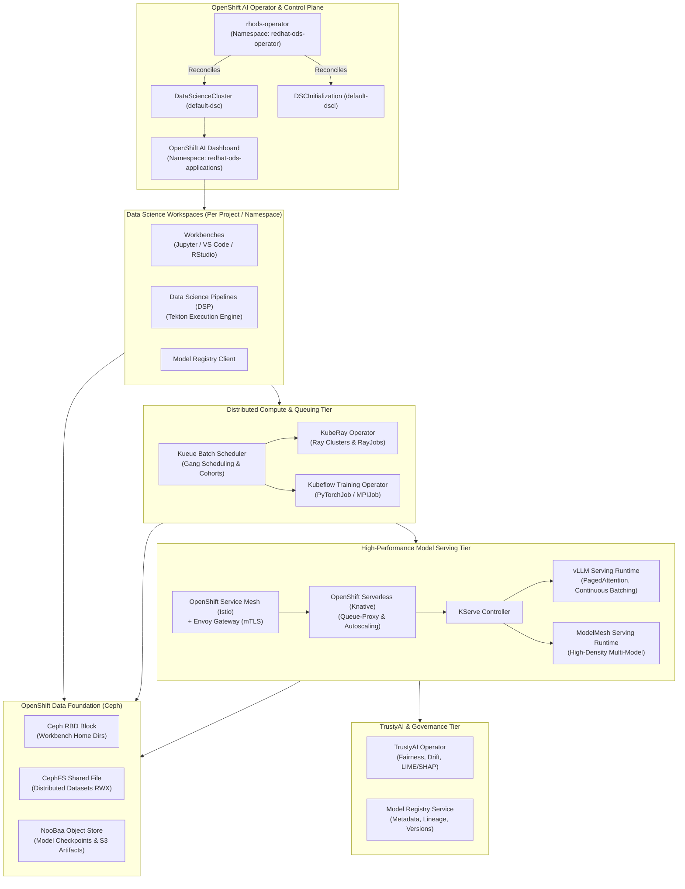

# Red Hat OpenShift AI (RHOAI) System Topology & Control Plane Architecture

> **Space**: `rh-ai`  
> **Category**: `architecture`  
> **Status**: Approved Reference  
> **Target Platform**: OpenShift Container Platform 4.16+, OpenShift AI 2.14+

---

## 1. System Topology Overview

Red Hat OpenShift AI (RHOAI) decouples user-facing interactive environments, cluster-wide batch scheduling, and low-latency model inference into a layered Kubernetes-native topology.

---

## 2. Component Boundaries & Network Flows

1. **Ingress & Service Mesh Flow**:
   - Client requests enter via OpenShift Ingress Router (HAProxy).
   - Ingress passes requests to the Istio Ingress Gateway in `istio-system`.
   - Istio applies mTLS and routes through Knative Queue-Proxy to the vLLM container on port 8080.
2. **Batch Training Flow**:
   - Data scientists submit jobs via the CodeFlare SDK or Kubernetes manifests to a Kueue `LocalQueue`.
   - Kueue checks quota against the `ClusterQueue`. When all requested GPUs are available, it gates all Pods simultaneously (Gang Scheduling).
   - Distributed PyTorch pods initialize NCCL over secondary SR-IOV/RoCEv2 networks configured via Multus CNI.
3. **Artifact Flow**:
   - Model weights and datasets reside in Ceph Object Storage (NooBaa S3).
   - KServe storage initializers mount S3 buckets directly into the runtime container filesystem (`/mnt/models`) via S3 credentials stored in Kubernetes Secrets.

---

## Related Knowledge & Decision Links
- **Knowledge Hub**: [[spaces/rh-ai/notes/overview|Rh-Ai Knowledge Hub]]
- **Domain Guide**: [[spaces/rh-ai/notes/04-openshift-ai-rhoai-architecture|RHOAI Platform Architecture]]
- **Serving Guide**: [[spaces/rh-ai/notes/06-model-serving-kserve-and-vllm|KServe & vLLM Deep Dive]]
- **Architectural Decision**: [[spaces/rh-ai/decisions/adr_001_standardize_on_rhoai_and_kserve_vllm|ADR 001: Standardize on RHOAI, KServe & vLLM]]
