# Red Hat AI Portfolio Overview & Strategic Architecture

> **Focus Domain**: Enterprise AI Strategy, Full-Stack Architecture, and Ecosystem Mapping  
> **Audience**: Cloud & Systems Architects, Platform Engineers, Enterprise ML Practitioners  
> **Status**: Production Reference

---

## 1. Executive Summary & Strategic Philosophy

Enterprise AI adoption is constrained by three structural bottlenecks:
1. **The Infrastructure Gap**: Fragmented deployment targets across public clouds, on-premises bare metal, and edge environments.
2. **The Alignment & Cost Moat**: Commercial LLMs (closed-source APIs) impose vendor lock-in, data sovereignty risks, and uncontrollable token costs, while traditional open-source pre-training requires millions of dollars in compute.
3. **The Operational Disconnect (Day-2 AI Operations)**: Transitioning from a data scientist's Jupyter notebook to secure, scalable, compliant production inference requires Kubernetes-native orchestration, hardware acceleration drivers, drift monitoring, and model registry governance.

Red Hat’s AI strategy addresses this with a full-stack, open-source-first architecture spanning the operating system, container orchestration platform, foundation models, alignment tooling, and intelligent operational assistants.

```mermaid
flowchart TD
    subgraph Layer5["5. Generative AI Applications & Assistants"]
        AL["Ansible Lightspeed\n(watsonx Code Assistant)"]
        OSL["OpenShift Lightspeed\n(Cluster Operations & SRE)"]
        RHL["RHEL Lightspeed\n(Command-Line Linux Assistant)"]
    end

    subgraph Layer4["4. Governance, Safety & MLOps"]
        TY["TrustyAI\n(Fairness, Bias, Explainability, Drift)"]
        MR["OpenShift Model Registry\n(Catalog, Versioning, Metadata)"]
        DSP["Data Science Pipelines\n(Kubeflow Pipelines v2 + Tekton)"]
    end

    subgraph Layer3["3. Alignment & Foundation Models"]
        IL["InstructLab (ilab)\n(LAB Method / Synthetic Data Gen)"]
        GM["IBM Granite Models\n(3.0, Code, Time Series, Guardian)"]
        OFM["Community Foundation Models\n(Llama 3, Mistral, Gemma, Phi)"]
    end

    subgraph Layer2["2. Hybrid Cloud AI Platform & Serving"]
        RHOAI["Red Hat OpenShift AI (RHOAI)\n(Distributed Training, Ray, Kueue, KServe, vLLM, ModelMesh)"]
        RHELAI["Red Hat Enterprise Linux AI (RHEL AI)\n(Bootable OCI bootc Appliance for Granite & InstructLab)"]
    end

    subgraph Layer1["1. Hardware Acceleration & Cloud Fabric"]
        NV["NVIDIA\n(GPU Operator, NIM, H100/A100/L40S)"]
        AMD["AMD\n(ROCm Operator, Instinct MI300X/MI250)"]
        INT["Intel\n(Gaudi 2/3, OpenVINO)"]
        CLD["Hybrid Substrates\n(Bare Metal, AWS/ROSA, Azure/ARO, GCP, Nutanix AHV)"]
    end

    Layer1 --> Layer2
    Layer2 --> Layer3
    Layer3 --> Layer4
    Layer4 --> Layer5
```



---

## 2. Red Hat AI Offerings Taxonomy

Red Hat structures its AI portfolio into distinct offerings tailored to different operational scopes, from single-node developer workstations to multi-thousand GPU hyperscaler clusters:

| Offering | Primary Form Factor | Target User | Key Components | Core Value Proposition |
| :--- | :--- | :--- | :--- | :--- |
| **RHEL AI** | Bootable OCI Image (`bootc`), ISO, QCOW2, Cloud AMI | AI Engineers, Systems Admins, Edge Operators | Embedded Granite LLMs, InstructLab (`ilab`), PyTorch, vLLM, hardware drivers | Self-contained, turnkey OS appliance for local alignment and single-node inference. |
| **Red Hat OpenShift AI (RHOAI)** | Kubernetes Operator on OpenShift (`rhods-operator`) | Enterprise Platform Teams, MLOps Engineers, Data Scientists | KServe, vLLM, Ray/KubeRay, Kueue, Kubeflow Pipelines, TrustyAI, Model Registry | Multi-tenant, distributed training, batch queuing, and high-throughput model serving across hybrid clouds. |
| **InstructLab (`ilab`)** | CLI Tool & Open-Source Project | Model Curators, Domain Experts, Developers | Taxonomy Git Tree, Synthetic Data Generator, Multi-Phase Trainer (LoRA/Full) | Democratized model alignment using synthetic data and knowledge/skill taxonomy. |
| **IBM Granite Models** | Open Weight Models (Apache 2.0) | Enterprise Developers, SREs, Solution Architects | Granite 3.0 (1B, 3B, 8B, MoE), Granite Code (3B–34B), Granite Guardian | Fully open, transparent datasets, covered by Red Hat & IBM enterprise IP indemnification. |
| **Ansible Lightspeed** | Cloud Service / Controller Integration | Automation Developers, DevOps Engineers | VS Code extension, Ansible Automation Controller, watsonx Code Assistant | Translates plain English into certified, production-grade Ansible tasks and playbooks. |
| **OpenShift Lightspeed** | OpenShift Operator / Console Plugin | Kubernetes Administrators, SREs | In-cluster LLM assistant, Prometheus integration, OpenShift KB grounding | Natural language cluster diagnostics, incident triage, and declarative configuration assistance. |

---

## 3. RHEL AI vs. OpenShift AI: Architectural Boundary

A critical decision point for enterprise architects is positioning **RHEL AI** vs. **OpenShift AI (RHOAI)**. They are complementary tiers of the same pipeline:

```mermaid
flowchart LR
    subgraph DevEdge["Edge & Workstation Alignment (RHEL AI)"]
        D1["Domain Expert adds Knowledge/Skill\nto Git Taxonomy"]
        D2["Run ilab data generate\n(Synthetic Data Generation)"]
        D3["Single-Node Fine-Tuning\n(QLoRA / LoRA on 1-4 GPUs)"]
        D4["Local Evaluation & Verification\n(ilab model test)"]
        D1 --> D2 --> D3 --> D4
    end

    subgraph Registry["Enterprise Model Registry"]
        PR["Model Registry\n(OCI Registry / Quay / S3)"]
    end

    subgraph ScaleProd["Distributed Scale-Out (OpenShift AI)"]
        P1["Distributed Multi-Node Training\n(KubeRay + PyTorch FSDP on 32-512 GPUs)"]
        P2["Automated MLOps Pipeline\n(Kubeflow Pipelines v2)"]
        P3["High-Throughput Production Serving\n(KServe + vLLM + Knative + Istio)"]
        P4["Governance & Explainability\n(TrustyAI Bias & Drift Monitoring)"]
        P1 --> P2 --> P3 --> P4
    end

    D4 -->|Export Checkpoint / PR| PR
    PR -->|Promote to Distributed Pipeline| P1
```



### Architectural Comparison Matrix

| Capability | Red Hat Enterprise Linux AI (RHEL AI) | Red Hat OpenShift AI (RHOAI) |
| :--- | :--- | :--- |
| **Deployment Model** | Single host, virtual machine, or edge appliance. | Multi-node Kubernetes / OpenShift cluster. |
| **Target Scale** | 1 to 8 GPUs (single compute box). | 1 to 10,000+ GPUs across heterogeneous nodes. |
| **Orchestrator** | Linux `systemd`, `podman`, containerized CLI. | Kubernetes CRI-O, Kubelet, OpenShift Operators. |
| **Alignment Engine** | Native `ilab` CLI local workflow. | Distributed InstructLab on KubeRay / CodeFlare. |
| **Serving Runtime** | vLLM via containerized execution. | KServe + vLLM + Knative (Serverless) + Istio. |
| **Multi-Tenancy** | Single-tenant (Linux UID/GID isolation). | Multi-tenant (Kubernetes RBAC, Project Isolation, Kueue fair-share). |
| **Enterprise Storage** | Local NVMe, POSIX filesystem mounts. | Red Hat OpenShift Data Foundation (Ceph RBD/CephFS/NooBaa S3). |
| **Hardware Driver Injection** | Pre-baked in bootable image or driver container. | Dynamic via NVIDIA GPU Operator / AMD ROCm Operator. |

---

## 4. Upstream Foundations & Enterprise Decoupling

Red Hat’s AI portfolio is anchored in upstream community projects, hardened and certified with enterprise SLAs:

```
┌──────────────────────────────────────────────┐
│ Upstream Community                           │
│  - InstructLab (github.com/instructlab)      │
│  - vLLM (github.com/vllm-project/vllm)       │
│  - KServe (kserve.github.io)                 │
│  - Kubeflow Pipelines & Training Operator    │
│  - KubeRay & Project CodeFlare               │
│  - TrustyAI (trustyai-explainability)        │
└──────────────────────┬───────────────────────┘
                       │ Hardening, CVE scanning, FIPS compliance,
                       │ Enterprise operator lifecycle, Red Hat support
┌──────────────────────▼───────────────────────┐
│ Red Hat Downstream Products                  │
│  - Red Hat Enterprise Linux AI (RHEL AI)     │
│  - Red Hat OpenShift AI (RHOAI)              │
│  - Ansible Lightspeed & OpenShift Lightspeed │
└──────────────────────────────────────────────┘
```

1. **No Proprietary Vendor Lock-In**:
   - Model weights conform to open standard formats (SafeTensors, GGUF, Hugging Face format).
   - Alignment taxonomy is standard YAML maintained in Git.
   - Inference interfaces expose standard OpenAI-compatible REST endpoints (`/v1/chat/completions`, `/v1/models`).

2. **Enterprise Indemnification**:
   - IBM and Red Hat provide intellectual property indemnification for the IBM Granite models when used within enterprise subscriptions, shielding customers against copyright infringement claims.

3. **Air-Gapped & Sovereign Ready**:
   - Complete support for air-gapped / disconnected datacenters using private container registries (Quay Enterprise) and internal artifact stores (S3/MinIO/Ceph).

---

## 5. Knowledge Base Roadmap & Deep Dive Modules

This knowledge base is organized into specialized engineering modules:

1. **Module 01**: [[01-red-hat-ai-portfolio-overview|Portfolio Overview & Strategic Architecture]] (Current Guide)
2. **Module 02**: [[02-rhel-ai-architecture-and-deployment|RHEL AI Architecture, Bootc Images & Deployment]]
3. **Module 03**: [[03-instructlab-and-model-alignment|InstructLab & LAB Alignment Methodology]]
4. **Module 04**: [[04-openshift-ai-rhoai-architecture|Red Hat OpenShift AI (RHOAI) Platform Architecture]]
5. **Module 05**: [[05-distributed-training-and-orchestration|Distributed Training & Workload Orchestration (Ray, Kueue, PyTorch)]]
6. **Module 06**: [[06-model-serving-kserve-and-vllm|High-Performance Model Serving (KServe & vLLM)]]
7. **Module 07**: [[07-ibm-granite-models-and-open-foundation|IBM Granite Models & Enterprise Open Foundation Architecture]]
8. **Module 08**: [[08-ansible-and-openshift-lightspeed|Enterprise Generative AI & Automation (Ansible & OpenShift Lightspeed)]]
9. **Module 09**: [[09-governance-trustyai-and-mlops-pipelines|Governance, Safety, TrustyAI & MLOps Pipelines]]
10. **Module 10**: [[10-hardware-acceleration-and-cluster-sizing|Hardware Acceleration, GPU Math & Cluster Sizing Guide]]

---
*Reference architecture documentation for `/workspace/projects/rh-ai`.*


---

## Related Knowledge & Architecture Links
- **Knowledge Hub**: [[spaces/rh-ai/notes/overview|Rh-Ai Knowledge Hub]]
- **Next Module**: [[spaces/rh-ai/notes/02-rhel-ai-architecture-and-deployment|RHEL AI Architecture & Deployment]]
- **System Architecture**: [[spaces/rh-ai/architecture/rhoai_system_topology|RHOAI System Topology]]
- **Architectural Decision**: [[spaces/rh-ai/decisions/adr_001_standardize_on_rhoai_and_kserve_vllm|ADR 001: Standardize on RHOAI & vLLM]]
