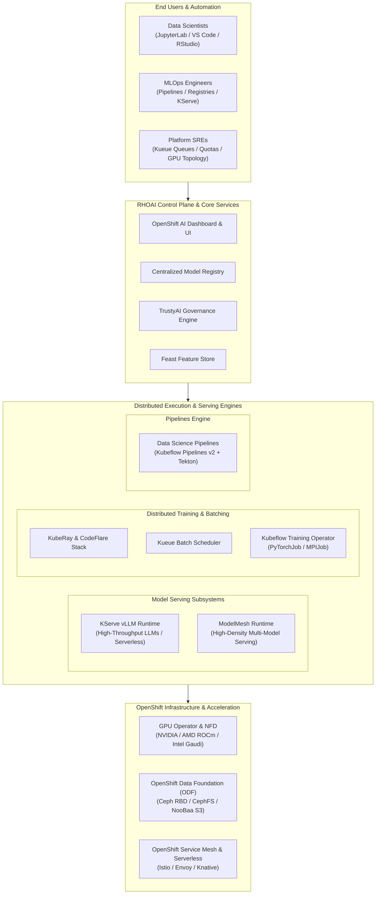
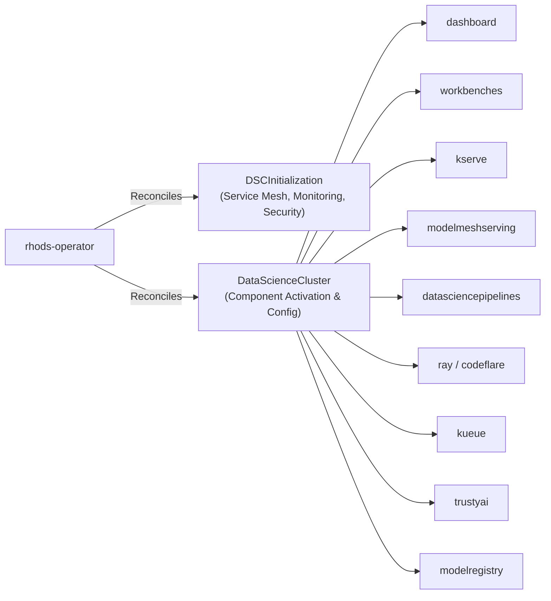
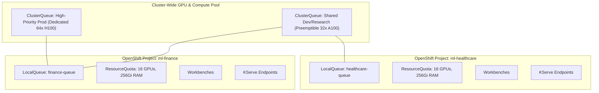

# Red Hat OpenShift AI (RHOAI) Platform Architecture

> **Focus Domain**: Kubernetes-Native AI Platform, Operator Lifecycle, Multi-Tenancy, Distributed Orchestration  
> **Audience**: Cloud Architects, OpenShift Platform Engineers, Site Reliability Engineers, MLOps Architects  
> **Status**: Production Reference

---

## 1. Platform Architecture & Core Philosophy

**Red Hat OpenShift AI (RHOAI)** (formerly Red Hat OpenShift Data Science / RHODS) is an enterprise-grade, hybrid-cloud AI platform built natively on Red Hat OpenShift. It abstracts underlying compute, hardware acceleration, storage, and networking into a managed, multi-tenant environment for the entire AI/ML lifecycle: data ingestion, distributed training, fine-tuning, model serving, and governance.



---

## 2. Operator Architecture: DSC and DSCI Custom Resources

RHOAI is deployed and managed via the `rhods-operator`. The operator enforces a declarative desired-state model driven by two cluster-scoped Custom Resources (CRs):

1. **`DSCInitialization` (DSCI)**: Defines the foundational infrastructure, network topology, Service Mesh bindings, monitoring, and CA certificate injection.
2. **`DataScienceCluster` (DSC)**: Enables and configures the modular AI components.



### Production `DataScienceCluster` Manifest

```yaml
apiVersion: datasciencecluster.opendatahub.io/v1
kind: DataScienceCluster
metadata:
  name: default-dsc
spec:
  components:
    dashboard:
      managementState: Managed
    workbenches:
      managementState: Managed
    datasciencepipelines:
      managementState: Managed
    kserve:
      managementState: Managed
      serving:
        managementState: Managed
        name: knative-serving
        ingressGateway:
          certificate:
            type: OpenshiftDefaultIngress
    modelmeshserving:
      managementState: Managed
    ray:
      managementState: Managed
    codeflare:
      managementState: Managed
    kueue:
      managementState: Managed
    trustyai:
      managementState: Managed
    modelregistry:
      managementState: Managed
```

### Production `DSCInitialization` Manifest

```yaml
apiVersion: dsci.opendatahub.io/v1
kind: DSCInitialization
metadata:
  name: default-dsci
spec:
  applicationsNamespace: redhat-ods-applications
  monitoring:
    managementState: Managed
    namespace: redhat-ods-monitoring
  serviceMesh:
    managementState: Managed
    controlPlane:
      name: data-science-smcp
      namespace: istio-system
  trustedCABundle:
    managementState: Managed
    customCABundle: ""
```

---

## 3. Core Component Deep Dive

### 3.1 OpenShift AI Dashboard & Workbenches
- **Dashboard**: Unified web interface where data science teams provision projects, spawn workbench notebook servers, configure pipelines, and track deployed endpoints.
- **Workbenches**: Self-contained development containers providing:
  - Standard images: Minimal Python, PyTorch with CUDA, TensorFlow, and RStudio.
  - Custom workbench images: Standardized via BuildConfig or external OCI registries.
  - Persistent volume binding for code and data retention.

### 3.2 Dual Serving Architectures: KServe vs. ModelMesh
RHOAI provides two distinct serving engines tailored to opposing workload characteristics:

| Feature | Single-Model Serving (KServe + vLLM) | Multi-Model Serving (ModelMesh) |
| :--- | :--- | :--- |
| **Primary Workload** | Large Language Models (LLMs), Generative AI, Large Diffusion Models. | Traditional predictive ML (Scikit-learn, XGBoost, small ONNX models). |
| **Footprint per Pod** | 1 dedicated model per Pod (allocates dedicated GPU/VRAM). | 10s to 100s of small models dynamically packed into a shared runtime pool. |
| **Autoscaling** | Knative Serverless scale-to-zero and burst-to-N based on concurrency. | Model routing across LRU-cached worker memory pools. |
| **Engines** | vLLM, Hugging Face TGI, NVIDIA Triton, OpenVINO. | Triton, OpenVINO, MLServer. |
| **Streaming** | Server-Sent Events (SSE) token streaming via HTTP/gRPC. | Standard synchronous request-response payload. |

### 3.3 Distributed Workloads & Fair-Sharing (KubeRay + Kueue)
- **KubeRay Operator**: Manages lifecycle of Ray clusters (RayHead and autoscaling RayWorker pods) across Kubernetes.
- **Kueue**: Cloud-native batch scheduler. Prevents cluster congestion by managing:
  - **LocalQueues**: Tenant-level submission queues with quotas.
  - **ClusterQueues**: Global GPU resource pools supporting fair-sharing, borrower/lender rules, and preemption.
- **CodeFlare Operator**: Provides simplified abstraction for data scientists to submit Ray jobs without writing complex Kubernetes manifests.

### 3.4 Data Science Pipelines (Kubeflow Pipelines v2 + Tekton)
- Cloud-native workflow orchestrator for reproducible ML pipelines.
- Pipeline steps execute as isolated container tasks coordinated via Tekton under the hood.
- S3 artifact integration: Intermediate dataset splits, trained model artifacts, and evaluation metrics automatically write to object storage.

### 3.5 Model Registry
- Centralized metadata repository for storing and cataloging model lineage, versions, deployment tags, and metrics.
- Integrates with OpenShift RBAC to govern model promotion from experimentation to staging and production.

### 3.6 TrustyAI Governance
- In-cluster governance operator monitoring live model endpoints.
- Computes statistical bias, disparate impact ratios, data drift against training baselines, and model explainability (LIME/SHAP).

---

## 4. Multi-Tenancy, Quotas & Resource Isolation

Enterprise RHOAI environments require strict workload isolation across business units:



### 1. Namespace / Project Isolation
- Each data science team operates in an OpenShift `Project`.
- NetworkPolicies enforce tenant isolation, blocking lateral network attacks while allowing traffic from OpenShift Ingress and Istio Service Mesh.

### 2. ResourceQuotas & LimitRanges
```yaml
apiVersion: v1
kind: ResourceQuota
metadata:
  name: ai-team-quota
  namespace: data-science-project-a
spec:
  hard:
    requests.nvidia.com/gpu: "8"
    limits.nvidia.com/gpu: "8"
    requests.cpu: "64"
    requests.memory: 256Gi
```

### 3. Service Mesh & Ingress Security
- KServe integrates with OpenShift Service Mesh (Istio) and OpenShift Serverless (Knative).
- Mutual TLS (mTLS) secures intra-cluster communication between ingress gateways and model runtimes.
- OpenShift OAuth and JWT validation protect model endpoints against unauthenticated access.

---

## 5. Storage Architecture: OpenShift Data Foundation (ODF)

Storage is the lifeline of enterprise AI. RHOAI standardizes on **Red Hat OpenShift Data Foundation (ODF)** (Ceph-based):

```mermaid
flowchart LR
    ODF["OpenShift Data Foundation (Ceph)"]
    
    ODF -->|Ceph RBD (Block)| S1["Workbenches & Notebook Volumes\n(Low-latency POSIX RWO)"]
    ODF -->|CephFS (Shared File)| S2["Distributed Training Datasets\n(High-throughput Shared RWX)"]
    ODF -->|NooBaa (Object S3)| S3["Model Checkpoints & Pipeline Artifacts\n(S3 API compatible OCI/Object)"]
```

1. **Ceph RBD (Block Storage - `ReadWriteOnce`)**:
   - Backing store for Data Science Workbenches (Jupyter home directories).
   - Provides fast sequential read/write for local conda environments and scratch files.
2. **CephFS (Shared Filesystem - `ReadWriteMany`)**:
   - Mountable across hundreds of distributed training worker pods concurrently.
   - Ideal for large raw training corpora and tokenized datasets.
3. **NooBaa / Ceph Object Gateway (S3 API)**:
   - Central repository for model weight distribution, KServe inference loading, and Data Science Pipeline artifacts.

---

## 6. Disconnected & Air-Gapped Deployment Pattern

In defense, financial, and sovereign cloud environments, OpenShift AI must operate without internet access:

```bash
# 1. Mirror RHOAI Operator and component images using oc-mirror
oc-mirror --config imageset-config.yaml docker://registry.internal.corp/rhoai

# 2. Deploy ImageContentSourcePolicy / ImageDigestMirrorSet to map redhat.io to local registry
oc apply -f idms-rhoai.yaml

# 3. Mirror foundational Granite models to internal S3 or Quay OCI registry
skopeo copy \
  docker://registry.redhat.io/rhelai1/granite-8b-starter:latest \
  docker://registry.internal.corp/models/granite-8b-starter:latest
```

---
*Reference architecture documentation for `/workspace/projects/rh-ai`.*


---

## Related Knowledge & Architecture Links
- **Knowledge Hub**: [[spaces/rh-ai/notes/overview|Rh-Ai Knowledge Hub]]
- **Previous Module**: [[spaces/rh-ai/notes/03-instructlab-and-model-alignment|InstructLab Alignment]]
- **Next Module**: [[spaces/rh-ai/notes/05-distributed-training-and-orchestration|Distributed Training]]
- **System Architecture**: [[spaces/rh-ai/architecture/rhoai_system_topology|RHOAI System Topology]]
- **Architectural Decision**: [[spaces/rh-ai/decisions/adr_001_standardize_on_rhoai_and_kserve_vllm|ADR 001: Standardize on RHOAI & vLLM]]
