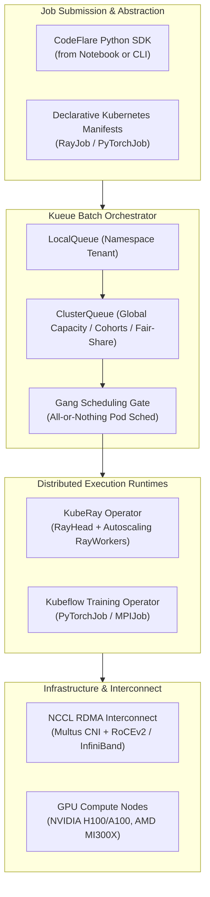
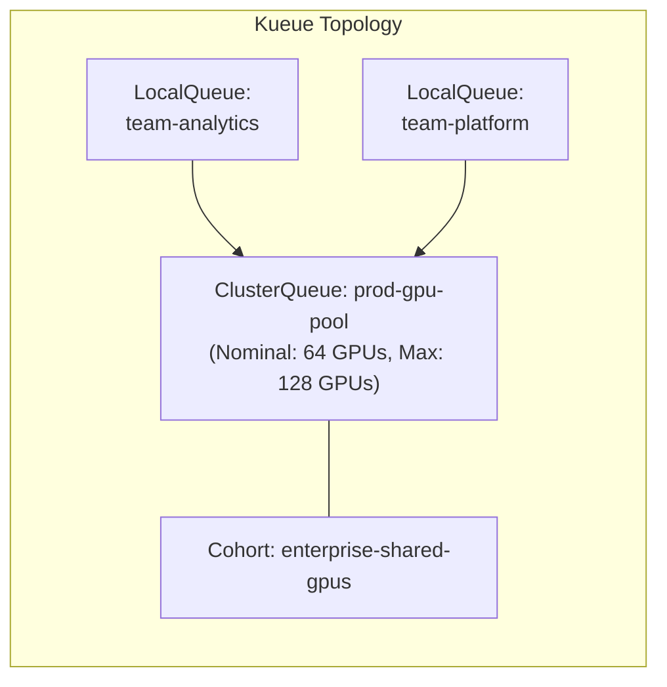
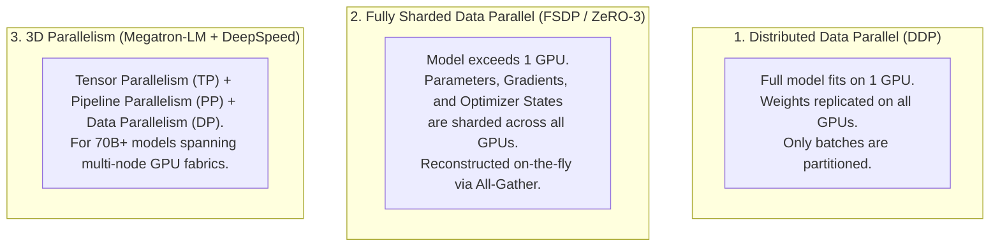

# Distributed Training & Workload Orchestration (Ray, Kueue, PyTorch)

> **Focus Domain**: Distributed Compute, Batch Scheduling, Ray on Kubernetes, Kueue Queuing, High-Speed Fabric  
> **Audience**: Platform Engineers, MLOps Architects, Distributed Systems Specialists  
> **Status**: Production Reference

---

## 1. The Distributed AI Challenge on Kubernetes

Training or fine-tuning models with 8 billion to 70+ billion parameters exceeds the physical memory (VRAM) of a single GPU. Enterprise training requires clustering tens to hundreds of GPUs across high-speed fabrics.

Standard Kubernetes schedulers are designed for long-running microservices, creating acute challenges for AI workloads:
1. **Lack of Gang Scheduling**: If a 32-GPU job requests 4 nodes of 8 GPUs, but only 3 nodes are available, standard Kubernetes schedules 24 GPUs and leaves them idling while waiting for the final node—wasting expensive GPU cycles and deadlocking the cluster.
2. **No Multi-Tenant Batch Queuing**: Simultaneous job submissions cause out-of-memory or pending-state thrashing without fair-share policies or priority-based preemption.
3. **Complex Communication Primitives**: Distributed PyTorch (`torch.distributed`) requires low-latency, non-blocking all-reduce collectives across GPUs via NCCL (NVIDIA Collective Communications Library).

Red Hat OpenShift AI solves this by integrating **Kueue**, **KubeRay**, **Project CodeFlare**, and the **Kubeflow Training Operator**.



---

## 2. Batch Queuing Architecture with Kueue

**Kueue** manages hardware allocation dynamically without modifying the underlying Kubernetes scheduler. It implements **All-or-Nothing (Gang) Scheduling** and **Fair-Share Borrowing**:



### 1. Production `ClusterQueue` Configuration

```yaml
apiVersion: kueue.x-k8s.io/v1beta1
kind: ClusterQueue
metadata:
  name: gpu-cluster-queue
spec:
  namespaceSelector: {}
  cohort: "enterprise-shared-gpus"
  resourceGroups:
    - coveredResources: ["nvidia.com/gpu", "cpu", "memory"]
      flavors:
        - name: "h100-flavor"
          resources:
            - name: "nvidia.com/gpu"
              nominalQuota: 64
              borrowingLimit: 32
            - name: "cpu"
              nominalQuota: 512
            - name: "memory"
              nominalQuota: 2048Gi
  preemption:
    reclaimWithinCohort: Any
    withinClusterQueue: LowerPriority
```

### 2. Production `LocalQueue` Configuration

```yaml
apiVersion: kueue.x-k8s.io/v1beta1
kind: LocalQueue
metadata:
  namespace: team-nlp
  name: team-nlp-local-queue
spec:
  clusterQueue: gpu-cluster-queue
```

---

## 3. Distributed Compute with KubeRay & CodeFlare

Project CodeFlare integrates with KubeRay to simplify running Ray workloads on OpenShift.

### RayCluster with Kueue Integration

```yaml
apiVersion: ray.io/v1
kind: RayCluster
metadata:
  name: granite-distributed-tune
  namespace: team-nlp
  labels:
    kueue.x-k8s.io/queue-name: team-nlp-local-queue
spec:
  rayVersion: "2.35.0"
  headGroupSpec:
    rayStartParams:
      dashboard-host: "0.0.0.0"
    template:
      spec:
        containers:
          - name: ray-head
            image: registry.redhat.io/rhoai/ray-cuda-py311:latest
            resources:
              limits:
                cpu: "8"
                memory: 32Gi
  workerGroupSpecs:
    - groupName: gpu-workers
      replicas: 4
      minReplicas: 4
      maxReplicas: 4
      rayStartParams: {}
      template:
        spec:
          containers:
            - name: ray-worker
              image: registry.redhat.io/rhoai/ray-cuda-py311:latest
              resources:
                limits:
                  nvidia.com/gpu: "8"
                  cpu: "64"
                  memory: 256Gi
              volumeMounts:
                - mountPath: /dev/shm
                  name: dshm
          volumes:
            - name: dshm
              emptyDir:
                medium: Memory
                sizeLimit: 64Gi
```

### Submitting Workloads via the CodeFlare Python SDK

```python
from codeflare_sdk import Cluster, ClusterConfiguration, TokenAuthentication

# 1. Authenticate with OpenShift
auth = TokenAuthentication(
    token="sha256~...",
    server="https://api.ocp.corp.internal:6443",
    skip_tls=False
)
auth.login()

# 2. Define Ray cluster configuration with Kueue LocalQueue
cluster_config = ClusterConfiguration(
    name="instructlab-dist-train",
    namespace="team-nlp",
    num_workers=4,
    num_gpus_per_worker=8,
    worker_cpu_requests=64,
    worker_mem_requests=256,
    image="registry.redhat.io/rhoai/ray-cuda-py311:latest",
    local_queue="team-nlp-local-queue"
)

# 3. Provision and wait for gang scheduling allocation
cluster = Cluster(cluster_config)
cluster.up()
cluster.wait_ready()

# 4. Submit distributed fine-tuning job
job_client = cluster.job_client
job_id = job_client.submit_job(
    entrypoint="python3 -m instructlab.training.distributed_train --model-name granite-8b --dataset-path s3://models/data.jsonl",
    runtime_env={"pip": ["torch", "transformers", "accelerate", "deepspeed"]}
)
print(f"Distributed job submitted: {job_id}")
```

---

## 4. Distributed Training Strategies: DDP vs. FSDP vs. Megatron-LM

When scaling foundation models, platform architects must choose the appropriate parallelism paradigm:



### Memory Footprint Breakdown (AdamW Optimizer in FP16/BF16)

For a model with $N$ billion parameters:
- **Model Weights (FP16)**: $2N$ bytes
- **Gradients (FP16)**: $2N$ bytes
- **Optimizer States (AdamW)**:
  - FP32 Master Weights: $4N$ bytes
  - Momentum: $4N$ bytes
  - Variance: $4N$ bytes
  - *Total Optimizer*: $12N$ bytes
- **Total Static Memory**: $16N$ bytes per model parameter!

For an 8-Billion parameter model:
$$\text{Static VRAM} = 8 \times 10^9 \times 16 \text{ bytes} \approx 128 \text{ GB}$$

*Conclusion*: An 8B model cannot be trained with full AdamW on a single 80 GB GPU. **FSDP or ZeRO-3 sharding across at least 2 to 4 GPUs is mathematically required.**

---

## 5. Kubernetes PyTorchJob Manifest (Kubeflow Training Operator)

For native PyTorch distributed runs using PyTorch Elastic (`torchrun`), RHOAI provides the `PyTorchJob` custom resource:

```yaml
apiVersion: kubeflow.org/v1
kind: PyTorchJob
metadata:
  name: granite-fsdp-finetune
  namespace: team-nlp
  labels:
    kueue.x-k8s.io/queue-name: team-nlp-local-queue
spec:
  nprocPerNode: "8"
  pytorchReplicaSpecs:
    Master:
      replicas: 1
      restartPolicy: OnFailure
      template:
        spec:
          containers:
            - name: pytorch
              image: registry.redhat.io/rhoai/pytorch-cuda-py311:latest
              command:
                - torchrun
                - --nnodes=2
                - --nproc_per_node=8
                - --rdzv_backend=c10d
                - train_fsdp.py
              resources:
                limits:
                  nvidia.com/gpu: "8"
                  cpu: "64"
                  memory: 256Gi
    Worker:
      replicas: 1
      restartPolicy: OnFailure
      template:
        spec:
          containers:
            - name: pytorch
              image: registry.redhat.io/rhoai/pytorch-cuda-py311:latest
              resources:
                limits:
                  nvidia.com/gpu: "8"
                  cpu: "64"
                  memory: 256Gi
```

---

## 6. High-Performance Interconnects: RoCEv2 & SR-IOV on OpenShift

Distributed all-reduce operations (NCCL) saturate standard 10GbE/25GbE Kubernetes CNI networks, leading to severe GPU starvation:

```
┌─────────────────────────────────────────────────────────┐
│ Multi-NIC OpenShift Node Architecture                  │
│                                                         │
│  [Pod / Container]                                      │
│     ├── eth0 (Default CNI / OVN-Kubernetes) ──► Pod API │
│     └── net1 (SR-IOV / RoCEv2 RDMA) ─────────► NCCL Fab │
│                                                         │
│  [Hardware NICs]                                        │
│     ├── 2x 25GbE LACP (Cluster Management & K8s API)    │
│     └── 8x 400GbE NVIDIA CX7 / BlueField (RoCEv2 East-West)│
└─────────────────────────────────────────────────────────┘
```

1. **Multus CNI**: Attaches multiple network interfaces to a single training Pod.
2. **SR-IOV Network Operator**: Bypasses the host Linux kernel network stack, injecting virtual functions (VFs) directly into the PyTorch/Ray containers.
3. **RDMA / RoCEv2**: Enables GPU-to-GPU Direct Memory Access across nodes without CPU intervention, driving NCCL bandwidth up to 400 Gbps per NIC.

---
*Reference architecture documentation for `/workspace/projects/rh-ai`.*


---

## Related Knowledge & Architecture Links
- **Knowledge Hub**: [[spaces/rh-ai/notes/overview|Rh-Ai Knowledge Hub]]
- **Previous Module**: [[spaces/rh-ai/notes/04-openshift-ai-rhoai-architecture|RHOAI Architecture]]
- **Next Module**: [[spaces/rh-ai/notes/06-model-serving-kserve-and-vllm|Model Serving KServe & vLLM]]
- **Fabric Architecture**: [[spaces/rh-ai/architecture/hybrid_cloud_ai_fabric|Hybrid Cloud AI Fabric]]
- **Architectural Decision**: [[spaces/rh-ai/decisions/adr_003_heterogeneous_hardware_acceleration|ADR 003: Heterogeneous Hardware Acceleration]]
