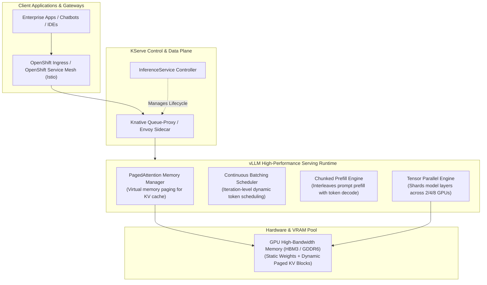
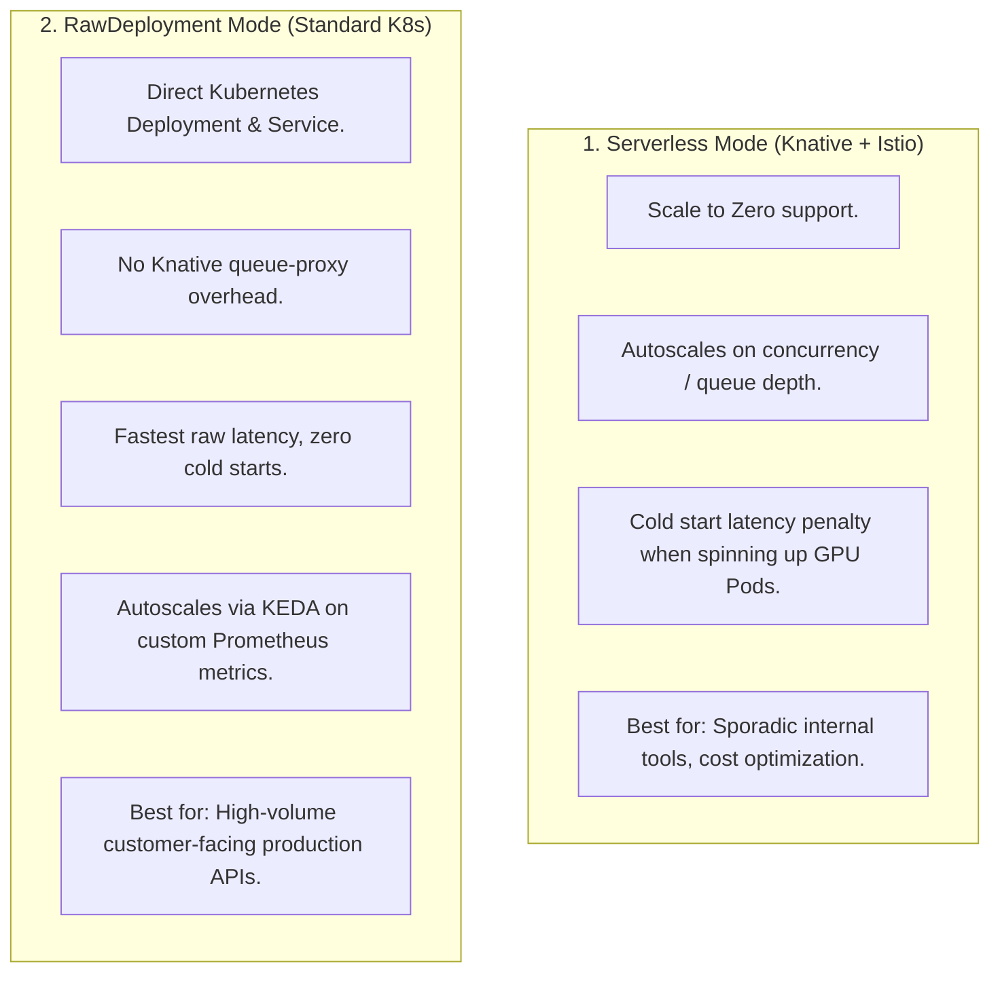

# High-Performance Model Serving (KServe & vLLM)

> **Focus Domain**: LLM Inference Engines, KServe Orchestration, vLLM Optimization, Autoscaling  
> **Audience**: Platform Engineers, Systems Architects, MLOps Engineers  
> **Status**: Production Reference

---

## 1. Inference Serving Architecture on OpenShift AI

Serving Large Language Models (LLMs) in enterprise production requires an inference stack capable of low-latency token streaming, high concurrency, zero-waste memory management, and dynamic autoscaling.

Red Hat OpenShift AI standardizes on **KServe** paired with the **vLLM Serving Runtime**.



---

## 2. The vLLM Execution Engine: Why Traditional Serving Fails

Traditional serving frameworks (Hugging Face Transformers / standard PyTorch pipelines) suffer from severe architectural limitations when running auto-regressive LLMs:

1. **KV Cache Memory Fragmentation**:
   - In auto-regressive decoding, the Key-Value (KV) cache grows monotonically with each output token.
   - Traditional engines pre-allocate contiguous memory chunks corresponding to `max_sequence_length`. Because actual sequence lengths vary, **60% to 80% of GPU VRAM is wasted due to internal and external fragmentation**.
2. **Static Batching Latency**:
   - Traditional batching waits for an entire batch of requests to complete before scheduling new requests. A single long prompt stalls all fast completions.

### 2.1 PagedAttention
vLLM solves memory fragmentation via **PagedAttention**, inspired by classical operating system virtual memory paging:
- The KV cache is partitioned into fixed-size **blocks** (typically 16 or 32 tokens).
- Logical blocks are mapped to physical non-contiguous GPU memory pages via a block table.
- Reduces VRAM waste to **under 4%**, allowing 2x to 4x higher concurrency on the same GPU hardware.

```
Logical Blocks:   [ Block 0 (tokens 0-15) ] ──► [ Block 1 (tokens 16-31) ]
                            │                               │
Physical Pages:             ▼                               ▼
                      GPU Page #14                    GPU Page #82
```

### 2.2 Continuous Batching & Chunked Prefill
- **Continuous (Iteration-Level) Batching**: Requests join and exit the batch on each forward token step rather than waiting for full-sequence termination.
- **Chunked Prefill**: Large prompt prefills (which are compute-bound) are sliced into sub-chunks and co-scheduled with memory-bound decode steps, preventing Time-to-First-Token (TTFT) spikes from starving active token streaming.

---

## 3. Production KServe Manifests on OpenShift AI

KServe defines two Custom Resources:
1. **`ServingRuntime` / `ClusterServingRuntime`**: Defines the container image, entrypoint arguments, and environment variables for the serving engine.
2. **`InferenceService`**: Represents the deployment instance, pointing to the model weights in object storage and defining resource limits.

### 3.1 `ClusterServingRuntime` for vLLM

```yaml
apiVersion: serving.kserve.io/v1alpha1
kind: ClusterServingRuntime
metadata:
  name: vllm-runtime
spec:
  annotations:
    openshift.io/display-name: "vLLM Serving Runtime for OpenShift AI"
  supportedModelFormats:
    - name: vLLM
      version: "1"
      autoSelect: true
  containers:
    - name: kserve-container
      image: registry.redhat.io/rhoai/vllm-cuda-py311:latest
      command: ["python3", "-m", "vllm.entrypoints.openai.api_server"]
      args:
        - "--port=8080"
        - "--model=/mnt/models"
        - "--gpu-memory-utilization=0.90"
        - "--max-model-len=8192"
        - "--tensor-parallel-size=1"
        - "--enforce-eager"
      ports:
        - containerPort: 8080
          protocol: TCP
      env:
        - name: HF_HOME
          value: /tmp/hf_home
```

### 3.2 `InferenceService` for IBM Granite 8B

```yaml
apiVersion: serving.kserve.io/v1beta1
kind: InferenceService
metadata:
  name: granite-8b-instruct
  namespace: team-nlp
  annotations:
    serving.kserve.io/deploymentMode: Serverless
    serving.knative.dev/minScale: "1"
    serving.knative.dev/maxScale: "4"
spec:
  predictor:
    model:
      modelFormat:
        name: vLLM
      runtime: vllm-runtime
      storageUri: "s3://model-registry/granite-8b-instruct/"
      resources:
        requests:
          cpu: "8"
          memory: 32Gi
          nvidia.com/gpu: "1"
        limits:
          cpu: "16"
          memory: 64Gi
          nvidia.com/gpu: "1"
```

### 3.3 S3 Connection Secret (`storageUri` Binding)

```yaml
apiVersion: v1
kind: Secret
metadata:
  name: storage-config
  namespace: team-nlp
  labels:
    opendatahub.io/dashboard: "true"
stringData:
  aws_access_key_id: "ODF_ACCESS_KEY"
  aws_secret_access_key: "ODF_SECRET_KEY"
  aws_s3_endpoint: "https://s3.odf.apps.ocp.corp.internal"
  aws_s3_bucket: "model-registry"
  aws_default_region: "us-east-1"
```

---

## 4. Autoscaling Architecture: Serverless vs. RawDeployment

RHOAI supports two deployment modes for KServe:



### Autoscaling with KEDA on vLLM Queue Metrics (RawDeployment)

In high-throughput environments, KEDA scales model replicas based on the number of waiting requests reported by the vLLM Prometheus metrics exporter:

```yaml
apiVersion: keda.sh/v1alpha1
kind: ScaledObject
metadata:
  name: vllm-queue-scaler
  namespace: team-nlp
spec:
  scaleTargetRef:
    apiVersion: apps/v1
    kind: Deployment
    name: granite-8b-instruct-predictor
  minReplicaCount: 2
  maxReplicaCount: 8
  triggers:
    - type: prometheus
      metadata:
        serverAddress: https://thanos-querier.openshift-monitoring.svc:9091
        metricName: vllm_num_requests_waiting
        query: sum(vllm:num_requests_waiting{namespace="team-nlp"})
        threshold: "5"
```

---

## 5. Memory Sizing & Sizing Formulas for Inference

To size GPU VRAM for vLLM accurately, calculate the static model footprint plus the dynamic KV-cache budget:

$$\text{Total VRAM} = \text{Model Weights} + \text{KV Cache} + \text{CUDA Activation Buffer}$$

### 1. Model Weights Memory Formula
$$\text{Weight Memory (GB)} = \frac{\text{Parameters (Billions)} \times \text{Bytes per Param}}{10^9}$$

- **FP16 / BF16**: 2 bytes per parameter ($8 \times 2 = 16 \text{ GB}$).
- **INT8**: 1 byte per parameter ($8 \times 1 = 8 \text{ GB}$).
- **AWQ / GPTQ (INT4)**: 0.5 bytes per parameter ($8 \times 0.5 = 4 \text{ GB}$).

### 2. KV Cache Memory Formula (Grouped Query Attention)
For a model with $L$ layers, $H_{kv}$ KV heads, head dimension $D$, context length $S$, batch size $B$, and 2 bytes (FP16):

$$\text{KV Cache per Token} = 2 \times L \times H_{kv} \times D \times 2 \text{ bytes}$$

For **Granite-8B-Instruct** ($L=36, H_{kv}=8, D=128$):
$$\text{Memory per Token} = 2 \times 36 \times 8 \times 128 \times 2 = 147,456 \text{ bytes} \approx 144 \text{ KB}$$

For 1,000 concurrent tokens across the system:
$$\text{KV Cache} = 1000 \times 144 \text{ KB} \approx 144 \text{ MB}$$
For a full 8,192 sequence length with batch size 16:
$$\text{KV Cache} = 16 \times 8,192 \times 144 \text{ KB} \approx 18.87 \text{ GB}$$

*Sizing Recommendation*: On a single 80 GB A100/H100 GPU:
- Model Weights (FP16): 16 GB
- Activations: ~4 GB
- Available KV Cache: $80 \times 0.90 - 20 = 52 \text{ GB}$
- **Concurrency capacity**: Over 40 simultaneous streams at full 8k context!

---

## 6. End-to-End Verification via cURL

```bash
# Obtain OpenShift route host
ROUTE_HOST=$(oc get route granite-8b-instruct -n team-nlp -o jsonpath='{.spec.host}')

# Stream tokens from the OpenAI-compatible vLLM endpoint
curl -X POST https://${ROUTE_HOST}/v1/chat/completions \
  -H "Authorization: Bearer $(oc whoami -t)" \
  -H "Content-Type: application/json" \
  -d '{
    "model": "granite-8b-instruct",
    "messages": [
      {"role": "system", "content": "You are a Red Hat OpenShift AI Architect."},
      {"role": "user", "content": "What is the primary benefit of PagedAttention?"}
    ],
    "stream": true,
    "temperature": 0.1
  }'
```

---
*Reference architecture documentation for `/workspace/projects/rh-ai`.*


---

## Related Knowledge & Architecture Links
- **Knowledge Hub**: [[spaces/rh-ai/notes/overview|Rh-Ai Knowledge Hub]]
- **Previous Module**: [[spaces/rh-ai/notes/05-distributed-training-and-orchestration|Distributed Training]]
- **Next Module**: [[spaces/rh-ai/notes/07-ibm-granite-models-and-open-foundation|IBM Granite Models]]
- **System Architecture**: [[spaces/rh-ai/architecture/rhoai_system_topology|RHOAI System Topology]]
- **Architectural Decision**: [[spaces/rh-ai/decisions/adr_001_standardize_on_rhoai_and_kserve_vllm|ADR 001: Standardize on RHOAI & vLLM]]
