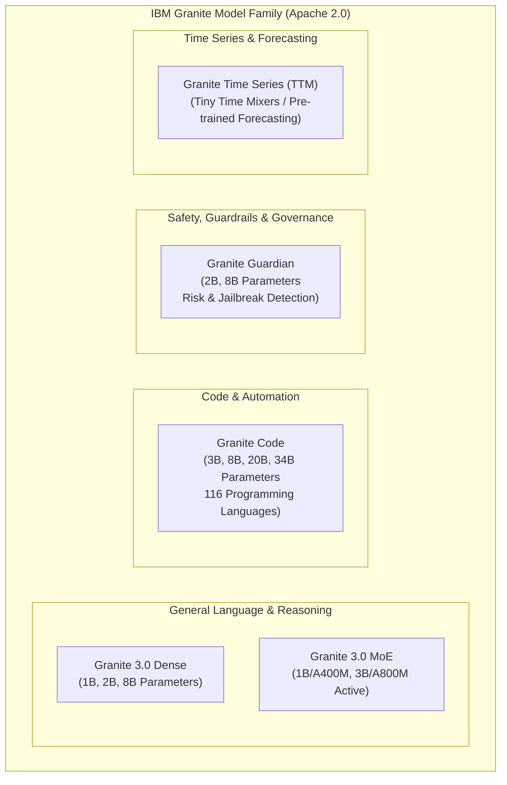
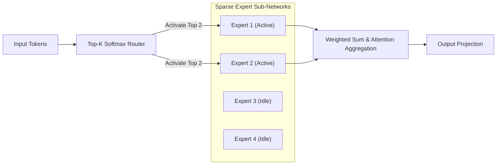
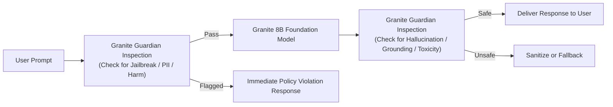

# IBM Granite Models & Enterprise Open Foundation Architecture

> **Focus Domain**: Open Foundation Models, Apache 2.0 Licensing, IP Indemnification, Model Sizing  
> **Audience**: AI Architects, Enterprise Compliance Officers, Lead Software Engineers  
> **Status**: Production Reference

---

## 1. The Granite Strategic Advantage: Open Weights & Enterprise Indemnity

Most proprietary and "open-weights" foundation models suffer from legal and operational risks in enterprise deployments:
1. **Opaque Training Data**: Many popular models are trained on scraped internet data with unverified copyright licenses, exposing enterprises to legal liability.
2. **Restrictive Commercial Licensing**: Models frequently carry custom non-commercial or user-threshold licenses (e.g., Llama acceptable use policies) that prohibit certain enterprise use cases.
3. **Absence of IP Indemnity**: If a model generates copyrighted code or text, the deploying enterprise bears full legal liability.

Developed by IBM Research and championed across Red Hat's AI portfolio, the **IBM Granite** family provides enterprise-ready foundation models with three core guarantees:
- **100% Apache 2.0 License**: Full freedom to modify, fine-tune, distribute, and commercialize without royalty obligations.
- **Data Transparency & Governance**: Trained on rigorously filtered, de-duplicated datasets scrubbed of PII, toxic language, and copyright-encumbered source code.
- **Enterprise IP Indemnification**: IBM and Red Hat provide intellectual property indemnification for Granite models deployed under active enterprise subscriptions.

---

## 2. Granite Model Families & Specifications



### 2.1 Technical Specifications & Context Windows

| Model Variant | Parameter Count | Architecture | Native Context | Optimal Deployment Target |
| :--- | :--- | :--- | :--- | :--- |
| **Granite 3.0 1B** | 1.3 Billion | Dense Transformer | 8,192 tokens | Edge devices, mobile, low-power IoT, fast drafting. |
| **Granite 3.0 3B** | 3.3 Billion | Dense Transformer | 8,192 tokens | CPU-only server inference, lightweight chatbots. |
| **Granite 3.0 8B** | 8.2 Billion | Dense Transformer (GQA) | 8,192 / 32,768 tokens | Enterprise standard: RAG, summarization, tool use. |
| **Granite 3.0 3B-A800M** | 3.3B Total / 800M Active | Mixture of Experts (MoE) | 8,192 tokens | Ultra-high throughput at sub-1B computational cost. |
| **Granite Code 8B** | 8.1 Billion | Dense Code Specialist | 4,096 / 16,384 tokens | IDE code completion, unit test generation, refactoring. |
| **Granite Code 20B** | 20.2 Billion | Dense Code Specialist | 8,192 / 32,768 tokens | Enterprise repository understanding, multi-file migration. |
| **Granite Code 34B** | 33.8 Billion | Dense Code Specialist | 8,192 / 32,768 tokens | Complex multi-language architectural modernization. |
| **Granite Guardian 8B** | 8.2 Billion | Safety & Risk Classifier | 8,192 tokens | Real-time guardrail scoring (toxicity, PII, hallucination). |

---

## 3. Granite 3.0 Architecture: Mixture of Experts (MoE) & Dense

Granite 3.0 introduces Mixture of Experts (MoE) architectures designed to maximize inference speed and lower token serving costs:



- In **Granite 3.0 3B-A800M**, the model retains 3.3 billion total parameters of deep capacity, but **only 800 million parameters are activated per token forward pass**.
- Result: The model matches the reasoning capabilities of a 3B dense model while running at the latency and memory bandwidth consumption of an 800M parameter micro-model.

---

## 4. Hardware Sizing & Quantization Profiles

Deploying Granite models requires matching model weight precision to available GPU VRAM:

| Model | Precision | Weight VRAM | Minimum Recommended GPU | vLLM Flags |
| :--- | :--- | :--- | :--- | :--- |
| **Granite 3.0 8B** | FP16 (16-bit) | ~16 GB | 1x NVIDIA A10G / L40S (24 GB) | `--gpu-memory-utilization=0.90` |
| **Granite 3.0 8B** | AWQ / GPTQ (4-bit) | ~4.5 GB | 1x NVIDIA L4 (24 GB) / T4 (16 GB) | `--quantization=awq` |
| **Granite 3.0 8B** | FP8 (8-bit) | ~8.2 GB | 1x NVIDIA L40S / H100 (Native FP8) | `--quantization=fp8` |
| **Granite Code 20B** | FP16 (16-bit) | ~40 GB | 1x NVIDIA A100 (80 GB) / 2x L40S | `--tensor-parallel-size=2` |
| **Granite Code 20B** | AWQ (4-bit) | ~11 GB | 1x NVIDIA A10G (24 GB) | `--quantization=awq` |
| **Granite Code 34B** | FP16 (16-bit) | ~68 GB | 1x NVIDIA H100 (80 GB) / 2x A100 | `--tensor-parallel-size=2` |
| **Granite Code 34B** | AWQ (4-bit) | ~18 GB | 1x NVIDIA A10G / L40S (24 GB) | `--quantization=awq` |

---

## 5. Granite Guardian: Enterprise Safety & Guardrails

Deploying Generative AI in regulated industries (healthcare, banking, defense) requires real-time content moderation and risk mitigation. **Granite Guardian** acts as a specialized classification model that scores inputs and outputs against predefined risk dimensions:



### Risk Dimensions Scored by Granite Guardian
1. **Harm & Toxicity**: Violence, hate speech, sexual content, profanity.
2. **Jailbreak Detection**: Adversarial prompts, prompt injection attempts, system prompt exfiltration.
3. **Context Grounding / Hallucination**: Verifies whether claims in the generated response are mathematically grounded in the RAG retrieval documents.
4. **PII Exfiltration**: Identification of credit card numbers, social security identifiers, and medical records.

---

## 6. Real-World Deployment Manifest for Granite on OpenShift AI

```yaml
apiVersion: serving.kserve.io/v1beta1
kind: InferenceService
metadata:
  name: granite-3-8b-instruct
  namespace: enterprise-rag
spec:
  predictor:
    model:
      modelFormat:
        name: vLLM
      runtime: vllm-runtime
      storageUri: "s3://models/ibm-granite/granite-3.0-8b-instruct/"
      resources:
        requests:
          cpu: "8"
          memory: 32Gi
          nvidia.com/gpu: "1"
        limits:
          cpu: "16"
          memory: 64Gi
          nvidia.com/gpu: "1"
```

---
*Reference architecture documentation for `/workspace/projects/rh-ai`.*


---

## Related Knowledge & Architecture Links
- **Knowledge Hub**: [[spaces/rh-ai/notes/overview|Rh-Ai Knowledge Hub]]
- **Previous Module**: [[spaces/rh-ai/notes/06-model-serving-kserve-and-vllm|Model Serving]]
- **Next Module**: [[spaces/rh-ai/notes/08-ansible-and-openshift-lightspeed|Ansible & OpenShift Lightspeed]]
- **Pipeline Architecture**: [[spaces/rh-ai/architecture/instructlab_alignment_pipeline|InstructLab Pipeline Architecture]]
- **Architectural Decision**: [[spaces/rh-ai/decisions/adr_002_instructlab_taxonomy_governance|ADR 002: InstructLab Taxonomy Governance]]
