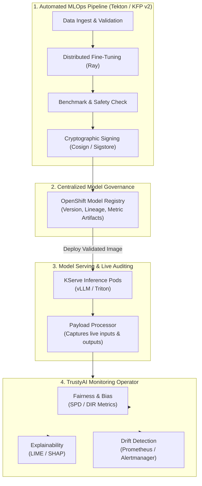
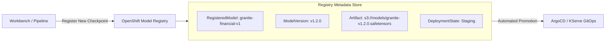
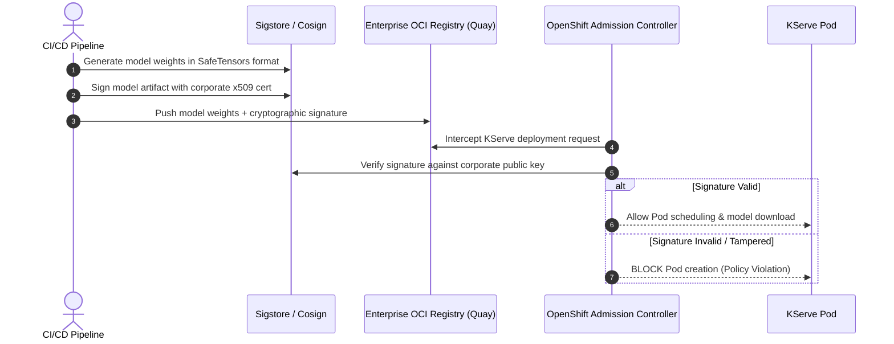

# Governance, Safety, TrustyAI & MLOps Pipelines

> **Focus Domain**: AI Governance, Model Explainability, Bias Detection, Model Registry, Automated Pipelines  
> **Audience**: MLOps Engineers, Compliance Officers, Platform Architects, Enterprise Data Scientists  
> **Status**: Production Reference

---

## 1. The Enterprise AI Governance Imperative

Deploying AI models in production without continuous auditing introduces significant legal, ethical, and operational liabilities:
1. **Algorithmic Bias**: Models can perpetuate or amplify discriminatory outcomes (e.g., credit approvals, hiring filters), violating regulations such as the EU AI Act and EEOC guidelines.
2. **Black-Box Decision Making**: Regulators require explainable outcomes ("Why was this loan application rejected?").
3. **Model & Data Drift**: Over time, real-world data diverges from training distributions, silently degrading model accuracy.
4. **Supply Chain Tampering**: Malicious actors can poison model weights (e.g., via pickle deserialization exploits) or substitute unvalidated checkpoints.

Red Hat OpenShift AI integrates **TrustyAI**, the **OpenShift Model Registry**, and **Data Science Pipelines** to establish an automated, verifiable governance lifecycle.



---

## 2. TrustyAI: Bias, Fairness & Explainability

**TrustyAI** is an OpenShift operator that attaches to model serving endpoints to provide continuous auditing:

### 2.1 Fairness Metrics: SPD & DIR
TrustyAI monitors outcomes across protected attributes (e.g., gender, age, race):

1. **Statistical Parity Difference (SPD)**:
   Measures the difference in probability of positive outcomes between unprivileged ($U$) and privileged ($P$) groups:
   $$SPD = P(\hat{Y} = 1 \mid D = U) - P(\hat{Y} = 1 \mid D = P)$$
   - Ideal: $0.0$
   - Acceptable Fair Range: $[-0.1, 0.1]$

2. **Disparate Impact Ratio (DIR)**:
   Measures the ratio of favorable outcomes:
   $$DIR = \frac{P(\hat{Y} = 1 \mid D = U)}{P(\hat{Y} = 1 \mid D = P)}$$
   - Ideal: $1.0$
   - 80% Rule (EEOC Standard): $DIR \ge 0.80$

### 2.2 Explainability Engines: LIME & SHAP
- **LIME (Local Interpretable Model-agnostic Explanations)**: Builds a local surrogate linear model around a single inference request to determine feature attribution weights.
- **SHAP (SHapley Additive exPlanations)**: Computes game-theoretic Shapley values to apportion credit or blame to each input feature.

### 2.3 TrustyAIService Manifest

```yaml
apiVersion: trustyai.opendatahub.io/v1alpha1
kind: TrustyAIService
metadata:
  name: trustyai-service
  namespace: team-nlp
spec:
  storage:
    format: PVC
    size: 50Gi
  data:
    filename: data.csv
    format: CSV
  metrics:
    schedule: "5s"
```

---

## 3. OpenShift Model Registry

The **Model Registry** is a centralized catalog that manages the lifecycle of machine learning models from experimentation to production:



### Key API Entities
1. **RegisteredModel**: Top-level identity for an AI asset (e.g., `fraud-detection-model`).
2. **ModelVersion**: Specific iteration with Git commit hash, training dataset hash, and accuracy metrics.
3. **ModelArtifact**: URI pointing to the model weights in S3 or OCI registry with cryptographic checksum.

---

## 4. End-to-End MLOps Pipeline (Kubeflow Pipelines v2 on Tekton)

OpenShift Data Science Pipelines automates the entire alignment, verification, and deployment lifecycle using standard Python DSL:

```python
from kfp import dsl

@dsl.component(base_image="registry.redhat.io/rhelai1/instructlab-cuda:latest")
def generate_synthetic_data(taxonomy_git: str, num_samples: int) -> dsl.Dataset:
    """Clones taxonomy and executes ilab data generate."""
    # Automated execution steps...
    pass

@dsl.component(base_image="registry.redhat.io/rhoai/ray-cuda-py311:latest")
def train_model(dataset: dsl.Dataset, epochs: int) -> dsl.Model:
    """Executes distributed FSDP fine-tuning across Ray cluster."""
    # Automated training steps...
    pass

@dsl.component(base_image="registry.redhat.io/rhoai/trustyai-eval:latest")
def audit_and_evaluate(model: dsl.Model) -> float:
    """Executes MMLU, MT-Bench, and bias checks; returns accuracy score."""
    # Automated audit...
    return 0.94

@dsl.pipeline(
    name="enterprise-granite-alignment-pipeline",
    description="Automated alignment, verification, and KServe deployment"
)
def alignment_pipeline(taxonomy_git: str = "https://github.com/corp/taxonomy.git"):
    gen_step = generate_synthetic_data(taxonomy_git=taxonomy_git, num_samples=500)
    train_step = train_model(dataset=gen_step.output, epochs=3)
    eval_step = audit_and_evaluate(model=train_step.output)
```

---

## 5. Securing the AI Supply Chain: Sigstore & Cosign

Loading untrusted model weights exposes clusters to Remote Code Execution (RCE) via Python `pickle` exploits. Red Hat implements a secure supply chain:



### Signing and Verifying Model Weights

```bash
# 1. Sign model weights using enterprise private key
cosign sign --key k8s://team-nlp/cosign-key \
  quay.internal.corp/models/granite-8b-custom:v1.2

# 2. Verify signature before deployment
cosign verify --key k8s://team-nlp/cosign-key \
  quay.internal.corp/models/granite-8b-custom:v1.2
```

---
*Reference architecture documentation for `/workspace/projects/rh-ai`.*


---

## Related Knowledge & Architecture Links
- **Knowledge Hub**: [[spaces/rh-ai/notes/overview|Rh-Ai Knowledge Hub]]
- **Previous Module**: [[spaces/rh-ai/notes/08-ansible-and-openshift-lightspeed|Ansible & OpenShift Lightspeed]]
- **Next Module**: [[spaces/rh-ai/notes/10-hardware-acceleration-and-cluster-sizing|Hardware Acceleration]]
- **System Architecture**: [[spaces/rh-ai/architecture/rhoai_system_topology|RHOAI System Topology]]
- **Architectural Decision**: [[spaces/rh-ai/decisions/adr_001_standardize_on_rhoai_and_kserve_vllm|ADR 001: Standardize on RHOAI & vLLM]]
