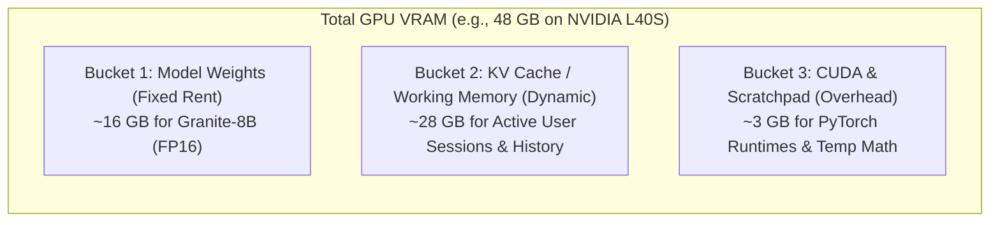
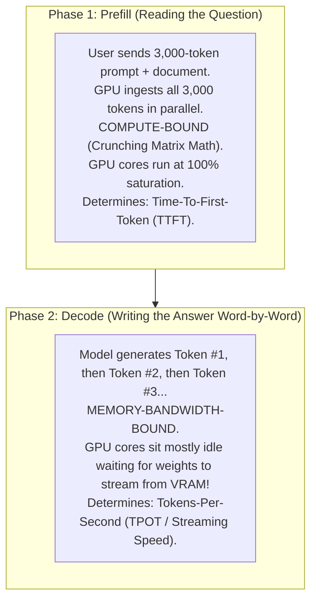
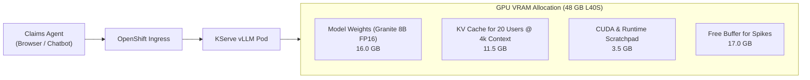
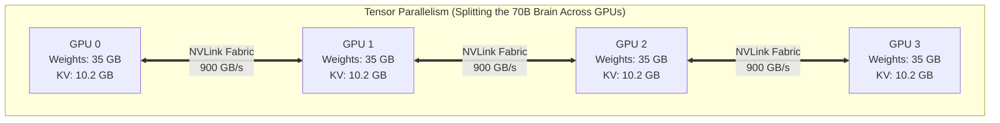
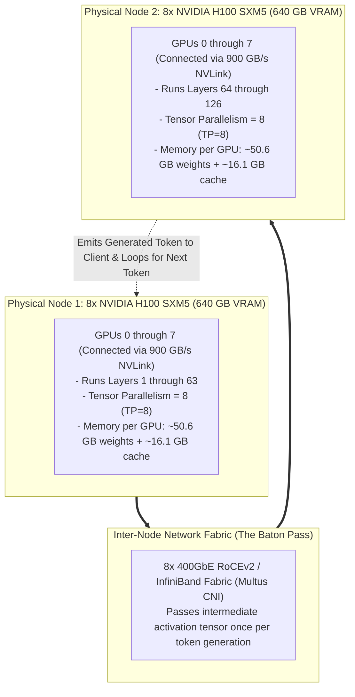

# Hardware Acceleration, GPU Math & Cluster Sizing in Plain English

> **Focus Domain**: GPU Memory Physics, Bandwidth Sizing, Real-World Inferencing Pipelines, Capacity Planning  
> **Audience**: Systems Architects, Platform Engineers, Infrastructure Leads, SREs  
> **Target Platforms**: Red Hat OpenShift AI (RHOAI), RHEL AI, KServe, vLLM  
> **Status**: Production Reference

---

## 1. Executive Summary: The "Office Desk" Mental Model

Sizing infrastructure for Large Language Models (LLMs) like IBM Granite, Llama 3, or Mistral is completely different from sizing traditional virtual machines or Kubernetes microservices.

In traditional enterprise IT, if CPU traffic spikes, your server gets a bit sluggish, CPU usage climbs from 40% to 85%, and you spin up another pod. In GPU inferencing, **everything is bound by strict physical memory limits**. If your workload needs just 50 megabytes more VRAM than the GPU physically possesses, your server does not slow down—**it crashes instantly** with an unrecoverable `CUDA Out of Memory` (OOM) error.

To understand GPU sizing intuitively without drowning in academic formulas, picture a GPU worker at an **Office Desk**:

```
┌─────────────────────────────────────────────────────────────────────────────┐
│                         THE OFFICE DESK MENTAL MODEL                        │
├─────────────────────────────────────────────────────────────────────────────┤
│  1. THE DESK SURFACE (VRAM Capacity in Gigabytes):                          │
│     • The Model Weights are a giant encyclopedia permanently open on the    │
│       desk. You cannot move it; you must pay this space just to start.      │
│     • The Active User Conversations (KV Cache) are notepads piled up on the │
│       remaining empty space on the desk.                                    │
│     • If too many users arrive at once, notepads fall off the edge of the   │
│       desk and the worker passes out (CUDA Out of Memory crash).            │
├─────────────────────────────────────────────────────────────────────────────┤
│  2. THE PAGE-FLIPPING SPEED (Memory Bandwidth in Gigabytes/sec):            │
│     • In AI, to write ONE SINGLE WORD (token), the GPU must read through    │
│       the ENTIRE encyclopedia from front to back!                           │
│     • How fast the worker's hands can physically flip pages (VRAM bandwidth)│
│       sets the absolute ceiling on how fast words appear on a user's screen.│
├─────────────────────────────────────────────────────────────────────────────┤
│  3. TALKING BETWEEN DESKS (Interconnect — NVLink vs. Network):              │
│     • If the encyclopedia is too massive to fit on one desk (e.g. 70B model)│
│       you split it across 2, 4, or 8 desks side-by-side.                    │
│     • If the desks are bolted together with high-speed cables (NVLink at    │
│       900 GB/s), they can whisper instantly and work as one brain.          │
│     • If they sit across the room over standard network cables, every word  │
│       stutters and freezes while they wait for network packets.             │
└─────────────────────────────────────────────────────────────────────────────┘
```

---

## 2. The Three Buckets of GPU Memory (VRAM)

Whenever you deploy a model in Red Hat OpenShift AI using KServe and vLLM, your GPU's physical memory is sliced into three distinct buckets:



### Bucket 1: The Model Weights ("The Fixed Rent")
This is the immutable baseline cost. You must pay this memory just to load the model into the GPU, even if zero users are sending prompts.

The math is simple:
$$\text{Weight Footprint (GB)} = \text{Parameter Count (Billions)} \times \text{Bytes per Parameter}$$

*   **FP16 / BF16 (16-bit precision)**: $2\text{ bytes per parameter}$.
    *   *Granite 8B*: $8 \times 2 = \mathbf{16\text{ GB}}$
    *   *Granite 20B*: $20 \times 2 = \mathbf{40\text{ GB}}$
    *   *Granite 34B*: $34 \times 2 = \mathbf{68\text{ GB}}$
    *   *Llama-3 70B*: $70 \times 2 = \mathbf{140\text{ GB}}$
*   **FP8 (8-bit precision - native on NVIDIA Hopper/Ada)**: $1\text{ byte per parameter}$.
    *   *Granite 8B in FP8*: $8 \times 1 = \mathbf{8\text{ GB}}$ (Half the size, nearly identical accuracy!)
*   **AWQ / GPTQ (4-bit quantization)**: $0.5\text{ bytes per parameter}$.
    *   *Granite 8B in 4-bit*: $8 \times 0.5 = \mathbf{4\text{ GB}}$ (Runs on low-cost edge GPUs).

### Bucket 2: The KV Cache ("The Active Conversation Scratchpad")
When an LLM writes text, it generates tokens sequentially. To prevent the model from forgetting earlier parts of the prompt, it caches the mathematical vectors of every past word in VRAM. This is the **Key-Value (KV) Cache**.

*   If an employee asks a 10-word question, their KV cache is tiny.
*   If an employee uploads a 4,000-word PDF contract into a RAG pipeline, their KV cache is enormous.
*   **The Golden Rule**: Every active user sitting in the system holding open a conversation consumes a slice of this KV Cache pool. When this pool fills up, new requests must queue up and wait.

### Bucket 3: CUDA Activation Scratchpad & Runtime Overhead
The GPU operating system, CUDA context, PyTorch runtime libraries, and intermediate matrix calculation buffers require a safety cushion.
*   **Rule of thumb**: Always reserve **2 GB to 4 GB** of VRAM for overhead.

---

## 3. Why Speed Depends on Memory Bandwidth: The Two Phases of Inference

Many engineers assume that GPU computing power (TFLOPS) determines how fast an LLM answers. That is only half true. Inference is divided into two radically different stages:



### The "Memory Bandwidth Bottleneck" Explained
In the **Decode phase**, to emit just *one single new word*, the GPU must read its entire encyclopedia of model weights from memory into its compute cores. 

$$\text{Theoretical Max Streaming Speed (Tokens/sec)} = \frac{\text{GPU Memory Bandwidth (GB/sec)}}{\text{Model Weight Size (GB)}}$$

Look at how the physical hardware limits the reading speed for an unquantized **Granite 8B (16 GB weights)**:
*   **NVIDIA L4 (300 GB/s bandwidth)**:
    $$\frac{300\text{ GB/s}}{16\text{ GB}} \approx \mathbf{18.7\text{ tokens/sec maximum single-user speed}}$$
*   **NVIDIA L40S (864 GB/s bandwidth)**:
    $$\frac{864\text{ GB/s}}{16\text{ GB}} \approx \mathbf{54\text{ tokens/sec maximum single-user speed}}$$
*   **NVIDIA H100 SXM5 (3,350 GB/s bandwidth)**:
    $$\frac{3,350\text{ GB/s}}{16\text{ GB}} \approx \mathbf{209\text{ tokens/sec maximum speed}}$$

> **Key Takeaway**: If your enterprise users demand snappy, real-time typing speed (>30 words/second), deploying a large model on a GPU with low memory bandwidth will physically fail, regardless of how many CPU cores your server has.

---

## 4. Real-World Walkthrough: Sizing an Enterprise RAG Pipeline

Let's apply this to a concrete, production scenario on Red Hat OpenShift AI.

### The Business Scenario
An enterprise insurance organization is deploying an **AI Policy Assistant** on OpenShift AI.
*   **Application**: Internal claims agents ask questions about insurance policies.
*   **The Pipeline**:
    1. The agent types a question: *"Does Policy Gold-900 cover commercial roof leaks?"*
    2. A vector database (Milvus) retrieves 3 relevant policy sections: **3,500 input tokens**.
    3. The model reviews the context and writes a response: **500 output tokens**.
    4. Total context per request: **4,000 tokens**.
*   **SLA & Concurrency**:
    *   Target peak load: **20 claims agents asking questions simultaneously**.
    *   Target Time-to-First-Token (TTFT): **< 1.0 second**.
    *   Target generation speed: **> 35 tokens/second**.



---

### Step-by-Step Sizing Calculations

#### Step 1: Model Selection & Weight Footprint
We select **IBM Granite-3.0-8B-Instruct**.
*   In standard FP16 precision: $8 \times 2\text{ bytes} = \mathbf{16.0\text{ GB}}$ of VRAM.

#### Step 2: Calculate KV Cache per User
In transformer models using Grouped Query Attention (GQA), such as Granite 8B, the memory cost per token is:
$$\text{Memory per Token} = 2 \times (\text{Layers}) \times (\text{KV Heads}) \times (\text{Head Dimension}) \times (\text{Bytes per Number})$$

For Granite-8B ($L=36, H_{kv}=8, D=128, \text{FP16}=2\text{ bytes}$):
$$\text{Memory per Token} = 2 \times 36 \times 8 \times 128 \times 2 = 147,456\text{ bytes} \approx \mathbf{144\text{ KB per token}}$$

For a single user's 4,000-token session:
$$4,000\text{ tokens} \times 144\text{ KB} \approx \mathbf{576\text{ MB per active agent}}$$

#### Step 3: Calculate Total KV Cache for Peak Concurrency
To support **20 concurrent agents** running full 4,000-token queries simultaneously:
$$\text{Total KV Cache} = 20\text{ agents} \times 576\text{ MB} = \mathbf{11.52\text{ GB}}$$

#### Step 4: Add Overhead and Calculate Total VRAM
*   Model Weights: **16.0 GB**
*   Active KV Cache (20 users): **11.52 GB**
*   CUDA & Runtime Scratchpad: **3.5 GB**
*   $$\text{Total VRAM Required} = 16.0 + 11.52 + 3.5 = \mathbf{31.02\text{ GB}}$$

---

### Hardware Selection Decision

Now let's compare our hardware options in the enterprise catalog:

| Hardware Candidate | Physical VRAM | Memory Bandwidth | Will It Fit 20 Users? | Verdict & Analysis |
| :--- | :--- | :--- | :---: | :--- |
| **NVIDIA L4 (PCIe)** | 24 GB | 300 GB/s | ❌ **No** | **Fails**. 31 GB exceeds the 24 GB physical card. The pod will crash with `CUDA OOM` on user #12. *(Could work if quantized to FP8 or AWQ, but bandwidth limits speed to ~18 tokens/sec).* |
| **NVIDIA L40S (PCIe)** | **48 GB** | **864 GB/s** | ✅ **Yes** | **Optimal Enterprise Choice**. 31 GB fits easily within 48 GB, leaving 17 GB of headroom for traffic spikes up to 35 concurrent users. Bandwidth easily hits >45 tokens/sec. |
| **NVIDIA A100 (PCIe)** | 80 GB | 1,935 GB/s | ✅ **Yes** | **Excellent, but overkill for single 8B**. Sits at <40% utilization unless hosting multiple models or 60+ users. |
| **AMD Instinct MI300X** | 192 GB | 5,300 GB/s | ✅ **Yes** | **Massive Overkill**. Can host the 8B model and 150+ concurrent users with zero strain. |

**Final Recommendation for this RAG Pipeline**: Deploy on **1x NVIDIA L40S (48 GB)**. It delivers the lowest hardware cost per token while satisfying all SLAs.

---

## 5. Real-World Walkthrough 2: Sizing a Large 70B Model Pipeline

What happens when an enterprise demands a significantly larger model, such as **Llama-3.3-70B-Instruct** or an enterprise code model like **IBM Granite-Code-34B/70B**?

At 70 billion parameters, the math changes dramatically:
$$\text{70B Model in FP16 (16-bit)} = 70 \times 2\text{ bytes} = \mathbf{140.0\text{ GB of raw weights alone!}}$$

No single mainstream NVIDIA GPU on the market (including an 80 GB A100 or H100) has 140 GB of VRAM. If you attempt to boot this model on a single 80 GB GPU, **it cannot even load the weights to start serving user #1—it crashes immediately with `CUDA Out of Memory`**.

---

### The Business Scenario: Enterprise Code & Architecture Assistant
An engineering organization is deploying a high-capacity AI Code & Document Assistant on Red Hat OpenShift AI:
*   **Model**: Llama-3.3-70B-Instruct (or Granite 70B).
*   **Workload**: Developers submit multi-file pull requests, architecture documents, or legacy codebase files for automated refactoring, unit test generation, and migration advice.
*   **Average Context Window**:
    *   Input prompt + code context: **7,000 tokens**.
    *   Generated code & explanations: **1,000 tokens**.
    *   Total context length: **8,000 tokens per request**.
*   **SLA & Concurrency**:
    *   Target peak load: **16 concurrent developers** submitting requests simultaneously.
    *   Target streaming speed: **> 25 tokens/second** (smooth interactive typing experience).
    *   Target Time-to-First-Token (TTFT): **< 1.5 seconds**.

---

### Step-by-Step Sizing Calculations for 70B

#### Step 1: Model Weights Footprint
*   **Standard FP16 (16-bit)**: $70 \times 2\text{ bytes} = \mathbf{140.0\text{ GB}}$
*   **Native FP8 (8-bit)**: $70 \times 1\text{ byte} = \mathbf{70.0\text{ GB}}$ (Half the weight size with negligible accuracy loss on Hopper/Ada)
*   **AWQ / INT4 (4-bit)**: $70 \times 0.5\text{ bytes} = \mathbf{35.0\text{ GB}}$

#### Step 2: Calculate KV Cache per User for 70B
In Llama-3-70B, the transformer architecture is much deeper than an 8B model:
*   Layers ($L$): **80** (vs 36 in 8B)
*   Key-Value Attention Heads ($H_{kv}$): **8** (Grouped Query Attention)
*   Head Dimension ($D$): **128**
*   Precision: FP16 ($2\text{ bytes}$)

$$\text{Memory per Token} = 2 \times 80\text{ layers} \times 8\text{ heads} \times 128\text{ dim} \times 2\text{ bytes} = 327,680\text{ bytes} \approx \mathbf{320\text{ KB per token}}$$
*(Notice: A single token in a 70B model costs more than double the memory of an 8B model!)*

Now calculate the KV Cache for **one developer's 8,000-token request**:
$$\text{KV Cache per User} = 8,000\text{ tokens} \times 320\text{ KB} = 2,560,000\text{ KB} \approx \mathbf{2.56\text{ GB per active user!}}$$

#### Step 3: Calculate Total KV Cache for 16 Concurrent Users
To support 16 concurrent developers simultaneously running 8,000-token sessions without queuing:
$$\text{Total KV Cache Pool} = 16\text{ developers} \times 2.56\text{ GB} = \mathbf{40.96\text{ GB of dynamic VRAM}}$$

#### Step 4: Add Overhead and Calculate Total Cluster VRAM Needed
*   Model Weights (FP16): **140.0 GB**
*   KV Cache Pool (16 users @ 8k context): **40.96 GB**
*   CUDA Context, PyTorch & Activation Buffers: **8.0 GB**
*   $$\text{Total Cluster VRAM Required (FP16)} = 140.0 + 40.96 + 8.0 = \mathbf{188.96\text{ GB}}$$

*(If running in **FP8 precision**, Model Weights drop to 70 GB, bringing Total Cluster VRAM to $70 + 40.96 + 8.0 = \mathbf{118.96\text{ GB}}$.)*

---

### Hardware Selection Decision: The 70B Model Comparison Table

Because the model requires either ~189 GB (FP16) or ~119 GB (FP8), we must evaluate multi-GPU clusters using **Tensor Parallelism (TP)** alongside massive single-chip accelerators:



| Hardware Candidate | Total Cluster VRAM | Total Memory Bandwidth | Will It Fit 16 Users @ 8k Context? | Verdict & Engineering Analysis |
| :--- | :---: | :---: | :---: | :--- |
| **1x NVIDIA A100 / H100 (80 GB)** | 80 GB | 2,000 / 3,350 GB/s | ❌ **IMPOSSIBLE** | **Immediate Crash**. 140 GB weights physically cannot load onto a single 80 GB card. Fails with `CUDA OOM` before serving even 1 user. |
| **2x NVIDIA A100 PCIe (80 GB each, TP=2)** | 160 GB | 3,870 GB/s | ⚠️ **Tight / Borderline in FP16**<br>✅ **Yes in FP8** | In unquantized FP16, 140 GB weights leaves only 20 GB for cache + CUDA overhead, crashing after ~5 concurrent users. **However**, if quantized to **FP8** (70 GB weights), 90 GB is free for KV cache, easily handling **25+ concurrent users** at ~32 tokens/sec. |
| **4x NVIDIA L40S PCIe (48 GB each, TP=4)** | **192 GB** | **3,456 GB/s** | ✅ **YES** | **The Enterprise Cost/Performance Champion**. 192 GB total VRAM provides 35 GB weights per card (140 GB total) and leaves 52 GB across the cards for KV cache. Comfortably supports **16 to 20 concurrent users** in unquantized FP16 with smooth >28 tokens/sec streaming at a fraction of H100 procurement cost. |
| **8x NVIDIA H100 SXM5 (80 GB each, TP=4 or TP=8)** | 640 GB | 26,800 GB/s | 🚀 **YES** (Overkill) | **Hyperscale Gold Standard**. Ultra-high bandwidth and 4th Gen NVLink (900 GB/s) deliver blistering speeds (>65 tokens/sec). Sits mostly idle unless serving 100+ concurrent developers across the entire enterprise. |
| **1x AMD Instinct MI300X OAM (192 GB single chip)** | **192 GB** | **5,300 GB/s** | 🏆 **YES** | **The Single-Chip Disruption**. Because a single MI300X features an unprecedented **192 GB of HBM3 on one socket**, the entire 140 GB model + 41 GB KV cache fits onto **one single GPU**! Eliminates the need for multi-GPU Tensor Parallelism, NVLink bridges, or complex multi-card orchestration. Bandwidth yields >35 tokens/sec. |

---

### Key Takeaways for Big Models

1.  **Tensor Parallelism requires NVLink**: When splitting a 70B model across 4 GPUs (`--tensor-parallel-size 4`), GPUs communicate on *every single transformer layer*. They **must** be connected via high-speed NVLink (900 GB/s) within the same physical server chassis. Never attempt Tensor Parallelism across separate physical nodes over standard Ethernet.
2.  **FP8 Halves the Hardware Footprint**: If you are constrained to dual 80 GB GPUs (2x A100 or 2x H100), serving the 70B model in **FP8 precision** drops the weights from 140 GB to 70 GB, instantly creating 90 GB of breathing room for active user KV cache.
3.  **The MI300X Single-Card Advantage**: If your enterprise wants to avoid the operational complexity of multi-GPU tensor sharding, AMD's 192 GB MI300X runs the entire 70B model on a single card with zero inter-GPU communication overhead.

---

## 6. Real-World Walkthrough 3: Sizing a Massive 405B Frontier Model (Multi-Node GPU Cluster)

What happens when an enterprise needs to host an open-weights frontier model like **Meta Llama-3.1-405B-Instruct** (or a 600B+ Mixture-of-Experts model like **DeepSeek-V3 / DeepSeek-R1**)?

Here, we cross a major physical boundary: **The model can no longer fit inside a single physical server, no matter how many GPUs are packed into it.**

$$\text{405B Model in FP16 (16-bit)} = 405 \times 2\text{ bytes} = \mathbf{810.0\text{ GB of model weights alone!}}$$

The standard enterprise flagship server is an 8-way GPU chassis (such as an NVIDIA HGX H100 with 8x 80 GB GPUs):
$$\text{Total VRAM of an 8-way H100 server} = 8 \times 80\text{ GB} = \mathbf{640.0\text{ GB}}$$

Since $810\text{ GB} > 640\text{ GB}$, the unquantized weights physically overflow the entire server. **A multi-node GPU cluster spanning multiple physical servers over high-speed RDMA fabric is mathematically required.**

---

### The Business Scenario: Enterprise Legal & Regulatory Intelligence Engine
A global financial and legal institution deploys Llama-3.1-405B on Red Hat OpenShift AI for automated M&A contract review, risk modeling, and multi-jurisdictional regulatory compliance:
*   **Model**: Llama-3.1-405B-Instruct.
*   **Workload**: Complex multi-agent reasoning over dozens of 50-page credit agreements and financial disclosures.
*   **Deep Context Window**:
    *   Input prompt + multiple retrieved legal contracts: **14,000 tokens**.
    *   Detailed synthesized legal opinion: **2,000 tokens**.
    *   Total context length: **16,000 tokens per request**.
*   **SLA & Concurrency**:
    *   Target peak load: **32 enterprise analysts** running concurrent deep evaluations.
    *   Target streaming speed: **> 20 tokens/second**.
    *   Target Time-to-First-Token (TTFT): **< 2.0 seconds**.

---

### Step-by-Step Multi-Node Sizing Math for 405B

#### Step 1: Model Weights Footprint
*   **Standard FP16 (16-bit)**: $405 \times 2\text{ bytes} = \mathbf{810.0\text{ GB}}$
*   **Native FP8 (8-bit)**: $405 \times 1\text{ byte} = \mathbf{405.0\text{ GB}}$ (Can fit on a single 8-way node in FP8, but leaves limited headroom for 16k context or high concurrency).

#### Step 2: Calculate KV Cache per User for 405B
Llama-3.1-405B features an immense transformer architecture:
*   Layers ($L$): **126 layers** (massive depth!)
*   Key-Value Heads ($H_{kv}$): **8** (Grouped Query Attention)
*   Head Dimension ($D$): **128**
*   Precision: FP16 ($2\text{ bytes}$)

$$\text{Memory per Token} = 2 \times 126\text{ layers} \times 8\text{ heads} \times 128\text{ dim} \times 2\text{ bytes} = 516,096\text{ bytes} \approx \mathbf{504\text{ KB per token}}$$
*(Each single token of context consumes over half a megabyte!)*

For a single analyst running a deep **16,000-token request**:
$$\text{KV Cache per User} = 16,000\text{ tokens} \times 504\text{ KB} = 8,064,000\text{ KB} \approx \mathbf{8.06\text{ GB per active analyst!}}$$

#### Step 3: Calculate Total KV Cache for 32 Concurrent Analysts
To support 32 concurrent analysts evaluating 16,000-token contract dossiers simultaneously:
$$\text{Total KV Cache Pool} = 32\text{ analysts} \times 8.06\text{ GB} = \mathbf{257.92\text{ GB of dynamic VRAM}}$$

#### Step 4: Add Overhead and Calculate Total Cluster VRAM Needed
*   Model Weights (FP16): **810.0 GB**
*   KV Cache Pool (32 users @ 16k context): **257.92 GB**
*   CUDA Context, PyTorch & Multi-Node NCCL Buffers: **32.0 GB**
*   $$\text{Total Cluster VRAM Required (FP16)} = 810.0 + 257.92 + 32.0 = \mathbf{1,099.92\text{ GB (1.1 Terabytes of GPU VRAM!)}}$$

*(In **FP8 precision**, Model Weights drop to 405 GB, bringing Total Cluster VRAM to $405 + 258 + 32 = \mathbf{695\text{ GB}}$.)*

---

### How Multi-Node Serving Works: 2D Parallelism (TP + PP) in Plain English

```
┌─────────────────────────────────────────────────────────────────────────────┐
│              HOW 405B MODEL SHARDING WORKS IN PLAIN ENGLISH                 │
├─────────────────────────────────────────────────────────────────────────────┤
│  THE PROBLEM:                                                               │
│  • A 405-Billion parameter model needs 1.1 Terabytes of GPU memory (810 GB  │
│    for FP16 weights + 258 GB for KV cache + buffers).                       │
│  • The largest server you can buy only has 640 GB of VRAM (8x 80GB H100s).  │
│  • The model physically overflows a single server! You need TWO servers.   │
│                                                                             │
│  WHY WE CANNOT JUST "CONNECT THEM TOGETHER":                                │
│  • Inside 1 server: The 8 GPUs talk over NVLink—an ultra-fast copper highway│
│    etched directly into the motherboard (900 GB/sec, sub-microsecond lag).  │
│  • Between the 2 servers: They can only talk over network cables (400GbE    │
│    fiber-optic cables). Network cables are fast, but ~18x slower than       │
│    on-board NVLink!                                                         │
│                                                                             │
│  THE 2D SHARDING SOLUTION (TP + PP):                                        │
│                                                                             │
│  1. PIPELINE PARALLELISM (PP = 2) = "The Two-Station Factory Assembly Line" │
│     • The model has 126 sequential math layers (like a 126-chapter book).   │
│     • We slice the book cleanly in half:                                    │
│       - Server 1 handles Chapters 1 to 63 (Layers 1–63).                    │
│       - Server 2 handles Chapters 64 to 126 (Layers 64–126).                │
│     • Server 1 does the first half of the thinking. When it reaches layer   │
│       63, it passes a small baton (a summary vector) over the network cable │
│       to Server 2.                                                          │
│     • Server 2 runs layers 64 to 126 and outputs the final word!            │
│     • Why this is brilliant: The two servers only talk ONCE per word! The   │
│       slower network cable between servers never gets clogged.              │
│                                                                             │
│  2. TENSOR PARALLELISM (TP = 8) = "8 Cooks Chopping the Same Giant Onion"   │
│     • Inside Server 1, those 63 layers still weigh ~405 GB (way too heavy   │
│       for any single 80 GB GPU).                                            │
│     • So the 8 GPUs inside Server 1 chop every single math equation into    │
│       8 vertical strips.                                                    │
│     • GPU 0 calculates strip 1, GPU 1 calculates strip 2, etc.              │
│     • They sync their answers thousands of times a second across the        │
│       blindingly fast NVLink highway inside the box.                        │
│     • Server 2 does the exact same thing with its 8 GPUs for the 2nd half.  │
├─────────────────────────────────────────────────────────────────────────────┤
│  THE MATHEMATICAL MEMORY SPLIT PER GPU:                                     │
│  • 16 GPUs total across 2 servers (8 GPUs on Node 1 + 8 GPUs on Node 2).   │
│  • Model Weights: 810 GB ÷ 16 GPUs = ~50.6 GB per GPU                       │
│  • KV Cache (32 users @ 16k context): ~16.1 GB per GPU                      │
│  • Activation Buffer & System Overhead: ~3.5 GB per GPU                     │
│  • Total VRAM used per GPU = ~70.2 GB out of 80 GB (88% utilized).          │
│  • Result: All 1.1 Terabytes fit smoothly with zero crashes!                │
└─────────────────────────────────────────────────────────────────────────────┘
```



### The Step-by-Step Journey of a Single Token (How Generation Works)

To see this in action, follow what happens when an enterprise analyst asks: *"Summarize the global macroeconomic risk in this 10,000-word portfolio report."*

1.  **Prompt Ingress & Tokenization**:
    *   The prompt arrives at the OpenShift Ingress Gateway and routes to **Node 1**.
    *   The text is turned into tokens (numbers) and loaded into the GPUs.
2.  **Phase 1: Node 1 Computes Layers 1 to 63 (TP = 8)**:
    *   All 8 GPUs on Node 1 work simultaneously. GPU 0 handles $\frac{1}{8}\text{th}$ of Layer 1, GPU 1 handles $\frac{1}{8}\text{th}$, and so on.
    *   They exchange numbers across NVLink at 900 GB/sec, compute Layer 1, and immediately move to Layer 2.
    *   They repeat this all the way up through **Layer 63**.
3.  **Phase 2: The Inter-Node Baton Pass (Pipeline Parallelism = 2)**:
    *   At the output of Layer 63, Node 1 does not yet know the final answer. It holds a mathematical "thought state" (the hidden activation vector, about **16 to 32 Kilobytes** of data).
    *   Node 1 transmits this small data packet across the **8x 400GbE RoCEv2 network cables** to Node 2 in less than **2 microseconds**.
4.  **Phase 3: Node 2 Computes Layers 64 to 126 (TP = 8)**:
    *   Node 2 catches the baton.
    *   Its 8 GPUs immediately slice the math across its own NVLink, running through Layers 64, 65, ..., all the way to **Layer 126**.
5.  **Phase 4: Token Emission & Loop**:
    *   At Layer 126, Node 2 calculates the probability distribution over the 128,000-word vocabulary and picks the most likely next word: `Based`.
    *   Node 2 immediately streams `Based` to the user's browser.
    *   Node 2 sends the new token back to Node 1, and the entire cycle repeats for the next word (`on...`)!
6.  **Why You Must Never Do TP Across Network Cables**:
    *   If you tried to run **Tensor Parallelism across both servers (TP=16)** without pipeline slicing, all 16 GPUs would need to talk across the network cables **at every single matrix multiplication inside every single layer**!
    *   That would require tens of thousands of network transmissions per second over the network cables. The network would choke, the GPUs would sit 90% idle waiting for packets, and token generation would crash from 25 tokens/sec to 1 token/sec.
    *   **Rule of Thumb**: Fast NVLink = chop equations (TP). Slower network cable = chop layers / assembly line (PP).

---

### Hardware Selection Decision: The 405B Multi-Node Comparison Table

| Hardware Architecture | Total Cluster VRAM | Interconnect Fabric | Will It Fit 32 Users @ 16k Context? | Verdict & Architectural Analysis |
| :--- | :---: | :---: | :---: | :--- |
| **1x 8-GPU Node (NVIDIA H100 80GB x8)** | 640 GB | NVLink (Intra-node only) | ❌ **Fails in FP16**<br>⚠️ **Borderline in FP8** | **Cannot boot unquantized FP16** (810 GB > 640 GB). If quantized to FP8 (405 GB weights), only 195 GB remains for cache + CUDA buffers, running out of memory after ~20 users at 16k context. |
| **2x 8-GPU Nodes (NVIDIA H100 80GB x16 = 16 GPUs, TP=8, PP=2)** | **1,280 GB** (1.28 TB) | 8x 400GbE RoCEv2 / InfiniBand per node | ✅ **YES** | **The Enterprise Multi-Node Standard**. 1,280 GB total VRAM comfortably holds the 810 GB FP16 weights and leaves 438 GB of free VRAM for KV cache. Easily handles **32 to 50 concurrent analysts** at 16k context with streaming speeds >22 tokens/sec. |
| **4x 8-GPU Nodes (NVIDIA H100 80GB x32 = 32 GPUs, TP=8, PP=4)** | **2,560 GB** (2.56 TB) | 8x 400GbE RoCEv2 Spine-and-Leaf | 🚀 **YES** (Hyperscale) | **Sovereign / Tier-1 Cloud Scale**. 2.5 Terabytes of VRAM supports **100+ concurrent enterprise users** with full **32,000 to 128,000 token context windows**. Massive throughput, but requires $1.2M+ in hardware. |
| **2x 8-GPU Nodes (AMD Instinct MI300X x16 = 16 GPUs, TP=8, PP=2)** | **3,072 GB** (3.07 TB) | 8x 400GbE RoCEv2 per node | 🏆 **YES** (Highest VRAM Density) | **The Memory Value Monster**. Because each MI300X has 192 GB of VRAM, two 8-GPU servers provide an astounding **3.07 Terabytes of HBM3 memory**. It holds the 405B model with over 2 Terabytes remaining for gigantic KV cache pools at a substantially lower acquisition cost. |
| **4x 4-GPU Commodity Nodes (16x NVIDIA L40S 48GB = 768 GB)** | 768 GB | Standard 25GbE / 100GbE TCP | ❌ **NO** | **Severe Architectural Failure**. Total VRAM (768 GB) is smaller than the 810 GB model weights. Even in FP8 (405 GB), PCIe Gen4 bus contention and lack of NVLink/RDMA fabrics create extreme inter-node communication latency, causing token streaming to freeze. |

---

### Final Sizing Rules for Frontier Models

1.  **Two-Node Baseline for 405B**: In unquantized FP16, always budget **two 8-GPU nodes (16x 80GB GPUs)** as the minimum physical footprint.
2.  **Network is Compute**: For multi-node pipeline parallelism, network bandwidth between servers is just as critical as GPU VRAM. Standardize on **400GbE RoCEv2 (NVIDIA ConnectX-7) or InfiniBand** with Multus CNI.
3.  **FP8 Halves Node Count**: If you can only procure a single 8-way H100 server (640 GB), you **must** run the 405B model in **FP8 precision** (405 GB weights) and limit concurrency to under 20 users.

---

## 7. Hardware Cheat Sheet for Red Hat OpenShift AI

| GPU Model | VRAM | Memory Bandwidth | Best OpenShift AI Workload | Sweet-Spot Model Sizing |
| :--- | :---: | :---: | :--- | :--- |
| **NVIDIA L4** | 24 GB | 300 GB/s | Edge appliances, RHEL AI, lightweight dev workbenches, low-volume chatbots. | 8B Models (quantized to FP8/AWQ). |
| **NVIDIA L40S** | 48 GB | 864 GB/s | Enterprise workhorse: RAG pipelines, internal copilots, InstructLab synthetic data generation. | 8B models (unquantized, 30+ users) or 20B/34B models (quantized). |
| **NVIDIA A100 / H100** | 80 GB | 2,000 – 3,350 GB/s | Low-latency mission-critical inference, large batch serving, multi-node pre-training. | 8B–70B models with high concurrency (>50 streams). |
| **AMD Instinct MI300X** | 192 GB | 5,300 GB/s | Massive single-card capacity: Run 70B models on 1 GPU without needing multi-GPU tensor slicing. | 70B models unquantized on a single chip, or 405B across two 8-way nodes. |

---

## 8. Production OpenShift AI Manifests with Sizing Flags

### 8.1 Single-GPU Manifest: IBM Granite 8B on 1x NVIDIA L40S (48 GB)

```yaml
apiVersion: serving.kserve.io/v1beta1
kind: InferenceService
metadata:
  name: granite-8b-rag-service
  namespace: insurance-claims
  annotations:
    serving.kserve.io/deploymentMode: RawDeployment
spec:
  predictor:
    model:
      modelFormat:
        name: vLLM
      runtime: vllm-runtime
      storageUri: "s3://models/ibm-granite/granite-3.0-8b-instruct/"
      resources:
        requests:
          cpu: "8"
          memory: 32Gi
          nvidia.com/gpu: "1"     # Exactly 1x L40S GPU
        limits:
          cpu: "16"
          memory: 64Gi
          nvidia.com/gpu: "1"
      args:
        # Reserve 10% for CUDA/PyTorch, dedicate 90% (43.2 GB) to weights + KV cache
        - "--gpu-memory-utilization=0.90"
        
        # Hard cap context length to 4,096 tokens to prevent runaway memory leaks
        - "--max-model-len=4096"
        
        # Cap concurrent in-flight streams to 32 to guarantee stable latency
        - "--max-num-seqs=32"
        
        # Single GPU execution (no tensor sharding required)
        - "--tensor-parallel-size=1"
```

### 8.2 Single-Node Multi-GPU Manifest: 70B Model on 4x NVIDIA L40S (192 GB, TP=4)

```yaml
apiVersion: serving.kserve.io/v1beta1
kind: InferenceService
metadata:
  name: llama-70b-code-service
  namespace: developer-platform
  annotations:
    serving.kserve.io/deploymentMode: RawDeployment
spec:
  predictor:
    model:
      modelFormat:
        name: vLLM
      runtime: vllm-runtime
      storageUri: "s3://models/meta-llama/Llama-3.3-70B-Instruct/"
      resources:
        requests:
          cpu: "32"
          memory: 128Gi
          nvidia.com/gpu: "4"     # Request 4x L40S GPUs on the same physical node
        limits:
          cpu: "48"
          memory: 256Gi
          nvidia.com/gpu: "4"
      args:
        # 90% allocation across all 4 GPUs (172.8 GB total usable VRAM)
        - "--gpu-memory-utilization=0.90"
        
        # Support deep 8k coding context (7k prompt + 1k completion)
        - "--max-model-len=8192"
        
        # Cap concurrent developer streams to 16 to guarantee high throughput
        - "--max-num-seqs=16"
        
        # Slices the 70B weights (35 GB/card) and KV cache across all 4 GPUs via NVLink
        - "--tensor-parallel-size=4"
```

### 8.3 Multi-Node Manifest: 405B Frontier Model on 2x 8-GPU Nodes (16x H100, TP=8, PP=2)

```yaml
apiVersion: ray.io/v1
kind: RayCluster
metadata:
  name: llama-405b-multinode-cluster
  namespace: enterprise-legal
  annotations:
    k8s.v1.cni.cncf.io/networks: rocev2-secondary-network  # 400GbE RDMA network via Multus
spec:
  rayVersion: "2.35.0"
  headGroupSpec:
    rayStartParams:
      dashboard-host: "0.0.0.0"
    template:
      spec:
        containers:
          - name: ray-head
            image: registry.redhat.io/rhoai/vllm-cuda-py311:latest
            resources:
              limits:
                cpu: "16"
                memory: 64Gi
  workerGroupSpecs:
    - groupName: h100-nodes
      replicas: 2               # Exactly 2 physical 8-GPU servers
      minReplicas: 2
      maxReplicas: 2
      template:
        spec:
          containers:
            - name: vllm-worker
              image: registry.redhat.io/rhoai/vllm-cuda-py311:latest
              command: ["python3", "-m", "vllm.entrypoints.openai.api_server"]
              args:
                - "--model=meta-llama/Llama-3.1-405B-Instruct"
                - "--tensor-parallel-size=8"     # Slices across 8 GPUs on each server via NVLink
                - "--pipeline-parallel-size=2"   # Slices layers across the 2 servers over 400G RoCEv2
                - "--gpu-memory-utilization=0.92"
                - "--max-model-len=16384"        # Support deep 16k legal context
                - "--max-num-seqs=32"
              resources:
                limits:
                  nvidia.com/gpu: "8"            # 8 GPUs per physical node (16 total)
                  cpu: "128"
                  memory: 1024Gi
```

---

## 9. Sizing Summary Checklist for Architects

Before purchasing or provisioning GPU nodes for any inferencing pipeline, verify these 5 questions:

1. [ ] **What is the Model Size in Bytes?** (Parameters $\times$ 2 bytes for FP16, or $\times$ 1 byte for FP8).
2. [ ] **What is the Average Context Window?** (System prompt + RAG retrieved documents + user query + output).
3. [ ] **What is the Peak Concurrent User Count?** (Multiply by context length $\times$ KV cache bytes/token).
4. [ ] **Does Total VRAM fit within 90% of the GPU's physical capacity?** (Weights + KV Cache + 3GB overhead $< \text{Total VRAM} \times 0.90$).
5. [ ] **Does the GPU Memory Bandwidth satisfy user streaming speed expectations?** (Target bandwidth $> \text{Weight Size} \times \text{Desired Tokens/sec}$).

---

## Related Knowledge & Architecture Links
- **Knowledge Hub**: [[spaces/rh-ai/notes/overview|Rh-Ai Knowledge Hub]]
- **Previous Module**: [[spaces/rh-ai/notes/09-governance-trustyai-and-mlops-pipelines|Governance & TrustyAI]]
- **Fabric Architecture**: [[spaces/rh-ai/architecture/hybrid_cloud_ai_fabric|Hybrid Cloud AI Fabric]]
- **Architectural Decision**: [[spaces/rh-ai/decisions/adr_003_heterogeneous_hardware_acceleration|ADR 003: Heterogeneous Hardware Acceleration]]
