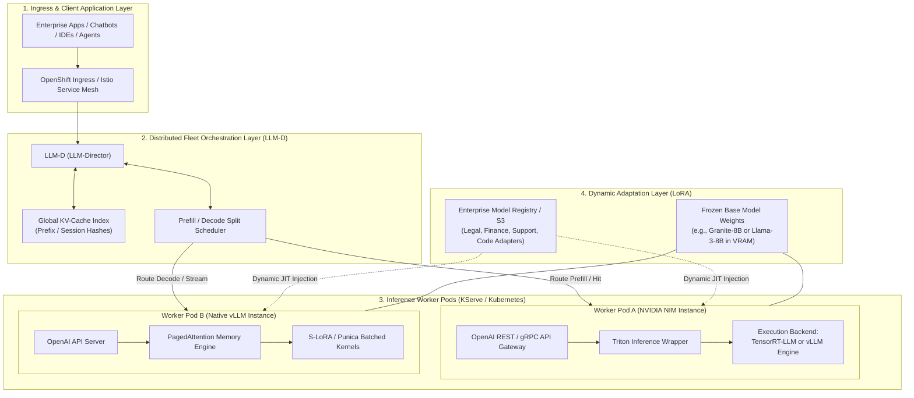
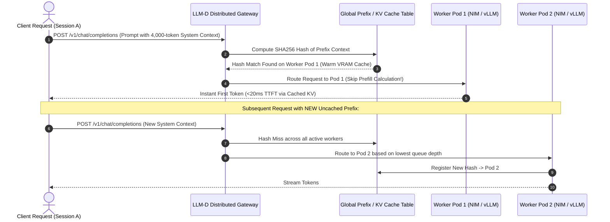
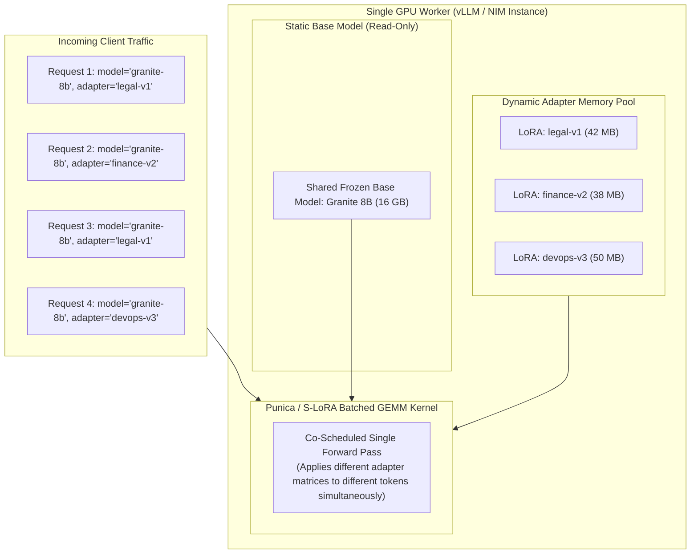
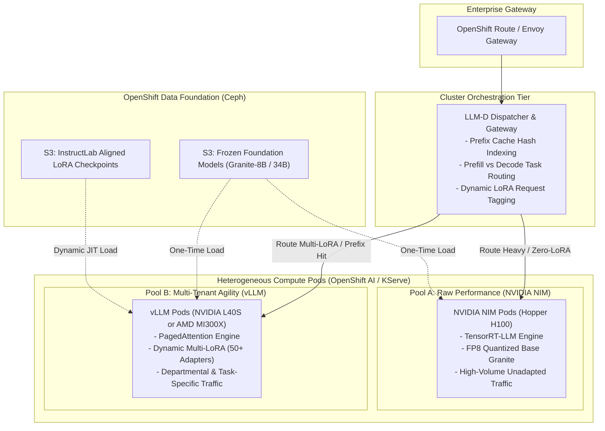
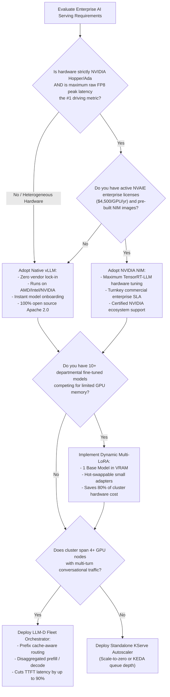

# NVIDIA NIM, vLLM, LLM-D & Dynamic LoRA Adapters: Architectural Relationship & Deep Dive

> **Focus Domain**: Inference Microservices, Engine Internals, Distributed Fleet Routing, Multi-LoRA Serving  
> **Audience**: Enterprise Infrastructure Architects, MLOps Engineers, Principal Systems Engineers  
> **Target Platforms**: Red Hat OpenShift AI (RHOAI), NVIDIA AI Enterprise (NVAIE), Kubernetes  
> **Status**: Production Reference

---

## 1. Executive Summary & The Inference Stack Topology

Enterprise generative AI serving has evolved from monolithic model scripts into a disaggregated, multi-tier software architecture. To architect production systems effectively, engineers must distinguish between four distinct layers:

1. **The Container Packaging & Commercial Delivery Layer (NVIDIA NIM)**: Turnkey, enterprise-supported OCI microservice containers with standard APIs.
2. **The Single-Node Neural Network Execution Engine (vLLM vs. TensorRT-LLM)**: Low-level CUDA kernel execution, memory management (PagedAttention), continuous batching, and tensor operations.
3. **The Distributed Fleet Orchestrator (LLM-D)**: Kubernetes-level intelligent traffic routing, KV-cache-aware prefix dispatch, and disaggregated prefill/decode scheduling across dozens of nodes.
4. **The Multi-Tenant Personalization Layer (LoRA Adapters)**: Serving hundreds of specialized fine-tuned business capabilities over a single shared base model without multiplying GPU VRAM requirements.



---

## 2. NVIDIA NIM vs. vLLM: Symbiosis, Competition, and Internals

A common misconception is that **NVIDIA NIM** is an engine that directly competes with **vLLM** from the ground up. In reality, their relationship is both complementary and nested.

### 2.1 What NVIDIA NIM Actually Is
**NVIDIA NIM (NVIDIA Inference Microservice)** is an enterprise containerized distribution format packaged by NVIDIA as part of the **NVIDIA AI Enterprise (NVAIE)** suite:
- **Packaging**: Self-contained OCI container image containing standard OpenAI-compliant REST and gRPC endpoints.
- **Triton Wrapper**: Uses **Triton Inference Server** as the process supervisor and IPC bridge.
- **Dual Backend Engines**:
  - **TensorRT-LLM (Primary)**: Highly specialized, ahead-of-time (AOT) compiled C++/CUDA engine optimized exclusively for NVIDIA Tensor Cores (Hopper, Ada, Ampere).
  - **vLLM (Integrated Alternative)**: NVIDIA embeds vLLM inside NIM containers for models or deployment profiles requiring rapid onboarding, dynamic LoRA agility, or architectures not yet compiled into TensorRT-LLM engines.
- **Licensing**: Commercial proprietary wrapper requiring NVAIE subscription licenses ($4,500/GPU/year or enterprise licensing) for production usage.

### 2.2 What vLLM Actually Is
**vLLM** is an open-source, community-governed inference engine (Apache 2.0) originating from UC Berkeley’s LMSYS:
- **Core Innovation**: Invented **PagedAttention**, eliminating memory fragmentation and reducing KV-cache waste from ~70% down to <4%.
- **Hardware Neutrality**: Runs natively on NVIDIA GPUs, AMD Instinct GPUs (ROCm), Intel Gaudi / CPUs, and AWS Neuron / Inferentia.
- **Rapid Model Adoption**: Community adds support for new open-weights models (Granite 3.0, Llama 3, DeepSeek, Qwen) within hours of release.
- **Dynamic Multi-LoRA**: S-LoRA and Punica multi-tenant adapter execution built natively into the C++ forward pass.

```
┌─────────────────────────────────────────────────────────────────────────────┐
│                      NVIDIA NIM INTERNAL ARCHITECTURE                       │
│                                                                             │
│  [ OpenAI REST / gRPC Interface ] (Port 8000)                               │
│         │                                                                   │
│         ▼                                                                   │
│  [ Triton Inference Server Supervisor & Metrics (DCGM) ]                     │
│         │                                                                   │
│         ├──► [ TensorRT-LLM Backend ] ──► Maximum Hopper FP8 Peak Speed     │
│         │                                                                   │
│         └──► [ vLLM Engine Backend ] ───► Dynamic LoRA & Broad Open Weights │
└─────────────────────────────────────────────────────────────────────────────┘
```

### 2.3 Architectural Comparison Matrix

| Architectural Dimension | NVIDIA NIM (with TensorRT-LLM) | Native vLLM (Open Source) |
| :--- | :--- | :--- |
| **Governance & License** | Proprietary (NVIDIA AI Enterprise subscription). | 100% Open Source (Apache 2.0, community-governed). |
| **Silicon Portability** | Strictly NVIDIA GPUs (Hopper, Ada, Ampere). | Heterogeneous (NVIDIA, AMD MI300X, Intel Gaudi, CPUs). |
| **Underlying Engine** | TensorRT-LLM (or vLLM embedded backend). | Native vLLM core with custom CUDA/C++ kernels. |
| **Engine Compilation** | Ahead-of-Time (AOT) compiled engine models. | Just-in-Time (JIT) loading of standard SafeTensors/GGUF. |
| **Model Onboarding Speed** | Slow: Requires building TensorRT model plans. | Instant: Mount SafeTensors directory and start serving. |
| **Peak FP8 Matrix Throughput** | +5% to +20% on Hopper SXM5 Tensor Cores. | Near-parity (~90-95% of TRT-LLM on equivalent FP8 kernels). |
| **Dynamic Multi-LoRA** | Supported via Triton dynamic repo / NeMo. | Best-in-class native batched LoRA (Punica/S-LoRA). |
| **Air-Gapped Deployment** | Supported with local cache & NGC license key. | Turnkey: Zero telemetry, zero external authentication. |

---

## 3. LLM-D: The Fleet-Level Distributed Orchestrator

While vLLM and NIM optimize the execution of a single server (or tensor-parallel node), **LLM-D (LLM-Director)** operates at the cluster level across Kubernetes and OpenShift AI:



### 3.1 Key Responsibilities of LLM-D

1. **KV-Cache-Aware Routing (Prefix Caching & Session Affinity)**:
   - In conversational applications, multi-turn dialogues share 80-95% of preceding tokens (chat history and system prompts).
   - A traditional round-robin load balancer sends Turn 1 to Pod A and Turn 2 to Pod B. Pod B is forced to re-compute the entire 4,000-token prompt prefill from scratch, wasting compute and multiplying Time-to-First-Token (TTFT) by 10x.
   - LLM-D hashes prompt prefixes and routes requests to the specific worker pod (NIM or vLLM) that already holds those KV blocks in GPU VRAM, cutting TTFT by up to 90%.

2. **Disaggregated Prefill and Decode (Split-Phase Serving)**:
   - LLM inference consists of two fundamentally mismatched phases:
     - **Prefill (Compute-Bound)**: Processes incoming prompt tokens in parallel using dense Matrix-Matrix multiplications (GEMM). Saturates GPU compute cores.
     - **Decode (Memory-Bandwidth-Bound)**: Emits one token at a time sequentially using Matrix-Vector multiplications (GEMV). Squeezes memory bus bandwidth while GPU compute cores sit largely idle.
   - When prefill and decode are handled in the same batch on one GPU, incoming massive prompts cause active token streams to stall (jitter and high Time-Per-Output-Token / TPOT).
   - **LLM-D decouples these phases**:
     - Dedicated **Prefill Workers** compute the prompt and generate the KV cache.
     - High-speed RDMA / NVSwitch transfers the KV cache to **Decode Workers** that focus exclusively on token streaming.

```
┌─────────────────────────────────────────────────────────────────────────────┐
│                 DISAGGREGATED PREFILL & DECODE WITH LLM-D                   │
│                                                                             │
│  [ Incoming Request ] ──► [ LLM-D Gateway ]                                 │
│                                 │                                           │
│         ┌───────────────────────┴───────────────────────┐                   │
│         ▼                                               ▼                   │
│  [ Prefill Pool (H100/A100) ]                 [ Decode Pool (L40S) ]        │
│   - Compute-Bound GEMM                         - Memory-Bandwidth GEMV      │
│   - Generates KV Cache                         - Continuous Token Stream    │
│         │                                               ▲                   │
│         └────────── Transfer KV Cache via RDMA ─────────┘                   │
└─────────────────────────────────────────────────────────────────────────────┘
```

3. **Interoperability with NIM and vLLM**:
   - Because LLM-D sits at the HTTP/gRPC ingress layer, it is engine-agnostic.
   - It can orchestrate a fleet composed entirely of native vLLM pods, a fleet of NVIDIA NIM pods, or a hybrid fleet routing complex prompts to NIM (TRT-LLM) and dynamic multi-adapter prompts to vLLM.

---

## 4. The Multi-LoRA Serving Problem & Solution

### 4.1 The Enterprise Multi-Tenant Dilemma
In modern enterprises, a single foundational base model (e.g., IBM Granite-8B or Llama-3-8B) must serve dozens of distinct corporate functions:
- **Finance**: Fine-tuned on ledger reconciliation and balance sheet formats.
- **Legal**: Fine-tuned on contract clause extraction and regulatory disclosures.
- **SRE / DevOps**: Fine-tuned on Ansible playbooks and Kubernetes incident triage.
- **Customer Support**: Fine-tuned on corporate brand tone and product FAQs.

#### The Naive Failure Pattern (Dedicated Model per Tenant)
Deploying 50 distinct base models requires:
$$\text{Total VRAM} = 50 \text{ replicas} \times 16 \text{ GB (FP16)} = 800 \text{ GB VRAM}$$
This requires at least ten 80 GB GPUs ($300,000+ in hardware), with most GPUs idling at 5% utilization when their specific business department is offline.

#### The Multi-LoRA Solution
Low-Rank Adaptation (LoRA) freezes the base model weights ($W_0 \in \mathbb{R}^{d \times k}$) and decomposes weight updates into two low-rank matrices:
$$\Delta W = B \cdot A \quad \text{where } B \in \mathbb{R}^{d \times r}, \; A \in \mathbb{R}^{r \times k}, \; r \ll \min(d, k)$$
- Base model weights: **~16 GB** (shared in GPU VRAM once).
- Each LoRA adapter ($r=16$ or $r=32$): **only 20 MB to 100 MB**!
- 50 LoRA adapters require only **1 GB to 5 GB** of additional memory.



---

### 4.2 Dynamic LoRA Execution: vLLM vs. NVIDIA NIM

#### How vLLM Implements Multi-LoRA
vLLM incorporates the **Punica** and **S-LoRA** algorithms directly into its CUDA execution path:
1. **Heterogeneous Batched GEMM**:
   - In a single forward pass of batch size 16, Request 1 can use Adapter A, Request 2 can use Adapter B, and Request 3 can use the base model.
   - The custom CUDA kernel loads the base model activations once, then multiplies token activations by their specific small LoRA adapter matrices on-the-fly.
2. **LRU Adapter Cache in GPU Memory**:
   - Adapters are stored in host RAM or high-speed NVMe and dynamically loaded into a dedicated GPU VRAM buffer using Least-Recently-Used (LRU) eviction.
   - When a request specifies a new adapter, vLLM loads the adapter asynchronously without interrupting active base model token streaming.

```bash
# Launching native vLLM with multi-LoRA support
python3 -m vllm.entrypoints.openai.api_server \
  --model /mnt/models/granite-8b-base \
  --enable-lora \
  --max-loras 16 \
  --max-lora-rank 64 \
  --lora-modules \
    legal=/mnt/adapters/granite-legal-v1 \
    finance=/mnt/adapters/granite-finance-v2 \
    sre=/mnt/adapters/granite-sre-v3
```

#### How NVIDIA NIM Implements Multi-LoRA
NVIDIA NIM supports dynamic LoRA through **Triton Inference Server Dynamic Model Repository** and **TensorRT-LLM LoRA layers**:
1. **Pre-Registered Adapters**: Adapters can be baked into the NIM container or mounted from an OCI/S3 volume.
2. **Runtime LoRA Injection**:
   - NIM exposes endpoints to register LoRA checkpoints dynamically at runtime using the Triton C++ API.
   - TensorRT-LLM allocates dynamic pointer tables inside its attention blocks to swap adapter weights into tensor computations.
3. **NeMo Integration**: Seamlessly loads LoRA checkpoints produced by the NVIDIA NeMo framework.

---

## 5. Architectural Synthesis: The Unified Ecosystem

The following topology illustrates how NVIDIA NIM, vLLM, LLM-D, and LoRA converge in an enterprise OpenShift AI deployment:



---

## 6. Production Kubernetes & KServe Manifests

### 6.1 Deploying Native vLLM with Dynamic Multi-LoRA on RHOAI

```yaml
apiVersion: serving.kserve.io/v1beta1
kind: InferenceService
metadata:
  name: granite-multilora-service
  namespace: team-nlp
  annotations:
    serving.kserve.io/deploymentMode: RawDeployment
spec:
  predictor:
    model:
      modelFormat:
        name: vLLM
      runtime: vllm-runtime
      storageUri: "s3://model-registry/granite-8b-base/"
      resources:
        requests:
          cpu: "8"
          memory: 32Gi
          nvidia.com/gpu: "1"
        limits:
          cpu: "16"
          memory: 64Gi
          nvidia.com/gpu: "1"
      env:
        - name: VLLM_ALLOW_RUNTIME_LORA_UPDATING
          value: "true"
      args:
        - "--enable-lora"
        - "--max-loras=8"
        - "--max-lora-rank=32"
        - "--lora-modules"
        - "legal=s3://adapters/granite-legal-v1"
        - "finance=s3://adapters/granite-finance-v2"
```

### 6.2 Deploying NVIDIA NIM on OpenShift AI (KServe ServingRuntime)

```yaml
apiVersion: serving.kserve.io/v1alpha1
kind: ClusterServingRuntime
metadata:
  name: nvidia-nim-runtime
spec:
  supportedModelFormats:
    - name: nim
      version: "1"
      autoSelect: true
  containers:
    - name: kserve-container
      image: nvcr.io/nim/meta/llama3-8b-instruct:latest
      ports:
        - containerPort: 8000
          protocol: TCP
      env:
        - name: NGC_API_KEY
          valueFrom:
            secretKeyRef:
              name: nvidia-ngc-secret
              key: api-key
        - name: NIM_CACHE_PATH
          value: /opt/nim/.cache
      resources:
        limits:
          nvidia.com/gpu: "1"
          cpu: "16"
          memory: 64Gi
```

---

## 7. Architectural Decision Guide: When to Choose What



---
*Reference architecture documentation for `/workspace/projects/rh-ai`.*


---

## Related Knowledge & Architecture Links
- **Knowledge Hub**: [[spaces/rh-ai/notes/overview|Rh-Ai Knowledge Hub]]
- **Previous Module**: [[spaces/rh-ai/notes/11-executive-pitch-competition-and-swot-analysis|Executive Pitch & SWOT]]
- **Model Serving Guide**: [[spaces/rh-ai/notes/06-model-serving-kserve-and-vllm|KServe & vLLM Guide]]
- **Distributed Fleet Topology**: [[spaces/rh-ai/architecture/rhoai_system_topology|RHOAI System Topology]]
- **Architectural Decision**: [[spaces/rh-ai/decisions/adr_001_standardize_on_rhoai_and_kserve_vllm|ADR 001: Standardize on RHOAI & vLLM]]
