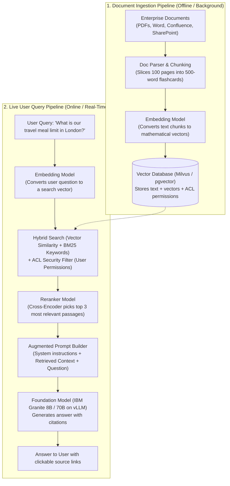
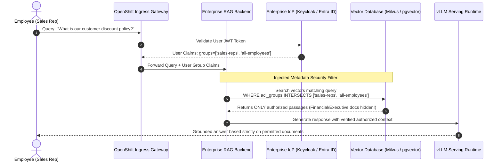

# Enterprise Retrieval-Augmented Generation (RAG): In Plain English

> **Focus Domain**: Retrieval-Augmented Generation (RAG), Semantic Vector Search, Document Ingestion, Enterprise Access Control (ACL), Hallucination Elimination  
> **Audience**: Enterprise Architects, Data Engineers, Software Engineering Leads, CISOs  
> **Target Platforms**: Red Hat OpenShift AI (RHOAI), Milvus / pgvector, IBM Granite Models  
> **Status**: Production Reference

---

## 1. Executive Summary: What RAG Actually Is in Plain English

When enterprise leaders ask: *"Can we train ChatGPT or an open-source LLM on all our internal company PDFs, SharePoint sites, and Jira tickets?"*, they almost always mean **Retrieval-Augmented Generation (RAG)**—not training.

### The "Closed-Book vs. Open-Book Exam" Mental Model

To understand why RAG dominates enterprise generative AI, consider how humans take exams:

```
┌─────────────────────────────────────────────────────────────────────────────┐
│                 THE CLOSED-BOOK VS. OPEN-BOOK MENTAL MODEL                  │
├─────────────────────────────────────────────────────────────────────────────┤
│  1. RAW FOUNDATION MODEL (The Closed-Book Exam):                            │
│     • The student sits in an empty exam room with no notes, relying only on │
│       what they memorized 6 months ago during cram school (pre-training).   │
│     • They know general English, world history, and general programming.    │
│     • If you ask: "What is our company's refund policy for Q3 enterprise    │
│       contracts?", they cannot look it up.                                  │
│     • Because they are eager to please, they make up a plausible-sounding   │
│       answer out of thin air (Hallucination!).                              │
├─────────────────────────────────────────────────────────────────────────────┤
│  2. RETRIEVAL-AUGMENTED GENERATION (The Open-Book Exam):                    │
│     • When you ask a question, a lightning-fast research assistant runs into│
│       your corporate filing cabinet, finds the EXACT 3 paragraphs that talk │
│       about Q3 refund policies, and paperclips them to your exam sheet.     │
│     • The student reads those 3 specific paragraphs, summarizes the answer  │
│       accurately, and cites the exact document title and page number!       │
│     • If the filing cabinet has no record of the policy, the student simply │
│       says: "I cannot find this in company records" instead of guessing.    │
└─────────────────────────────────────────────────────────────────────────────┘
```

---

## 2. RAG vs. Fine-Tuning: "Law School vs. Today's Court Docket"

A widespread misconception among software teams is deciding between **Fine-Tuning** and **RAG**. They solve two completely different problems:

```
┌─────────────────────────────────────────────────────────────────────────────┐
│                      RAG VS. FINE-TUNING IN PLAIN ENGLISH                   │
├──────────────────────────────────┬──────────────────────────────────────────┤
│ Fine-Tuning                      │ Retrieval-Augmented Generation (RAG)     │
│ ("Going to Law School")          │ ("Reading Today's Case Docket")          │
├──────────────────────────────────┼──────────────────────────────────────────┤
│ • Teaches the model a NEW SKILL, │ • Provides the model with NEW FACTS,     │
│   vocabulary, or behavioral tone │   real-time data, and private documents. │
│ • Example: Teaching a general    │ • Example: Giving the lawyer the 20-page │
│   model how to write valid       │   contract for Client XYZ signed this    │
│   Ansible playbooks or medical   │   morning.                               │
│   diagnosis summaries.           │                                          │
│ • Updating facts is slow and     │ • Instant: Upload a new PDF to S3, and   │
│   expensive (requires GPU tuning)│   the AI knows it within 5 seconds!      │
│ • Cannot provide clickable links │ • Provides 100% exact citations, page    │
│   or page-number citations.      │   numbers, and audit trails.             │
└──────────────────────────────────┴──────────────────────────────────────────┘
```

> **The Architectural Rule of Thumb**:  
> * Use **Fine-Tuning** (via [InstructLab](file:///workspace/projects/rh-ai/03-instructlab-and-model-alignment.md)) when you want to change **how the model talks or thinks** (syntax, tone, domain taxonomy).  
> * Use **RAG** when you want to change **what the model knows** (company policies, live inventory, customer contracts, wiki docs).

---

## 3. How Enterprise RAG Works: Step-by-Step Architecture

An enterprise RAG system is not a single script; it is a pipeline composed of 5 distinct stages:



---

### Step 1: Chunking — "Slicing Encyclopedias into Flashcards"
You cannot feed a 300-page employee handbook into a model all at once. 
* **Chunking** cuts the document into bite-sized passages (typically 300 to 500 words each).
* **Chunk Overlap**: Consecutive chunks overlap by 10% (e.g., 50 words) so a critical sentence split across two paragraphs is not cut in half and lost.

### Step 2: Embeddings — "GPS Coordinates for Meaning"
How does a computer know that *"laptop broken"* and *"MacBook won't turn on"* mean the exact same thing, even though they share zero identical words?
* An **Embedding Model** reads a text chunk and converts it into a list of numbers (a vector, e.g., 1,024 floating-point coordinates).
* Text with similar concepts are placed right next to each other on this mathematical map.
* In an enterprise deployment, embedding models (like `granite-embedding` or `bge-large`) run locally on OpenShift AI via [vLLM](file:///workspace/projects/rh-ai/06-model-serving-kserve-and-vllm.md), ensuring proprietary text is never sent to public embedding APIs.

```
                  "Smartphone battery dead"
                             •
                             │ (Close together in mathematical space)
                             •
                 "iPhone won't charge"

                                                        • "Quarterly Earnings Report"
                                                          (Far away on the map)
```

### Step 3: Hybrid Vector Search — "GPS Coordinates + Exact Keywords"
Traditional search looks for exact words (Ctrl+F / BM25). Vector search looks for semantic concepts.
* **Pure vector search alone can fail on technical terms**: If an engineer searches for error code `ERR_NET_402_AUTH`, a vector search might return general networking articles instead of that exact error code!
* **Enterprise Solution**: **Hybrid Search**. OpenShift AI pairs vector similarity search with keyword search, merging the results using Reciprocal Rank Fusion (RRF) to get the best of both worlds.

### Step 4: Reranking — "The Strict Editor Sifting the Pile"
Vector search is fast, but it can cast a wide net (returning 50 candidate paragraphs).
* A **Reranker Model** (like `bge-reranker-large`) acts like a strict magazine editor. It reads the user's specific question side-by-side with each of the 50 candidate paragraphs, grades their relevance from 1 to 100, and selects only the **top 3 or 4 highest-signal paragraphs**.
* This eliminates the "Lost-in-the-Middle" problem where LLMs get confused by irrelevant noise in long context windows.

### Step 5: Generation with Citations — "The Grounded Answer"
The serving engine constructs an augmented prompt and feeds it to **IBM Granite 8B** running on KServe:

```
[SYSTEM INSTRUCTION]
You are an enterprise AI assistant. Answer the question using ONLY the provided reference context below. 
If the answer is not directly supported by the context, respond: "I do not have sufficient information in company records."
Every statement must cite its source document.

[RETRIEVED CONTEXT]
Source: [Travel_Policy_2026.pdf | Page 14]
"For travel in the United Kingdom (London Metropolitan Area), the maximum daily meal allowance is £85.00."

Source: [Expense_Guidelines.docx | Page 3]
"Alcoholic beverages are non-reimbursable under standard business expense filings."

[USER QUESTION]
What is the meal budget if I am traveling to London?

[MODEL RESPONSE]
According to the 2026 Travel Policy (Page 14), the maximum daily meal allowance for the London Metropolitan Area is £85.00. Please note that alcohol is non-reimbursable (Expense Guidelines, Page 3).
```

---

## 4. The 4 Big Traps in Enterprise RAG (And How to Avoid Them)

Deploying a toy RAG proof-of-concept on a laptop takes an afternoon. Making RAG work across 10,000 corporate employees requires solving four enterprise engineering hurdles:

```
┌─────────────────────────────────────────────────────────────────────────────┐
│                     THE 4 BIG ENTERPRISE RAG PITFALLS                       │
├─────────────────────────────────────────────────────────────────────────────┤
│  1. THE PERMISSION DISASTER (The Intern Reads the CEO's Payroll):           │
│     • Trap: You index all company files into one global vector database.     │
│       An intern asks: "What are the executive bonuses this year?"           │
│       The AI helpfully retrieves the confidential Executive Compensation    │
│       Spreadsheet and summarizes it!                                        │
│     • Fix: Metadata Access Control Lists (ACLs). Every chunk stored in the  │
│       database is tagged with Active Directory / LDAP groups. When the user │
│       queries, the database filters chunks strictly to what that specific   │
│       user is permitted to read!                                            │
├─────────────────────────────────────────────────────────────────────────────┤
│  2. THE MESSY DOCUMENT TRAP (Garbage In, Garbage Out):                      │
│     • Trap: Standard PDF text extractors turn complex tables, two-column    │
│       layouts, and scanned invoices into scrambled word soup.               │
│     • Fix: Advanced Document Parsing (Docling / Unstructured). Tables are   │
│       converted into clean Markdown or HTML tables before embedding, so the │
│       model understands rows and columns.                                   │
├─────────────────────────────────────────────────────────────────────────────┤
│  3. THE "LOST IN THE MIDDLE" TRAP (Context Stuffing):                       │
│     • Trap: Teams think "Our model supports 128,000 tokens, so let's dump  │
│       30 whole documents into the prompt!"                                  │
│     • Result: LLMs suffer from attention degradation—they pay attention to  │
│       the beginning and end of long prompts, ignoring the critical data in  │
│       the middle. Latency spikes and cost explodes.                         │
│     • Fix: Strict chunk reranking. Retrieve 50, rerank to top 4.            │
├─────────────────────────────────────────────────────────────────────────────┤
│  4. THE STALE DATA PROBLEM (Zombie Policies):                               │
│     • Trap: HR updates the Health Benefits PDF, but the old 2024 version    │
│       remains in the vector database. The AI gives conflicting advice.      │
│     • Fix: Automated MLOps Sync Pipelines. OpenShift Data Science Pipelines │
│       listen to SharePoint/Git webhooks, automatically re-chunking and      │
│       invalidating deleted documents.                                       │
└─────────────────────────────────────────────────────────────────────────────┘
```

---

## 5. Security & Access Control: Document-Level Security (DLS)

The #1 objection from enterprise CISOs regarding RAG is **data access governance**.

In OpenShift AI, RAG enforces **Document-Level Security (DLS)** using vector metadata filtering:



---

## 6. Evaluating Enterprise RAG: The "RAG Triad"

How do you know if your enterprise RAG system is actually working, or if it is hallucinating? 

Red Hat OpenShift AI uses **TrustyAI** to measure the **RAG Triad**:

```
                              [ User Query ]
                                ╱        ╲
            Retrieval Quality ╱            ╲ Generation Quality
                            ╱                ╲
                 [ Retrieved Context ] ─────── [ Generated Answer ]
                                 Groundedness
```

1. **Context Relevance (Retrieval Quality)**: Did the vector search find passages that actually answer the user's question, or did it pull back irrelevant corporate boilerplate?
2. **Groundedness / Faithfulness (Hallucination Detector)**: Is every claim in the generated answer directly supported by the retrieved context? If the answer contains a claim not found in the source text, it is flagged as an ungrounded hallucination.
3. **Answer Relevance**: Did the model actually answer what the user asked, or did it evade the question?

---

## 7. Real-World Walkthrough: Enterprise Insurance Claims Assistant

To see how all pieces operate in production, examine this real insurance adjuster pipeline:

```
┌─────────────────────────────────────────────────────────────────────────────┐
│ REAL-WORLD SCENARIO: Hurricane Wind Damage Claim Processing                 │
├─────────────────────────────────────────────────────────────────────────────┤
│ 1. 10:00 - Adjuster Submission:                                             │
│    Insurance adjuster uploads Claim #9842 (Roof damage from storm in Miami)  │
│    and types: "Is commercial roof tile replacement covered under Policy     │
│    #FL-8821 with a $5,000 deductible?"                                      │
│                                                                             │
│ 2. 10:00:00.020 - Identity & Permission Check:                              │
│    System verifies adjuster credentials via Keycloak: User has permission   │
│    to view Florida Commercial Policies.                                     │
│                                                                             │
│ 3. 10:00:00.060 - Hybrid Retrieval & Reranking:                             │
│    • Embedding model runs query: `granite-embedding-107m` generates vector. │
│    • Milvus searches 450,000 policy clauses in 12 milliseconds.             │
│    • Cross-encoder reranker evaluates top 30 matches and isolates 2 chunks: │
│      - Chunk A: Policy #FL-8821 Rider 4 (Windstorm & Hail Endorsement).     │
│      - Chunk B: Section 12.2 (Commercial Roof Tile Deprecation Schedule).   │
│                                                                             │
│ 4. 10:00:00.150 - Inference & Generation on OpenShift AI:                   │
│    KServe executes IBM Granite 8B on an NVIDIA L40S GPU.                    │
│    The model streams the response in 1.2 seconds:                           │
│    "Yes. Under Policy #FL-8821, Rider 4 (Windstorm Endorsement), commercial │
│     tile roof replacement is covered subject to the named hurricane         │
│     deductible. However, Section 12.2 specifies that roofs over 15 years old│
│     are reimbursed at Actual Cash Value (ACV) rather than Replacement Cost."│
│                                                                             │
│ 5. 10:00:01.500 - Audit & Verification:                                     │
│    Adjuster sees clickable links to Page 18 and Page 34 of the contract.    │
│    TrustyAI records a Faithfulness score of 0.99 in Prometheus.             │
└─────────────────────────────────────────────────────────────────────────────┘
```

---

## 8. OpenShift AI Reference Architecture for RAG

In a production Red Hat OpenShift AI environment, RAG components are deployed as containerized microservices managed by OpenShift operators:

```yaml
apiVersion: serving.kserve.io/v1beta1
kind: InferenceService
metadata:
  name: granite-rag-generator
  namespace: insurance-rag
  annotations:
    serving.kserve.io/deploymentMode: RawDeployment
spec:
  predictor:
    model:
      modelFormat:
        name: vLLM
      runtime: vllm-runtime
      storageUri: "s3://models/ibm-granite/granite-3.0-8b-instruct/"
      resources:
        requests:
          cpu: "8"
          memory: 32Gi
          nvidia.com/gpu: "1"     # 1x NVIDIA L40S (48GB)
        limits:
          cpu: "16"
          memory: 64Gi
          nvidia.com/gpu: "1"
      args:
        - "--gpu-memory-utilization=0.90"
        - "--max-model-len=16384"  # Deep context to handle multiple retrieved chunks
```

---

## Related Knowledge & Architecture Links
- **Knowledge Hub**: [[spaces/rh-ai/notes/overview|Rh-Ai Knowledge Hub]]
- **Foundation Models**: [[spaces/rh-ai/notes/07-ibm-granite-models-and-open-foundation|IBM Granite Models & Open Foundation Architecture]]
- **Model Serving (vLLM)**: [[spaces/rh-ai/notes/06-model-serving-kserve-and-vllm|High-Performance Model Serving (KServe & vLLM)]]
- **Model Alignment (InstructLab)**: [[spaces/rh-ai/notes/03-instructlab-and-model-alignment|InstructLab & Model Alignment]]
- **Governance & Safety**: [[spaces/rh-ai/notes/09-governance-trustyai-and-mlops-pipelines|Governance, Safety, TrustyAI & MLOps Pipelines]]
- **Security & Threat Defense**: [[spaces/rh-ai/notes/13-enterprise-ai-security-and-governance|Enterprise AI Security & Governance]]

---
*Reference architecture documentation for `/workspace/projects/rh-ai`.*
