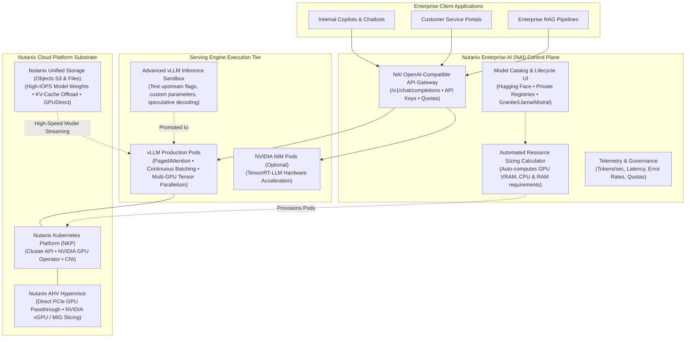
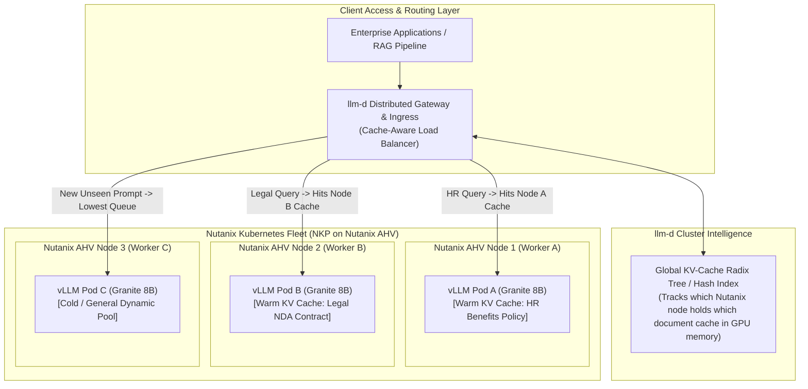

# Nutanix Enterprise AI (NAI), NKP, vLLM & LLM-D: Architecture & Integration Guide

> **Focus Domain**: Nutanix Enterprise AI (NAI), Nutanix Kubernetes Platform (NKP), vLLM Inference Runtime, `llm-d` Distributed Routing, Red Hat & Nutanix Hybrid Synergy  
> **Audience**: Enterprise Infrastructure Architects, Cloud Engineers, Systems Architects, MLOps Specialists  
> **Target Platforms**: Nutanix Cloud Platform (AHV/AOS/Objects), Nutanix Kubernetes Platform (NKP), Red Hat OpenShift AI (RHOAI)  
> **Status**: Production Reference

---

## 1. Executive Summary: The Nutanix AI Stack in Plain English

Enterprises with significant investments in **Nutanix Cloud Platform (HCI)** frequently ask how Nutanix's native AI offerings—**Nutanix Enterprise AI (NAI)** and **Nutanix Kubernetes Platform (NKP)**—work with high-performance inference runtimes like **vLLM** and distributed orchestrators like **`llm-d`**.

Furthermore, because **Red Hat and Nutanix share a strategic engineering partnership**, architects must understand how Nutanix Enterprise AI services these modern AI engines today, and how that compares to running Red Hat OpenShift AI on Nutanix infrastructure.

### The Plain-English Mental Model: The Car, The Engine, and The Air Traffic Controller

To understand how Nutanix runs AI today, think of an enterprise AI platform like an airport fleet:

```
┌─────────────────────────────────────────────────────────────────────────────┐
│                 THE NUTANIX, vLLM & LLM-D TOPOLOGY IN PLAIN ENGLISH          │
├─────────────────────────────────────────────────────────────────────────────┤
│  1. vLLM = "The High-Performance V8 Engine"                                │
│     • The raw open-source engine that actually calculates words and tokens. │
│     • Solves the biggest problem in AI: GPU memory waste (PagedAttention)   │
│       and traffic jams (Continuous Batching).                               │
│     • Both Nutanix (NAI) and Red Hat (RHOAI) chose vLLM as their core.      │
├─────────────────────────────────────────────────────────────────────────────┤
│  2. NUTANIX ENTERPRISE AI (NAI) = "The Turnkey Factory Car"                 │
│     • Nutanix's software appliance that puts a dashboard, steering wheel,   │
│       and ignition key onto the vLLM engine.                                │
│     • Gives developers an OpenAI-compatible URL, manages security keys,     │
│       tracks departmental token usage, and automatically configures GPUs.   │
├─────────────────────────────────────────────────────────────────────────────┤
│  3. llm-d = "The Multi-Node Fleet Air Traffic Controller"                   │
│     • An open-source distributed inference framework (co-founded by         │
│       Red Hat, IBM, Google, NVIDIA, and Nutanix; "d" stands for Distributed)│
│     • When you have 4, 8, or 16 Nutanix nodes running vLLM, llm-d directs   │
│       traffic so prompts go to the exact server that already has the text   │
│       loaded in GPU memory (Prefix Caching), preventing wasted compute.     │
├─────────────────────────────────────────────────────────────────────────────┤
│  4. NUTANIX CLUSTER (AHV + AOS + NKP) = "The High-Speed Highway & Garage"   │
│     • Nutanix AHV provides direct GPU virtualization (vGPU / Passthrough).  │
│     • Nutanix AOS & Objects (S3) store model weights with rapid NVMe speed. │
│     • Nutanix Kubernetes Platform (NKP) automatically manages container pods.│
└─────────────────────────────────────────────────────────────────────────────┘
```

---

## 2. What Is Nutanix Enterprise AI (NAI)?

**Nutanix Enterprise AI (NAI)** (the evolution of Nutanix *GPT-in-a-Box 2.0*) is a cloud-native software application designed to deploy, run, manage, and scale Generative AI inference microservices across hybrid cloud infrastructure.

NAI runs on top of Kubernetes—primarily **Nutanix Kubernetes Platform (NKP)** on Nutanix AHV, but also on Red Hat OpenShift or hyperscaler managed Kubernetes (AWS EKS, Azure AKS).



### The Core Capabilities of Nutanix Enterprise AI:
1. **Automated Resource Sizing Calculator**: When an administrator selects a model (e.g., IBM Granite 8B, Llama 3.1 70B, Mistral Small), NAI automatically calculates the required GPU count, VRAM capacity, CPU cores, and system memory. This eliminates guesswork and prevents out-of-memory (OOM) deployment failures.
2. **OpenAI-Compatible Gateway**: Enterprise applications, LangChain workflows, and RAG pipelines interact with NAI using standard OpenAI REST endpoints (`/v1/chat/completions`, `/v1/embeddings`). Switching an internal chatbot from public OpenAI to private Nutanix-hosted models requires changing only the `base_url` and `api_key`.
3. **Multi-Tenant Security & API Key Governance**: Central IT can provision distinct API keys with strict token quotas and rate limits for different business units (e.g., Legal, HR, Engineering), ensuring fair resource sharing.
4. **Model Lifecycle Management**: Download, update, rollback, and scale open-weights models from public hubs (Hugging Face) or secure, air-gapped enterprise artifact registries.

---

## 3. How Nutanix Enterprise AI Services vLLM Today

**vLLM is the primary, native open-source inference engine embedded inside Nutanix Enterprise AI.** Rather than building a proprietary inference runtime from scratch, Nutanix standardized on vLLM to give enterprise customers state-of-the-art performance, community innovation, and open-weights portability.

Here is exactly how NAI operates, configures, and services vLLM:

### 3.1 The vLLM Execution Pipeline Under NAI
When an administrator clicks "Deploy Model" in the NAI dashboard and selects vLLM:
1. **Automated Pod Provisioning**: NAI instructs the underlying Kubernetes platform (NKP) to spin up container pods using hardened vLLM container images.
2. **GPU Passthrough & Slicing**: NAI requests GPU hardware directly through the Kubernetes device plugin. On Nutanix AHV, this translates either to:
   - **Direct PCIe Passthrough**: The vLLM pod takes dedicated ownership of physical GPUs (e.g., 2x NVIDIA L40S or 4x A100/H100) for maximum performance.
   - **NVIDIA vGPU / MIG (Multi-Instance GPU)**: For smaller models (e.g., Granite 8B or CodeLlama 7B), AHV splits a single physical GPU into isolated virtual hardware slices (e.g., a 20GB MIG slice), allowing multiple vLLM engines to share one physical card safely.
3. **PagedAttention Configuration**: NAI configures vLLM's memory manager to partition GPU VRAM into virtual blocks (similar to virtual memory paging in operating systems). This eliminates internal memory fragmentation and boosts concurrency by **2x to 4x** compared to standard Hugging Face Transformers.
4. **Dynamic Continuous Batching**: Instead of waiting for an entire batch of queries to complete before accepting new ones, vLLM continuously injects newly arriving enterprise queries into running GPU matrix operations at every token generation step.

### 3.2 The Advanced vLLM Inference Sandbox (NAI v2.6+)
In newer releases of Nutanix Enterprise AI (such as v2.6 and beyond), Nutanix introduced the **Advanced vLLM Inference Sandbox**:
* **Community Innovation on Your Schedule**: Enterprise IT no longer has to wait for platform upgrades to test the latest upstream vLLM capabilities.
* **Custom Parameter Tuning**: AI engineers can launch isolated sandbox pods to experiment with advanced vLLM flags:
  - `--max-model-len`: Expanding context windows (e.g., from 8K to 32K or 128K tokens).
  - `--gpu-memory-utilization`: Fine-tuning the VRAM reserve (e.g., setting to `0.92` to maximize KV-cache memory).
  - `--tensor-parallel-size`: Sharding models across 2, 4, or 8 GPUs.
  - `--enable-chunked-prefill`: Breaking massive RAG document prompts into manageable chunks so short chat queries are not blocked.
* **Speculative Decoding**: The sandbox enables testing speculative decoding, where a tiny "draft model" (e.g., Granite 1B) rapidly guesses tokens that a larger "verifier model" (e.g., Granite 20B) approves in parallel, achieving **1.5x to 2.5x faster response times** for code generation and document summarization.
* **Safe Promotion**: Once validated in the sandbox, engineers promote the exact configuration into production with zero downtime.

### 3.3 Nutanix Storage & Data Path for vLLM
AI model weights and KV-cache states demand massive storage throughput:
* **Nutanix Objects (S3)**: Foundation model weights (SafeTensors format) are stored in Nutanix Objects on-premises. When a vLLM pod scales up, it streams weights over internal 25/100 GbE connections at multi-gigabyte-per-second throughput, spinning up models in seconds rather than tens of minutes.
* **Nutanix Unified Storage (Files) & GPUDirect**: Nutanix supports GPUDirect Storage (GDS) paths to stream data directly between NVMe storage tiers and GPU memory, bypassing CPU and host RAM bottlenecks. This accelerates initial cold-start model loading and provides a high-speed offload tier for large KV caches.

---

## 4. How Nutanix Services `llm-d` Today (Distributed Inference)

While a single vLLM engine performs exceptionally well inside a single server, large enterprises inevitably scale horizontally across **multiple Nutanix worker nodes**.

When you run multiple vLLM instances across a cluster, standard Kubernetes networking creates massive inefficiencies. This is where **`llm-d`** comes in.

```
┌─────────────────────────────────────────────────────────────────────────────┐
│                       WHAT IS llm-d? (DISTRIBUTED INFERENCE)                │
├─────────────────────────────────────────────────────────────────────────────┤
│  • Full Name: Distributed Large Language Model Inference Framework          │
│  • Governance: CNCF (Cloud Native Computing Foundation) Sandbox Project     │
│  • Founding Contributors: Red Hat, IBM Research, Google Cloud, NVIDIA,      │
│    CoreWeave, AMD, Intel, Cisco, and NUTANIX.                               │
│  • Core Purpose: Turns a cluster of standalone vLLM inference pods into a   │
│    unified, intelligent, memory-aware distributed supercomputing fabric.    │
└─────────────────────────────────────────────────────────────────────────────┘
```

Nutanix actively collaborates in the `llm-d` open-source ecosystem. Inside Nutanix environments, `llm-d` operates as the distributed orchestration and routing tier in front of vLLM worker pools:



### The Three Core Problems `llm-d` Solves on Nutanix:

#### 1. Cache-Aware Request Routing (Global Prefix Caching)
* **The Problem**: In multi-turn chat conversations or enterprise RAG, users repeatedly submit prompts containing the same 4,000-word document or system instructions.
* **Without `llm-d` (Standard Round-Robin)**: Question 1 goes to Node A (which reads the 4,000 words and stores it in its GPU memory). Question 2 goes to Node B. Node B does not have it, so it spends 2.5 seconds re-reading and recalculating the entire 4,000 words from scratch. This wastes GPU compute and slows user experience.
* **With `llm-d` on Nutanix**: `llm-d` computes a cryptographic hash of the prompt's prefix. It checks its global index, sees that Nutanix Node A already has this document cached warm in its GPU VRAM, and routes Question 2 straight back to Node A.
* **The Result**: Time-to-First-Token (TTFT) drops from **2,500ms down to 15ms** (a **99% latency reduction**).

#### 2. Disaggregated Prefill and Decode (Split-Phase Serving)
Generating text with an LLM consists of two completely different computational workloads:
1. **Prefill (Reading)**: Compute-heavy. The GPU processes thousands of prompt tokens in parallel at maximum math throughput.
2. **Decode (Writing/Streaming)**: Memory-bandwidth heavy. The GPU generates words one token at a time, waiting on memory bandwidth.

When both happen on the same GPU, a new user submitting a large document causes existing users' streaming responses to stutter and freeze.

* **How `llm-d` Fixes This on Nutanix**:
  - `llm-d` splits the workload across dedicated Nutanix worker nodes.
  - **Nutanix Prefill Nodes** (e.g., equipped with NVIDIA H100/H200 compute cards) crunch the initial prompt and generate the KV-cache.
  - **Nutanix Decode Nodes** (e.g., equipped with NVIDIA L40S or L4 memory cards) stream the tokens smoothly back to users.
  - The intermediate KV cache is transferred across Nutanix's high-speed RoCEv2 / 100GbE internal network with microsecond latency.

#### 3. GPU Memory-Aware Load Balancing
Standard Kubernetes load balancers only know if a pod's CPU is busy or if an HTTP port is responding. They are blind to whether a GPU has 100% or 10% of its VRAM occupied. `llm-d` monitors real-time vLLM KV-cache memory pressure and queue depth, ensuring traffic is only routed to nodes with sufficient physical VRAM headroom.

---

## 5. End-to-End Walkthrough: An Enterprise Query Lifecycle

To visualize how all these components work together in production today, follow a single enterprise query from an employee's browser to the Nutanix cluster:

```
┌─────────────────────────────────────────────────────────────────────────────┐
│                 STEP-BY-STEP INFERENCE REQUEST LIFECYCLE                     │
├─────────────────────────────────────────────────────────────────────────────┤
│                                                                             │
│  [Employee Portal / RAG Bot]                                                │
│         │                                                                   │
│         ▼  1. POST /v1/chat/completions (Bearer Token + 3,500-token Prompt) │
│  [Nutanix Enterprise AI (NAI) API Gateway]                                  │
│         │  • Authenticates department API key (e.g., HR-Dept-Key-99).       │
│         │  • Checks rate limits and records token usage telemetry.          │
│         ▼                                                                   │
│  [llm-d Routing & Ingress Engine]                                           │
│         │  • Hashes the prompt prefix (3,500 tokens of company HR policy).  │
│         │  • Discovers Nutanix AHV Node 2 already holds this exact hash.    │
│         ▼                                                                   │
│  [Nutanix AHV Worker Node 2 (NKP Pod)]                                      │
│         │  • GPU Passthrough: NVIDIA L40S GPU.                              │
│         │  • vLLM Engine: Skips prefill calculation! Reuses warm            │
│         │    PagedAttention memory blocks.                                  │
│         │  • Continuous Batcher injects question into current execution slot│
│         ▼                                                                   │
│  [Token Generation & Streaming]                                             │
│         │  • vLLM streams tokens at 70 tokens/second.                       │
│         ▼                                                                   │
│  [Employee Portal Receives Answer in < 25 milliseconds TTFT]                │
│                                                                             │
└─────────────────────────────────────────────────────────────────────────────┘
```

---

## 6. Strategic Comparison: Nutanix NAI vs. Red Hat OpenShift AI on Nutanix

Because Red Hat and Nutanix are premier technology partners, enterprise architects frequently evaluate two architectural options:

### Option A: Nutanix Native Stack (NAI on NKP)
A pure Nutanix-native solution where the hypervisor (AHV), Kubernetes engine (NKP), and AI serving management (NAI) all come directly from Nutanix.

### Option B: Red Hat OpenShift AI (RHOAI) on Nutanix Cloud Platform
The joint-alliance architecture where Nutanix provides the resilient hardware, hypervisor (AHV), and distributed storage (AOS/Objects), while **Red Hat OpenShift** provides the enterprise Kubernetes platform and **OpenShift AI** manages the end-to-end AI lifecycle.

```
┌─────────────────────────────────────────────────────────────────────────────┐
│                 SIDE-BY-SIDE ARCHITECTURAL COMPARISON                       │
├──────────────────────────┬───────────────────────┬──────────────────────────┤
│ Architectural Dimension  │ Nutanix NAI on NKP    │ Red Hat OpenShift AI on  │
│                          │ (Native Nutanix Stack)│ Nutanix Cloud Platform   │
├──────────────────────────┼───────────────────────┼──────────────────────────┤
│ **Core Mission**         │ Turnkey Inference     │ Full Lifecycle AI: Data, │
│                          │ Serving Microservices │ Train, Align, Serve, Gov │
├──────────────────────────┼───────────────────────┼──────────────────────────┤
│ **Inference Engine**     │ vLLM (or NVIDIA NIM)  │ vLLM (via KServe)        │
├──────────────────────────┼───────────────────────┼──────────────────────────┤
│ **Distributed Routing**  │ llm-d (CNCF project)  │ llm-d (co-founded by RH) │
├──────────────────────────┼───────────────────────┼──────────────────────────┤
│ **Kubernetes Engine**    │ Nutanix NKP (Upstream)│ Red Hat OpenShift (OCP)  │
├──────────────────────────┼───────────────────────┼──────────────────────────┤
│ **Model Training**       │ External pipelines    │ Native Ray, Kueue,       │
│                          │ required              │ Kubeflow Training Op     │
├──────────────────────────┼───────────────────────┼──────────────────────────┤
│ **Model Alignment**      │ Manual / External     │ Native InstructLab (LAB) │
│                          │ fine-tuning           │ synthetic data alignment │
├──────────────────────────┼───────────────────────┼──────────────────────────┤
│ **Governance & Auditing**│ Token metrics & logs  │ TrustyAI (bias metrics,  │
│                          │                       │ LIME/SHAP explainability)│
├──────────────────────────┼───────────────────────┼──────────────────────────┤
│ **Model Supply Chain**   │ User-managed registry │ Sigstore / Cosign + OCP  │
│                          │                       │ admission policy guards  │
├──────────────────────────┼───────────────────────┼──────────────────────────┤
│ **Underlying Substrate** │ Nutanix AHV + AOS     │ Nutanix AHV (Certified)  │
│                          │ + Nutanix Objects     │ + Nutanix Objects / AOS  │
└──────────────────────────┴───────────────────────┴──────────────────────────┘
```

### The "Better Together" Alliance:
* **Red Hat OpenShift is the certified, premier enterprise Kubernetes partner for Nutanix Cloud Platform.**
* **Nutanix Cloud Platform is the premier hyperconverged infrastructure (HCI) partner for Red Hat OpenShift.**
* If your organization needs a **quick, dedicated inference endpoint** managed directly within Nutanix Prism, **NAI** delivers immediate value.
* If your organization has enterprise data science teams doing **distributed model fine-tuning (Ray), synthetic data generation (InstructLab), and regulatory AI bias audits (TrustyAI)**, running **Red Hat OpenShift AI on Nutanix AHV** provides the complete enterprise platform.

---

## 7. Summary Cheatsheet & Key Takeaways

```
┌─────────────────────────────────────────────────────────────────────────────┐
│                    SUMMARY CHEATSHEET: NAI, vLLM & LLM-D                     │
├─────────────────────────────────────────────────────────────────────────────┤
│  1. vLLM is the runtime engine.                                             │
│     NAI does not build a proprietary model engine; it standardizes on vLLM  │
│     for its PagedAttention and continuous batching efficiency.              │
│                                                                             │
│  2. NAI is the enterprise management wrapper.                               │
│     NAI adds an automated GPU sizing calculator, an OpenAI REST API         │
│     gateway, multi-tenant API key quotas, and an Advanced vLLM Sandbox.     │
│                                                                             │
│  3. llm-d is the multi-node air traffic controller.                         │
│     llm-d sits in front of multiple Nutanix vLLM nodes, hashing prompt      │
│     prefixes to route queries to warm GPU caches and splitting prefill from │
│     decode workloads.                                                       │
│                                                                             │
│  4. Nutanix AHV & Objects provide the hardware foundation.                  │
│     AHV provides direct PCIe GPU passthrough and NVIDIA vGPU slicing, while │
│     Nutanix Objects streams model weights directly into GPU memory with     │
│     GPUDirect Storage.                                                      │
└─────────────────────────────────────────────────────────────────────────────┘
```

---

## Related Knowledge & Architecture Links
- **Knowledge Hub**: [[spaces/rh-ai/notes/overview|Rh-Ai Knowledge Hub]]
- **Model Serving (vLLM)**: [[spaces/rh-ai/notes/06-model-serving-kserve-and-vllm|High-Performance Model Serving (KServe & vLLM)]]
- **Distributed Routing (llm-d)**: [[spaces/rh-ai/notes/12-nvidia-nim-vllm-llmd-and-lora-adapters|NVIDIA NIM, vLLM, LLM-D & Dynamic LoRA Adapters]]
- **Hardware Sizing**: [[spaces/rh-ai/notes/10-hardware-acceleration-and-cluster-sizing|Hardware Acceleration & Cluster Sizing Guide]]
- **Security & Governance**: [[spaces/rh-ai/notes/13-enterprise-ai-security-and-governance|Enterprise AI Security & Governance]]
- **RAG Architecture**: [[spaces/rh-ai/notes/14-enterprise-retrieval-augmented-generation-rag|Enterprise Retrieval-Augmented Generation (RAG)]]
- **Architectural Decision**: [[spaces/rh-ai/decisions/adr_001_standardize_on_rhoai_and_kserve_vllm|ADR 001: Standardize on RHOAI & vLLM]]

---
*Reference architecture documentation for `/workspace/projects/rh-ai`.*
