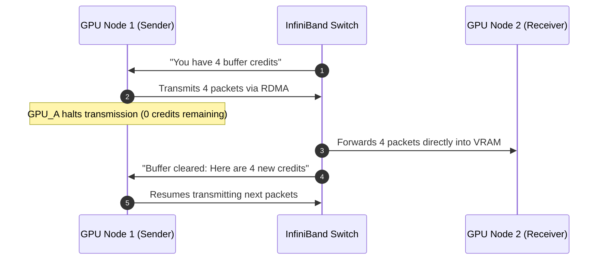
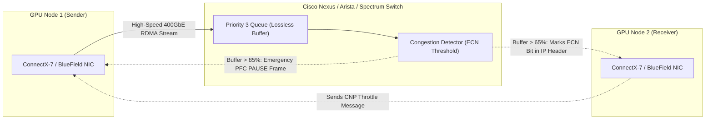

# InfiniBand vs. RoCEv2 for AI Infrastructure: In Plain English

> **Focus Domain**: AI Networking Fabrics, Remote Direct Memory Access (RDMA), InfiniBand, RoCEv2, Lossless Ethernet, Ultra Ethernet Consortium (UEC)  
> **Audience**: Enterprise Infrastructure Architects, Network Engineers, Systems Architects, Datacenter Leads  
> **Target Platforms**: Red Hat OpenShift AI (RHOAI), NVIDIA DGX / HGX, Cisco Nexus AI Fabric, Arista, Nutanix Cloud Platform  
> **Status**: Production Reference

---

## 1. Executive Summary: The AI Networking Problem in Plain English

When building an enterprise AI platform, most people focus on GPUs (like NVIDIA H100s or L40S) and storage. However, as soon as you connect two or more GPU servers together, **the network becomes the single biggest bottleneck in your entire system.**

Why? Because training models or serving massive LLMs requires GPUs to exchange gigabytes of mathematical matrices (tensors) every few milliseconds.

```
┌─────────────────────────────────────────────────────────────────────────────┐
│                 WHY REGULAR ETHERNET FAILS FOR AI                           │
├─────────────────────────────────────────────────────────────────────────────┤
│  REGULAR TCP/IP ETHERNET (The Postal Office):                               │
│  • Every time Server A wants to talk to Server B, the CPU wakes up, copies  │
│    the data into host RAM, cuts it into packets, adds TCP headers, and      │
│    sends it out. If a packet gets dropped, TCP pauses, asks for a resend,   │
│    and resumes.                                                             │
│  • For Netflix or web surfing, a 5ms delay or 0.1% packet loss is invisible.│
│                                                                             │
│  THE AI DISASTER (The "Tail Latency" Wall):                                 │
│  • In distributed AI training or sharded model inference (Pipeline/Tensor   │
│    Parallelism), 64 GPUs calculate in parallel. At the end of every layer,  │
│    ALL 64 GPUs must synchronize their math (AllReduce).                     │
│  • If a SINGLE packet drops on server #12, ALL 64 GPUs freeze at 0%         │
│    utilization waiting for that one packet to resend!                       │
│  • A 0.1% packet drop can slow down an entire AI cluster by 50% to 80%!     │
│                                                                             │
│  THE SOLUTION: RDMA (Remote Direct Memory Access)                           │
│  • Bypasses the CPU and OS kernel completely.                               │
│  • GPU #1's memory writes directly into GPU #2's memory across the network  │
│    in under 1 to 2 microseconds, with ZERO host CPU involvement.            │
│  • BUT: RDMA requires a 100% LOSSLESS network (zero dropped packets).       │
└─────────────────────────────────────────────────────────────────────────────┘
```

To deliver lossless RDMA, the industry has two competing champions:
1. **InfiniBand**: The **Dedicated Formula 1 Super-Track**. A proprietary, purpose-built supercomputing network designed from the ground up for zero packet loss.
2. **RoCEv2 (RDMA over Converged Ethernet)**: The **High-Speed Express Lane on Public Highways**. Takes standard enterprise Ethernet switches and configures them with special traffic signals so RDMA packets fly without dropping.

---

## 2. The Plain-English Mental Model

```
┌─────────────────────────────────────────────────────────────────────────────┐
│                   INFINIBAND vs. RoCEv2 MENTAL MODEL                        │
├─────────────────────────────────────────────────────────────────────────────┤
│  INFINIBAND = "The Private High-Speed Bullet Train"                         │
│  • Custom track gauge, custom stations, custom locomotives.                 │
│  • Credit-Based Flow Control: A train is literally NOT allowed to leave the │
│    station unless the receiving platform has guaranteed space for it.       │
│  • Zero packet loss by physical law. Ultra-low latency (~1 µs).             │
│  • The Catch: Only NVIDIA makes it. You must buy NVIDIA switches, NVIDIA    │
│    cables, and hire specialized HPC engineers. Your Cisco/Arista team       │
│    cannot manage it, and it cannot talk directly to your corporate LAN.     │
├─────────────────────────────────────────────────────────────────────────────┤
│  RoCEv2 = "The Smart Express Carpool Lane on Standard Highways"             │
│  • Runs on standard, familiar enterprise Ethernet cables and switches       │
│    (Cisco, Arista, Dell, Broadcom, Juniper, NVIDIA Spectrum).               │
│  • Uses Priority Flow Control (PFC) and Congestion Notification (ECN) to    │
│    tell senders to slow down before buffers overflow.                        │
│  • Multi-vendor, cost-effective, and managed by your existing NetOps team.  │
│  • The Catch: Requires expert switch tuning. If misconfigured, "PFC storms" │
│    or traffic deadlocks can stall the network.                              │
└─────────────────────────────────────────────────────────────────────────────┘
```

---

## 3. How They Work Under the Hood

### 3.1 InfiniBand: Hardware Credit-Based Flow Control
InfiniBand does not guess or estimate network congestion. It uses a strict **credit-based mechanism** hardwired into the silicon:
1. Switch Port B tells Switch Port A: *"I have buffer memory for exactly 8 data packets."*
2. Switch Port A sends 8 packets and **immediately stops transmitting**.
3. As Switch Port B drains packets into the receiving GPU, it grants new credits back to Port A.
4. **Result**: Buffers can never overflow. Packets are physically never dropped due to congestion.
5. **Central Subnet Manager (SM)**: A centralized controller calculates all network routing paths in advance, ensuring balanced multipathing without loops.



---

### 3.2 RoCEv2: Lossless Ethernet via PFC and ECN
Standard Ethernet was designed in the 1970s with a "best-effort" philosophy: if a switch buffer gets full, it simply throws extra packets in the trash (packet drop) and lets TCP figure it out later.

To make Ethernet lossless for RDMA, **RoCEv2** wraps RDMA packets inside standard UDP/IP frames and adds two crucial traffic-management protocols:

#### 1. Priority-based Flow Control (PFC - IEEE 802.1Qbb)
* PFC splits a single physical network cable into **8 virtual lanes (priorities)**.
* Standard web traffic, SSH, and logs run on Priority 0 (best-effort; drops allowed).
* AI GPU matrix traffic runs on **Priority 3 (Lossless)**.
* When a switch buffer on Priority 3 fills to 80%, the switch sends an emergency **PAUSE frame** back to the transmitting server, telling it: *"Stop sending Priority 3 packets for 50 microseconds!"*

#### 2. Explicit Congestion Notification (ECN - RFC 3168) & DCQCN
* While PFC acts as the emergency brakes, **ECN** acts as the early warning radar.
* When switch buffers begin building up, the switch marks a special bit in the IP header of the passing packet (Congestion Experienced).
* When the destination GPU sees this bit, it sends a Congestion Notification Packet (CNP) back to the sender, telling it to gently throttle its transmission speed before buffers fill up.
* This proactive speed throttling prevents the emergency PAUSE frames from ever triggering!



---

## 4. Comprehensive Architectural Comparison

| Architectural Dimension | InfiniBand (Quantum-2 / Quantum-X800) | RoCEv2 on Lossless Ethernet (400GbE / 800GbE) |
| :--- | :--- | :--- |
| **Underlying Protocol** | Native InfiniBand Link Layer | RDMA encapsulated in standard UDP/IP over Ethernet |
| **Flow Control Mechanism** | Hardware credit-based (guaranteed zero drop) | Priority-based Flow Control (PFC) + ECN (DCQCN) |
| **Switch-to-Switch Latency** | **~100 to 130 nanoseconds** | **~400 to 800 nanoseconds** |
| **End-to-End Hop Latency** | **~0.8 to 1.2 microseconds** | **~1.5 to 2.5 microseconds** |
| **Vendor Ecosystem** | **Proprietary (NVIDIA Mellanox)** | **Open Multi-Vendor** (Cisco, Arista, Broadcom, Dell, Juniper, NVIDIA Spectrum) |
| **Switch Silicon** | NVIDIA Quantum-2 / Quantum-X | Cisco Silicon One, Broadcom Tomahawk, NVIDIA Spectrum-4 |
| **Routing Protocol** | Centralized Subnet Manager (OpenSM) | Standard BGP / EVPN with ECMP (Equal-Cost Multi-Path) |
| **Operational Skillset** | Specialized HPC / Supercomputing engineers | Standard Enterprise Network Engineers (CCIE, Arista EOS) |
| **Datacenter Interoperability** | Isolated island; requires gateway bridge to talk to LAN/WAN | Native; plugs straight into existing datacenter core routers |
| **Hardware Cost & Lead Times** | **High premium**; single-source vendor; long lead times | **30% to 50% lower cost**; multi-vendor competitive bidding |
| **Risk of Misconfiguration** | Very low (works out of the box) | Moderate (poorly tuned PFC can cause PFC deadlocks/storms) |
| **OpenShift / K8s Support** | Native (Multus CNI + SR-IOV + NVIDIA GPU Operator) | Native (Multus CNI + SR-IOV + NVIDIA GPU Operator) |

---

## 5. Modern Evolutions: Why Ethernet Is Gaining Fast Ground

Historically, InfiniBand was the undisputed king of AI supercomputers. However, between 2024 and 2026, the industry has seen a massive shift toward **Lossless Ethernet (RoCEv2)** in the enterprise for three major reasons:

### 1. NVIDIA Spectrum-X (NVIDIA's Own Ethernet Solution)
Recognizing that enterprise customers refuse to deploy isolated InfiniBand islands, NVIDIA created **Spectrum-X**:
* Combines **NVIDIA Spectrum-4 Ethernet switches** (51.2 Tbps) with **BlueField-3 SuperNICs**.
* Uses dynamic packet spraying, hardware telemetry, and adaptive routing on top of RoCEv2.
* Achieves **95%+ of InfiniBand's effective throughput** while remaining 100% standard Ethernet.

### 2. Cisco Nexus & Silicon One AI Fabrics
Cisco introduced high-radix, single-chip switches (such as the Cisco Nexus 9300 / 9400 powered by Silicon One G200):
* Massive on-chip shared packet buffers absorb traffic bursts without triggering PFC PAUSE frames.
* Fully automated RoCEv2 profile deployment via Cisco Nexus Dashboard, eliminating manual buffer math and preventing deadlocks.

### 3. The Ultra Ethernet Consortium (UEC)
Founded under the Linux Foundation by AMD, Cisco, Arista, Broadcom, Intel, Meta, Microsoft, and Red Hat:
* Purpose: Designing a brand-new, modern open transport layer to replace old TCP and legacy RoCEv2.
* Features multi-path packet spraying, out-of-order packet delivery directly to GPU memory, and selective retransmission.
* Designed to surpass InfiniBand in hyperscale clusters of 100,000+ GPUs without proprietary lock-in.

---

## 6. How OpenShift AI Implements RoCEv2 & InfiniBand

Red Hat OpenShift AI handles both InfiniBand and RoCEv2 using the exact same cloud-native architecture: **Multus CNI + SR-IOV Operator**.

Every AI training pod is assigned **two networks**:
1. **Primary Network (`eth0`)**: Standard Kubernetes network (OVS-Kubernetes). Handles cluster DNS, API calls, pod health checks, and Prometheus metrics.
2. **Secondary Network (`net1` through `net8`)**: Dedicated high-speed RDMA network. Bypasses Kubernetes software switches and attaches the pod directly to the physical 400G PCIe network cards via SR-IOV.

```
┌─────────────────────────────────────────────────────────────────────────────┐
│                 OPENSHIFT DUAL-HOMED AI POD ARCHITECTURE                    │
├─────────────────────────────────────────────────────────────────────────────┤
│  [ OPENSHIFT AI GPU WORKER POD ]                                            │
│    ├── eth0 (Default CNI) ────► Management, Logging, Kubernetes API, KEDA   │
│    │                                                                        │
│    └── net1 (SR-IOV RDMA) ────► 400GbE RoCEv2 / InfiniBand                  │
│    └── net2 (SR-IOV RDMA) ────► 400GbE RoCEv2 / InfiniBand                  │
│    └── net3 (SR-IOV RDMA) ────► 400GbE RoCEv2 / InfiniBand  (High-Speed     │
│    └── net4 (SR-IOV RDMA) ────► 400GbE RoCEv2 / InfiniBand   NCCL Tensor    │
│    └── net5 (SR-IOV RDMA) ────► 400GbE RoCEv2 / InfiniBand   Fabric)        │
│    └── net6 (SR-IOV RDMA) ────► 400GbE RoCEv2 / InfiniBand                  │
│    └── net7 (SR-IOV RDMA) ────► 400GbE RoCEv2 / InfiniBand                  │
│    └── net8 (SR-IOV RDMA) ────► 400GbE RoCEv2 / InfiniBand                  │
└─────────────────────────────────────────────────────────────────────────────┘
```

### PyTorch / NCCL Environment Configuration:
Inside the training or vLLM container, the NVIDIA Collective Communications Library (NCCL) auto-detects either fabric with zero application code changes:

```bash
# Enable hardware RDMA
export NCCL_DEBUG=INFO
export NCCL_IB_DISABLE=0                # 0 = Use RDMA (works for both IB and RoCEv2)
export NCCL_NET_GDR_LEVEL=5             # Enable GPUDirect RDMA (Direct VRAM-to-NIC transfer)

# For RoCEv2: Specify GID index and interface names
export NCCL_IB_GID_INDEX=3              # RoCEv2 IPv4 GID table entry
export NCCL_IB_HCA=mlx5_1,mlx5_2,mlx5_3,mlx5_4,mlx5_5,mlx5_6,mlx5_7,mlx5_8
export NCCL_IB_TC=106                   # DSCP priority tag for Lossless QoS
```

---

## 7. The Strategic Decision Guide: Which Should You Choose?

```
┌─────────────────────────────────────────────────────────────────────────────┐
│                    STRATEGIC FABRIC DECISION TREE                           │
├─────────────────────────────────────────────────────────────────────────────┤
│  CHOOSE INFINIBAND IF:                                                      │
│  1. You are building a Tier-1 Frontier Training Cluster (training models     │
│     from scratch with 500 to 10,000+ GPUs like Llama 4 / GPT-5 scale).      │
│  2. You are purchasing an all-in-one NVIDIA DGX SuperPOD turnkey appliance  │
│     where NVIDIA requires InfiniBand for their performance warranty.        │
│  3. You have an existing High-Performance Computing (HPC) team with deep    │
│     experience managing InfiniBand Subnet Managers and optical fabrics.     │
│  4. Budget and single-vendor procurement are not primary constraints.       │
├─────────────────────────────────────────────────────────────────────────────┤
│  CHOOSE RoCEv2 (LOSSLESS ETHERNET) IF:                                      │
│  1. You are an ENTERPRISE running model inference, RAG, and fine-tuning     │
│     (InstructLab / LoRA) across 8 to 256 GPUs.                              │
│  2. Your networking team is standardized on Cisco Nexus, Arista, or Dell,   │
│     and you want to use your existing network tools and monitoring.         │
│  3. You demand a multi-vendor supply chain with competitive hardware        │
│     pricing and standard lead times.                                        │
│  4. You want a converged infrastructure where storage (Ceph/Nutanix S3) and │
│     compute share the same physical switching fabric.                       │
│  5. You plan to adopt the open Ultra Ethernet Consortium (UEC) standard.    │
└─────────────────────────────────────────────────────────────────────────────┘
```

---

## 8. Summary Cheatsheet

```
┌─────────────────────────────────────────────────────────────────────────────┐
│                       SUMMARY COMPARISON CHEATSHEET                         │
├──────────────────────────┬──────────────────────────┬───────────────────────┤
│ Feature                  │ InfiniBand               │ RoCEv2 (Ethernet)     │
├──────────────────────────┼──────────────────────────┼───────────────────────┤
│ Philosophy               │ Purpose-built super-track│ Upgraded highway      │
│ Zero-Loss Mechanism      │ Credit-based (Hardware)  │ PFC + ECN (QoS)       │
│ Average Latency          │ ~1.0 microsecond         │ ~1.8 microseconds     │
│ Multi-Vendor Hardware    │ No (NVIDIA exclusive)    │ Yes (Cisco, Arista...)│
│ Operational Complexity   │ High (Specialized skill) │ Medium (Standard Net) │
│ Enterprise Adoption Trend│ Specialized training     │ Dominant for Enterprise│
└──────────────────────────┴──────────────────────────┴───────────────────────┘
```

---

## Related Knowledge & Architecture Links
- **Knowledge Hub**: [[spaces/rh-ai/notes/overview|Rh-Ai Knowledge Hub]]
- **Distributed Training**: [[spaces/rh-ai/notes/05-distributed-training-and-orchestration|Distributed Training & Workload Orchestration]]
- **Hardware Sizing & Sharding**: [[spaces/rh-ai/notes/10-hardware-acceleration-and-cluster-sizing|Hardware Acceleration & Cluster Sizing Guide]]
- **Enterprise AI Security & Cisco**: [[spaces/rh-ai/notes/13-enterprise-ai-security-and-governance|Enterprise AI Security & Cisco Nexus Fabric]]
- **Nutanix Enterprise AI & Fabrics**: [[spaces/rh-ai/notes/15-nutanix-enterprise-ai-nkp-vllm-and-llmd|Nutanix Enterprise AI, NKP, vLLM & LLM-D]]
- **Architectural Topology**: [[spaces/rh-ai/architecture/hybrid_cloud_ai_fabric|Hybrid Cloud AI Fabric Topology]]

---
*Reference architecture documentation for `/workspace/projects/rh-ai`.*
