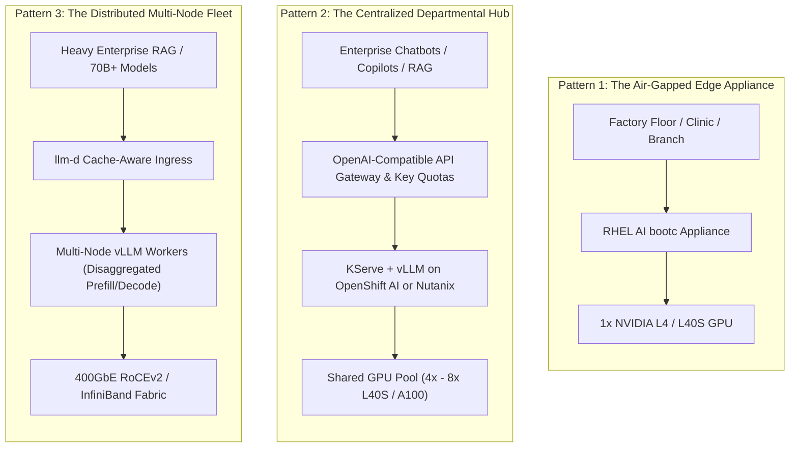
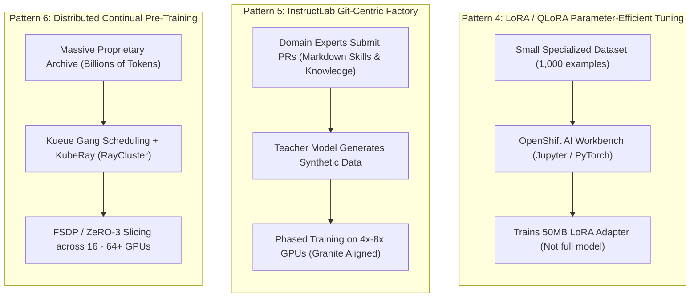

# Common Private Training & Inferencing Architectures: In Plain English

> **Focus Domain**: Private AI Architectures, On-Premises LLM Inference, Private Model Alignment, Distributed Training, Enterprise Reference Topologies  
> **Audience**: Enterprise Infrastructure Architects, Cloud Engineers, Systems Architects, MLOps Leads, CISOs  
> **Target Platforms**: Red Hat OpenShift AI (RHOAI), RHEL AI, Nutanix Cloud Platform, NVIDIA DGX/HGX, Lossless Ethernet (RoCEv2)  
> **Status**: Production Reference

---

## 1. Executive Summary: Why Private AI in the Enterprise?

When enterprise leaders evaluate Generative AI, they quickly realize that sending proprietary business data to public SaaS APIs (like OpenAI, Anthropic, or public cloud endpoints) introduces unacceptable risks:
1. **Intellectual Property & Privacy**: Trade secrets, proprietary source code, customer PII, and patient health records must never leave corporate firewalls.
2. **Regulatory & Sovereignty Mandates**: Compliance frameworks (HIPAA, GDPR, SEC Rule 17a-4, FedRAMP, PCI-DSS) strictly mandate where data is stored, processed, and audited.
3. **Runaway Operational Costs**: At enterprise scale (millions of tokens per day across thousands of employees), paying per-token SaaS fees becomes far more expensive than running private GPU clusters.
4. **Latency & Predictability**: Critical enterprise systems require deterministic, single-digit millisecond latency without being subject to public API rate limits or global outages.

However, building private AI does **not** mean every company needs to spend $50 million building a ChatGPT from scratch. 

In the real world, **99% of enterprises utilize standardized, proven architecture patterns** for private training and inferencing. This guide breaks down these architectures in plain English.

---

## 2. The Plain-English Mental Model: The AI Assembly Line

To understand private AI architectures, think of an enterprise manufacturing plant:

```
┌─────────────────────────────────────────────────────────────────────────────┐
│                 THE ENTERPRISE PRIVATE AI PIPELINE                          │
├─────────────────────────────────────────────────────────────────────────────┤
│  1. THE RAW FOUNDATION (The Steel & Aluminum):                              │
│     • Open-weights models (IBM Granite, Meta Llama 3, Mistral).             │
│     • Downloaded once into your private, secure datacenter model registry.   │
├─────────────────────────────────────────────────────────────────────────────┤
│  2. PRIVATE TRAINING & ALIGNMENT (The Custom Workshop):                     │
│     • Teaching the open model your company's private language, rules,       │
│       and trade secrets without starting from scratch.                      │
│     • Approaches: Prompt Engineering -> RAG -> LoRA Adapters -> InstructLab.│
├─────────────────────────────────────────────────────────────────────────────┤
│  3. MODEL REGISTRY & AUDIT (The Quality Inspection Gate):                   │
│     • Digitally signing weights (Sigstore/Cosign) to prevent tampering.     │
│     • Scanning for security vulnerabilities, bias, and toxic outputs.       │
├─────────────────────────────────────────────────────────────────────────────┤
│  4. PRIVATE INFERENCING (The Retail Store / Service Counter):               │
│     • Running the tuned models 24/7 on GPU servers to answer employee and   │
│       customer queries in milliseconds (vLLM, KServe, llm-d).               │
└─────────────────────────────────────────────────────────────────────────────┘
```

---

## 3. The Three Most Common Private Inferencing Architectures

Private inferencing is the runtime phase: taking a trained model and hosting it so applications can query it over internal REST APIs.



---

### Pattern 1: The Air-Gapped Edge / Branch Appliance (The "Self-Contained Island")

* **Best For**: Remote hospitals, retail stores, manufacturing plants, defense installations, and offshore rigs where internet access is intermittent, untrusted, or forbidden.
* **The Architecture**:
  - A single 1U or 2U physical server running **Red Hat Enterprise Linux AI (RHEL AI)** as an immutable, bootable container (`bootc`).
  - Equipped with **1x or 2x entry/mid-tier GPUs** (NVIDIA L4 24GB or NVIDIA L40S 48GB).
  - Hosts a quantized or compact foundation model (such as **IBM Granite 8B** or **Mistral 7B**).
  - Runs local **vLLM** directly on the host, exposing `localhost:8080/v1`.
  - Storage is entirely local NVMe storage; zero external network dependencies.
* **Why Enterprises Choose It**:
  - **Zero Attack Surface**: No external SaaS connections, no open inbound ports.
  - **Plug-and-Play**: Ships as an ISO or flash drive. If power drops, it boots back up immediately with zero Kubernetes operational complexity.

---

### Pattern 2: The Centralized Departmental Inference Hub (The "Shared Copilot")

* **Best For**: Standard corporate IT serving hundreds to thousands of employees with internal chatbots, developer code copilots, and document search.
* **The Architecture**:
  - A 3-to-6 node Kubernetes cluster (**Red Hat OpenShift AI** or **Nutanix Kubernetes Platform (NKP)** on Nutanix AHV).
  - A shared pool of **4x to 8x enterprise GPUs** (NVIDIA L40S 48GB or NVIDIA A100 80GB).
  - **KServe + vLLM**: Manages model pod lifecycles, continuous batching, and PagedAttention memory management.
  - **OpenAI-Compatible API Gateway**: Handles departmental authentication, rate limiting, and token quotas (e.g., Finance Key, Legal Key, HR Key).
  - **KEDA Autoscaler**: Monitors queue waiting depth (`vllm:num_requests_waiting`) to scale model replicas dynamically during business rush hours.
* **Why Enterprises Choose It**:
  - **Cost Consolidation**: Instead of every department buying their own GPUs, central IT provides a single "Internal OpenAI" service.
  - **Drop-in Compatibility**: Developers simply change `base_url="https://ai.corp.internal/v1"` in their LangChain or Python scripts.

---

### Pattern 3: The Distributed Multi-Node Fleet (The "Hyperscale Sovereign Fabric")

* **Best For**: Tier-1 banks, government agencies, and telecom providers hosting massive foundation models (e.g., Llama 3.1 70B, Granite 70B, or 405B) with high concurrency and deep RAG documents.
* **The Architecture**:
  - Multi-server GPU cluster (e.g., 4 to 16 servers, each with 8x NVIDIA H100/H200 or AMD Instinct MI300X GPUs).
  - **Interconnect**: Lossless **400GbE RoCEv2** (Cisco Nexus / NVIDIA Spectrum-X) or **InfiniBand** using Multus CNI and SR-IOV.
  - **`llm-d` Ingress Routing**: Intelligently hashes incoming prompt prefixes. If Server 3 already has a 10-page legal contract cached in its GPU VRAM, `llm-d` routes the query to Server 3 (sub-20ms Time-to-First-Token).
  - **Disaggregated Prefill & Decode**: Heavy prompt reading is handled by compute nodes (Prefill), while real-time token streaming is handled by memory-bandwidth nodes (Decode).
  - **High-Speed Model Storage**: Nutanix Objects (S3) or Ceph ODF streaming weights over NVMe at multi-gigabyte-per-second throughput via GPUDirect Storage.
* **Why Enterprises Choose It**:
  - Eliminates the latency spikes and GPU out-of-memory bottlenecks that occur when serving massive models to thousands of simultaneous users.

---

## 4. The Three Most Common Private Training & Alignment Architectures

Contrary to popular belief, enterprises almost never train frontier foundation models from scratch (which takes $20M+ and months of supercomputer time). Instead, enterprises focus on **private alignment, domain specialization, and continuous fine-tuning**.



---

### Pattern 4: Parameter-Efficient Fine-Tuning (PEFT / LoRA / QLoRA)

* **The Plain-English Concept**: Instead of modifying all 8 billion parameters in the model's brain, you keep the base model 100% frozen and train a **tiny specialist adapter (a 50MB "sticky note")** on top of it.
* **Hardware Footprint**: **1x to 4x GPUs** (NVIDIA L40S 48GB or A100 80GB).
* **Workflow**:
  1. A data science team creates an **OpenShift AI Workbench** (JupyterLab).
  2. They load an open foundation model (e.g., Granite 8B) in 4-bit precision (QLoRA).
  3. They train on 2,000 proprietary customer service chat logs.
  4. Training completes in **2 to 6 hours** on a single workstation or small GPU node.
  5. The resulting 50MB LoRA adapter is saved to the model registry and dynamically loaded onto vLLM at runtime.
* **Why Enterprises Choose It**:
  - Extremely cheap and fast.
  - One base model running in production can serve dozens of different departmental LoRA adapters simultaneously using multi-LoRA serving.

---

### Pattern 5: Git-Centric Synthetic Data Alignment (The InstructLab Factory)

* **The Plain-English Concept**: Standard fine-tuning requires thousands of expensive, manually labeled prompt-response pairs. **InstructLab (pioneered by Red Hat and IBM)** uses a "Teacher Model" to automatically generate thousands of synthetic training examples from simple business markdown documents submitted via Git.
* **Hardware Footprint**: **4x to 8x GPUs** (e.g., 1x 8-GPU node or 2x 4-GPU nodes with NVIDIA L40S, A100, or H100).
* **Workflow**:
  1. Business analysts and subject matter experts (lawyers, insurance underwriters, claims adjusters) write plain-English rules and company knowledge into markdown files.
  2. They submit a **Git Pull Request** to the corporate taxonomy repository.
  3. The CI/CD pipeline triggers InstructLab:
     - **Synthetic Data Generation (SDG)**: A large Teacher model (e.g., Granite 34B) reads the markdown and synthesizes thousands of high-quality Q&A test cases.
     - **Critic Filtering**: Low-quality or hallucinatory pairs are automatically rejected.
     - **Phased Training**: A compact Student model (Granite 8B) is trained on the synthetic dataset.
  4. The freshly aligned model is evaluated against baseline benchmarks and deployed to production.
* **Why Enterprises Choose It**:
  - **Democratizes AI**: Enables non-programmers to teach the AI company knowledge without writing Python or touching deep learning frameworks.
  - **Auditable**: Every single piece of knowledge taught to the AI is tracked with Git commit history and pull request approvals.

---

### Pattern 6: Multi-Node Distributed Continual Pre-Training (The Heavy Factory)

* **The Plain-English Concept**: Injecting massive, deep institutional knowledge (e.g., 50 years of proprietary geological sensor logs, 20 billion lines of internal proprietary code, or specialized medical chemistry) directly into the neural weights of a model.
* **Hardware Footprint**: **16 to 64+ GPUs** across multiple physical nodes connected via **400GbE RoCEv2 or InfiniBand**.
* **Workflow**:
  1. **Batch Gang Scheduling with Kueue**: Ensures that multi-node training jobs only start when *all* required GPU nodes and network interfaces are 100% available simultaneously (preventing deadlocks).
  2. **Orchestration with KubeRay**: Automatically provisions worker pods across the cluster.
  3. **Memory Slicing with PyTorch FSDP / DeepSpeed ZeRO-3**: The massive model weights, optimizer states, and gradients are sharded evenly across all GPUs in the cluster.
  4. **High-Speed Checkpointing**: Checkpoints (hundreds of gigabytes) are saved directly to Nutanix Objects or Ceph ODF storage over NVMe tiers.
* **Why Enterprises Choose It**:
  - When an organization has billions of tokens of proprietary data that cannot be captured by simple RAG or LoRA adapters alone.

---

## 5. The Complete Enterprise Reference Topology

Here is how private training, alignment, storage, and inferencing tie together into a unified, secure enterprise architecture on Red Hat OpenShift AI:

```
┌─────────────────────────────────────────────────────────────────────────────┐
│                    END-TO-END PRIVATE ENTERPRISE AI TOPOLOGY                │
├─────────────────────────────────────────────────────────────────────────────┤
│                                                                             │
│  [ Enterprise Data Sources ]                                                │
│    (Git Repos • Internal Wiki • Document Stores • Relational Databases)     │
│         │                                                                   │
│         ▼                                                                   │
│  [ Data Preparation & Alignment Tier ]                                      │
│    • InstructLab Taxonomy (Git PRs for business knowledge)                  │
│    • Synthetic Data Generation (SDG Teacher Model)                          │
│    • Ray / PyTorch Distributed Training (OpenShift AI + Kueue)              │
│         │                                                                   │
│         ▼                                                                   │
│  [ Enterprise Security & Governance Gate ]                                  │
│    • Sigstore / Cosign: Cryptographically signs validated model weights     │
│    • TrustyAI: Audits model for fairness (SPD/DIR) & explains outputs (SHAP)│
│    • Model Registry (Quay / OCI): Air-gapped immutable storage              │
│         │                                                                   │
│         ▼                                                                   │
│  [ High-Performance Inference Serving Tier ]                                │
│    • KServe / vLLM: PagedAttention, Continuous Batching, Chunked Prefill    │
│    • llm-d Ingress: Prefix Cache routing & split prefill/decode             │
│    • KEDA: Scales GPU replicas based on waiting request queue depth         │
│         │                                                                   │
│         ▼                                                                   │
│  [ OpenAI-Compatible API Gateway ]                                          │
│    • Authenticates departmental tokens, rate limits, and token metrics      │
│         │                                                                   │
│         ▼                                                                   │
│  [ Enterprise Consumer Applications ]                                       │
│    (Customer Chatbots • Developer IDE Copilots • Internal RAG Search)       │
│                                                                             │
└─────────────────────────────────────────────────────────────────────────────┘
```

---

## 6. Strategic Architecture Decision Guide

| Enterprise Business Requirement | Recommended Architecture Pattern | Recommended Hardware Sizing | Core Software Technologies |
| :--- | :--- | :--- | :--- |
| **Air-gapped edge, clinic, or branch** | **Pattern 1: Edge Appliance** | 1x NVIDIA L4 (24GB) or L40S (48GB) | RHEL AI (`bootc`) + vLLM |
| **Departmental chatbot / copilot (<1,000 users)** | **Pattern 2: Centralized Hub** | 2x to 4x NVIDIA L40S (48GB) | OpenShift AI / Nutanix + KServe + vLLM |
| **High-traffic production API (>5,000 users, 70B+)** | **Pattern 3: Distributed Fleet** | 2x to 4x 8-GPU Servers (H100/L40S) + 400G RoCEv2 | `llm-d` + vLLM + KEDA + Cisco Nexus / Spectrum-X |
| **Quick departmental task customization** | **Pattern 4: LoRA / QLoRA** | 1x to 2x NVIDIA L40S or A100 | OpenShift AI Workbenches + PyTorch PEFT |
| **Enterprise knowledge injection via Git** | **Pattern 5: InstructLab Factory** | 1x 8-GPU Node (L40S or A100) | InstructLab (`ilab`) + IBM Granite |
| **Massive institutional continual pre-training**| **Pattern 6: Distributed Training** | 2 to 8+ Multi-GPU Nodes + Lossless Fabric | KubeRay + Kueue + FSDP + InfiniBand / RoCEv2 |

---

## 7. Summary Cheatsheet & Key Takeaways

```
┌─────────────────────────────────────────────────────────────────────────────┐
│                       SUMMARY CHEATSHEET: PRIVATE AI                        │
├─────────────────────────────────────────────────────────────────────────────┤
│  1. Don't Train From Scratch:                                               │
│     Pre-training is for foundation model providers. Enterprises win by      │
│     aligning open-weights models (Granite, Llama 3) with private data.      │
│                                                                             │
│  2. Two Workhorses: InstructLab & vLLM:                                     │
│     • InstructLab is the factory that trains and aligns models via Git.     │
│     • vLLM is the engine that serves them with zero memory waste.           │
│                                                                             │
│  3. The Edge Needs Simplicity; The Core Needs Orchestration:                │
│     • Run RHEL AI bootable containers for single-server air-gapped sites.   │
│     • Run OpenShift AI or Nutanix NKP for multi-tenant datacenter hubs.     │
│                                                                             │
│  4. The Network Is As Critical As The GPU:                                  │
│     Multi-node training and 70B+ inference require lossless 400GbE RoCEv2   │
│     or InfiniBand with SR-IOV to prevent GPU idling.                        │
└─────────────────────────────────────────────────────────────────────────────┘
```

---

## Related Knowledge & Architecture Links
- **Knowledge Hub**: [[spaces/rh-ai/notes/overview|Rh-Ai Knowledge Hub]]
- **Edge Deployment**: [[spaces/rh-ai/notes/02-rhel-ai-architecture-and-deployment|RHEL AI Architecture & Deployment]]
- **Alignment Factory**: [[spaces/rh-ai/notes/03-instructlab-and-model-alignment|InstructLab & LAB Alignment Methodology]]
- **Platform Architecture**: [[spaces/rh-ai/notes/04-openshift-ai-rhoai-architecture|OpenShift AI Platform Architecture]]
- **Distributed Training**: [[spaces/rh-ai/notes/05-distributed-training-and-orchestration|Distributed Training & Workload Orchestration]]
- **Model Serving**: [[spaces/rh-ai/notes/06-model-serving-kserve-and-vllm|High-Performance Model Serving (KServe & vLLM)]]
- **Cluster Sizing Math**: [[spaces/rh-ai/notes/10-hardware-acceleration-and-cluster-sizing|Hardware Acceleration & Cluster Sizing Guide]]
- **AI Networking**: [[spaces/rh-ai/notes/16-infiniband-vs-rocev2-ai-networking|InfiniBand vs. RoCEv2 for AI Infrastructure]]
- **Nutanix Stack**: [[spaces/rh-ai/notes/15-nutanix-enterprise-ai-nkp-vllm-and-llmd|Nutanix Enterprise AI, NKP, vLLM & LLM-D]]

---
*Reference architecture documentation for `/workspace/projects/rh-ai`.*
