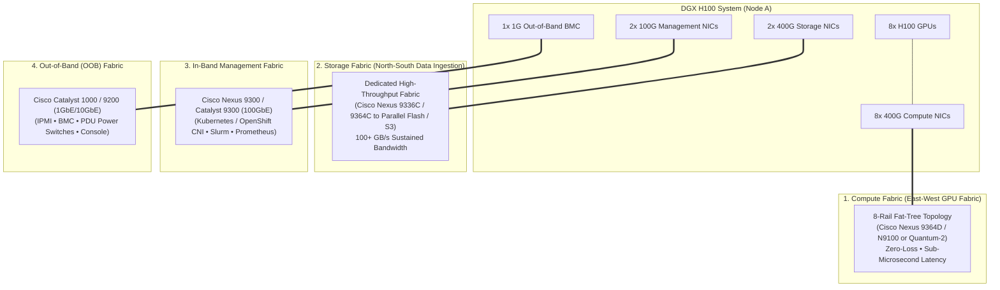
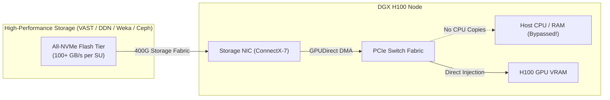
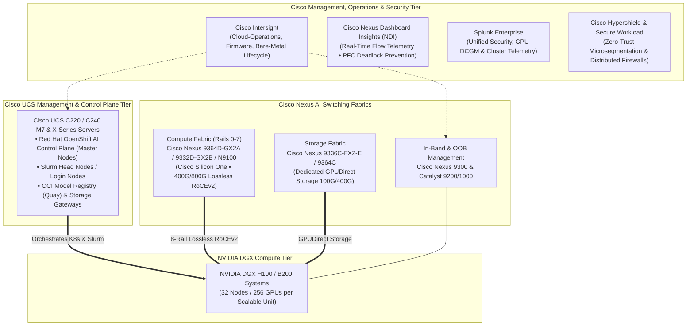

# NVIDIA DGX POD & SuperPOD: High-Level Architecture in Plain English

> **Focus Domain**: NVIDIA DGX Systems, DGX POD, DGX SuperPOD, Cisco Validated Designs (CVD), Cisco Nexus AI Fabric, Cisco UCS Compute, Rail-Optimized Networking, NVLink / NVSwitch  
> **Audience**: Enterprise Infrastructure Architects, Systems Engineers, Datacenter Facility Leads, MLOps Architects, Network Engineers  
> **Target Platforms**: NVIDIA DGX H100 / B200, Cisco Nexus 9000 / N9100, Cisco UCS M7 / X-Series, Cisco Intersight, Red Hat OpenShift AI (RHOAI)  
> **Status**: Production Reference

---

## 1. Executive Summary: What Is a DGX POD & SuperPOD?

When an enterprise decides to build an AI supercomputer, buying individual GPU servers and plugging them into standard datacenter racks will quickly fail. At multi-node scale, thermal limits melt standard racks, power circuits trip, and network bottlenecks stall expensive GPUs.

To solve this, NVIDIA and Cisco created standardized engineering blueprints:
* **DGX System**: The individual 8-GPU supercomputer server (e.g., DGX H100 or DGX B200).
* **Scalable Unit (SU)**: The standardized, modular building block—typically **32 DGX systems (256 GPUs)**—packaged with dedicated leaf switches, power distribution, and certified storage.
* **DGX SuperPOD**: A massive supercomputing cluster created by connecting **multiple Scalable Units** (e.g., 2 SUs = 64 nodes / 512 GPUs, 4 SUs = 128 nodes / 1,024 GPUs, up to 64+ SUs / 2,048+ nodes) using a non-blocking 2-tier Fat-Tree network.
* **Cisco AI POD / Cisco Validated Design (CVD)**: The enterprise-standard implementation where **Cisco Nexus 9000 switches** provide the lossless RoCEv2 AI fabric, **Cisco UCS servers** host the Kubernetes/Slurm control plane, and **Cisco Intersight + Nexus Dashboard** manage Day-2 operations.

```
┌─────────────────────────────────────────────────────────────────────────────┐
│                   DGX HIERARCHY IN PLAIN ENGLISH                            │
├─────────────────────────────────────────────────────────────────────────────┤
│  1. DGX SYSTEM (The 8-Cylinder Engine):                                     │
│     • 1 Physical Server holding 8x SXM GPUs tied together by NVSwitch.      │
│     • 640 GB of ultra-fast HBM3 memory running at 3.35 TB/s per GPU.        │
├─────────────────────────────────────────────────────────────────────────────┤
│  2. SCALABLE UNIT / SU (The Standard Train Car):                            │
│     • 32 DGX Systems (256 GPUs) + 8 Leaf Switches + Storage.                │
│     • The fundamental modular Lego brick of the datacenter.                 │
├─────────────────────────────────────────────────────────────────────────────┤
│  3. DGX SUPERPOD (The High-Speed Super-Train):                              │
│     • 2 to 32+ Scalable Units linked by Spine Switches.                     │
│     • Hundreds to thousands of GPUs operating as one unified computer.      │
├─────────────────────────────────────────────────────────────────────────────┤
│  4. CISCO AI POD / CVD (The Enterprise Airport Infrastructure):             │
│     • Cisco Nexus 9000 & N9100 switches powering the 4 network fabrics.     │
│     • Cisco UCS M7 servers running OpenShift AI control planes.             │
│     • Cisco Intersight, Nexus Dashboard, Hypershield & Splunk monitoring.   │
└─────────────────────────────────────────────────────────────────────────────┘
```

---

## 2. The Plain-English Mental Model: The Hypercar Fleet

```
┌─────────────────────────────────────────────────────────────────────────────┐
│                 THE DGX SUPERPOD METAPHOR                                   │
├─────────────────────────────────────────────────────────────────────────────┤
│  1. THE DGX CHASSIS = "The 8-Cylinder Hypercar"                             │
│     • Inside the car, all 8 cylinders (GPUs) are connected by a solid steel │
│       driveshaft (NVLink & NVSwitch). They talk to each other at 900 GB/s   │
│       with zero delay.                                                      │
├─────────────────────────────────────────────────────────────────────────────┤
│  2. THE 8-RAIL COMPUTE NETWORK = "The 8-Lane Formula 1 Highway"             │
│     • When cars need to coordinate, Cylinder #1 in Car A has its own        │
│       private express lane directly to Cylinder #1 in Car B, Car C, etc.   │
│     • Powered by Cisco Nexus 9300/9400 switches running lossless RoCEv2,    │
│       traffic across the 8 rails never crosses or causes a jam.             │
├─────────────────────────────────────────────────────────────────────────────┤
│  3. THE STORAGE NETWORK = "The Dedicated High-Pressure Fuel Line"           │
│     • Feeds gigabytes of training data straight into the engine (VRAM)      │
│       via GPUDirect Storage, completely bypassing the driver (CPU/RAM).     │
├─────────────────────────────────────────────────────────────────────────────┤
│  4. CISCO UCS & MANAGEMENT = "The Pit Wall & Crew Chiefs"                   │
│     • Cisco UCS head nodes run the OpenShift/Kubernetes controllers.        │
│     • Cisco Intersight and Nexus Dashboard monitor temperatures, detect     │
│       buffer congestion, and ensure cars run at peak RPM 24/7.              │
└─────────────────────────────────────────────────────────────────────────────┘
```

---

## 3. Inside the DGX Node: Anatomy of the Compute Block

Each DGX system (such as the DGX H100) is a dense 8U or 10U chassis engineered for raw mathematical performance:

```
┌─────────────────────────────────────────────────────────────────────────────┐
│                     DGX H100 NODE INTERNAL ARCHITECTURE                     │
├─────────────────────────────────────────────────────────────────────────────┤
│                                                                             │
│   [ GPU 0 ]   [ GPU 1 ]   [ GPU 2 ]   [ GPU 3 ]                             │
│       │           │           │           │     (8x NVIDIA H100 SXM5 GPUs)  │
│   [ GPU 4 ]   [ GPU 5 ]   [ GPU 6 ]   [ GPU 7 ]     (80GB HBM3 VRAM Each)   │
│       ▲           ▲           ▲           ▲                                 │
│       └─────┬─────┴─────┬─────┴─────┬─────┘                                 │
│             │           │           │                                       │
│    ═════════╪═══════════╪═══════════╪═══════════════════════════════════    │
│    │     4x NVIDIA NVSwitch 4 Chips (900 GB/s per GPU Bidirectional)    │   │
│    │         Aggregates to 7.2 TB/s All-to-All Full Bisection           │   │
│    ═════════╪═══════════╪═══════════╪═══════════════════════════════════    │
│             │           │           │                                       │
│    [ PCIe Gen 5 Switches ] ─────── [ 2x Intel Xeon Platinum CPUs / 2TB RAM] │
│             │                                                               │
│             ▼                                                               │
│    [ 8x ConnectX-7 400G OSFP Ports ] ──► Compute Fabric (Rails 0 to 7)     │
│    [ 2x ConnectX-7 400G OSFP Ports ] ──► Dedicated Storage Fabric (S3/NVMe) │
│    [ 2x 100GbE / 25GbE Ports ]       ──► In-Band Cluster Management & K8s   │
│    [ 1x 1GbE RJ45 Port ]             ──► Out-of-Band BMC / IPMI             │
│                                                                             │
└─────────────────────────────────────────────────────────────────────────────┘
```

### The Three Interconnect Tiers Inside the Box:
1. **Intra-GPU Mesh (NVLink 4 & NVSwitch)**:
   - Instead of sending data over the slow PCIe bus, the 8 GPUs communicate through 4 high-speed NVSwitch chips.
   - Provides **900 GB/s bidirectional bandwidth per GPU** (7.2 TB/s total).
   - To the software, all 8 GPUs appear as a single, massive **640 GB shared memory pool**.
2. **Compute Network Connectors (8x 400G NICs)**:
   - 8 individual 400 Gb/s network ports (NDR InfiniBand or 400GbE RoCEv2).
   - **Exactly one 400G NIC is paired to each GPU.** GPU 0 owns NIC 0, GPU 1 owns NIC 1, and so on.
3. **Storage & Host Management**:
   - 2x dual-port ConnectX-7 adapters dedicated exclusively to feeding datasets and saving checkpoints.
   - Dual enterprise CPUs with 2 Terabytes of system memory and local NVMe boot/scratch storage.

---

## 4. The Four Isolated Network Fabrics

In standard enterprise IT, all traffic (web, database, backup, management) often travels across shared switches. **In a DGX SuperPOD, doing this would destroy AI performance.**

A DGX SuperPOD physically separates all traffic into **four dedicated, air-gapped network fabrics**:



---

## 5. The Rail-Optimized Network: Why "Rails" Matter

The most ingenious design feature of the DGX SuperPOD is its **Rail-Optimized Compute Topology**.

### The Problem with Random Cabling:
In a 32-node cluster (256 GPUs), if you wire network ports randomly to switches, collective operations like `AllReduce` must travel through multiple switch hops and cross-connects, creating traffic jams and jitter.

### The Rail Solution:
NVIDIA and Cisco divide the compute network into **8 independent "Rails" (Rail 0 through Rail 7)**:
* **Rail 0**: Connects **GPU 0 from every single DGX server** to a dedicated set of leaf switches.
* **Rail 1**: Connects **GPU 1 from every single DGX server** to a separate set of leaf switches.
* ...up through **Rail 7**.

```
┌─────────────────────────────────────────────────────────────────────────────┐
│                 THE 8-RAIL NETWORK ARCHITECTURE                             │
├─────────────────────────────────────────────────────────────────────────────┤
│                                                                             │
│  [DGX Node 1]      [DGX Node 2]      [DGX Node 3] ...    [DGX Node 32]      │
│   ├── GPU 0 ────────┼── GPU 0 ────────┼── GPU 0 ───────────┼── GPU 0        │
│   │    └──► [ CISCO NEXUS RAIL 0 LEAF ] ◄─┴────────────────┘   (Rail 0)     │
│   │                                                                         │
│   ├── GPU 1 ────────┼── GPU 1 ────────┼── GPU 1 ───────────┼── GPU 1        │
│   │    └──► [ CISCO NEXUS RAIL 1 LEAF ] ◄─┴────────────────┘   (Rail 1)     │
│   │                                                                         │
│   └── GPU 7 ────────┼── GPU 7 ────────┼── GPU 7 ───────────┼── GPU 7        │
│        └──► [ CISCO NEXUS RAIL 7 LEAF ] ◄─┴────────────────┘   (Rail 7)     │
│                                                                             │
└─────────────────────────────────────────────────────────────────────────────┘
```

#### What This Achieves:
* When all GPUs perform an `AllReduce` operation, **GPU 0 only talks to GPU 0 on other servers**, and it does so over its own dedicated Rail 0 switch.
* Traffic on Rail 0 **never interferes** with traffic on Rail 1.
* In a 32-node Scalable Unit, all communication within a rail completes in **a single switch hop (<1 microsecond)**!

---

## 6. The Scalable Unit (SU) & SuperPOD Scaling

NVIDIA packages the SuperPOD in modular units called **Scalable Units (SUs)**:

```
┌─────────────────────────────────────────────────────────────────────────────┐
│                 SUPERPOD SCALABILITY TABLE (DGX H100)                       │
├──────────────┬──────────────┬────────────┬───────────────┬──────────────────┤
│ Architecture │ DGX Systems  │ Total GPUs │ Compute VRAM  │ Compute Fabric   │
├──────────────┼──────────────┼────────────┼───────────────┼──────────────────┤
│ **1 SU**     │ 32 Nodes     │ 256 GPUs   │ 20.4 TB HBM3  │ 8 Leaf Switches  │
│ **2 SUs**    │ 64 Nodes     │ 512 GPUs   │ 40.9 TB HBM3  │ Leaf + Spine     │
│ **4 SUs**    │ 128 Nodes    │ 1,024 GPUs │ 81.9 TB HBM3  │ 1:1 Non-Blocking │
│ **8 SUs**    │ 256 Nodes    │ 2,048 GPUs │ 163.8 TB HBM3 │ Full Bisection   │
└──────────────┴──────────────┴────────────┴───────────────┴──────────────────┘
```

---

## 7. Storage Architecture: GPUDirect Storage (GDS)

Training models requires ingesting massive datasets continuously. If the storage subsystem is slow, GPUs sit idle waiting for data.

### The DGX SuperPOD Way: GPUDirect Storage (GDS):
`Storage -> Dedicated Storage NIC -> PCIe Switch -> GPU VRAM`  
*(Direct DMA transfer; zero CPU involvement, zero RAM bounce buffers).*



---

## 8. Physical Facilities: Power, Cooling & Rack Layout

```
┌─────────────────────────────────────────────────────────────────────────────┐
│                    PHYSICAL INFRASTRUCTURE METRICS                          │
├─────────────────────────────────────────────────────────────────────────────┤
│  POWER DENSITY:                                                             │
│  • 1x DGX H100 chassis consumes up to 10.2 kW of power.                     │
│  • A standard compute rack holds 2 to 4 DGX chassis + leaf switches.        │
│  • Rack Power Density: 35 kW to 45 kW per rack (DGX H100)                   │
│    and up to 120 kW per rack for next-gen liquid-cooled DGX NVL72!          │
│                                                                             │
│  COOLING ARCHITECTURES:                                                     │
│  • Standard Datacenters (5 kW/rack) CANNOT support a DGX SuperPOD!          │
│  • Air-Cooled DGX PODs require:                                             │
│    - Containment aisles (Hot/Cold aisle separation).                        │
│    - Rear-Door Heat Exchangers (RDHx) with chilled water loops.             │
│  • Next-Gen B200 / NVL72 SuperPODs mandate Direct-to-Chip Liquid Cooling    │
│    (DLC) with facility water distribution units (CDUs).                     │
└─────────────────────────────────────────────────────────────────────────────┘
```

---

## 9. Cisco Components in a DGX Architecture: CVDs & AI PODs

While NVIDIA provides the GPU compute nodes, the majority of Fortune 500 enterprises standardize on **Cisco** for the networking, management head nodes, security, and operations tier.

Through the **Cisco & NVIDIA Strategic Partnership**, Cisco delivers **Cisco Validated Designs (CVDs)** and **Cisco AI PODs** that package the entire infrastructure surrounding the DGX nodes:



---

### 9.1 Cisco Nexus 9000 & N9100 AI Switching Fabrics

Cisco provides the physical switching silicon that connects the DGX nodes across the four network tiers:

```
┌─────────────────────────────────────────────────────────────────────────────┐
│                 CISCO NEXUS AI SWITCHING PORTFOLIO                          │
├───────────────────────┬─────────────────────────┬───────────────────────────┤
│ Fabric Role           │ Cisco Switch Models     │ Silicon & Key Features    │
├───────────────────────┼─────────────────────────┼───────────────────────────┤
│ **1. Compute Fabric** │ **Nexus 9364D-GX2A**    │ • **Cisco Silicon One**   │
│    (Rail-Optimized    │ (64x 400G / 16x 800G)   │   (G100 / G200 ASICs)     │
│     GPU-to-GPU)       │ **Nexus 9332D-GX2B**    │ • Deep shared packet      │
│                       │ (32x 400G / 8x 800G)    │   buffers absorb AllReduce│
│                       │ **Cisco N9100 Series**  │   traffic bursts.         │
│                       │ (Spectrum-X Silicon)    │ • Lossless RoCEv2 with    │
│                       │ **Nexus 9408 Modular**  │   hardware PFC and DCQCN. │
├───────────────────────┼─────────────────────────┼───────────────────────────┤
│ **2. Storage Fabric** │ **Nexus 9336C-FX2-E**   │ • Dedicated 100G/400G     │
│    (GPUDirect Storage │ **Nexus 9364C-GX**      │   storage switching.      │
│     to NVMe Flash)    │ (64x 100G)              │ • Zero contention with    │
│                       │                         │   GPU compute traffic.    │
├───────────────────────┼─────────────────────────┼───────────────────────────┤
│ **3. In-Band K8s**    │ **Nexus 93180YC-FX3**   │ • Standard 100GbE / 25GbE │
│    (API & Management) │ **Catalyst 9300**       │ • Pod CNI, ingress, logs  │
├───────────────────────┼─────────────────────────┼───────────────────────────┤
│ **4. Out-of-Band**    │ **Catalyst 1000 / 9200**│ • 1GbE RJ45 console, IPMI │
│    (BMC / Power)      │                         │ • Remote serial & power   │
└───────────────────────┴─────────────────────────┴───────────────────────────┘
```

#### Why Cisco Silicon One & N9100 for DGX Compute Fabrics?
1. **Deep Shared Packet Buffers**: In collective training operations (`AllReduce`), hundreds of GPUs burst traffic simultaneously. Standard commodity switches drop packets when shallow buffers overflow. Cisco Silicon One switches feature massive shared packet buffers that absorb these microbursts without dropping a single packet.
2. **The Cisco N9100 Series (Spectrum-X Inside)**: Cisco co-developed the N9100 switch with NVIDIA. It embeds NVIDIA’s **Spectrum-X Ethernet silicon** inside a Cisco chassis running enterprise **Cisco NX-OS** or **SONiC**, giving customers the ultimate blend of NVIDIA AI hardware performance and Cisco enterprise management.
3. **Automated Lossless RoCEv2**: Cisco Nexus switches auto-apply validated QoS profiles:
   - Sets Priority 3 as Lossless with Priority-based Flow Control (PFC).
   - Configures Explicit Congestion Notification (ECN) thresholds so GPUs throttle slightly before buffers fill, preventing PFC deadlocks.

---

### 9.2 Cisco UCS Servers: The Management & Control Plane Tier

In a DGX SuperPOD, expensive DGX GPU servers are **never** used to run Kubernetes master nodes, database controllers, or management dashboards. 

Instead, **Cisco UCS C-Series and X-Series servers** act as the dedicated cluster control plane:

* **Cisco UCS C220 M7 & C240 M7 Rack Servers**:
  - High-density dual-socket servers powered by 4th/5th Gen Intel Xeon Scalable processors.
  - Deployed in sets of 3 or 6 to host the **Red Hat OpenShift AI Control Plane (Master Nodes)**.
  - Act as **Slurm Login Nodes**, Slurm Controller Nodes, and **NVIDIA UFM (Unified Fabric Manager)** appliances.
* **Cisco UCS X-Series Modular System**:
  - Hybrid blade/modular chassis used in large-scale SuperPODs for centralized compute, storage nodes, and edge aggregation.
  - Houses the enterprise model registry (Quay / OCI), vector database head nodes, and CI/CD pipelines.

---

### 9.3 Operations & Automation: Cisco Intersight & Nexus Dashboard

Managing dozens of switches and servers requires centralized orchestration:

1. **Cisco Intersight (Cloud & On-Premises Operations)**:
   - Single-pane-of-glass management for all Cisco UCS servers and Nexus fabric switches.
   - Automates bare-metal OS deployment, firmware upgrades, hardware inventory, and proactive RMA support.
2. **Cisco Nexus Dashboard & Nexus Dashboard Insights (NDI)**:
   - **One-Click AI Fabric Automation**: Administrators select the "NVIDIA DGX SuperPOD" template in Nexus Dashboard, and it automatically pushes the exact PFC, ECN, MTU (9216 Jumbo Frames), and queue configurations across all leaf and spine switches.
   - **Real-Time Telemetry & Deadlock Detection**: NDI monitors switch buffer utilization, PFC pause durations, and tail latency in real time. If a misbehaving server causes a "PFC storm" (holding up traffic), Nexus Dashboard immediately isolates the offending port before it stalls the entire SuperPOD.

---

### 9.4 Security & Observability: Cisco Hypershield & Splunk

Enterprise AI supercomputers represent a company's highest-value intellectual property. Cisco integrates defense-in-depth directly into the DGX architecture:

1. **Cisco Hypershield & Secure Workload**:
   - Implements distributed zero-trust microsegmentation.
   - Enforces strict network guardrails: DGX compute pods are blocked from accessing external internet APIs, and management networks are strictly isolated from the high-speed data path.
2. **Splunk Enterprise & ITSI**:
   - Ingests streaming telemetry from Cisco Nexus switches (port throughput, buffer health), DGX baseboard management controllers (temperatures, power draw), NVIDIA DCGM (GPU health and throttle states), and OpenShift audit logs.
   - Correlates network microbursts with GPU training job failures, giving CISOs and SREs a unified operational dashboard.

---

## 10. Software Stack: Orchestrating a DGX POD with OpenShift AI

While NVIDIA provides the physical hardware, enterprise IT teams manage DGX clusters using modern container orchestration platforms like **Red Hat OpenShift AI (RHOAI)**:

```
┌─────────────────────────────────────────────────────────────────────────────┐
│                 RED HAT OPENSHIFT AI ON NVIDIA DGX POD                      │
├─────────────────────────────────────────────────────────────────────────────┤
│  [ Enterprise Data Scientists & AI Engineers ]                              │
│         │                                                                   │
│         ▼                                                                   │
│  [ Red Hat OpenShift AI (RHOAI) Control Plane on Cisco UCS M7 Nodes ]       │
│    • Kueue: Gang scheduler (ensures all 32 DGX nodes start together)        │
│    • KubeRay / CodeFlare: Manages distributed PyTorch / Megatron training   │
│    • KServe & vLLM: High-throughput inference serving                       │
│         │                                                                   │
│         ▼                                                                   │
│  [ Red Hat Enterprise Linux CoreOS (RHCOS) + Operators ]                    │
│    • NVIDIA GPU Operator: Automatically installs CUDA, Fabric Manager       │
│    • Multus CNI + SR-IOV: Attaches all 8 Compute Rails directly to pods     │
│         │                                                                   │
│         ▼                                                                   │
│  [ Cisco Nexus 9000 8-Rail RoCEv2 Fabric ]                                  │
│         │                                                                   │
│         ▼                                                                   │
│  [ NVIDIA DGX H100 Scalable Units (Hardware Substrate) ]                    │
└─────────────────────────────────────────────────────────────────────────────┘
```

1. **NVIDIA GPU Operator**: Deploys drivers, CUDA runtimes, and the NVIDIA Fabric Manager onto the DGX nodes automatically.
2. **Multus CNI + SR-IOV**: Injects all 8 physical 400G Compute NICs directly into the training container pods, enabling native GPUDirect RDMA across the Cisco Nexus fabric.
3. **Kueue Gang Scheduling**: Prevents deadlocks by guaranteeing that a 64-GPU distributed training job will only launch when all 64 GPUs and network interfaces across all nodes are free and ready.

---

## 11. Summary Cheatsheet & Key Takeaways

```
┌─────────────────────────────────────────────────────────────────────────────┐
│                    DGX POD ARCHITECTURE CHEATSHEET                          │
├─────────────────────────────────────────────────────────────────────────────┤
│  1. The Node (DGX System):                                                  │
│     8 GPUs interconnected by NVSwitch at 900 GB/s. Behaves as a single      │
│     640 GB shared-memory super-GPU.                                         │
│                                                                             │
│  2. The Building Block (Scalable Unit / SU):                                │
│     32 DGX Systems (256 GPUs). The standard repeatable Lego brick.          │
│                                                                             │
│  3. The Four Isolated Networks:                                             │
│     Compute (GPU-to-GPU), Storage (Data ingestion), In-Band Management      │
│     (Kubernetes), and Out-of-Band (BMC hardware control). Never mix them.  │
│                                                                             │
│  4. Cisco Nexus AI Fabric (Compute & Storage):                              │
│     Cisco Nexus 9364D (Silicon One) and Cisco N9100 (Spectrum-X) power the  │
│     8-rail compute network with lossless RoCEv2, PFC, and deep buffers.    │
│                                                                             │
│  5. Cisco UCS Management Tier:                                              │
│     Cisco UCS C220/C240 M7 servers host OpenShift AI control planes, Slurm  │
│     controllers, and UFM without wasting expensive DGX GPU servers.         │
│                                                                             │
│  6. Cisco Operations & Security:                                            │
│     Cisco Intersight manages hardware lifecycles, Nexus Dashboard automates │
│     AI fabric tuning, Hypershield secures workloads, and Splunk correlates │
│     network, GPU, and security telemetry.                                   │
└─────────────────────────────────────────────────────────────────────────────┘
```

---

## Related Knowledge & Architecture Links
- **Knowledge Hub**: [[spaces/rh-ai/notes/overview|Rh-Ai Knowledge Hub]]
- **Distributed Training**: [[spaces/rh-ai/notes/05-distributed-training-and-orchestration|Distributed Training & Workload Orchestration]]
- **Hardware Acceleration & Cluster Sizing**: [[spaces/rh-ai/notes/10-hardware-acceleration-and-cluster-sizing|Hardware Acceleration & Cluster Sizing Guide]]
- **AI Security & Cisco / Splunk**: [[spaces/rh-ai/notes/13-enterprise-ai-security-and-governance|Enterprise AI Security & Cisco Nexus Fabric]]
- **AI Networking Fabrics (InfiniBand vs RoCEv2)**: [[spaces/rh-ai/notes/16-infiniband-vs-rocev2-ai-networking|InfiniBand vs. RoCEv2 for AI Infrastructure]]
- **Private Architectures**: [[spaces/rh-ai/notes/17-common-private-training-and-inferencing-architectures|Common Private Training & Inferencing Architectures]]
- **System Topology**: [[spaces/rh-ai/architecture/hybrid_cloud_ai_fabric|Hybrid Cloud AI Fabric Topology]]

---
*Reference architecture documentation for `/workspace/projects/rh-ai`.*
