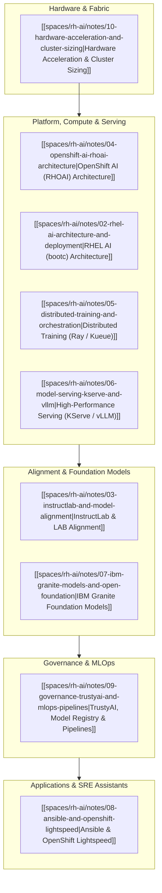

# Red Hat Enterprise AI Knowledge Base Overview

> **Space**: `rh-ai`  
> **Domain**: Red Hat OpenShift AI (RHOAI), RHEL AI, InstructLab, IBM Granite, KServe, Hardware Acceleration  
> **Status**: Active Reference Hub  
> **Target Version**: RHEL AI 1.x, OpenShift AI 2.14+, OpenShift Container Platform 4.16+

---

## 🧭 Knowledge Map & Domain Topology

This space serves as the comprehensive technical repository and second brain for **Red Hat Enterprise AI Offerings, Operating System Appliances, Alignment Pipelines, Serving Architecture, and Distributed Orchestration**.

---

## 📚 Core Knowledge Modules

1. **Strategic Architecture & Taxonomy**:
   - [[spaces/rh-ai/notes/01-red-hat-ai-portfolio-overview|Portfolio Overview & Strategic Architecture]]: Strategy, full-stack mapping, RHEL AI vs RHOAI boundary, upstream decoupling, and enterprise IP indemnification.

2. **Operating System & Edge Appliance**:
   - [[spaces/rh-ai/notes/02-rhel-ai-architecture-and-deployment|RHEL AI Architecture & Deployment Guide]]: Bootable OCI containers (`bootc`), transactional updates, ISO/QCOW2/AMI artifacts, single-node `ilab` workflow, and local vLLM serving.

3. **Alignment & Synthetic Data Generation**:
   - [[spaces/rh-ai/notes/03-instructlab-and-model-alignment|InstructLab & LAB Alignment Methodology]]: LAB methodology, Skills vs Knowledge Git taxonomy, Synthetic Data Generation (SDG) with teacher models, and multi-phase training (LoRA/QLoRA/Full).

4. **Cloud-Native AI Platform**:
   - [[spaces/rh-ai/notes/04-openshift-ai-rhoai-architecture|Red Hat OpenShift AI (RHOAI) Platform Architecture]]: `rhods-operator`, `DataScienceCluster` and `DSCI` CRDs, Workbenches, KServe vs ModelMesh, and Ceph ODF storage tiers.

5. **Distributed Training & Queuing**:
   - [[spaces/rh-ai/notes/05-distributed-training-and-orchestration|Distributed Training & Workload Orchestration]]: Kueue gang scheduling, KubeRay, CodeFlare SDK, PyTorchJob, FSDP/ZeRO-3, Multus CNI, and RoCEv2/SR-IOV high-speed fabrics.

6. **Inference & Model Serving**:
   - [[spaces/rh-ai/notes/06-model-serving-kserve-and-vllm|High-Performance Model Serving (KServe & vLLM)]]: PagedAttention memory management, continuous batching, chunked prefill, Serverless vs RawDeployment, and KEDA Prometheus autoscaling.

7. **Foundation Models**:
   - [[spaces/rh-ai/notes/07-ibm-granite-models-and-open-foundation|IBM Granite Models & Open Foundation Architecture]]: Granite 3.0 (Dense & MoE), Granite Code, Granite Guardian, Apache 2.0 open licensing, data transparency, and sizing formulas.

8. **Automation & Operational Assistants**:
   - [[spaces/rh-ai/notes/08-ansible-and-openshift-lightspeed|Enterprise Generative AI & Automation (Lightspeed)]]: Ansible Lightspeed, Content Source Matching, custom enterprise watsonx fine-tuning, and OpenShift Lightspeed cluster SRE assistant.

9. **Safety, Governance & Pipelines**:
   - [[spaces/rh-ai/notes/09-governance-trustyai-and-mlops-pipelines|Governance, Safety, TrustyAI & MLOps Pipelines]]: TrustyAI operator (SPD, DIR, LIME, SHAP), OpenShift Model Registry, Kubeflow Pipelines v2 on Tekton, and Sigstore/Cosign model signing.

10. **Hardware Acceleration & Sizing**:
    - [[spaces/rh-ai/notes/10-hardware-acceleration-and-cluster-sizing|Hardware Acceleration, GPU Math & Cluster Sizing Guide]]: Heterogeneous compute (NVIDIA, AMD MI300X, Intel Gaudi), VRAM mathematical equations, TPOT memory bandwidth bound, and cluster archetypes A/B/C.

11. **Strategy, Competition & SWOT**:
    - [[spaces/rh-ai/notes/11-executive-pitch-competition-and-swot-analysis|Executive Pitch, Competitive Landscape & SWOT Analysis]]: C-suite pitch narrative, competitive battlecards (AWS, Azure, GCP, Databricks, VMware, NVIDIA), complete SWOT analysis, and customer discovery matrix.

12. **Inference Microservices & Fleets**:
    - [[spaces/rh-ai/notes/12-nvidia-nim-vllm-llmd-and-lora-adapters|NVIDIA NIM, vLLM, LLM-D & Dynamic LoRA Adapters]]: NVIDIA NIM architecture vs native vLLM, LLM-D prefix-aware routing & split prefill/decode, Punica multi-LoRA execution, and OpenShift manifests.

---

## 🏛️ System Architecture & Reference Topologies

- [[spaces/rh-ai/architecture/rhoai_system_topology|RHOAI System Topology]]: Control plane, operator reconciliation, user namespaces, and Ceph storage tiers.
- [[spaces/rh-ai/architecture/instructlab_alignment_pipeline|InstructLab Pipeline Architecture]]: Git-centric taxonomy PRs, synthetic data expansion, critic filtering, and phased training.
- [[spaces/rh-ai/architecture/hybrid_cloud_ai_fabric|Hybrid Cloud AI Fabric]]: Multi-NIC pod interconnect with Multus CNI, SR-IOV, and 400GbE lossless RoCEv2.

---

## ⚖️ Architectural Decision Records (ADRs)

- [[spaces/rh-ai/decisions/adr_001_standardize_on_rhoai_and_kserve_vllm|ADR 001: Standardize on RHOAI with KServe & vLLM for Model Serving]]
- [[spaces/rh-ai/decisions/adr_002_instructlab_taxonomy_governance|ADR 002: Adopt InstructLab Git Taxonomy for Enterprise Knowledge Grounding]]
- [[spaces/rh-ai/decisions/adr_003_heterogeneous_hardware_acceleration|ADR 003: Standardize Heterogeneous Hardware Acceleration Framework]]

---
*Maintained in `/workspace/knowledge/spaces/rh-ai/`.*
