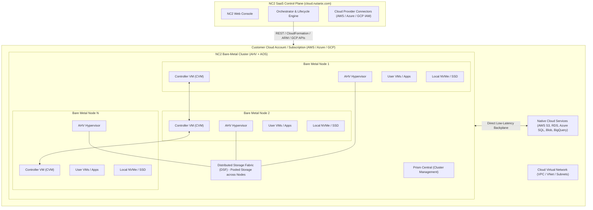

# 01 - Nutanix Cloud Clusters (NC2) Architecture Overview

## 1. Introduction to Nutanix Cloud Clusters (NC2)

**Nutanix Cloud Clusters (NC2)** delivers the complete Nutanix Cloud Platform (NCP) software stack deployed directly onto dedicated bare-metal instances provided by public cloud hyperscalers—**Amazon Web Services (AWS)**, **Microsoft Azure**, and **Google Cloud Platform (GCP)**, as well as sovereign enclaves (**Government Cloud Clusters / GC2**).

Unlike nested virtualization or re-architected cloud proprietary services, NC2 runs the enterprise-grade **Nutanix AHV Hypervisor** and **Acropolis Operating System (AOS)** directly on top of physical cloud hardware (bare-metal servers). This architecture eliminates hypervisor tax, maximizes raw compute and I/O performance, and preserves architectural parity between private on-premises datacenters and the public cloud.

---

## 2. Core Value Propositions

```
+-------------------------------------------------------------------------------+
|                       KEY VALUE DRIVERS OF NUTANIX NC2                        |
+-------------------------------------------------------------------------------+
| 1. Zero-Refactoring Migration  | Lift and shift legacy VMs without code or    |
|                                | hypervisor changes. Keep existing OS configs.|
+--------------------------------+----------------------------------------------+
| 2. Unified Operations Plane    | Manage On-Prem, AWS, Azure, and GCP via a    |
|                                | single Prism Central / Nutanix Central.      |
+--------------------------------+----------------------------------------------+
| 3. License Portability (BYOL)  | Move Nutanix capacity-based licenses (NCI/   |
|                                | NCM) freely across on-prem and public cloud. |
+--------------------------------+----------------------------------------------+
| 4. Native Cloud Integration    | Low-latency, high-bandwidth communication    |
|                                | with native cloud services (S3, RDS, Blob).  |
+--------------------------------+----------------------------------------------+
| 5. Rapid Elasticity & DR       | Spin up / down clusters on demand. Hibernate |
|                                | clusters to object storage to minimize TCO.  |
+--------------------------------+----------------------------------------------+
```

---

## 3. High-Level Architecture & Core Components



### Component Breakdown

### 1. Acropolis Operating System (AOS) & Controller VM (CVM)
*   **Controller Virtual Machine (CVM)** runs on every bare-metal node as a privileged virtual machine.
*   CVMs form a scale-out cluster and communicate over private high-speed networking to pool storage across all physical NVMe drives into the **Distributed Storage Fabric (DSF)**.
*   The CVM handles all data paths, replication factor enforcement (RF2/RF3), deduplication, compression, erasure coding (EC-X), tiering, and data protection.

### 2. Acropolis Hypervisor (AHV)
*   An enterprise, hardened KVM-based hypervisor tuned specifically for Nutanix software-defined infrastructure.
*   Runs directly on bare-metal cloud hardware without nested layers.
*   Communicates with the CVM to serve VM I/O and interfaces with the cloud provider's network adapters using specialized network drivers (AWS ENA / Azure Accelerated Networking / GCP gVNIC).

### 3. Distributed Storage Fabric (DSF)
*   Aggregates local high-speed NVMe/SSD storage attached to bare-metal instances into a single shared distributed storage pool.
*   Provides enterprise storage features: snapshots, thin provisioning, data locality, clones, and synchronous/asynchronous replication.
*   Presents storage to AHV hosts and user VMs via standard protocols (iSCSI, NFS, SMB) or direct storage backplanes.

### 4. NC2 SaaS Management Plane (`cloud.nutanix.com`)
*   A hosted SaaS orchestrator provided by Nutanix that brokers the lifecycle of bare-metal instances inside the customer's cloud account.
*   Key duties:
    *   Authenticating into the customer's AWS/Azure/GCP account using secure role delegation (IAM Roles / Entra ID Enterprise App / GCP Service Accounts).
    *   Automating bare-metal node provisioning, imaging with AHV/AOS, cluster formation, and node expansion/shrinkage.
    *   Managing **Cluster Hibernation** and **Resume** operations.
    *   Tracking cloud quotas, health telemetry, and cloud provider API interactions.

### 5. Prism Central & Prism Element
*   **Prism Element (PE)**: Local cluster management interface running directly within the CVMs of the cluster.
*   **Prism Central (PC)**: Multicloud, multi-cluster management control plane. Deployed as a VM cluster within the cloud or on-prem. Orchestrates VM provisioning, Flow Virtual Networking, microsegmentation, disaster recovery runbooks, and Day-2 operations.

---

## 4. Shared Responsibility Model

Running Nutanix software on public cloud infrastructure splits operational and architectural responsibilities across three entities: **Cloud Provider (AWS/Azure/GCP)**, **Nutanix**, and the **Customer**.

```
+-----------------------------------------------------------------------------------------+
|                               SHARED RESPONSIBILITY MATRIX                              |
+--------------------------+-----------------------+--------------------+-----------------+
| Architectural Layer      | AWS / Azure / GCP     | Nutanix            | Customer        |
+--------------------------+-----------------------+--------------------+-----------------+
| Physical Datacenter,     | Full Responsibility   | None               | None            |
| Power, Cooling, Racks    | (Hardware maintenance)|                    |                 |
+--------------------------+-----------------------+--------------------+-----------------+
| Bare-Metal Hardware &    | Server replacement,   | None               | Request quotas  |
| Cloud Network Fabric     | Top-of-rack switches  |                    | & capacity      |
+--------------------------+-----------------------+--------------------+-----------------+
| NC2 SaaS Orchestrator    | None                  | Full SaaS SLA,     | Maintain cloud  |
| (cloud.nutanix.com)      |                       | UI/API maintenance | credentials/IAM |
+--------------------------+-----------------------+--------------------+-----------------+
| Hypervisor & Storage     | None                  | Provide software,  | Schedule 1-click|
| (AHV, AOS, CVM, DSF)     |                       | LCM upgrades, KBs  | software updates|
+--------------------------+-----------------------+--------------------+-----------------+
| Network Design &         | Cloud VPC/VNet infra  | Flow Networking    | CIDR design,    |
| Security Groups          |                       | software features  | firewall rules  |
+--------------------------+-----------------------+--------------------+-----------------+
| User Virtual Machines    | None                  | None               | Full OS, App, & |
| (Guest OS, Apps, Data)   |                       |                    | Data Management |
+--------------------------+-----------------------+--------------------+-----------------+
```
