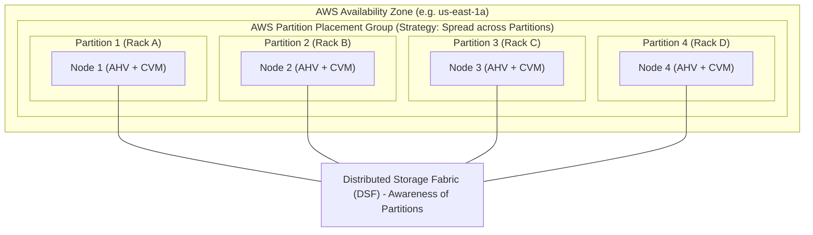

# 02 - Nutanix Cloud Clusters (NC2) on AWS

## 1. Overview of NC2 on AWS

Nutanix Cloud Clusters (NC2) on Amazon Web Services runs the complete Nutanix software stack (AHV hypervisor and AOS) directly on **Amazon EC2 Bare-Metal Instances**. 

Because AHV runs on physical server hardware, it interacts directly with AWS Nitro system network adapters and local NVMe storage without requiring nested virtualization. All bare-metal instances and networking constructs are provisioned directly inside the customer's own AWS account and Virtual Private Cloud (VPC).

---

## 2. Supported AWS Bare-Metal Instance Types

Nutanix supports a wide spectrum of EC2 bare-metal instance families optimized for different enterprise workload profiles:

```
+---------------------------------------------------------------------------------------------------+
|                               AWS BARE-METAL INSTANCE SPECIFICATIONS                              |
+-------------------+---------+---------+------------------------+-------------------+--------------+
| Instance Family   | vCPUs   | RAM(GiB)| Local NVMe Storage     | Network Bandwidth | Best For     |
+-------------------+---------+---------+------------------------+-------------------+--------------+
| i4i.metal         | 128     | 512     | 8x 3.75 TB NVMe        | Up to 75 Gbps     | General Prod,|
| (3rd Gen Xeon)    |         |         | (30 TB Raw NVMe)       | (Nitro)           | Databases, IO|
+-------------------+---------+---------+------------------------+-------------------+--------------+
| i3en.metal        | 96      | 768     | 8x 7.5 TB NVMe         | Up to 100 Gbps    | Storage-dense|
| (Skylake/Cascade) |         |         | (60 TB Raw NVMe)       | (Nitro)           | Big Data, VDI|
+-------------------+---------+---------+------------------------+-------------------+--------------+
| i3.metal          | 72      | 512     | 8x 1.9 TB NVMe         | Up to 25 Gbps     | Standard dev,|
| (Broadwell)       |         |         | (15.2 TB Raw NVMe)     | (Nitro)           | Legacy apps  |
+-------------------+---------+---------+------------------------+-------------------+--------------+
| m6id.metal        | 128     | 512     | 4x 1.9 TB NVMe         | Up to 50 Gbps     | Memory/CPU   |
| (Ice Lake)        |         |         | (7.6 TB Raw NVMe)      | (Nitro)           | intensive    |
+-------------------+---------+---------+------------------------+-------------------+--------------+
| m5d.metal         | 96      | 384     | 4x 900 GB NVMe         | Up to 25 Gbps     | Compute-bound|
| (Cascade Lake)    |         |         | (3.6 TB Raw NVMe)      | (Nitro)           | test/dev     |
+-------------------+---------+---------+------------------------+-------------------+--------------+
| z1d.metal         | 48      | 384     | 2x 1.9 TB NVMe         | Up to 25 Gbps     | High single- |
| (High Frequency)  | (4.0GHz)|         | (3.8 TB Raw NVMe)      | (Nitro)           | core licensing|
+-------------------+---------+---------+------------------------+-------------------+--------------+
```

---

## 3. Storage Architecture on AWS

```
+-------------------------------------------------------------------------------+
|                       STORAGE ARCHITECTURE ON AWS                             |
+-------------------------------------------------------------------------------+
| Bare-Metal Host (e.g. i4i.metal)                                              |
| +---------------------------------------------------------------------------+ |
| |  [NVMe 0] [NVMe 1] [NVMe 2] [NVMe 3] [NVMe 4] [NVMe 5] [NVMe 6] [NVMe 7]  | |
| +---------------------------------------------------------------------------+ |
|                                      |                                        |
|                          Direct PCIe Pass-through                             |
|                                      v                                        |
| +---------------------------------------------------------------------------+ |
| |  Nutanix Controller VM (CVM)                                              | |
| |  - Distributed Storage Fabric (DSF)                                       | |
| |  - Replication Factor 2 (RF2) or Replication Factor 3 (RF3)               | |
| |  - Inline Deduplication, LZ4 Compression, EC-X Erasure Coding             | |
| +---------------------------------------------------------------------------+ |
|                                      |                                        |
|       +------------------------------+-------------------------------+        |
|       v                                                              v        |
|  [ AHV Host Storage Container ]                             [ Amazon S3 ]     |
|  (User VM Disks & vDisks)                            (Hibernation & Snapshots)|
+-------------------------------------------------------------------------------+
```

---

## 4. High Availability & Fault Domains (Partition Placement Groups)



*   **Rack-Aware DSF**: Nutanix AOS automatically aligns its storage block placement with AWS partition boundaries.
*   **Blast Radius Protection**: If AWS experiences a physical top-of-rack switch or power failure in Partition 1, copies of data on Partitions 2, 3, and 4 maintain 100% data availability without cluster downtime.

---

## 5. Step-by-Step Deployment Workflow on AWS

### Step 1: AWS Account Onboarding & IAM Roles
1. Log in to the NC2 SaaS Console (`https://cloud.nutanix.com`).
2. Navigate to **Cloud Accounts** -> **Add AWS Account**.
3. Launch the official Nutanix CloudFormation template into your target AWS Account.
4. The template provisions the required IAM Roles:
   - `nutanix-clusters-role`: Allows NC2 orchestrator to describe VPCs, launch EC2 bare-metal instances, attach ENIs, and create security groups.
   - `nutanix-clusters-instance-profile`: Attached to EC2 bare-metal nodes for S3 bucket access during cluster deployment and hibernation.

### Step 2: AWS VPC & Subnet Preparation
Ensure the following minimum subnets are created in the target VPC:
- **Management Subnet**: `/24` or `/23` recommended. Used by AHV hosts and CVMs.
- **Prism Central Subnet**: `/26` or `/25`.
- **User VM Subnets**: Sized based on estimated VM workload capacity (or overlay CIDRs if using Flow Virtual Networking).

### Step 3: Cluster Provisioning in NC2 Console
1. Select **Create Cluster** -> **AWS**.
2. Specify Cluster Name, Target Region, AZ, VPC, and Management Subnet.
3. Select EC2 Instance Type (e.g., `i4i.metal`) and Node Count (Minimum 3 for RF2).
4. Select AOS Version and AHV build.
5. Provide Prism Central deployment details (Deploy new or connect to existing).
6. Click **Deploy Cluster** (~30 to 45 minutes build time).

*(For in-depth AWS networking, ENI mechanics, and transit routing, see [**06-networking-aws.md**](file:///workspace/nc2-kb/06-networking-aws.md).)*
