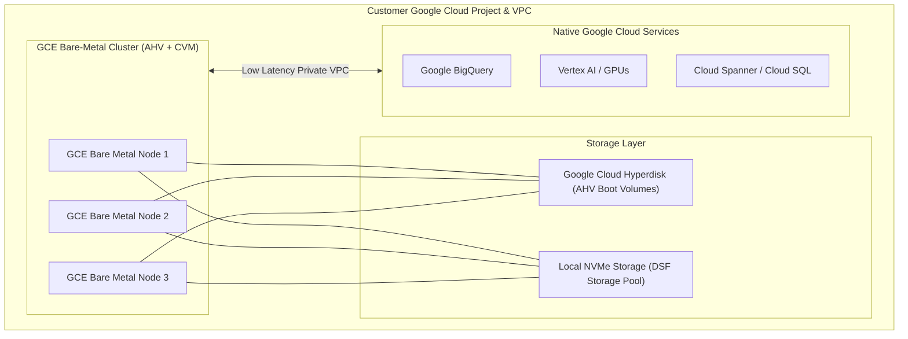

# 04 - Nutanix Cloud Clusters (NC2) on Google Cloud Platform (GCP)

## 1. Overview of NC2 on Google Cloud

Nutanix Cloud Clusters (NC2) on Google Cloud delivers the complete Nutanix Cloud Platform (NCP) onto **Google Compute Engine (GCE) Bare-Metal Instances**.

Running natively on GCE bare-metal servers allows AHV to interface directly with Google's high-speed **Andromeda Software-Defined Network (SDN)** using Google Virtual NIC (gVNIC) adapters.

---

## 2. GCE Bare-Metal Architecture & Storage Integration

### Key Highlights
*   **Google Cloud Hyperdisk**: Provides persistent, enterprise-grade storage for AHV hypervisor boot partitions and cluster configuration state.
*   **Distributed Storage Fabric (DSF)**: Pools attached high-speed physical NVMe drives into a shared storage pool supporting RF2/RF3 resilience, inline compression, and erasure coding.
*   **Direct Cloud Adjacency**: Nutanix workloads on GCP communicate directly with native Google Cloud analytics (BigQuery) and AI platforms (Vertex AI) over Google's top-of-rack VPC backplane.

---

## 3. Step-by-Step Deployment Workflow on GCP

1. **GCP Project & Quotas**: Ensure your GCP project has sufficient quota allocated for GCE bare-metal instance families in the target region.
2. **GCP Service Account & IAM**: Create a service account in GCP with permissions to provision compute instances, manage VPC subnets, and attach Hyperdisk volumes.
3. **VPC Network Preparation**: Create VPC subnets for Management (AHV/CVM) and User Workloads (Alias IP subnets or overlay transit).
4. **Provision via NC2 Portal**: Launch cluster creation from `cloud.nutanix.com`, specifying GCP project ID, region, zone, node count, and Prism Central integration.

*(For in-depth GCP networking, Alias IP allocations, and Google Cloud Router BGP, see [**08-networking-gcp.md**](file:///workspace/nc2-kb/08-networking-gcp.md).)*
