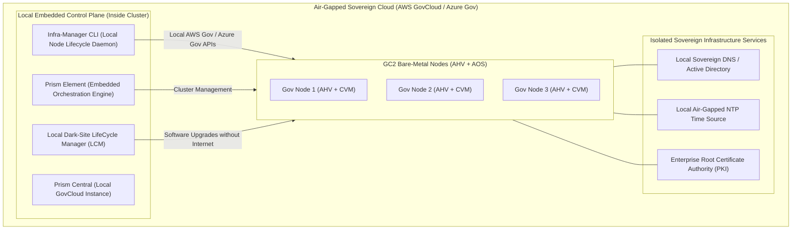

# 05 - Nutanix Government Cloud Clusters (GC2)

## 1. Overview of Government Cloud Clusters (GC2)

**Nutanix Government Cloud Clusters (GC2)** is an air-gapped, zero-trust cloud architecture engineered specifically for the United States Federal Government, Department of Defense (DoD), Intelligence Community (IC), and global public sector agencies requiring sovereign operations.

GC2 operates on bare-metal hardware inside **AWS GovCloud**, **Azure Government**, and classified intelligence enclaves (**SC2S**, **C2S**).

---

## 2. Key Differences: Standard NC2 vs Government Cloud Clusters (GC2)

```
+-------------------------------------------------------------------------------------------------------+
|                                    NC2 VS GC2 ARCHITECTURAL COMPARISON                                |
+--------------------------+------------------------------------+---------------------------------------+
| Dimension                | Standard NC2                       | Government Cloud Clusters (GC2)       |
+--------------------------+------------------------------------+---------------------------------------+
| Target Cloud Enclaves    | Commercial AWS, Commercial Azure,  | AWS GovCloud (US-East/West),          |
|                          | Google Cloud Platform (GCP)        | Azure Government, Secret / Top Secret |
+--------------------------+------------------------------------+---------------------------------------+
| Orchestration Control    | External SaaS Control Plane        | **100% Embedded Locally in Cluster**  |
| Plane                    | (`cloud.nutanix.com`)              | (Prism Element & Infra-Manager CLI)   |
+--------------------------+------------------------------------+---------------------------------------+
| Internet Connectivity    | Requires outbound TLS (Port 443)   | **ZERO Outbound Internet Required**   |
| Requirements             | to Nutanix SaaS orchestrator       | (Strictly Isolated / Air-Gapped)      |
+--------------------------+------------------------------------+---------------------------------------+
| Node Lifecycle & Scaling | Triggered via NC2 Web Console      | Triggered via local `infra-manager`   |
|                          | or NC2 v2 REST APIs                | CLI commands inside Prism Element     |
+--------------------------+------------------------------------+---------------------------------------+
| Software Updates (LCM)   | Downloads bundles from Nutanix     | Uses local dark-site / air-gapped     |
|                          | Cloud CDN automatically            | web server (LCM Dark Site mode)       |
+--------------------------+------------------------------------+---------------------------------------+
| Security Compliance      | FedRAMP Moderate, SOC 2, HIPAA     | **DoD Impact Level 5 & 6 (IL5/IL6),   |
| Baseline                 |                                    | FedRAMP High, NIST 800-53, FIPS 140-2**|
+--------------------------+------------------------------------+---------------------------------------+
```

---

## 3. Embedded Local Architecture & Orchestration



---

## 4. Local Infrastructure Lifecycle Commands (`infra-manager`)

In air-gapped GC2 clusters, network administrators perform all infrastructure and node operations using the local `infra-manager` utility on the Controller VM:

```bash
# Check GC2 local infrastructure status
infra-manager cluster get-status

# Add bare-metal node in AWS GovCloud / Azure Gov
infra-manager node add \
  --node-type i4i.metal \
  --count 1 \
  --availability-zone us-gov-west-1a \
  --subnet-id subnet-0123456789gov01

# Perform security & STIG audit check
ncc health_checks run_all --category=security
allssh "sudo /usr/local/nutanix/cluster/bin/scma_check.sh"
```

*(For in-depth GC2 air-gapped networking and zero-egress routing, see [**09-networking-gc2.md**](file:///workspace/nc2-kb/09-networking-gc2.md).)*
