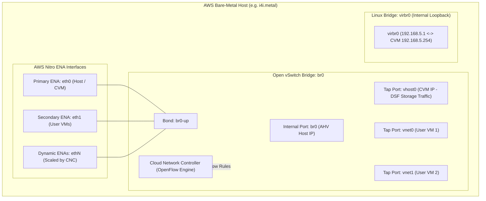
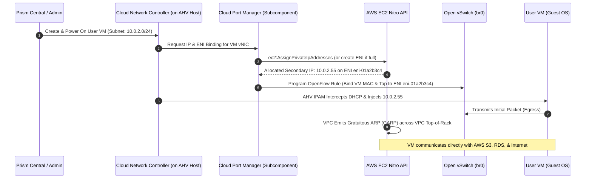
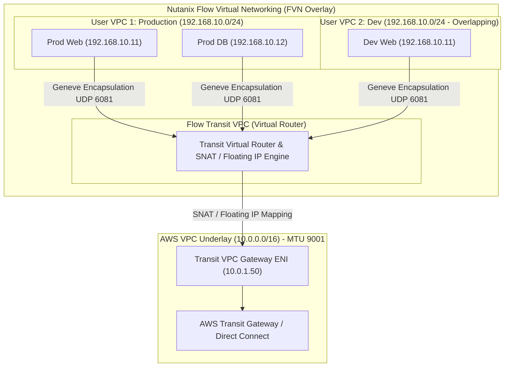
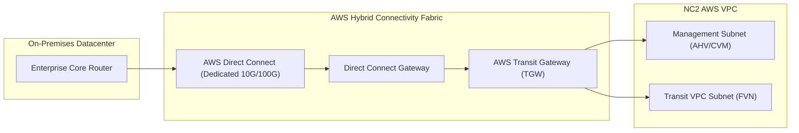

# 06 - NC2 Networking Deep Dive: Amazon Web Services (AWS)

## 1. Executive Architectural Overview

Nutanix Cloud Clusters (NC2) on AWS runs the complete Nutanix Enterprise Cloud OS (AHV and AOS) natively on dedicated **Amazon EC2 Bare-Metal Instances** (e.g., `i4i.metal`, `i3en.metal`, `m6id.metal`). 

Because AHV executes directly on physical server hardware, it interfaces directly with the AWS **Nitro System** PCI network adapters (Elastic Network Adapters - ENA).

```
+-----------------------------------------------------------------------------------------------+
|                             NC2 ON AWS NETWORKING MODES                                       |
+------------------------------------+----------------------------------------------------------+
| Networking Model                   | Primary Mechanism & Use Cases                            |
+------------------------------------+----------------------------------------------------------+
| 1. Native AWS Networking           | AHV binds User VM vNICs to secondary private IPs on      |
|    (Underlay ENI Mode)             | AWS Elastic Network Interfaces (ENIs). Direct AWS VPC IP.|
|                                    | Zero encapsulation overhead. Optimal for cloud adjacence.|
+------------------------------------+----------------------------------------------------------+
| 2. Flow Virtual Networking (FVN)   | Software-defined Geneve overlay (UDP 6081) on top of AWS |
|    (Overlay VPC Mode)              | VPC. Supports overlapping CIDRs, multi-tenant isolation, |
|                                    | and non-disruptive lift-and-shift with zero re-IPing.    |
+------------------------------------+----------------------------------------------------------+
```

---

## 2. AHV Host Open vSwitch (OVS) Architecture on AWS

On every AWS bare-metal node, AHV configures a standardized Open vSwitch (OVS) datapath:



### Bridge & Port Roles
1. **`br0`**: The primary OVS data switch handling all external communication, inter-node CVM storage replication, and guest VM traffic.
2. **`br0-up`**: The OVS uplink bond aggregating the physical AWS ENA interfaces attached to the instance.
3. **`vhost0`**: The dedicated tap interface connecting the resident Controller VM (CVM) to `br0` for Distributed Storage Fabric (DSF) traffic.
4. **`virbr0`**: An isolated internal Linux bridge on subnet `192.168.5.0/24` used for private local IPC and heartbeats between AHV and CVM.

---

## 3. Native AWS Networking: Cloud Network Controller (CNC) & ENI Lifecycle

In Native AWS Networking mode, guest virtual machines participate directly in the AWS VPC subnet IP space.



### 1. Cloud Network Controller (CNC) & Cloud Port Manager (CPM)
*   **CNC** is a leaderless, distributed daemon running on every AHV host.
*   **Cloud Port Manager** acts as the cloud interface adapter within CNC:
    *   Tracks attached ENIs and their current IP allocations.
    *   Each ENI supports 1 primary IP and up to **49 secondary private IPs** (on `i4i.metal` / `i3en.metal`).
    *   When an ENI reaches its secondary IP limit, CPM automatically invokes `ec2:CreateNetworkInterface` and `ec2:AttachNetworkInterface` to bind a new ENI to the physical host without disruption.

### 2. Live Migration Protocol & Gratuitous ARP (GARP)
When a User VM live-migrates from AHV Host 1 to AHV Host 2:
1. **Memory State Sync**: VM RAM pages migrate over `br0` using AWS VPC high-speed Nitro interconnects (up to 75-100 Gbps).
2. **IP Detachment / Re-Attachment**:
   - Host 1 CPM calls `ec2:UnassignPrivateIpAddresses`.
   - Host 2 CPM calls `ec2:AssignPrivateIpAddresses` to attach the secondary IP to Host 2's ENI.
3. **Gratuitous ARP (GARP)**: AWS Nitro fabric emits GARP frames, updating AWS VPC mapping tables so traffic routes immediately to Host 2 without TCP session drops.

### 3. Exclusivity of AHV Managed Subnets
*   NC2 on AWS **strictly requires Managed Subnets** (IPAM enabled in Prism).
*   Unmanaged subnets are not supported in native AWS networking because AHV IPAM must orchestrate IP allocation directly with the AWS DHCP and EC2 routing tables.

---

## 4. Flow Virtual Networking (FVN) on AWS: Transit VPC & Overlays

When organizations need overlapping subnets, zero-re-IP migrations, or strict isolation, NC2 on AWS utilizes **Flow Virtual Networking (FVN)**.



---

## 5. Enterprise Interconnect: AWS Transit Gateway (TGW) & Direct Connect



*   **AWS Transit Gateway (TGW)** connects NC2 VPCs, corporate on-premises networks over Direct Connect, and other application VPCs.
*   **Jumbo Frames Support**: AWS Direct Connect and Transit Gateway support up to **MTU 8500 / 9001**, allowing end-to-end Jumbo Frame transmission between on-premises Nutanix clusters and NC2 on AWS for maximum NearSync replication throughput.

---

## 6. Diagnostic & Verification Commands for NC2 on AWS

```bash
# View all attached ENIs, MAC addresses, and secondary IPs on AHV host
manage_ovs show_uplinks
manage_ovs show_interfaces

# Check Cloud Network Controller daemon health
allssh "genesis status | grep -i cloud_network_controller"
tail -f /home/nutanix/data/logs/cloud_network_controller.out

# Verify Open vSwitch Flow Tables & Bridge Rules
ovs-ofctl dump-flows br0 -O OpenFlow13

# Ping target AHV host or CVM with 8972 payload (AWS Jumbo Frames test)
ping -c 4 -M do -s 8972 <TARGET-CVM-OR-HOST-IP>
```
