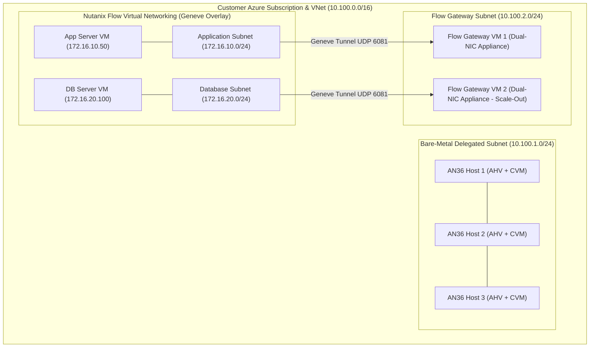
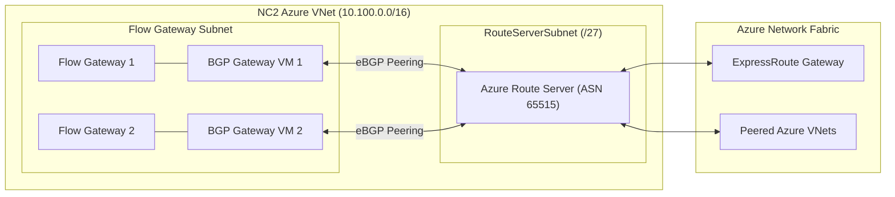
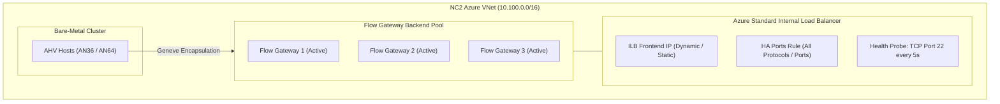

# 07 - NC2 Networking Deep Dive: Microsoft Azure

## 1. Executive Architectural Overview

Nutanix Cloud Clusters (NC2) on Microsoft Azure provisions the complete Nutanix Enterprise Cloud Platform directly on **Azure Dedicated Bare-Metal Nodes** (e.g., `AN36`, `AN36P`, `AN64`).

In Microsoft Azure, physical bare-metal network interfaces reside within a **Delegated Subnet** (`Microsoft.BareMetal/AzureHostedService`). Unlike AWS ENIs, Azure bare-metal network adapters do not permit assigning arbitrary secondary IP addresses directly to physical NICs. Therefore, **Flow Virtual Networking (FVN)** and the **Flow Gateway (FGW)** architecture serve as the foundational, software-defined networking model for all User VMs (UVMs) in NC2 on Azure.

---

## 2. Azure VNet & Flow Gateway (FGW) Architecture



### Flow Gateway (FGW) Appliance Mechanics
*   **Dual-NIC Architecture**:
    *   **Internal NIC (NIC 0)**: Connects to the Nutanix cluster network to receive Geneve-encapsulated overlay traffic (UDP Port 6081) from AHV hosts.
    *   **External NIC (NIC 1)**: Connects to the native Azure VNet subnet to forward un-encapsulated (or NAT'd) traffic into Azure.
*   **Deployment Scale**:
    *   **Scale-Out Active/Active (Recommended for Production)**: Deploys 2 to 4 Flow Gateway VMs in an active/active pool with Equal-Cost Multi-Path (ECMP) or Azure Load Balancer distribution, delivering aggregate throughput exceeding **40+ Gbps**.
    *   **Single Flow Gateway**: Deployed strictly for non-production proofs-of-concept.

---

## 3. Comparison of Azure North-South Routing Methods

NC2 on Azure supports three primary enterprise routing architectures:

```
+------------------------------------------------------------------------------------------------------------------------+
|                                    AZURE FLOW GATEWAY ROUTING METHODS COMPARED                                         |
+--------------------------+------------------------------------+-----------------------------+--------------------------+
| Architectural Dimension  | Option 1: Azure Virtual WAN (vWAN) | Option 2: Azure Route Server| Option 3: Azure Internal |
|                          | Hub-and-Spoke                      | (ARS with BGP)              | Load Balancer (ILB)      |
+--------------------------+------------------------------------+-----------------------------+--------------------------+
| Recommended Use Case     | Enterprise Global vWAN Hubs &      | Traditional Hub-and-Spoke   | Greenfield NC2 clusters, |
|                          | Secured Virtual Hubs (Firewall)    | VNets requiring dynamic BGP | Simple, low-cost routing |
+--------------------------+------------------------------------+-----------------------------+--------------------------+
| Minimum Requirement      | Azure vWAN Standard Hub            | Prism Central 2022.6+       | Prism Central 7.5+       |
+--------------------------+------------------------------------+-----------------------------+--------------------------+
| Dedicated BGP Gateway VMs| **YES (2 BGP VMs required)**       | **YES (2 BGP VMs required)**| **NO (0 BGP VMs needed)**|
+--------------------------+------------------------------------+-----------------------------+--------------------------+
| Additional Azure Cost    | vWAN Hub Router charges            | Azure Route Server hourly   | Low (Standard ILB rules) |
+--------------------------+------------------------------------+-----------------------------+--------------------------+
| Traffic Distribution     | vWAN Hub BGP ECMP                  | BGP ECMP (Equal-Cost)       | Azure ILB 5-Tuple Hash   |
+--------------------------+------------------------------------+-----------------------------+--------------------------+
| Health Probing           | BGP Keepalive / Hold timers        | BGP Keepalive (30s)         | TCP Port 22 Probe (5s)   |
+--------------------------+------------------------------------+-----------------------------+--------------------------+
| Failover Speed           | 10 to 30 seconds                   | 10 to 30 seconds            | **< 5 seconds (Instant)**|
+--------------------------+------------------------------------+-----------------------------+--------------------------+
| Traffic Inspection / NVA | Direct Secure vHub Firewall Policy | Requires NVA VNet peering   | Via Azure Firewall UDRs  |
+--------------------------+------------------------------------+-----------------------------+--------------------------+
```

---

## 4. Option 1: Azure Virtual WAN (vWAN) Integration Deep Dive

In enterprise organizations utilizing **Azure Virtual WAN (vWAN)** as their central cloud network backbone, NC2 integrates directly with the **vWAN Virtual Hub (vHub)**.

```mermaid
graph TD
    subgraph Azure_vWAN["Azure Virtual WAN (Global Transit Backbone)"]
        subgraph Virtual_Hub["vWAN Standard Virtual Hub (vHub Router - ASN 65515)"]
            vHub_Router["vHub Routing Engine"]
            Secured_Firewall["Azure Firewall (Secured Hub Policies)"]
            ER_Gateway["ExpressRoute Gateway"]
            VPN_Gateway["Site-to-Site VPN Gateway"]
        end

        subgraph Spoke_VNet_NC2["NC2 Spoke VNet (10.100.0.0/16)"]
            FGW_Pool["Scale-Out Flow Gateways (BGP Peered to vHub Router)"]
            AHV_Cluster["NC2 Bare-Metal Nodes (AHV)"]
        end

        subgraph Spoke_VNet_Native["Native Azure Spoke VNets"]
            App_VMs["Native Azure App VMs & Azure SQL"]
        end
    end

    subgraph OnPrem["On-Premises Datacenter"]
        OnPrem_Core["On-Prem Core Router"]
    end

    AHV_Cluster -->|Geneve Overlay| FGW_Pool
    FGW_Pool <-->|eBGP Dynamic Peering (TCP 179)| vHub_Router
    vHub_Router --- Secured_Firewall
    vHub_Router --- ER_Gateway
    vHub_Router --- Spoke_VNet_Native
    ER_Gateway <-->|ExpressRoute Private Peering| OnPrem_Core
```

---

## 5. Option 2: Azure Route Server (ARS) Architecture



---

## 6. Option 3: Azure Internal Load Balancer (ILB) Architecture (Recommended for Greenfield)

Introduced in **Prism Central 7.5+**, the **Azure Internal Load Balancer (ILB) routing method** replaces ARS and dedicated BGP VMs:



---

## 7. MTU Budget & TCP MSS Clamping on Azure

```
+-----------------------------------------------------------------------------------------------+
|                               AZURE MTU BUDGET & CLAMPING                                     |
+-----------------------------------------------------------------------------------------------+
| Azure Physical Underlay MTU: 1500                                                             |
|   - Geneve Overhead:          50 Bytes                                                        |
|   = Maximum Usable Inner MTU: 1450 Bytes                                                      |
|                                                                                               |
| TCP MSS Clamping Mechanism:                                                                   |
| The Flow Gateway automatically clamps the Maximum Segment Size (MSS) on TCP SYN packets to   |
| 1410 (1450 minus 40 bytes for TCP/IP headers) to prevent silent fragmentation.               |
+-----------------------------------------------------------------------------------------------+
```

---

## 8. Diagnostic & Verification Commands for NC2 on Azure

```bash
# Verify Flow Gateway Health & Connectivity (TCP Port 22 Probe)
nc -zv <FLOW-GATEWAY-IP> 22

# Inspect Geneve Tunnel State on Azure AHV Hosts
ovs-ofctl dump-flows br0 -O OpenFlow13 | grep "tun_id"

# Check Azure Delegated Subnet & Uplinks
allssh "manage_ovs show_uplinks"

# Verify Overlay Path MTU (Expecting success at 1422 bytes payload)
ping -c 4 -M do -s 1422 <TARGET-OVERLAY-USER-VM-IP>
```
