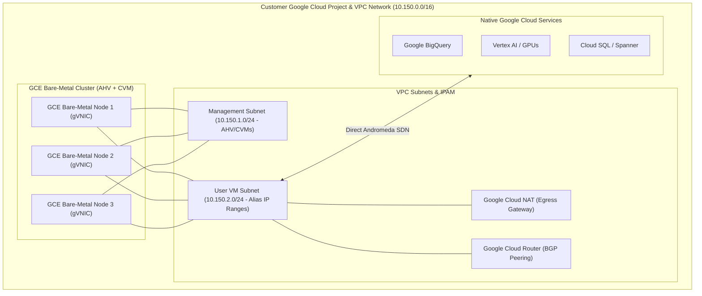
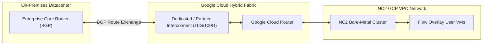

# 08 - NC2 Networking Deep Dive: Google Cloud Platform (GCP)

## 1. Executive Architectural Overview

Nutanix Cloud Clusters (NC2) on Google Cloud brings the complete Nutanix Cloud Platform directly onto **Google Compute Engine (GCE) Bare-Metal Instances**.

Running natively on GCE bare-metal servers allows AHV to interface directly with Google's **Andromeda Software-Defined Network (SDN)** using Google Virtual NIC (gVNIC) adapters.

```
+-----------------------------------------------------------------------------------------------+
|                             NC2 ON GCP NETWORKING MODES                                       |
+------------------------------------+----------------------------------------------------------+
| Networking Model                   | Primary Mechanism & Use Cases                            |
+------------------------------------+----------------------------------------------------------+
| 1. Native GCP VPC Networking       | User VMs receive native GCP IP addresses via **Alias IP  |
|    (Alias IP Mode)                 | Ranges** attached to the host's gVNIC interface.         |
|                                    | Direct line-rate access to BigQuery, Spanner, Vertex AI. |
+------------------------------------+----------------------------------------------------------+
| 2. Flow Virtual Networking (FVN)   | Software-defined Geneve overlay (UDP 6081) on top of GCP |
|    (Overlay VPC Mode)              | VPC. Enables multi-tenancy, cross-cloud DR without       |
|                                    | re-IPing, and granular microsegmentation.                |
+------------------------------------+----------------------------------------------------------+
```

---

## 2. GCP VPC & Bare-Metal Architecture



---

## 3. Native GCP VPC Integration: Alias IP Ranges

In Native GCP Networking mode, Nutanix AHV leverages **Google Cloud Alias IP Ranges**:
1. **Host Primary IP**: Assigned to the AHV host and Controller VM for hypervisor clustering and DSF storage replication.
2. **Alias IP Allocations**: The Cloud Network Controller allocates secondary CIDR blocks (e.g., `/28` or individual `/32` IPs) from the GCP VPC subnet and binds them as Alias IPs to the bare-metal node's network interface.
3. **User VM Mapping**: Guest VMs receive these Alias IPs directly via AHV IPAM DHCP.
4. **Direct Line-Rate Routing**: Google's Andromeda SDN routes traffic directly to and from User VM Alias IPs without requiring network translation appliances.

---

## 4. Flow Virtual Networking (FVN) on GCP

*   **Geneve Encapsulation**: Inter-VM traffic across hosts is encapsulated in Geneve UDP packets on port 6081.
*   **Google Cloud Router Integration**: Flow Gateways peer dynamically with Google Cloud Router using BGP (ASN 16550 / custom ASN) to advertise overlay subnets into the GCP routing fabric.
*   **Cloud NAT Integration**: Outbound traffic to the public internet can be routed through **Google Cloud NAT**, eliminating the need for public IP addresses on individual User VMs.

---

## 5. Enterprise Hybrid Interconnect on GCP



---

## 6. MTU Budget & Sizing on GCP

```
+-----------------------------------------------------------------------------------------------+
|                                 GCP MTU BUDGET GUIDELINES                                     |
+-----------------------------------------------------------------------------------------------+
| Standard MTU Environment (1460 Underlay):                                                     |
|   - Underlay MTU:         1460 Bytes                                                          |
|   - Geneve Overhead:        50 Bytes                                                          |
|   = Max Inner Overlay MTU: 1410 Bytes                                                        |
|   = TCP MSS Clamping:     1370 Bytes                                                          |
|                                                                                               |
| Jumbo VPC Environment (1500 Underlay):                                                        |
|   - Underlay MTU:         1500 Bytes                                                          |
|   - Geneve Overhead:        50 Bytes                                                          |
|   = Max Inner Overlay MTU: 1450 Bytes                                                        |
|   = TCP MSS Clamping:     1410 Bytes                                                          |
+-----------------------------------------------------------------------------------------------+
```

---

## 7. Diagnostic & Verification Commands for NC2 on GCP

```bash
# Check AHV Network Interfaces & gVNIC Uplinks on GCP
allssh "manage_ovs show_uplinks"
allssh "ip -d link show"

# Check Cloud Network Controller Logs on GCP Bare-Metal
tail -f /home/nutanix/data/logs/cloud_network_controller.out

# Verify BGP Peering with Google Cloud Router
allssh "links"
```
