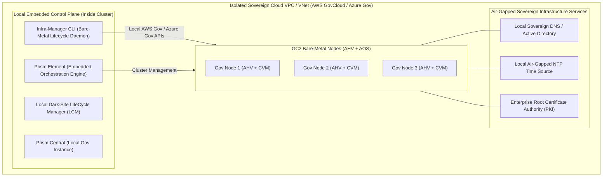

# 09 - NC2 Networking Deep Dive: Nutanix Government Cloud Clusters (GC2)

## 1. Executive Architectural Overview

**Nutanix Government Cloud Clusters (GC2)** is an air-gapped, zero-trust cloud architecture engineered specifically for the United States Federal Government, Department of Defense (DoD), Intelligence Community (IC), and highly regulated sovereign defense sectors.

GC2 executes on dedicated bare-metal nodes inside **AWS GovCloud**, **Azure Government**, and classified intelligence community enclaves (e.g., **SC2S**, **C2S**).

```
+-----------------------------------------------------------------------------------------------+
|                             KEY DIFFERENTIATORS OF GC2 NETWORKING                             |
+------------------------------------+----------------------------------------------------------+
| Architectural Dimension            | Implementation & Security Baseline                       |
+------------------------------------+----------------------------------------------------------+
| 1. Control Plane Isolation         | **100% Embedded Locally in Cluster** (Prism Element).    |
|                                    | Zero dependency on external SaaS (`cloud.nutanix.com`).  |
+------------------------------------+----------------------------------------------------------+
| 2. Outbound Internet Connectivity  | **ZERO Outbound Internet Required**. Strict air-gap.     |
+------------------------------------+----------------------------------------------------------+
| 3. Security Hardening Baseline     | DoD Impact Level 5 & 6 (IL5/IL6), FedRAMP High, FIPS 140-2|
|                                    | Cryptographic Modules, DISA STIG Profile Enforcement.    |
+------------------------------------+----------------------------------------------------------+
| 4. Network Orchestration Engine    | Localized `infra-manager` CLI & Prism Central.           |
+------------------------------------+----------------------------------------------------------+
```

---

## 2. Air-Gapped Network Topology & Embedded Orchestration



---

## 3. Network Security & STIG Baseline Hardening

### 1. Security Configuration Management Automation (SCMA)
*   In GC2, the built-in SCMA service audits all hypervisor and CVM network interfaces, iptables rules, and SSH daemon configurations against **DISA STIG** requirements every 60 minutes.
*   Any unauthorized configuration change or network port exposure is automatically reverted to the compliant baseline without human intervention.

### 2. Microsegmentation with Flow Network Security (FNS)
*   Stateful layer-4 microsegmentation policies enforce strict least-privilege access between application tiers.
*   **Quarantine Policies**: Instantly isolate compromised virtual machines at the vNIC layer.

---

## 4. Local Infrastructure Lifecycle Commands (`infra-manager`)

```bash
# View Local GC2 Network and Host Status
infra-manager cluster get-status

# Add Bare-Metal Node in AWS GovCloud / Azure Gov Subnet
infra-manager node add \
  --node-type i4i.metal \
  --count 1 \
  --availability-zone us-gov-west-1a \
  --subnet-id subnet-0123456789gov01

# Verify STIG & Security Compliance Status
ncc health_checks run_all --category=security
allssh "sudo /usr/local/nutanix/cluster/bin/scma_check.sh"
```
