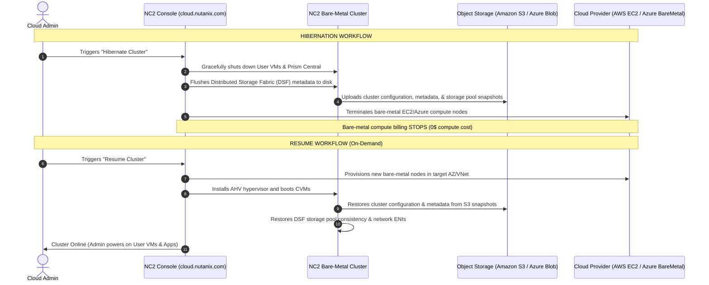
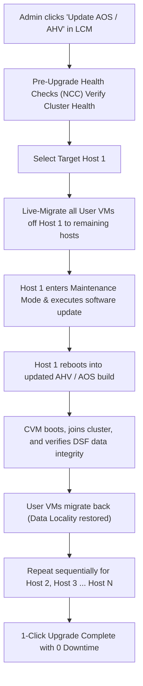

# 12 - Operations, Lifecycle & Cost Optimization in NC2

## 1. Day-2 Operations & Lifecycle Management

Managing Nutanix Cloud Clusters (NC2) provides the same operational simplicity as on-premises Nutanix appliances, combined with cloud agility.

```
+-----------------------------------------------------------------------------------------------+
|                             NC2 OPERATIONS CONTROL PLANES                                     |
+------------------------------------+----------------------------------------------------------+
| Control Plane                      | Core Operational Functions                               |
+------------------------------------+----------------------------------------------------------+
| NC2 SaaS Console                   | Bare-metal node lifecycle, Cluster creation, scaling,    |
| (cloud.nutanix.com)                | node repairs, Hibernation / Resume, Cloud billing sync.  |
+------------------------------------+----------------------------------------------------------+
| Nutanix Central                    | Global single-pane-of-glass dashboard across on-prem,    |
| (central.nutanix.com)              | AWS, Azure, and GCP Prism Central instances.             |
+------------------------------------+----------------------------------------------------------+
| Prism Central (PC)                 | VM lifecycle, Flow Networking, Microsegmentation, DR     |
| (Local or Cloud Deployment)        | runbooks, App blueprints, Role-Based Access Control.     |
+------------------------------------+----------------------------------------------------------+
| LifeCycle Manager (LCM)            | 1-click rolling non-disruptive software and firmware     |
| (Built into Prism)                 | upgrades (AOS, AHV, NCC, Foundation, Files, Objects).    |
+------------------------------------+----------------------------------------------------------+
```

---

## 2. Cluster Hibernation & Resume Deep Dive

The **Cluster Hibernate and Resume** feature is one of the most powerful cost-optimization mechanisms in NC2, allowing organizations to eliminate expensive bare-metal compute charges when clusters are not actively in use.



---

## 3. Elastic Cluster Auto-Scaling

NC2 allows clusters to dynamically expand and shrink based on real-time resource utilization:

```
+-----------------------------------------------------------------------------------------------+
|                               AUTO-SCALING POLICIES & THRESHOLDS                              |
+------------------------------------+----------------------------------------------------------+
| Trigger Metric                     | Recommended Threshold & Action                           |
+------------------------------------+----------------------------------------------------------+
| Storage Capacity Utilization       | Trigger Scale-Out when storage exceeds 75% capacity.     |
|                                    | Adds 1 bare-metal node to prevent storage exhaustion.    |
+------------------------------------+----------------------------------------------------------+
| Memory (RAM) Overcommit            | Trigger Scale-Out when host RAM utilization > 85%.       |
+------------------------------------+----------------------------------------------------------+
| CPU Utilization                    | Trigger Scale-Out when cluster CPU average > 80% for 15m.|
+------------------------------------+----------------------------------------------------------+
| Scale-In Guardrails                | Wait for 60-minute cooldown period before removing nodes.|
+------------------------------------+----------------------------------------------------------+
```

---

## 4. Non-Disruptive Upgrades with LifeCycle Manager (LCM)

LCM automates software and firmware updates across the entire hybrid estate without taking user applications offline.


