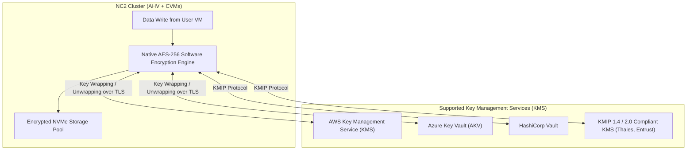

# 14 - Security, Governance & Compliance in NC2

## 1. Enterprise Security Architecture in NC2

Nutanix Cloud Clusters provides a hardened, defense-in-depth security framework built into the hypervisor, storage layer, control plane, and network fabric.

```
+-----------------------------------------------------------------------------------------------+
|                            DEFENSE-IN-DEPTH SECURITY STACK                                    |
+-----------------------------------------------------------------------------------------------+
| Layer 1: Identity & Access      | SAML 2.0 / Entra ID / Okta SSO, RBAC, Multi-Factor Auth.    |
+---------------------------------+-------------------------------------------------------------+
| Layer 2: Network Microsegment   | Flow Network Security, Layer-4 Stateful Firewall, SG/NSG.   |
+---------------------------------+-------------------------------------------------------------+
| Layer 3: Data Protection & DAR  | Software-defined AES-256 Data-at-Rest Encryption (KMS/Vault)|
+---------------------------------+-------------------------------------------------------------+
| Layer 4: Hypervisor & OS        | Hardened AHV / CVM OS, STIG baselines, SCMA self-healing.   |
+---------------------------------+-------------------------------------------------------------+
| Layer 5: Cloud Infrastructure   | AWS IAM Roles, Azure Custom RBAC, GCP Service Accounts.     |
+-----------------------------------------------------------------------------------------------+
```

---

## 2. Data-at-Rest Encryption (DAR) & Key Management (KMS)

NC2 uses software-based AES-256 encryption to protect all data stored in the Distributed Storage Fabric (DSF) without requiring specialized hardware self-encrypting drives (SEDs).



---

## 3. Host Hardening & Automated Drift Correction (SCMA)

*   **Security Configuration Management Automation (SCMA)**: Built-in daemon continuously checks OS configurations against DoD STIG profiles and automatically reverts unauthorized configuration drift every 60 minutes.
*   **Hardened Linux Foundation**: Stripped-down minimal OS kernel; unnecessary packages and services removed to minimize attack surface.
*   **Mutual TLS (mTLS) Inter-Node Comm**: All CVM-to-CVM and CVM-to-AHV management communications are encrypted using internal certificates and TLS 1.3.

---

## 4. Compliance & Certification Standards

| Compliance Framework | Description & Validation |
|---|---|
| **FIPS 140-2 Level 1 & 2** | Validated cryptographic modules for data encryption and secure key handling. |
| **Common Criteria (NDcPP)** | Certified under the Network Device collaborative Protection Profile. |
| **DoD STIG** | Security Technical Implementation Guides certified for United States Department of Defense baselines. |
| **FedRAMP Ready / High** | Compliant control plane architecture for federal government cloud workloads. |
| **SOC 1, SOC 2, SOC 3** | Independent third-party audit reports validating security, availability, and confidentiality. |
| **ISO/IEC 27001, 27017, 27018** | Global standards for information security management and cloud privacy. |
| **PCI-DSS & HIPAA** | Technical controls supporting financial cardholder data environments and healthcare PHI data protection. |
