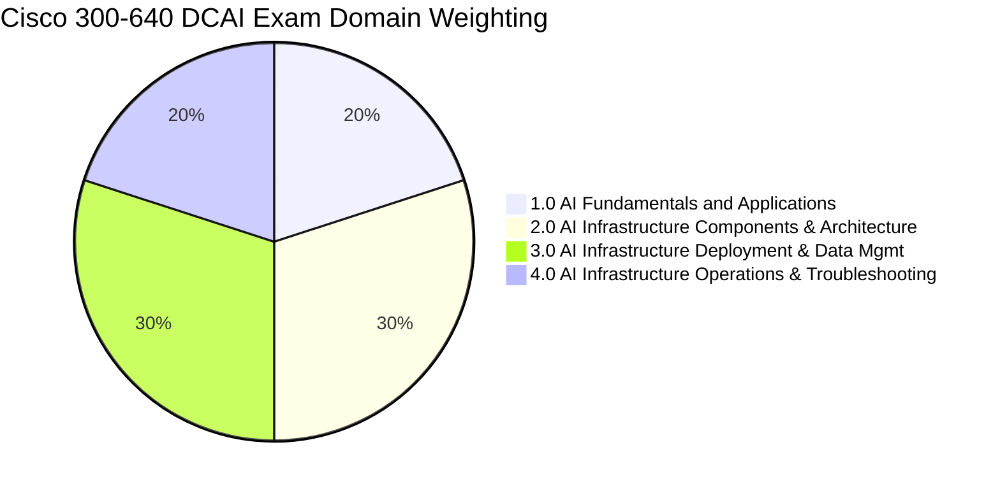

# Cisco 300-640 DCAI Exam Blueprint & Preparation Strategy

> **Exam Code:** 300-640 DCAI  
> **Exam Title:** Implementing Cisco Data Center AI Infrastructure  
> **Associated Certifications:** CCNP Data Center Concentration & Cisco Certified Specialist - Data Center AI Infrastructure  
> **Duration:** 90 Minutes  
> **Question Count:** ~55–65 Questions  
> **Format:** Multiple Choice (Single & Multiple Select), Drag-and-Drop, Scenario-Based Analysis  
> **Passing Score:** ~750–825 / 1000 (Scaled Score)  
> **Official Cisco Curriculum:** [Cisco Learning Network 300-640 DCAI](https://learningnetwork.cisco.com)

---

## 1. Explain Like I'm a Novice: What Is This Exam Actually About?

Imagine a Formula 1 racing team.
- Standard corporate IT is like driving a sensible minivan on suburban roads: traffic stops, starts, makes turns, and if a packet drops, standard TCP will politely tap the brakes, wait a few milliseconds, and retransmit. Nobody notices a minor delay when refreshing an email inbox.
- **AI Data Center Infrastructure is an 800-horsepower Formula 1 race on a razor-thin track.** Eight high-end GPUs inside a single server communicate at thousands of gigabytes per second across specialized buses (`NVLink`). When hundreds of these servers train a massive AI model together, they must continuously exchange gigabytes of matrix math values simultaneously (`AllReduce`).
- If even **one single packet** is dropped or delayed because a switch buffer fills up, all 1,000 GPUs slam on their brakes and sit completely idle waiting for that one packet. You are literally burning hundreds of dollars per minute in wasted electricity and GPU idle time.

**The Cisco 300-640 DCAI exam tests your ability to build the ultimate Formula 1 racetrack:**
1. How to make standard Ethernet completely **lossless** using Priority-based Flow Control (**PFC**) and Explicit Congestion Notification (**ECN**).
2. How to let GPUs talk straight to remote GPUs at 400G/800G without bothering the CPU using **RoCEv2** (RDMA over Converged Ethernet).
3. How to orchestrate heavy compute using **Cisco UCS X-Series**, **Intersight**, **Nexus Dashboard**, and **Nexus Hyperfabric**.
4. How to detect microbursts, pause storms, and fabric bottlenecks before they crash an AI training run.

---

## 2. Blueprint Domains & Score Distribution



| Domain | Weight | Core Focus Areas |
| :--- | :---: | :--- |
| **1.0 AI Fundamentals & Applications** | **20%** | Workload profiles (Training, Inference, RAG, GenAI), AI Lifecycle, Cloud vs On-Prem vs Edge, Hardware fundamentals (GPU, NVLink, Storage), Cisco AI Solutions (AI PODs, AI Canvas, Hyperfabric AI). |
| **2.0 AI Infrastructure Components & Architecture** | **30%** | Network sizing (Bandwidth, Tail Latency, Non-blocking Spine-Leaf), Compute sizing (GPU/CPU ratios, HBM memory, PCIe Gen 5, MIG vs Bare-metal), Storage evaluation (Throughput vs IOPS, Checkpointing, Parallel File Systems, GDS), Power & Cooling (High-density 40kW-100kW racks, Direct-to-Chip liquid cooling, PUE). |
| **3.0 AI Infrastructure Deployment & Data Management** | **30%** | Lossless Ethernet (PFC 802.1Qbb, ECN RFC 3168, ETS 802.1Qaz), RoCEv2 encapsulation & queues, NX-OS MQC QoS configuration, ECMP and Dynamic Load Balancing (DLB), Cisco UCS policies (vNICs, MTU 9216, QoS System Classes, Power/Storage policies), Orchestration tools (Nexus Dashboard / NDFC, APIC, Hyperfabric, Intersight). |
| **4.0 AI Infrastructure Operations & Troubleshooting** | **20%** | AI Benchmarking (NCCL tests, bus vs algo bandwidth, MLPerf, FIO), Monitoring platforms (Nexus Dashboard Insights, Intersight), Telemetry & health (gNMI, INT, Syslog, PFC watchdog, buffer utilization), Root cause troubleshooting (PFC deadlocks, slow drains, RoCE DSCP mismatch, GPU XID errors). |

---

## 3. The 4 Golden Rules to Passing 300-640 DCAI

### Rule 1: Master the "Lossless Ethernet Holy Trinity"
The biggest mental shift from standard networking to AI networking is **Zero Packet Loss**. You must be able to recite and diagram:
- **PFC (Priority-based Flow Control - 802.1Qbb):** The emergency pause brake on specific CoS queues.
- **ECN (Explicit Congestion Notification - RFC 3168):** The polite early-warning system that marks packets so the sender slows down before buffers overflow.
- **ETS (Enhanced Transmission Selection - 802.1Qaz):** The guaranteed bandwidth allocator that prevents one priority from starving another.

### Rule 2: Understand the "AllReduce" Synchronization Barrier
In deep learning training, all GPUs compute forward passes, calculate gradients (backward pass), and then **must synchronize their gradients** across all nodes using collective communications (`AllReduce`).
- In AllReduce, the slowest link or packet determines the speed of the **entire cluster**.
- This is called **Tail Latency Sensitivity**. A single 10-microsecond delay on one switch port can cause 512 GPUs to stall.

### Rule 3: Know the Cisco UCS & Nexus AI Portfolio Inside and Out
Cisco tests specific product capabilities:
- **Compute:** UCS X-Series (X9508 chassis, X210c compute nodes, X440p PCIe GPU nodes supporting NVIDIA H100/L40S).
- **Fabric Interconnects:** UCS 6536 (100G/400G unified fabric).
- **Nexus Switches:** Nexus 9300-GX/GX2, 9400, and 9800 modular chassis (Cloud Scale and Silicon One ASICs supporting 400G/800G, large packet buffers, and hardware DLB).
- **Management:** Intersight (Server profiles), Nexus Dashboard Fabric Controller (NDFC AI templates), Cisco Nexus Hyperfabric (Cloud-managed automated AI fabric).

### Rule 4: Pay Attention to MTU & Buffer Calculus
- AI fabrics **mandate Jumbo Frames (MTU 9000 to 9216)**. Small MTU (1500) wastes CPU/GPU cycles on header overhead and fragments large tensor transfers.
- Switch buffers must have dedicated headroom allocated for PFC pause frame transit time. If headroom is misconfigured, packets drop before the pause signal reaches the sender.

---

## 4. Exam Day Tactics & Time Management

```
Total Time: 90 Minutes | Total Questions: ~60
Average Time Per Question: 1 Minute 30 Seconds
```

1. **Beware the "Select All That Apply" Traps:** Cisco frequently asks questions like: *"Which two mechanisms are required to ensure lossless RoCEv2 transport across a Nexus 9000 fabric?"* (Answer: PFC on CoS 3 and ECN marking with WRED).
2. **Watch for Acronym Overload:** Expect terms like *RoCEv2, PFC, ECN, ETS, CNP, NCCL, GDS, MIG, HBM3e, NDFC, DLB, NDI*. Keep a mental dictionary of each term's exact layer and function.
3. **No Retraction Policy:** On Cisco computer-based tests, once you submit an answer and click **Next**, you **cannot go back** to review previous questions. Budget your time strictly and do not spend more than 2 minutes on any single question.

---

## 5. Knowledge Base Roadmap & Study Plan

Follow this KB systematically to cover 100% of the blueprint:

```
[Module 00: Hardware Primer & Architecture Blueprint]
   ↓
[Module 01: AI Fundamentals, Workload Profiles & Cisco Solutions] (20%)
   ↓
[Module 02: Network, Compute, Storage & Cooling Architecture] (30%)
   ↓
[Module 03: Lossless Fabrics, RoCEv2, UCS & Orchestration Deployment] (30%)
   ↓
[Module 04: Operations, NCCL Benchmarking & Troubleshooting] (20%)
   ↓
[Module 05: Practice Exam Drills & Master Cheat Sheets]
```
