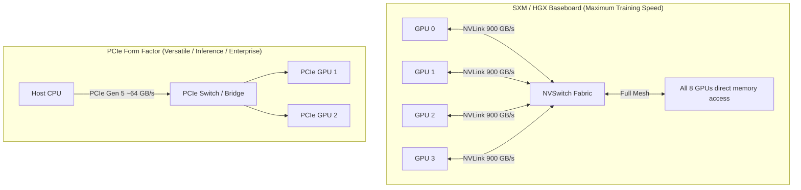
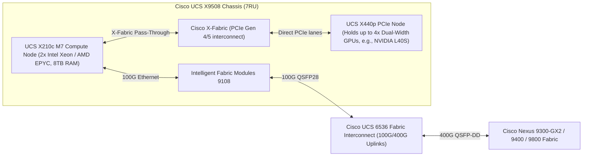

# AI Data Center Hardware Primer — GPUs, Interconnects, & Cisco Systems

> **Official Curriculum Reference:** Domain 1.5 (AI Components), Domain 2.2 (Compute Evaluation), Domain 3.2 (Cisco UCS)  
> **Target Concepts:** NVIDIA SXM vs PCIe, NVLink, NVSwitch, Cisco UCS X-Series (X9508, X210c, X440p), Fabric Interconnects (UCS 6536), Nexus 9000 Series, SuperNICs.

---

## 1. Explain Like I'm a Novice: The CPU vs. GPU Analogy

Imagine building a giant skyscraper:
- **A CPU (Central Processing Unit)** is like a team of **4 to 64 brilliant PhD project architects**. Each architect can solve ridiculously complex logic puzzles, manage permits, handle tax laws, and plan intricate steps sequentially. But if you tell them to personally haul 10,000,000 bricks up a ladder, they will take months because there are only a few of them.
- **A GPU (Graphics Processing Unit)** is like an army of **16,000 muscular construction laborers**. Individual laborers cannot draft architectural blueprints or debate contract law. But if you give them 10,000,000 bricks and say *"everyone carry two bricks at the exact same second"*, they will move the entire mountain in seconds.

### Why does AI need GPUs?
Deep Learning does not do complex branch logic. It does **Matrix Multiplication** ($A \times B = C$).
Every single token predicted by an LLM like ChatGPT requires trillions of parallel additions and multiplications. GPUs excel at this: they process massive arrays of numbers simultaneously (**SIMD / SIMT: Single Instruction, Multiple Threads**).

---

## 2. GPU Form Factors: SXM vs. PCIe

When designing an AI cluster, one of the first design decisions is choosing between **SXM (HGX)** and **PCIe** GPUs.



### SXM vs. PCIe Comparison Table

| Attribute | NVIDIA SXM (HGX H100 / H200 / B200) | Standard PCIe Cards (L40S, H100 NVL PCIe) |
| :--- | :--- | :--- |
| **Physical Form** | Soldered directly onto a high-density HGX motherboard with direct heatsinks/cold plates. | Standard full-height, full-length (FHFL) add-in PCIe cards installed in server slots. |
| **Inter-GPU Bandwidth** | **Up to 900 GB/s per GPU (NVLink 4)** on H100; bidirectional full-mesh via on-board NVSwitches. | Limited to PCIe Gen 5 bus speeds (**64 GB/s**) or 2-way NVLink bridge (~400 GB/s). |
| **Power Consumption** | **700W to 1,000W+ per GPU** (Requires extreme airflow or liquid cooling). | **300W to 350W per GPU** (Standard air-cooled enterprise server fans). |
| **Primary Use Case** | Large-scale **Foundation Model Training** and ultra-low-latency distributed inference. | Fine-tuning, **Inference serving**, Computer Vision, Enterprise AI RAG applications. |
| **Cisco Platform** | Cisco UCS C885A M8 / Dedicated High-Density AI Servers. | Cisco UCS X-Series (via X440p PCIe node) and UCS C240/C245 rack servers. |

---

## 3. The Interconnect Hierarchy: From Millimeters to Kilometers

AI computing requires moving data across multiple physical distances. Bandwidth drops dramatically as physical distance increases:

```
[Level 1: On-Die] GPU HBM3e Memory → 3,350 to 4,800 GB/s (Inside the GPU chip)
       ↓
[Level 2: Intra-Node] NVLink 4 / NVSwitch → 900 GB/s (Between GPUs on same baseboard)
       ↓
[Level 3: Host Bus] PCIe Gen 5 x16 → 64 GB/s (Between GPU and Host CPU/NIC)
       ↓
[Level 4: Inter-Node Cluster Fabric] 400G/800G RoCEv2 Ethernet → 50 to 100 GB/s (Between server racks)
```

> [!IMPORTANT]
> **Exam Trap:** Do not confuse **NVLink** with **RoCEv2**!
> - **NVLink / NVSwitch:** High-speed proprietary GPU-to-GPU interconnect **inside a single server chassis** (scale-up).
> - **RoCEv2 / InfiniBand:** Network fabric connecting **different server chassis across the data center** (scale-out).

---

## 4. Cisco UCS X-Series Architecture for AI

Cisco redesigned the data center compute platform with the **UCS X-Series Modular System**. It bridges traditional blade compute with heavy GPU acceleration.



### 1. UCS X9508 Chassis
- **Form Factor:** 7RU modular chassis.
- **Midplane-Free Design:** Airflow flows front-to-back with zero midplane obstruction. This allows the chassis to support up to 54,000W of redundant power, future-proofing high-wattage AI accelerators.
- **Cisco X-Fabric:** A passive, high-speed PCIe bridge connecting adjacent blade slots.

### 2. UCS X210c M7 Compute Node + UCS X440p PCIe Node
- **The Problem:** Traditional blade servers cannot fit massive double-width GPU cards.
- **The Cisco Solution:** The **X210c** compute node mates horizontally with the **X440p** PCIe node via **X-Fabric**.
- The X440p holds up to **four full-length, dual-width GPUs** (such as NVIDIA L40S or H100 NVL). To the operating system, these GPUs appear directly attached to the host CPU's PCIe lanes!

### 3. UCS 6536 Fabric Interconnect (FI)
- **Role:** The brain and network aggregation point for the UCS domain.
- **Ports:** 36-port 100G/400G switch.
- **Speeds:** Supports 40G, 100G, and 400G Ethernet, plus 32G and 64G Fibre Channel.
- **Throughput:** Delivers up to 7.42 Tbps line-rate switching per Fabric Interconnect.

---

## 5. Cisco Nexus Switching Portfolio for AI

Modern AI workloads demand **Nexus switches with ultra-deep buffers, line-rate 400G/800G, and Silicon One / Cloud Scale ASICs**:

| Switch Family | ASIC Architecture | Ports / Speed | Key AI Capabilities |
| :--- | :--- | :--- | :--- |
| **Nexus 9300-GX2** | Cisco Cloud Scale ASIC | 32 to 64 ports of **400G QSFP-DD** (1RU/2RU fixed) | Native line-rate RoCEv2, Dynamic Packet Buffering, hardware-based PFC & ECN, In-band Network Telemetry (INT). |
| **Nexus 9400 Series** | Cisco Cloud Scale ASIC | High-density 400G modular spine/leaf | Designed for high-scale enterprise spine-and-leaf fabrics with wire-speed performance. |
| **Nexus 9800 Modular** | Cisco **Silicon One** ASIC | 32-port 800G and 400G line cards (4RU, 8RU, 16RU) | Massive line-rate 800G fabric, disaggregated VOQ (Virtual Output Queuing) architecture, zero head-of-line blocking. |

---

## 6. SuperNICs & SmartNICs (The Host-to-Fabric Interface)

In AI servers, a standard 1GbE or 10GbE network card is useless. AI clusters use **SuperNICs** (such as NVIDIA ConnectX-7, ConnectX-8, or Cisco VIC 15000):

1. **GPUDirect RDMA Engine:** The SuperNIC contains direct PCIe DMA engines that pull tensors straight out of GPU High-Bandwidth Memory (HBM) and shoot them directly out onto the 400G fiber.
2. **Congestion Telemetry:** The SuperNIC calculates Round-Trip Time (RTT) down to nanoseconds and generates Congestion Notification Packets (CNP).
3. **Multi-Rail Pairing:** An 8-GPU server typically houses **8 separate 400G SuperNICs**—one dedicated NIC per GPU!

---

## 7. Quick Revision Flash Card Summary

| Component | Function in AI Cluster | Exam Note |
| :--- | :--- | :--- |
| **NVLink** | GPU-to-GPU intra-node bus (up to 900 GB/s) | Scale-up inside a single server. |
| **RoCEv2** | UDP-encapsulated RDMA inter-node protocol | Scale-out across the Nexus fabric. |
| **X440p** | UCS PCIe expansion module | Allows X210c blades to host 4x GPUs via X-Fabric. |
| **UCS 6536** | 36-port 100G/400G Fabric Interconnect | Aggregates UCS AI compute nodes with lossless QoS. |
| **Nexus 9800** | Silicon One modular 800G chassis | Backbone for massive hyperscale AI clusters. |
