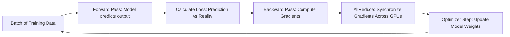
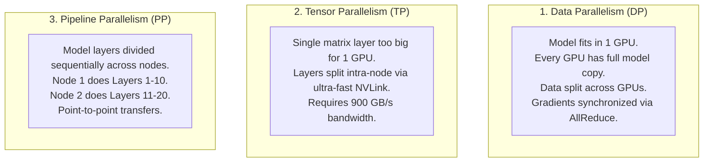
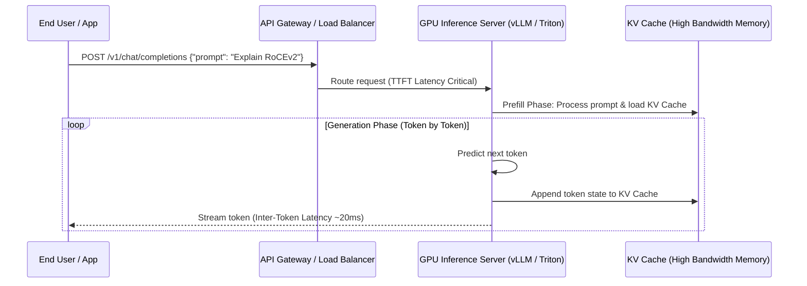
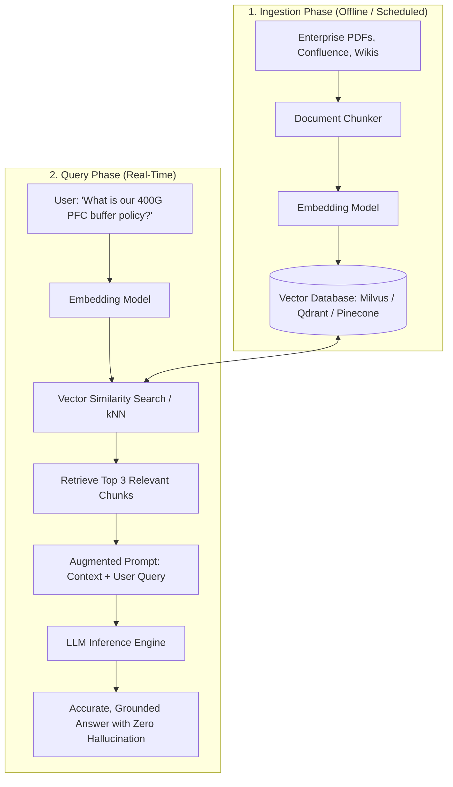

# AI & ML Workload Types — Training, Inference, RAG, & Generative AI

> **Official Curriculum Reference:** Domain 1.1 (Describe AI/ML workload types)  
> **Blueprint Subtopics:**  
> - 1.1.a RAG (Retrieval-Augmented Generation)  
> - 1.1.b Training  
> - 1.1.c Inference  
> - 1.1.d Generative AI  

---

## 1. Explain Like I'm a Novice: The School & Exam Analogy

Understanding AI workloads is simple when you compare it to a student going through university and entering the workforce:

1. **Model Training is Med School (Years of Heavy Labor):**
   - The student reads 500 medical textbooks, studies millions of case files, and practices surgery for 8 years.
   - It requires massive energy, continuous focus, thousands of hours, and sleepless nights.
   - Once med school is complete, the student graduates and receives a diploma (the **trained model weights**).
   - In data centers, **Training** takes weeks or months on hundreds of interconnected GPUs crunching petabytes of raw data.
2. **Inference is the Doctor Diagnosing a Patient in 3 Minutes:**
   - A patient walks into the clinic and says: *"Doctor, my knee hurts when I run."*
   - The doctor does not reread 500 textbooks from scratch. They immediately use the existing neural pathways in their brain to answer: *"It sounds like runner's knee; take ibuprofen and rest."*
   - In data centers, **Inference** takes the trained model, feeds it a prompt, and generates an answer in milliseconds using fractionally less compute.
3. **Generative AI is Writing an Original Essay on Demand:**
   - Instead of just predicting a label (*"Is this picture a cat or a dog?"*), GenAI creates brand-new poems, code, images, or synthetic audio token by token based on probabilistic predictions.
4. **RAG (Retrieval-Augmented Generation) is an Open-Book Exam:**
   - If you ask the doctor: *"What was our specific company travel expense policy updated yesterday at 4:00 PM?"*, they won't know because they graduated med school 3 years ago.
   - Instead of retraining the doctor for another 8 years (which is insanely expensive), the doctor quickly searches the company intranet, opens the PDF, reads the relevant paragraph, and answers your question accurately. That is **RAG**.

---

## 2. Deep Dive: Model Training (Domain 1.1.b)

Training is the process of adjusting the mathematical values (**weights and biases**) of a deep neural network until its predictions match reality.

### The Three Types of Distributed Training Parallelism

When an AI model has 70 billion or 400 billion parameters, it cannot fit into the memory of a single GPU (an NVIDIA H100 has 80GB of VRAM). The workload must be split across multiple GPUs and servers:

1. **Data Parallelism (DP):**
   - The entire model fits onto a single GPU.
   - You duplicate the model across 64 GPUs. Each GPU receives a different chunk of data (e.g., GPU 0 gets sentences 1–100, GPU 1 gets sentences 101–200).
   - At the end of every step, all 64 GPUs must talk to each other to average their learned gradients (**AllReduce**).
2. **Tensor Parallelism (TP):**
   - The mathematical matrices of a single neural network layer are too gigantic to fit inside 80GB of VRAM.
   - The individual matrix rows and columns are split across multiple GPUs.
   - Because this requires communication at every single layer of the network, **TP MUST run over ultra-fast NVLink within a single server chassis**. Running TP across standard Ethernet cables will completely stall the network.
3. **Pipeline Parallelism (PP):**
   - The 80 layers of a model are split like an assembly line: Server A runs layers 1–20, Server B runs layers 21–40, Server C runs layers 41–60, and Server D runs layers 61–80.
   - Output from Server A is forwarded as input to Server B.

---

## 3. Deep Dive: Model Inference (Domain 1.1.c)

Inference is the execution phase where an end-user sends a prompt and the model produces tokens (words, code, pixels).

### Key Performance Metrics for Inference

1. **TTFT (Time To First Token):** How many milliseconds between when the user hits "Enter" and when the first character appears on the screen. Dominated by prompt processing ("Prefill phase").
2. **ITL (Inter-Token Latency) / TPOT (Time Per Output Token):** The speed at which subsequent words stream. If ITL exceeds 50ms, human users perceive the chatbot as "laggy".
3. **KV Caching (Key-Value Caching):** LLMs must remember previous tokens in a conversation. Instead of recalculating past tokens repeatedly, the intermediate attention states are stored in GPU memory (**KV Cache**). As conversations grow, KV Cache consumes immense GPU memory.

### Batch Inference vs. Real-Time Streaming

| Feature | Real-Time / Interactive Inference | Batch Inference |
| :--- | :--- | :--- |
| **SLA Requirement** | Ultra-low latency (< 100ms response). | High throughput, latency-insensitive (hours/overnight). |
| **Example** | Customer service chatbots, autocomplete, real-time fraud scoring. | Offline image classification, nightly document indexing, synthetic data generation. |
| **Infrastructure Strategy** | Distributed across multiple small GPU nodes near the edge or regional DC; optimized for concurrency. | Large GPU pools saturated at 100% duty cycle. |

---

## 4. Deep Dive: Retrieval-Augmented Generation (RAG) (Domain 1.1.a)

RAG connects an LLM to external enterprise databases, document repositories, and live APIs.

### Why Enterprises Prefer RAG over Fine-Tuning
1. **Zero Hallucination:** Answers cite verified corporate sources.
2. **Instant Updates:** Updating knowledge requires adding a document to a vector database in 2 seconds, compared to days of retraining.
3. **Role-Based Access Control (RBAC):** Users only retrieve document chunks their enterprise credentials allow them to view.
4. **Massive Cost Reduction:** Embedding and vector search run on standard cheap CPUs and small GPUs; no massive GPU clusters required.

---

## 5. Deep Dive: Generative AI (Domain 1.1.d)

Generative AI refers to algorithms that generate new content:

1. **Large Language Models (LLMs):** Based on the **Transformer Architecture** (Self-Attention mechanism). Examples: LLaMA 3, GPT-4, Mistral.
2. **Diffusion Models:** Used for high-fidelity image and video generation (Stable Diffusion, Midjourney). They start with random static noise and iteratively denoise the image toward a prompt.
3. **Multimodal AI:** Single models capable of processing and generating text, audio, images, and video simultaneously.
4. **Context Windows:** The maximum number of tokens a model can read in one prompt (e.g., 8K, 32K, 128K, 1M tokens). Larger context windows require exponentially more GPU VRAM for the KV cache ($O(N^2)$ memory scaling).

---

## 6. Exam Traps & Key Distinctions

> [!WARNING]
> **Exam Pitfall 1:** Believing RAG requires GPU training.  
> **Reality:** RAG is strictly an **Inference + Vector Search** pipeline. It does not train the foundation LLM.

> [!WARNING]
> **Exam Pitfall 2:** Confusing Tensor Parallelism with Data Parallelism in networking questions.  
> **Reality:** Tensor Parallelism requires massive microsecond-level bandwidth and **must stay on NVLink within the server**. Data Parallelism synchronizes across the network fabric via **RoCEv2 / AllReduce**.

---

## 7. Quick Revision Summary Table

| Workload Type | Compute Intensity | Network Requirement | Primary Communication Pattern | Key Bottleneck |
| :--- | :--- | :--- | :--- | :--- |
| **Model Training** | Extreme (Weeks/Months) | 400G/800G Lossless RoCEv2 / NVLink | All-to-All / Ring AllReduce | Tail latency, packet drops, fabric congestion |
| **Inference (Real-Time)** | Moderate (Milliseconds) | Standard 25G/100G Leaf-Spine | Client-to-Server request/response | Memory bandwidth, KV cache capacity, TTFT |
| **RAG** | Low-to-Moderate | Standard enterprise LAN + Low-latency DB | Vector similarity search queries | Storage retrieval speed, vector indexing |
| **GenAI LLM Serving** | High Memory Footprint | 100G/400G for multi-GPU serving | Tensor splitting across intra-node GPUs | GPU VRAM capacity ($O(N^2)$ context length) |
