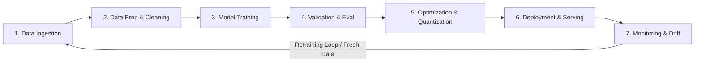
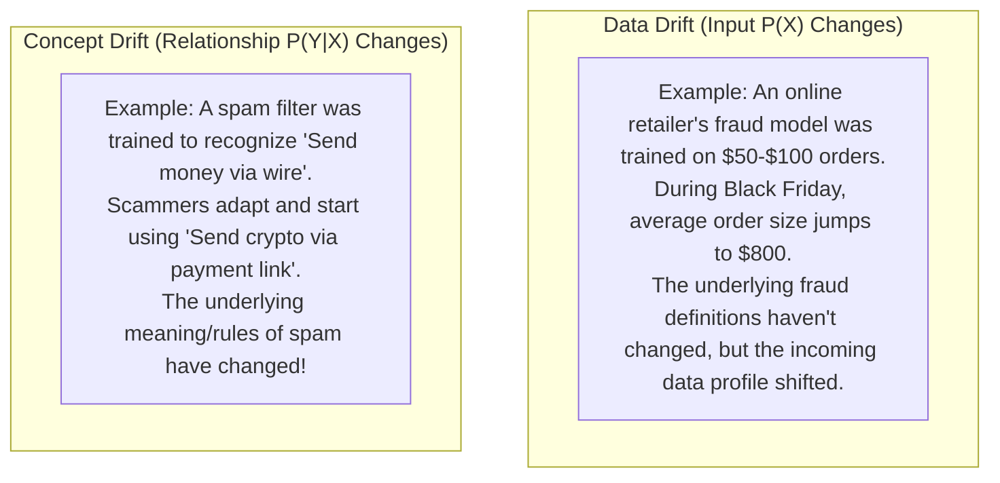

# AI Lifecycle & Enterprise Use Cases — Blueprint Domains 1.2 & 1.3

> **Official Curriculum Reference:**  
> - Domain 1.2: Describe the AI lifecycle  
> - Domain 1.3: Describe AI use cases  

---

## 1. Explain Like I'm a Novice: The Farm-to-Table Restaurant Analogy

Building and running AI is not a one-time project; it is a continuous conveyor belt, exactly like a Michelin-star farm-to-table restaurant:

1. **Phase 1: Sourcing the Raw Produce (Data Collection & Ingestion):**
   - You harvest truckloads of vegetables, meats, and spices from farms across the country.
   - Raw data arrives messy, mixed with dirt, stones, and expired ingredients.
2. **Phase 2: Washing, Peeling, and Chopping (Data Preparation & Cleaning):**
   - Sous chefs wash off the mud, throw out rotten tomatoes, slice carrots into uniform sizes, and label every ingredient container.
   - In AI, **80% of project time** is spent filtering duplicates, removing offensive text, and tokenizing data.
3. **Phase 3: The Master Chef Cooking the Feast (Model Training):**
   - The chef spends hours simmering the broth at precise temperatures, tasting and adjusting seasonings repeatedly until the flavor is perfected.
   - In data centers, this is where hundreds of GPUs burn 400 kilowatts running mathematical gradient descent.
4. **Phase 4: Taste Testing & Inspection (Validation & Evaluation):**
   - Before any dish leaves the kitchen, the head chef inspects the plate: Is it overcooked? Is the temperature right?
   - In AI, the model is tested against unseen benchmark exams to make sure it didn't just memorize the answers.
5. **Phase 5: Flash-Freezing for Meal Kits (Optimization & Quantization):**
   - You can't ship a 10-burner industrial stove to a customer's house. You simplify the recipe and compress the portions so it can be quickly heated anywhere.
   - In AI, we compress 16-bit floating point numbers down to 4-bit integers (**Quantization**) so the model runs on smaller, cheaper inference hardware.
6. **Phase 6: Serving the Dining Room (Deployment & Serving):**
   - Waiters rapidly deliver dishes to hungry tables as orders flow in from the point-of-sale system.
   - In AI, high-availability API endpoints serve predictions to thousands of concurrent users.
7. **Phase 7: Reviewing Customer Feedback & Food Expiration (Monitoring & Drift):**
   - If customer tastes change, or ingredients go out of season, the menu starts getting bad reviews.
   - In AI, models suffer from **Data Drift and Concept Drift**. You must continuously monitor quality and retrain the model with fresh data.

---

## 2. The 7 Phases of the AI Lifecycle (Domain 1.2)

### Phase-by-Phase Technical Breakdown

| Phase | Description & Activities | Infrastructure & Storage Requirements |
| :--- | :--- | :--- |
| **1. Data Ingestion** | Collecting massive datasets from diverse sources (object storage, databases, streaming Kafka feeds, web scrapers). | High-capacity Object Storage (S3, MinIO) and Data Lakes. High sequential ingress bandwidth. |
| **2. Data Preparation** | Deduplication, HTML stripping, PII redaction, data labeling/annotation, tokenization into vector arrays. | CPU-heavy worker clusters (Spark, Ray, Hadoop) with fast local scratch NVMe storage. |
| **3. Training** | Running forward/backward passes over epochs. Continuous mathematical loss minimization. | **GPU clusters (NVIDIA H100/H200)**, 400G/800G lossless RoCEv2, high-throughput parallel file systems (Weka, VAST) for rapid checkpointing. |
| **4. Validation & Evaluation** | Testing model against benchmark datasets (MMLU, GSM8K, HumanEval), safety red-teaming, human feedback (RLHF). | Modest GPU test nodes; high accuracy measurement and logging tools. |
| **5. Model Optimization** | Reducing model size and execution overhead: **Quantization** (FP16 $\to$ INT8/FP8/INT4), Pruning (zeroing inactive weights), Knowledge Distillation, TensorRT compilation. | High-memory CPU/GPU workstations running optimization toolkits (NVIDIA TensorRT-LLM, vLLM, ONNX Runtime). |
| **6. Deployment / Serving** | Exposing models via REST/gRPC APIs, containerized deployment on Kubernetes, multi-instance GPU slicing (MIG). | Low-latency inference clusters, API gateways, load balancers, Cisco UCS X-Series with NVIDIA L40S GPUs. |
| **7. Monitoring & Drift** | Tracking latency, GPU utilization, hallucination rates, concept drift, and data drift over time. | Telemetry systems (Prometheus, Grafana, Cisco Nexus Dashboard Insights, Cisco Intersight). |

---

## 3. Data Drift vs. Concept Drift (Key Exam Concept)

A critical exam distinction is understanding why deployed models degrade over time:

- **Data Drift:** The statistical properties of the **inputs** change over time, even if the target definition remains constant.
- **Concept Drift:** The statistical relationship between the **input data and the target prediction** changes over time.
- **Remediation:** Automated pipelines detect drift through statistical distance tests (e.g., Kolmogorov-Smirnov test) and trigger automated model fine-tuning or full retraining runs.

---

## 4. Enterprise AI Use Cases & Infrastructure Requirements (Domain 1.3)

Cisco categorizes AI enterprise use cases based on their network, compute, and storage profiles:

### 1. Enterprise Search & Knowledge Assistants (RAG)
- **What it does:** Indexes internal documents, manuals, wikis, and Jira tickets so employees can query company data in plain English.
- **Infrastructure Profile:** Modest GPU footprint (often single-node or multi-instance GPU - MIG). High storage IOPS on vector databases. Low network interconnect requirements (standard 25G/100G).

### 2. Computer Vision & Automated Quality Control (Edge AI)
- **What it does:** High-speed video cameras on manufacturing assembly lines inspect circuit boards or automotive parts for micro-defects in real time (< 5ms).
- **Infrastructure Profile:** Ruggedized edge servers (Cisco UCS C-Series or Edge compute), high-throughput camera ingress networking, small footprint inference accelerators (NVIDIA L4).

### 3. Autonomous Driving & Robotics Simulation
- **What it does:** Training autonomous vehicles using sensor feeds (LiDAR, radar, cameras) and synthetic simulation environments (NVIDIA Omniverse).
- **Infrastructure Profile:** Massive compute clusters, petabytes of high-bandwidth video ingestion, ultra-low latency storage, 400G lossless fabrics.

### 4. Predictive Maintenance & Industrial Telemetry
- **What it does:** Analyzes millions of time-series sensor readings per second from jet engines, oil refineries, or data center cooling plants to predict mechanical failure weeks before it happens.
- **Infrastructure Profile:** High-throughput streaming data ingestion (Kafka/Pulsar), time-series databases, CPU/GPU analytics.

### 5. Financial Fraud Detection & High-Frequency Trading
- **What it does:** Evaluates credit card transactions in under 10 milliseconds against complex graph neural networks to block fraudulent charges.
- **Infrastructure Profile:** Deterministic, jitter-free ultra-low-latency networking, kernel-bypass drivers, real-time in-memory databases.

---

## 5. Exam Traps & Real-World Gotchas

> [!TIP]
> **Checkpoints are the Secret Storage Killer:**  
> During Phase 3 (Training), if a GPU fails 4 weeks into an 8-week run, the entire job would be lost without **Checkpoints**. Every 30–60 minutes, the cluster writes hundreds of gigabytes of model weights to storage as fast as possible. If the storage cannot ingest this checkpoint in under 60 seconds, all GPUs stall and wait!

> [!WARNING]
> **Model Quantization Trade-offs:**  
> Moving from FP16 (16-bit) to INT4 (4-bit) shrinks memory footprint by 75% and dramatically speeds up inference, but may introduce slight precision degradation for complex mathematical reasoning tasks.

---

## 6. Quick Revision Summary Table

| Use Case | Latency Sensitivity | Storage Nature | Primary Network Bottleneck |
| :--- | :--- | :--- | :--- |
| **Foundation Training** | Batch (Days/Weeks) | Extreme write throughput (Checkpoints) | Back-end fabric AllReduce sync |
| **Enterprise RAG** | Interactive (< 2 sec) | High random read IOPS (Vector DB) | Standard front-end API routing |
| **Factory Edge Vision** | Real-Time (< 10 ms) | Local scratch / video buffer | Ingress camera streaming bandwidth |
| **Financial Fraud** | Real-Time (< 5 ms) | In-memory key-value cache | Network serialization jitter & tail latency |
