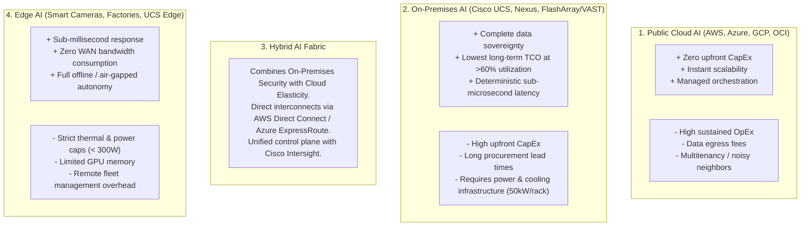
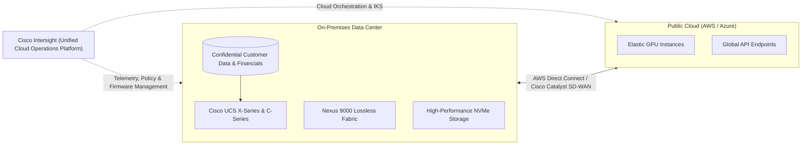

# AI Infrastructure Deployment Models — Cloud, Hybrid, On-Premises, & Edge

> **Official Curriculum Reference:** Domain 1.4 (Describe the types of AI infrastructure)  
> **Blueprint Subtopics:**  
> - 1.4.a Cloud  
> - 1.4.b Hybrid  
> - 1.4.c On-premises  
> - 1.4.d Edge AI  

---

## 1. Explain Like I'm a Novice: The Housing Analogy

Choosing where to run your AI workloads is just like choosing where to live:

1. **Public Cloud AI is Staying at a Luxury Hotel (Cloud):**
   - You don't have to buy furniture, install plumbing, or replace the roof. You just check in, swipe your credit card, and get an air-conditioned room with 8x H100 GPUs in 5 minutes.
   - **The Catch:** If you stay there for 2 years straight, the hotel bill will cost more than buying an entire suburban mansion. Plus, the hotel staff could theoretically walk into your room, and taking your furniture home requires paying expensive moving fees (**Cloud Data Egress Fees**).
2. **On-Premises AI is Buying Your Own Custom Mansion (On-Premises):**
   - You buy the land, pour the foundation, install heavy electrical wiring, and buy high-end appliances.
   - It requires a massive upfront investment (**CapEx**), specialized engineering staff, and months of build time.
   - **The Benefit:** Once built, your monthly cost is just electricity. You have 100% privacy, your proprietary data never leaves your property, and you can push your hardware to the absolute limit 24/7/365 without paying per-minute rental charges.
3. **Hybrid AI is Owning a Home and Renting an Airbnb for Family Reunions (Hybrid):**
   - You live in your private, secure house for everyday life (steady-state inference and sensitive customer data).
   - When a massive project arrives that requires 500 extra GPUs for 3 weeks, you rent cloud capacity temporarily, finish the job, and shut it down (**Cloud Bursting**).
4. **Edge AI is a Portable Camping Stove in Your Backpack (Edge):**
   - You are hiking in the deep mountains with zero cell phone signal. You can't call a luxury hotel or use your kitchen stove at home. You need a compact, low-battery stove right there in your hands to cook dinner.
   - In AI, **Edge AI** runs right next to cameras, drones, or robotic arms without needing an internet connection.

---

## 2. Deep Dive: The 4 AI Infrastructure Models



---

## 3. Comprehensive Model Evaluation Matrix

| Metric / Dimension | Public Cloud AI | On-Premises Private AI | Hybrid AI | Edge AI |
| :--- | :--- | :--- | :--- | :--- |
| **Primary Financial Model** | **OpEx** (Continuous monthly billing per GPU-hour). | **CapEx** (Upfront hardware purchase amortized over 3–5 years). | Balanced (Baseline CapEx + Elastic OpEx for spikes). | CapEx (Distributed edge gateways and ruggedized boxes). |
| **Time to First Token / Deployment** | Minutes (Provision via Terraform/Console). | Months (Procurement, racking, cabling, liquid cooling). | Moderate (Existing on-prem plus pre-wired cloud links). | Weeks (Deploying pre-packaged appliances to remote sites). |
| **Data Privacy & Compliance** | Shared responsibility; subject to cloud provider terms. | **Absolute sovereignty**; ideal for HIPAA, PCI-DSS, ITAR, defense. | Sensitive data stays on-prem; sanitized embeddings push to cloud. | Completely air-gapped; video/sensor data never leaves the premises. |
| **Network Latency** | Variable (WAN traversal: 15ms–80ms). | **Sub-microsecond** intra-fabric; 1ms–5ms campus. | Low on-prem, moderate across dedicated cloud direct connects. | **< 1 millisecond** (Sensor-to-inference directly on PCIe/bus). |
| **Network Egress Costs** | Expensive ($0.05 to $0.09 per GB downloaded). | **$0.00** (You own the switches and fiber). | Minimal (Only sanitized inference payloads traverse WAN). | **$0.00** (Data processed locally; only alerts sent upstream). |
| **Ideal Workload** | Rapid prototyping, unpredictable burst training, short AI hackathons. | 24/7 Foundation Model Training, persistent enterprise RAG, high-security IP. | Steady-state on-prem training + multi-region cloud consumer inference. | Computer vision on conveyor belts, autonomous robots, smart hospitals. |

---

## 4. Architectural Deep Dive: Hybrid AI with Cisco Intersight

A premier testable topic on Cisco DCAI is how Cisco enables **Hybrid AI architectures**:



### Key Components of Cisco Hybrid AI:
1. **Cisco Intersight:** Serves as the single pane of glass. An administrator can manage physical UCS servers in an on-premises data center and orchestrate Kubernetes clusters in public clouds simultaneously.
2. **Data Gravity & Sovereignty Strategy:**
   - Raw, regulated, or confidential datasets remain safely on-premises inside the enterprise firewall.
   - Fine-tuned, sanitized models or specialized inference endpoints can be deployed out to public clouds near global consumers.
3. **Dedicated Interconnects:** Cisco Nexus switches connect via high-bandwidth MACsec-encrypted links directly into AWS Direct Connect or Azure ExpressRoute for hybrid data synchronization.

---

## 5. Edge AI Constraints & Considerations

When designing Edge AI infrastructure, the rules of normal data centers do not apply:

```
Normal Data Center: Unlimited cooling, 3-phase 415V power, clean room, 100G fiber.
Edge Environment:   Greasy factory floor, 110V wall outlet, high vibration, zero IT staff.
```

### Critical Edge Design Factors:
- **SWaP-C (Size, Weight, Power, and Cost):** Edge nodes must operate within tightly constrained thermal limits (often < 350W per node).
- **Physical Hardening:** Fanless designs or filtered airflow to survive dust, moisture, and extreme temperature fluctuations (-20°C to 55°C).
- **Zero-Touch Provisioning (ZTP):** Edge nodes must automatically configure themselves upon plugging into power and network via Cisco Intersight.
- **Model Optimization:** Foundation models must be quantized to INT4 or pruned to fit inside compact edge inference cards (e.g., NVIDIA L4 or Jetson modules).

---

## 6. Exam Pitfalls & Key Takeaways

> [!TIP]
> **The 60% Utilization TCO Rule:**  
> On the DCAI exam, understand the economic inflection point: If an enterprise utilizes cloud GPUs at **over 60% steady-state utilization**, building an **On-Premises AI cluster with Cisco UCS and Nexus** is significantly more cost-effective over a 3-year amortization period than renting cloud instances.

> [!WARNING]
> **WAN Latency Kills Distributed Training:**  
> Never attempt to split a single distributed training job across Hybrid Cloud (e.g., 4 GPUs on-prem and 4 GPUs in AWS). The WAN round-trip time (30ms) will destroy the AllReduce synchronization barrier. Distributed training must be co-located within a single physical data hall.

---

## 7. Quick Revision Flash Cards

| Concept | Primary Driver | Cisco Solution Component |
| :--- | :--- | :--- |
| **Data Sovereignty** | Legal compliance (GDPR/HIPAA) preventing cloud storage | Cisco UCS on-premises compute with self-encrypting NVMe |
| **Cloud Bursting** | Handling seasonal spikes without over-provisioning CapEx | Cisco Intersight hybrid workload management |
| **Sub-Millisecond Inference** | Real-time industrial automation & safety systems | Cisco UCS C220/C240 Edge nodes with NVIDIA L4 accelerators |
| **Data Egress Mitigation** | Eliminating unpredictable hyperscaler download fees | On-premises Nexus 9000 storage & AI compute fabrics |
