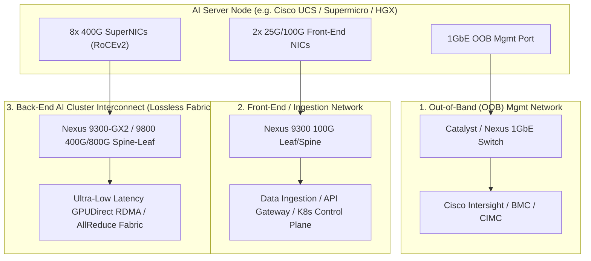
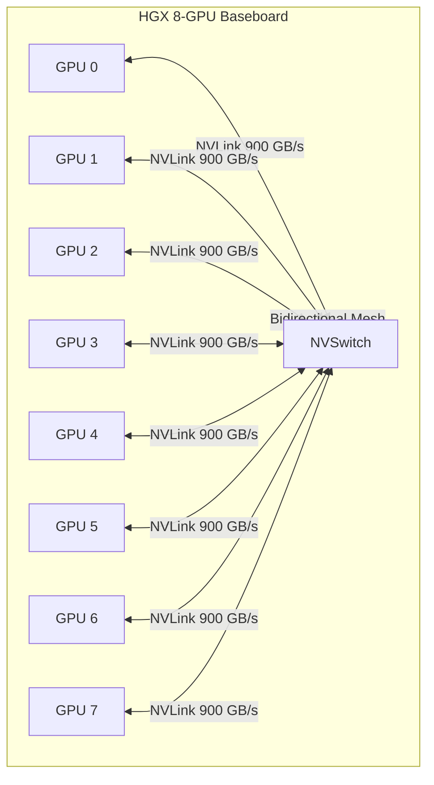
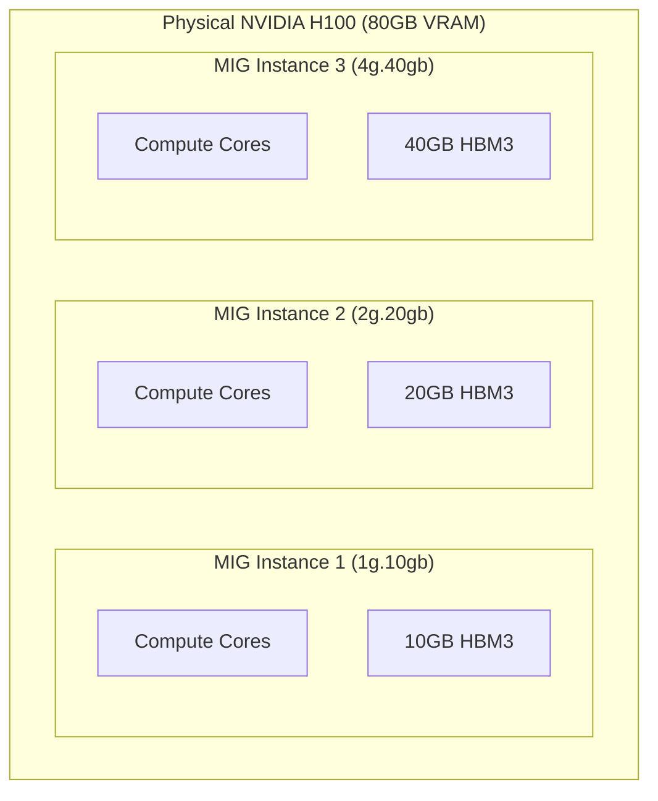
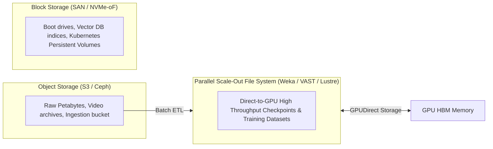

# Core Components of an AI Environment — Network, Compute, Containers, Orchestration, & Storage

> **Official Curriculum Reference:** Domain 1.5 (Describe the components used for AI environments)  
> **Blueprint Subtopics:**  
> - 1.5.a Network  
> - 1.5.b Compute and GPUs deployment (NVLink)  
> - 1.5.c Virtualization and containerization  
> - 1.5.d Orchestration  
> - 1.5.e Monitoring  
> - 1.5.f Storage such as SAN, Fibre Channel, NVMe, Block and File  

---

## 1. Explain Like I'm a Novice: The Professional Kitchen Ecosystem

Think of an enterprise AI cluster as a massive industrial kitchen catering a 5,000-guest state banquet:

1. **The Chefs (Compute & GPUs):** The line cooks chopping, sautéing, and plating food at blinding speed. Their hands are connected via super-fast body reflexes (**NVLink**).
2. **The Waitstaff Corridors (The Network):**
   - **The Front-of-House (Front-End Network):** The quiet carpeted dining room where waiters greet guests and take orders (Client API traffic).
   - **The Back-of-House Expressway (Back-End AI Fabric):** A high-speed, stainless-steel corridor where line cooks sprint with giant pots of boiling soup. If anyone drops a pot or stops in the doorway, everything collides (**Lossless 400G RoCEv2 Fabric**).
3. **The Kitchen Prep Stations (Containers & Virtualization):** Clean, standardized stainless steel tables where ingredients are isolated so fish oils don't contaminate pastries (**Docker / Kubernetes / MIG**).
4. **The Expediter with the Bell (Orchestration):** The head expediter shouting order tickets: *"Table 4 needs 8 steaks, fire station 2!"* That is **Slurm or Ray/Kubernetes**.
5. **The Walk-in Freezers & Pantries (Storage):**
   - **The Giant Cold Storage Warehouse (Object / Block Storage):** Holds tons of raw frozen meat.
   - **The Speed-Rack Next to the Stove (High-Performance Parallel File System):** Flash-fast NVMe storage feeding ingredients directly into the chef's hands (**GPUDirect Storage**).
6. **The Food Safety Inspectors (Monitoring):** Sensors tracking grill temperatures, refrigerator humidity, and chef heart rates (**DCGM & Nexus Dashboard Insights**).

---

## 2. Component 1: Network Architecture (Domain 1.5.a)

AI clusters physically separate traffic into **three distinct networks**:



### Front-End vs. Back-End Network Comparison

| Feature | Front-End Network | Back-End Cluster Fabric |
| :--- | :--- | :--- |
| **Speed** | 25GbE / 100GbE | **400GbE / 800GbE** |
| **Loss Profile** | Standard Lossy (TCP handles retransmits) | **Strictly Lossless** (PFC + ECN + RoCEv2) |
| **Traffic Type** | North-South (APIs, Kubernetes API, SSH, OS updates) | **East-West** (GPU-to-GPU tensor exchange, AllReduce) |
| **Switching Platform** | Cisco Nexus 9300 standard leaf | Cisco Nexus 9300-GX2 / 9400 / 9800 (Cloud Scale / Silicon One) |

---

## 3. Component 2: Compute & GPUs (Domain 1.5.b)



- **NVLink:** Proprietary high-speed bus connecting NVIDIA GPUs. An H100 provides up to **900 GB/s bidirectional bandwidth per GPU**—over 14 times faster than PCIe Gen 5!
- **NVSwitch:** On-board switching chip that creates a non-blocking, all-to-all crossbar between all 8 GPUs on the baseboard. Any GPU can read or write to any other GPU's memory as if it were a single giant memory pool.
- **GPUDirect RDMA:** Allows a network card (SuperNIC) to directly transfer data between GPU High Bandwidth Memory (HBM) across remote servers without copying data through the host CPU or system RAM.

---

## 4. Component 3: Virtualization & Containerization (Domain 1.5.c)

Modern AI infrastructure runs almost exclusively on **Containers (Docker / Podman / containerd) managed by Kubernetes or Red Hat OpenShift**.

### The Multi-Instance GPU (MIG) Architecture

When serving small models or running inference, assigning an entire 80GB H100 to one small task is financially wasteful. NVIDIA introduced **MIG (Multi-Instance GPU)**:



- **Hardware Isolation:** Unlike software time-slicing (where jobs take turns sharing memory), **MIG physically partitions the GPU silicon** into up to 7 independent instances.
- **Dedicated Memory & Bus:** Each instance has dedicated memory, memory controllers, and compute engines. If one customer's job crashes or runs an infinite loop, other tenants are completely unaffected.
- **NVIDIA GPU Operator on OpenShift/K8s:** Automates the injection of NVIDIA kernel drivers, container runtime hooks, and MIG discovery into Kubernetes pods.

---

## 5. Component 4: Orchestration (Domain 1.5.d)

AI clusters use two distinct orchestration paradigms:

```
                  ┌── Slurm (HPC Workloads: Batch, MPI, Fixed Compute Jobs)
AI Orchestration ─┤
                  └── Kubernetes / Ray (Cloud-Native AI: Microservices, APIs, Dynamic Scaling)
```

1. **Slurm (Simple Linux Utility for Resource Management):**
   - The gold standard for scientific supercomputers and traditional foundation model training.
   - High-throughput batch scheduler that locks down $N$ dedicated nodes for weeks with zero virtualization overhead.
2. **Kubernetes (K8s) & KubeFlow / Ray:**
   - Cloud-native framework favored by enterprise software teams.
   - Ideal for inference serving, automated scaling, continuous integration, and RAG pipelines.
3. **Cisco Intersight & Nexus Hyperfabric:**
   - Provides bare-metal orchestration and lifecycle management underneath Kubernetes and Slurm clusters.

---

## 6. Component 5: Monitoring & Telemetry (Domain 1.5.e)

Operating an AI cluster without telemetry is suicide. Monitoring requires full-stack visibility:

```
[Application Layer]   PyTorch / Hugging Face loss curves, tokens/sec
        ↓
[Compute Layer]       NVIDIA DCGM (Data Center GPU Manager): Temp, Wattage, Clocks, XID errors
        ↓
[Network Layer]       Cisco Nexus Dashboard Insights: PFC pause frames, buffer drops, microbursts
        ↓
[Infrastructure]      Cisco Intersight: Chassis power draw, fan speed, optic laser power, firmware
```

- **NVIDIA DCGM (Data Center GPU Manager):** An embedded agent that monitors GPU health, throttle reasons (thermal vs power caps), PCIe link bandwidth, and memory ECC errors.
- **Cisco Nexus Dashboard Insights (NDI):** Ingests streaming telemetry (gNMI/INT) to detect microsecond buffer spikes before packet drops trigger training crashes.

---

## 7. Component 6: Storage Ecosystem (Domain 1.5.f)

AI workloads have unique storage demands across the three classic storage types:



### 1. High-Performance Parallel File Systems (Weka, VAST Data, Lustre)
- Training requires feeding millions of tiny image or text files to GPUs without choking POSIX metadata servers.
- Parallel file systems distribute file metadata across hundreds of NVMe storage nodes, delivering **terabytes per second of read throughput**.

### 2. GPUDirect Storage (GDS)
- Bypasses the host CPU and Linux page cache.
- NVMe-oF network packets containing storage data are read directly into GPU High-Bandwidth Memory (HBM) over PCIe/NVLink.
- **Benefits:** Cuts end-to-end latency by 50% and offloads up to 80% of host CPU utilization during checkpoint operations.

---

## 8. Exam Traps & Real-World Gotchas

> [!IMPORTANT]
> **Exam Distinction: SAN vs. Parallel File System:**  
> Traditional SAN (Fibre Channel or standard iSCSI) is designed for transactional databases (high IOPS, moderate bandwidth). **AI Training requires massive sequential streaming throughput**, which is uniquely provided by **NVMe-oF and Parallel File Systems (e.g., Weka / VAST)**.

> [!WARNING]
> **NVIDIA MIG vs. vGPU:**  
> - **MIG:** Physical hardware partitioning on A100/H100/B200. Zero software licensing overhead, rigid memory allocations.  
> - **vGPU:** Hypervisor-based software time-slicing managed by NVIDIA vGPU software (often requires NVIDIA AI Enterprise licenses).

---

## 9. Quick Revision Summary Table

| Component | Technology | Primary Function in AI Cluster |
| :--- | :--- | :--- |
| **Intra-Node Compute** | NVLink / NVSwitch | 900 GB/s GPU-to-GPU tensor exchange within node |
| **Inter-Node Fabric** | 400G/800G RoCEv2 (Nexus 9000) | Lossless scale-out network fabric |
| **GPU Slicing** | NVIDIA MIG | Partitions 1 physical GPU into up to 7 isolated hardware instances |
| **Storage Acceleration** | GPUDirect Storage (GDS) | Direct NVMe-to-GPU data path bypassing CPU memory |
| **GPU Monitoring** | NVIDIA DCGM | Tracks GPU clock throttling, XID errors, and power/thermal states |
| **Fabric Telemetry** | Cisco Nexus Dashboard Insights | Tracks microbursts, buffer occupancy, and PFC pause storms |
