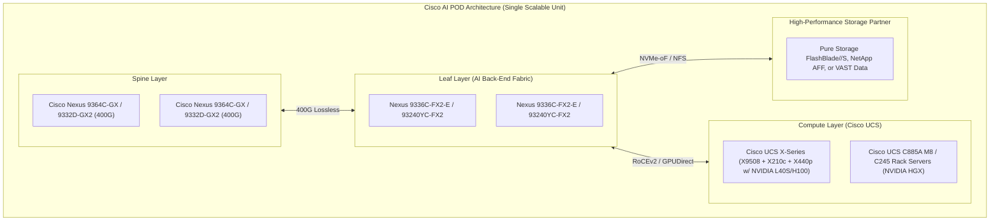
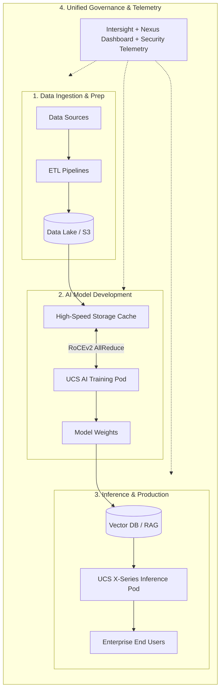
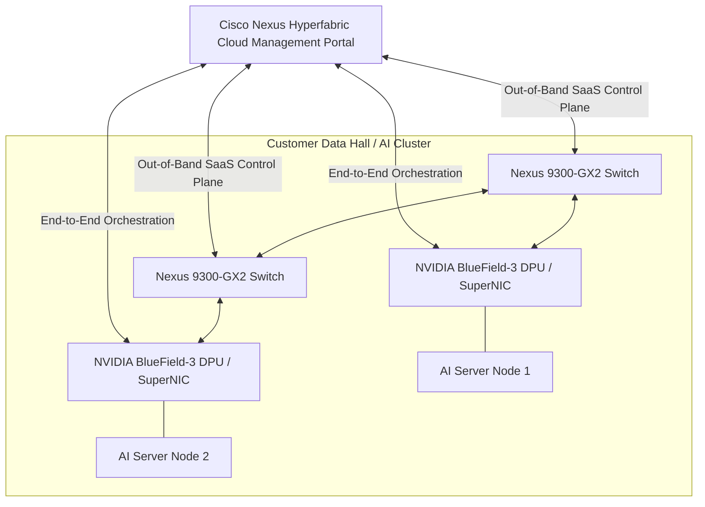

# Cisco AI Architectural Solutions — AI PODs, AI Canvas, & Nexus Hyperfabric

> **Official Curriculum Reference:** Domain 1.6 (Describe Cisco AI solutions)  
> **Blueprint Subtopics:**  
> - 1.6.a AI PODs  
> - 1.6.b AI Canvas  
> - 1.6.c Hyperfabric AI  

---

## 1. Explain Like I'm a Novice: The Turnkey Supercar Analogy

Building an AI cluster from loose parts is like ordering 5,000 engine valves, carbon-fiber panels, pistons, and turbochargers from 12 different catalogs and trying to assemble an 800-horsepower racecar in your garage:
- You will spend months fighting compatibility issues, misaligned bolts, overheating coolant pipes, and software bugs.

**Cisco provides three turnkey solutions to eliminate this nightmare:**

1. **Cisco AI PODs (The Certified Factory Assembly Kit):**
   - Instead of guessing, Cisco engineers work with NVIDIA, Pure Storage, NetApp, and VAST Data to pre-engineer, pre-test, and certify an entire rack of compute, storage, and networking down to the exact cable length and optics.
   - If you follow the **Cisco Validated Design (CVD)**, Cisco guarantees that 128 GPUs will work at peak performance with zero packet drops out of the box.
2. **Cisco AI Canvas (The Master Architect's Blueprint):**
   - A structured visual framework and planning methodology that helps enterprises map out their entire AI journey: from raw data ingestion sources, ETL pipelines, training clusters, and storage tiers, all the way to customer-facing inference APIs.
3. **Cisco Nexus Hyperfabric (The Cloud-Managed Autonomous Co-Pilot):**
   - Historically, configuring lossless RoCEv2 required typing hundreds of lines of complex QoS, buffer, and queuing commands on every switch.
   - **Nexus Hyperfabric** is a cloud-managed SaaS orchestrator. You plug in your Nexus switches and NVIDIA servers, open a clean web dashboard, click *"Deploy AI Cluster"*, and the cloud automatically configures wire-speed lossless fabrics, monitors real-time telemetry, and optimizes GPU networking without manual CLI friction.

---

## 2. Cisco AI PODs (Domain 1.6.a)

A **Cisco AI POD** is a standardized, modular building block designed as a **Cisco Validated Design (CVD)**.

### Key Pillars of a Cisco AI POD:
1. **Predictable Scaling:** Enterprises don't buy random servers; they buy PODs. Need double the capacity? Deploy POD #2 and connect it to the spine.
2. **Pre-Validated Buffer Sizing:** PFC pause thresholds, ECN WRED minimum/maximum markings, and queue buffer depths are tested and pre-baked into configuration templates.
3. **Partner Ecosystem Integration:**
   - **Compute/GPU:** NVIDIA HGX H100/H200 and PCIe L40S.
   - **Storage Partners:** Certified CVDs with Pure Storage FlashBlade, NetApp ONTAP AI, and VAST Data Universal Storage.
   - **Management:** Unified deployment via Cisco Intersight and Nexus Dashboard Fabric Controller (NDFC).

---

## 3. Cisco AI Canvas (Domain 1.6.b)

The **Cisco AI Canvas** is an architectural modeling and planning framework used by enterprise architects to design end-to-end AI infrastructure.

### Purpose of the AI Canvas:
- **Demystifies Complex Workflows:** Maps business applications to the required underlying compute, network, storage, and security layers.
- **Identifies Architectural Bottlenecks:** Shows architects where data stalls (e.g., between cold object storage and GPU cache) before hardware is ordered.
- **Enforces Security & Data Governance:** Visualizes where sensitive customer data lives, ensuring clear tenant boundaries, zero-trust network policies, and encryption in flight.

---

## 4. Cisco Nexus Hyperfabric AI (Domain 1.6.c)

Announced as Cisco's flagship AI innovation in partnership with **NVIDIA**, **Nexus Hyperfabric** revolutionizes how AI clusters are deployed and operated.

### What Makes Nexus Hyperfabric Revolutionary?
1. **Single Pane of Glass from Cloud to Silicon:**
   - Managed via an intuitive cloud SaaS portal (similar to Cisco Meraki, but built for 800G AI supercomputing).
2. **Automated Lossless Fabric Configuration:**
   - Eliminates the need to manually configure PFC, ECN, ETS, queuing maps, and MTU 9216.
   - The platform auto-provisions switches with Cisco-tested, AI-optimized profiles.
3. **End-to-End Visibility (Switch + SuperNIC/DPU):**
   - Hyperfabric manages not just the **Nexus switches**, but integrates directly with the **NVIDIA BlueField DPUs / ConnectX SuperNICs** on the servers.
   - If a flow experiences congestion, Hyperfabric detects whether the bottleneck is on the switch port, the transceiver laser, or the GPU host memory bus.
4. **Real-Time Automated Remediation:**
   - Automatically re-routes traffic around degraded links without dropping training jobs.

---

## 5. Exam Comparison & Distinctions

| Solution | Primary Delivery Model | Target Customer / Use Case | Management Interface |
| :--- | :--- | :--- | :--- |
| **Cisco AI POD** | Pre-engineered hardware design (Cisco Validated Design) | Large enterprises deploying turnkey, on-prem AI clusters with certified storage partners. | Cisco Intersight + Nexus Dashboard (NDFC). |
| **Cisco AI Canvas** | Conceptual planning and sizing framework | Solutions architects and system engineers mapping end-to-end AI workflows and data flows. | Visual architectural whiteboard / methodology tool. |
| **Nexus Hyperfabric** | Cloud-managed SaaS solution with NVIDIA integration | Enterprises seeking cloud-like simplicity for deploying and managing high-performance AI fabrics. | Cloud-hosted Nexus Hyperfabric portal. |

---

## 6. Exam Pitfalls & Key Takeaways

> [!TIP]
> **Hyperfabric is Cloud-Managed, but Traffic is 100% On-Prem:**  
> On the exam, remember that Cisco Nexus Hyperfabric is a **cloud-managed control and operations plane**. The actual user data and high-speed GPU RoCEv2 traffic never leaves the on-premises data center switches!

> [!WARNING]
> **CVDs Guarantee Zero-Drop Performance:**  
> A question may ask: *"How does an enterprise minimize deployment risk and eliminate buffer tuning complexity when implementing a multi-node AI cluster?"*  
> **Answer:** Deploy a **Cisco Validated Design (CVD) AI POD**.

---

## 7. Quick Revision Flash Card Summary

| Term | Quick Definition | Key Exam Keywords |
| :--- | :--- | :--- |
| **AI POD** | Pre-validated modular architecture combining UCS, Nexus, and certified storage. | CVD, turnkey, validated design, scalable building block. |
| **AI Canvas** | Visual design methodology for end-to-end AI pipelines. | Workflow mapping, data lifecycle, pipeline visualization. |
| **Nexus Hyperfabric** | Cloud-managed automated AI fabric solution co-developed with NVIDIA. | SaaS orchestration, automated RoCEv2, switch + DPU visibility. |
