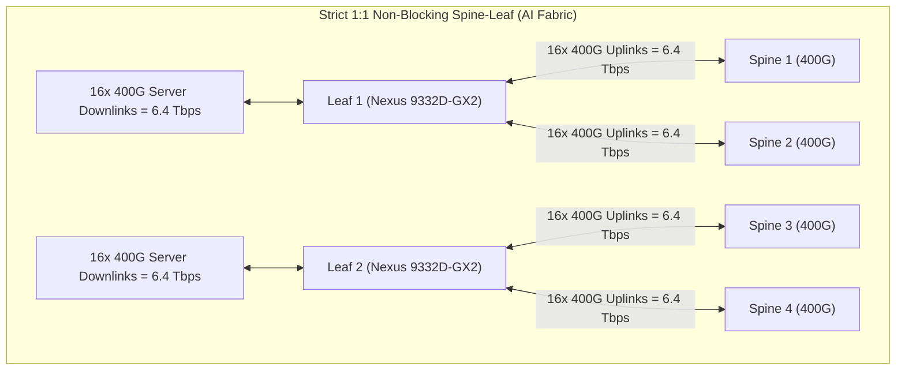
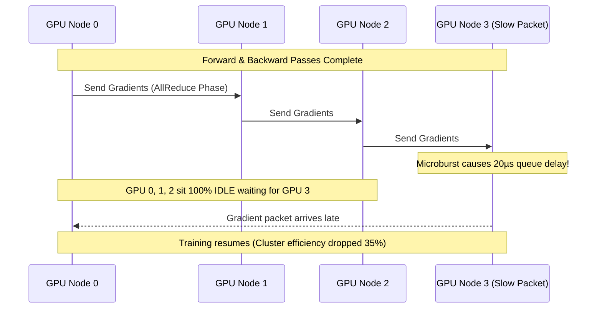
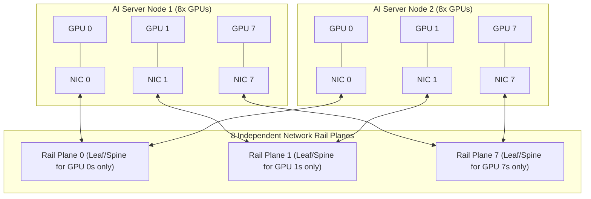

# Network Architecture Evaluation for AI Workloads — Blueprint Domain 2.1

> **Official Curriculum Reference:** Domain 2.1 (Evaluate network deployment based on AI workload requirements)  
> **Blueprint Subtopics:**  
> - Bandwidth (400G/800G, Non-blocking, 1:1 Oversubscription)  
> - Latency & Tail Latency (Microsecond Jitter, AllReduce Barriers)  
> - Redundancy (Dual-Rail, Multi-Plane, Fast Failover)  
> - Scalability (Rail-Optimized Spine-Leaf, Clos / Fat-Tree Topologies)  
> - Security (Tenant Segmentation, Zero-Trust, MACsec)  

---

## 1. Explain Like I'm a Novice: The Marching Band Analogy

Imagine a high school marching band with 500 musicians performing at the Super Bowl halftime show:

1. **Bandwidth is the Width of the Field:**
   - If the gates to the field are narrow, 500 musicians get stuck in a bottleneck and stumble over each other. You need giant 40-foot wide entrance tunnels so everyone can sprint onto the field at once (**400G and 800G Ethernet**).
2. **Tail Latency is the Slowest Drummer:**
   - If 499 musicians play their instruments on the exact beat, but **one drummer is delayed by half a second**, the entire musical song sounds like a chaotic train wreck. The conductor must pause the entire band until that one slow drummer catches up.
   - In AI distributed training, **this is the AllReduce barrier**. If 1,024 GPUs are calculating math, and a single network switch delays a single packet by 15 microseconds, all 1,024 GPUs stall and wait. That slow packet is the **Tail Latency**.
3. **Rail-Optimized Topology is Dedicated Lanes for Each Instrument Group:**
   - Instead of mixing tubas, flutes, drums, and trumpets into one giant mob, you build 8 parallel walking tracks. All flutes walk on Track 1, all trumpets on Track 2, and all drums on Track 3. They never collide.
   - In AI clusters, **Rail-Optimization** connects GPU 0 across all servers to a dedicated Switch Leaf Plane, GPU 1 to Plane 2, etc.

---

## 2. Bandwidth & Oversubscription Calculus (Domain 2.1)

In enterprise corporate networks, switches are routinely designed with **3:1 or 4:1 oversubscription** (meaning 400 Gbps of server downlinks share a single 100 Gbps uplink to the spine), because average office workers only use network bursts occasionally.

```
Enterprise LAN:  Oversubscription 3:1 to 5:1 (Acceptable: humans don't notice minor queuing)
AI Back-End Fabric: Oversubscription STRICTLY 1:1 (Non-Blocking: Mandatory for AI Training)
```



### The 1:1 Non-Blocking Golden Rule
- **Total Downlink Bandwidth = Total Uplink Bandwidth.**
- Example: If a Nexus 9332D-GX2 switch has 32 ports of 400G (12.8 Tbps total capacity):
  - **16 ports (6.4 Tbps)** connect downstream to GPUs.
  - **16 ports (6.4 Tbps)** connect upstream to Spines.
- Any oversubscription greater than 1:1 will cause instantaneous buffer overflows and massive PFC pause storms during distributed AllReduce bursts.

---

## 3. Latency, Jitter, & Tail Latency Sensitivity

In standard web apps, an engineer measures **average latency** (e.g., *"Our average ping is 2 milliseconds"*).  
In AI distributed training, **average latency is completely irrelevant; only Tail Latency (p99 and p99.9) matters.**



### Why Tail Latency Ruins Training:
- Deep learning training runs in synchronized computational cycles (steps).
- All GPUs must complete their gradient exchange before the next step's weights can be updated.
- **Amortized Loss:** A 1% packet delay on one node creates a cluster-wide speed penalty that compounds across hundreds of thousands of steps over weeks.

---

## 4. Rail-Optimized Fabric Architecture (The Gold Standard)

To eliminate cross-GPU traffic collisions inside the network, modern AI clusters use a **Rail-Optimized Spine-Leaf Architecture**:



### How Rail-Optimization Works:
1. Inside each server, an 8-GPU baseboard (HGX) assigns **one dedicated 400G NIC to each GPU** (NIC 0 pairs with GPU 0, NIC 1 pairs with GPU 1, etc.).
2. The network fabric is physically or logically divided into **8 separate Rail Planes**.
3. When GPU 0 needs to talk to GPU 0 on another server, the traffic travels exclusively through **Rail Plane 0**. It never contends for bandwidth or switch buffers with GPU 1 or GPU 2!
4. **Result:** Reduces hop count, prevents congestion spreading across different GPU ranks, and delivers near-zero jitter.

---

## 5. Network Redundancy & Graceful Degradation

In AI training, traditional Spanning Tree Protocol (STP) is strictly prohibited. AI fabrics rely on **Layer 3 ECMP (Equal-Cost Multi-Path)** routed fabrics:

- **BGP-EVPN / Routed IP Underlay:** BGP routes packets across all available spine switches.
- **Fast Link Failover (BFD - Bidirectional Forwarding Detection):**
  - Sub-second link failure detection (e.g., 50ms).
  - When a fiber cable or optic fails, BFD immediately notifies the routing engine to withdraw the path.
- **Graceful Degradation vs. Hard Abort:**
  - In unoptimized fabrics, a dropped link causes packet loss, triggering an NCCL timeout and crashing an 8-week training run.
  - In Cisco Nexus AI fabrics, hardware-level dynamic link failover and RoCEv2 retransmissions allow the cluster to gracefully absorb link transitions without crashing the PyTorch job.

---

## 6. AI Network Security & Tenant Segmentation

AI fabrics handle priceless enterprise intellectual property (proprietary model weights, classified research, customer datasets). Security cannot be an afterthought:

1. **Fabric Microsegmentation (VRF / EVPN VXLAN):**
   - Different research teams or departments are placed in dedicated Virtual Routing and Forwarding (**VRF**) instances.
   - Data from the HR RAG model cannot physically leak into the external marketing model's network.
2. **Line-Rate MACsec Encryption (IEEE 802.1AE):**
   - Encrypts all data traveling across inter-switch fiber cables at wire-speed (400 Gbps) with zero added latency penalty.
   - Prevents optical fiber tapping between data halls or buildings.
3. **Control Plane Security (CoPP - Control Plane Policing):**
   - Protects the Nexus switch CPUs from denial-of-service attacks, rogue BGP packets, or broadcast storms.

---

## 7. Exam Traps & Key Distinctions

> [!IMPORTANT]
> **1:1 Non-Blocking is Non-Negotiable:**  
> If an exam question describes an AI training cluster experiencing severe NCCL timeouts and asks for the architectural root cause, look for **oversubscription at the spine layer** (e.g., 2:1 or 3:1). AI training fabrics must be **1:1 non-blocking**.

> [!WARNING]
> **Rail-Optimized Alignment:**  
> In a rail-optimized design, **NIC 0 on Server 1 must connect to the same rail switch fabric as NIC 0 on Server 2**. If cabling is mismatched (NIC 0 cabled to Rail 1), traffic between matching GPU ranks must cross inter-spine links, destroying latency uniformity!

---

## 8. Quick Revision Summary Table

| Architectural Dimension | Standard Enterprise DC | AI Training Back-End Fabric |
| :--- | :--- | :--- |
| **Oversubscription** | 3:1 to 5:1 | **Strictly 1:1 (Non-Blocking)** |
| **Latency Focus** | Average Latency (p50) | **Tail Latency (p99 / p99.9)** |
| **Topology** | Collapsed Core / 2-Tier Leaf-Spine | **Multi-Plane Rail-Optimized Fat-Tree** |
| **Loss Characteristic** | Lossy (TCP retransmission acceptable) | **Strictly Lossless (RoCEv2 + PFC/ECN)** |
| **Link Speeds** | 10G / 25G / 100G | **400G / 800G line rate** |
| **Routing Protocol** | OSPF / EIGRP / BGP | **eBGP with ECMP & Dynamic Load Balancing** |
